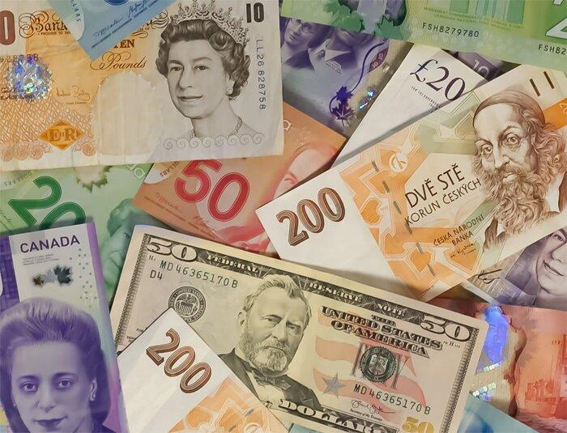

In the modern financial landscape, the interplay between currency mechanisms, private currency, and algorithmic trading has fundamentally reshaped global financial systems. As economies become increasingly interconnected, understanding these components is crucial for stakeholders across various industries striving to leverage these systems for growth and stability.

Currency mechanisms, which comprise the various processes and systems that determine and maintain the value of a currency, are foundational to economic stability. Central banks wield considerable influence through monetary policies and interest rate adjustments, impacting national and global economies significantly. Exchange rates, a critical aspect of currency mechanisms, affect international trade balances, thereby influencing economic health on a broader scale.



Private currencies, such as cryptocurrencies, have emerged as alternatives to traditional currencies issued by governments. Their decentralized nature offers unique transaction capabilities, but they also introduce challenges related to legal frameworks and trust. Historically, forms of private currency like company scrip served specific communities or industries, paving the way for modern iterations.

Algorithmic trading represents another transformative element, leveraging advanced algorithms for rapid trading decisions. This technology allows traders to react swiftly to market changes, enhancing the efficiency of trades and capitalizing on currency value fluctuations. Recent advancements in AI and machine learning continue to refine these algorithms, offering innovative tools for developing trading strategies.

Exploring the interrelation between these elements reveals the opportunities and challenges they present. Currency mechanisms, private currencies, and algorithmic trading strategies together form a triad that influences global markets. As these systems continue to evolve, stakeholders must remain adaptable, embracing technological advancements while ensuring stability and ethical considerations in financial systems. This article examines these components, assessing potential future trends and their implications for global finance.

## Table of Contents

## Understanding Currency Mechanisms

Currency mechanisms are essential components of financial systems, encompassing the processes and frameworks that determine and maintain the value of currencies on a global scale. At the heart of these mechanisms are central banks, which utilize a variety of tools to influence economic health. One primary method is the adjustment of interest rates, which can either stimulate or cool down an economy. For instance, lowering interest rates tends to encourage borrowing and spending, thereby boosting economic activity, while increasing rates can help control inflation by reducing spending.

Monetary policy is another significant tool utilized by central banks. This includes open market operations, reserve requirements, and other measures designed to control the money supply and maintain financial stability. By managing how much money is in circulation, central banks can influence inflation rates and economic growth. For instance, during periods of economic downturn, a central bank might purchase government securities to inject [liquidity](/wiki/liquidity-risk-premium) into the economy, thereby reducing interest rates and encouraging spending and investment.

Exchange rates are a critical element of currency mechanisms, profoundly impacting international trade. The value of a currency relative to others can affect a country's export and import balance. When a country's currency appreciates, its goods become more expensive for foreign buyers, potentially reducing exports. Conversely, depreciation makes exports cheaper and imports more costly, favoring local industries but potentially leading to higher import expenses.

Understanding these interactions is vital for stakeholders, including policymakers, investors, and businesses, as they navigate an ever-changing global economy. Stakeholders must monitor economic indicators and policy shifts to make informed decisions. For example, an investor might consider exchange rate trends when investing in foreign markets, while a business might adjust its supply chain strategy in response to changes in interest rates or currency values.

In summary, currency mechanisms are pivotal in shaping the economic landscape, involving a complex interplay of interest rates, monetary policies, and exchange rates. Central banks hold significant sway in managing these factors, impacting national and international economic conditions. By grasping these concepts, stakeholders can better adapt to economic fluctuations and policy adjustments, ensuring more resilient and informed decision-making in a dynamic global market.

## The Role of Private Currency

Private currencies, crafted by private organizations as alternatives to national currencies, offer distinct functionalities within financial systems. These currencies are often tailored to meet specific community or organizational needs, providing unique economic and transactional mechanisms outside the purview of national monetary authorities.

Historically, one of the earliest forms of private currency was company scrip. These were tokens issued by companies to employees, often redeemable only within company-owned stores or specific communities. While facilitative for company towns during the industrial age, company scrip was controversial due to its potential to economically bind workers to employers, limiting their ability to seek better wages or conditions elsewhere. This form of private currency reflected a direct link between labor and currency, bypassing traditional government-issued money.

In contemporary times, cryptocurrencies have emerged as a sophisticated counterpart to traditional private currencies. Distinct for their decentralized nature, cryptocurrencies operate on blockchain technology, allowing for peer-to-peer transactions without the need for intermediaries like banks. This technological underpinning challenges traditional financial systems by offering enhanced privacy, security, and possibly lower transaction costs. However, the decentralized nature of cryptocurrencies also raises substantial legal and trust issues. Regulators worldwide express concerns over their use in unlawful activities, given the pseudonymous nature of transactions, and the [volatility](/wiki/volatility-trading-strategies) of their value, which poses a risk for economic stability.

The interaction between private and government-issued currencies highlights both potential advantages and drawbacks. Private currencies like cryptocurrencies can offer financial inclusion and innovation by providing banking services to unbanked populations and fostering a more competitive currency market. Nonetheless, they also underscore limitations, such as regulatory challenges and the potential for undermining national monetary control. 

As private currencies continue to evolve, understanding these dynamics becomes crucial for policymakers and market participants. Their role in financial ecosystems is not just as currency alternatives but also as catalysts for change in how societies understand and interact with the notion of money itself.

## Algorithmic Trading and Financial Systems

Algorithmic trading has transformed financial markets by employing sophisticated algorithms to execute trades at speeds and frequencies that humans cannot match. These algorithms analyze a myriad of factors and execute trades based on pre-defined criteria, which significantly influences overall market dynamics.

The primary advantage of [algorithmic trading](/wiki/algorithmic-trading) lies in its ability to swiftly adapt to market changes. Algorithms can process vast amounts of data in real-time, allowing them to identify trading opportunities from minute price discrepancies and execute trades within milliseconds. This adaptability enhances the efficiency of trading processes and optimizes profits from currency value fluctuations.

Recent advancements in [artificial intelligence](/wiki/ai-artificial-intelligence) (AI) and [machine learning](/wiki/machine-learning) have further refined these algorithms. Machine learning models can identify and predict complex patterns in market data, enabling more sophisticated strategy development. For instance, AI can enhance risk management by predicting potential adverse movements and automatically adjusting trading positions to minimize losses.

In the context of [forex](/wiki/forex-system) and other financial markets, algorithmic trading plays a pivotal role. Forex markets, given their high liquidity and 24/7 operation, are ideal for algorithmic strategies, which can include [market making](/wiki/market-making), [arbitrage](/wiki/arbitrage), or [statistical arbitrage](/wiki/statistical-arbitrage). For example, using Python, traders can write scripts to execute a simple moving average crossover strategy, a common method used to signal buying or selling.

```python
import numpy as np
import pandas as pd
import matplotlib.pyplot as plt

# Assume df is a DataFrame with historical forex data with a 'Close' column
short_window = 40
long_window = 100

# Calculate moving averages
signals = pd.DataFrame(index=df.index)
signals['signal'] = 0.0
signals['short_mavg'] = df['Close'].rolling(window=short_window, min_periods=1, center=False).mean()
signals['long_mavg'] = df['Close'].rolling(window=long_window, min_periods=1, center=False).mean()

# Generate signals
signals['signal'][short_window:] = np.where(signals['short_mavg'][short_window:] > signals['long_mavg'][short_window:], 1.0, 0.0)   
signals['positions'] = signals['signal'].diff()

# Plotting
plt.figure(figsize=(10,5))
plt.plot(df['Close'], color='gray', label='Forex Price')
plt.plot(signals['short_mavg'], color='red', label='Short Moving Average')
plt.plot(signals['long_mavg'], color='green', label='Long Moving Average')
plt.legend(loc='best')
plt.show()
```

This script sets up a basic moving average crossover strategy by calculating two moving averages: the short-term average and the long-term average. A buy signal is generated when the short-term average crosses above the long-term average, while a sell signal is issued when the opposite occurs, helping traders capitalize on potential price trends.

Overall, algorithmic trading has introduced both opportunities and challenges. It offers traders the ability to mitigate risks through diverse strategies while maximizing returns by executing high-frequency trades. As algorithmic techniques continue to evolve with technological advancements, their influence on financial markets is expected to grow, providing enhanced tools and strategies for traders around the world.

## Private Currency and Algorithmic Trading: A Synergistic Approach

The rise of cryptocurrencies has significantly altered the landscape of private currencies and has introduced novel market dynamics, especially when combined with algorithmic trading. Cryptocurrencies represent a form of private currency that operates independently of traditional financial institutions, leveraging blockchain technology to ensure transparency and security. This independence, however, also introduces substantial volatility, creating both challenges and opportunities for traders.

Algorithmic trading, which uses automated and pre-programmed strategies to execute trades, has proven adept at managing the volatility intrinsic to cryptocurrencies. By analyzing massive amounts of data and executing trades at speeds unattainable by human traders, algorithmic trading can exploit the high-frequency fluctuations in [cryptocurrency](/wiki/cryptocurrency) values. Consider, for example, how an algorithm might analyze price changes, trading volumes, and historical data to predict potential future movements in real-time and make rapid trading decisions based on this analysis.

The synergy between private currencies like cryptocurrencies and algorithmic trading emerges as these algorithms are not only used to manage risk but also to take advantage of market inefficiencies. For instance, arbitrage opportunities—where a cryptocurrency is priced differently on two or more exchanges—can be rapidly exploited by algorithmic trading systems programmed to identify and act on these disparities. Below is a simple Python example of an arbitrage strategy:

```python
def find_arbitrage(exchange_rates):
    for currency, rates in exchange_rates.items():
        for first_exchange, rate_on_first in rates.items():
            for second_exchange, rate_on_second in rates.items():
                if rate_on_first * rate_on_second > 1.01:  # Account for transaction costs
                    print(f"Arbitrage opportunity: Buy at {first_exchange} and sell at {second_exchange}")

exchange_rates = {
    'BTC': {'Exchange1': 1.00, 'Exchange2': 0.98, 'Exchange3': 1.02},
    'ETH': {'Exchange1': 0.99, 'Exchange2': 1.03, 'Exchange3': 1.01}
}

find_arbitrage(exchange_rates)
```

Understanding this synergy is vital for stakeholders seeking to tap into the opportunities presented by the combination of private currencies and algorithmic trading. The integration of advanced technologies such as machine learning with algorithmic trading strategies adds another layer of sophistication, allowing algorithms to continuously improve their decision-making processes through experience and additional data input. This ongoing advancement fosters a dynamic environment where private currencies and algorithmic trading co-evolve, enhancing their mutual benefits in navigating contemporary financial markets.

## Challenges and Future Prospects

As financial systems incorporating currency mechanisms, private currencies, and algorithmic trading continue to evolve, several challenges and future prospects emerge. Legal challenges arise from the rapid innovation in private currencies, especially cryptocurrencies, which often operate outside of established regulatory frameworks. Regulations must adapt to accommodate these digital assets while ensuring consumer protection and financial stability. This can be seen in the evolving legalities around cryptocurrencies, where countries vary significantly in their regulatory approaches, from outright bans to integration into existing financial regulations.

Ethical challenges also present substantial concerns. Algorithmic trading, while optimizing for efficiency and profit, can lead to market distortions, unfair trading advantages, and ethical dilemmas related to transparency and fairness. Ensuring that these technologies are employed responsibly necessitates the development of codes of conduct and ethical frameworks that emphasize transparency and equal access to financial markets.

Technically, the integration of artificial intelligence (AI) and machine learning into financial systems introduces complexities that demand sophisticated infrastructure and cybersecurity measures. AI-driven models, while enhancing decision-making processes, pose risks related to bias, errors in data interpretation, and vulnerability to cyber-attacks. Developing robust AI systems that prioritize security, accuracy, and fairness is paramount as these technologies become more ingrained in financial transactions.

Looking ahead, the promising integration of AI and related technologies into financial systems will likely enhance decision-making and deepen market understanding. AI can analyze vast datasets quickly, revealing patterns and insights that might elude human analysts, thereby improving trading strategies and market predictions. This integration is expected to streamline operations and offer personalized financial services, such as robo-advisors, which tailor investment strategies based on individual user data.

Stakeholders, including financial institutions, regulators, and investors, must remain adaptable, embracing innovations while safeguarding stability and ethical considerations in global financial systems. This adaptability encompasses continuously updating skills and knowledge bases to meet the demands of new technologies and the regulatory environments they necessitate.

As financial systems grow in complexity, ongoing research, investment in advanced technologies, and adaptation of strategies will be essential for sustained growth and stability. Collaborative efforts among technologists, regulators, and financial experts will help craft balanced solutions that harness the benefits of these evolving systems while mitigating associated risks. Such efforts will ensure that the opportunities presented by advanced technologies in finance do not compromise ethical standards or financial stability.

## Conclusion

Currency mechanisms, private currency, and algorithmic trading together form a complex but vital part of modern financial systems, each influencing global economics in significant ways. A comprehensive understanding of these elements is crucial for stakeholders who aim to exploit their full potential to foster economic growth and maintain financial stability. As technology continues to advance, so too will these systems, evolving to present both new opportunities and challenges. This evolution underscores the critical importance of staying informed and adaptable, as the ability to navigate successfully within this dynamic landscape is essential for sustaining growth and stability.

Technological advancements, particularly in areas such as artificial intelligence and blockchain, are driving changes in financial systems at an unprecedented pace. These changes necessitate a balanced knowledge of currency mechanisms, where central banks' policies and exchange rate adjustments play a critical role in influencing national and international economies. Similarly, as private currencies like cryptocurrencies proliferate, they bring forth new economic dynamics and regulatory considerations. 

Algorithmic trading, meanwhile, is revolutionizing how financial markets operate by leveraging advanced algorithms to optimize trading strategies and manage risks effectively. The synergy between these algorithms and private currencies, notably cryptocurrencies, highlights an area ripe with potential but also fraught with volatility and regulatory scrutiny.

Staying informed involves more than merely keeping up with the latest trends; it requires an active engagement with the evolving technologies and regulatory landscapes that underpin these systems. This continual learning and adaptability are vital for stakeholders to harness the opportunities presented by these advancements while mitigating potential risks. As financial ecosystems grow increasingly intricate, ongoing research and proactive adaptation will be key determinants of success in capitalizing on the multifaceted opportunities that lie ahead in global finance.

## References & Further Reading

[1]: Nakamoto, S. (2008). ["Bitcoin: A Peer-to-Peer Electronic Cash System."](https://nakamotoinstitute.org/library/bitcoin/)

[2]: Narayanan, A., Bonneau, J., Felten, E., Miller, A., & Goldfeder, S. (2016). ["Bitcoin and Cryptocurrency Technologies: A Comprehensive Introduction."](https://press.princeton.edu/books/hardcover/9780691171692/bitcoin-and-cryptocurrency-technologies) Princeton University Press.

[3]: Aldridge, I. (2013). ["High-Frequency Trading: A Practical Guide to Algorithmic Strategies and Trading Systems."](https://onlinelibrary.wiley.com/doi/pdf/10.1002/9781119203803.fmatter) Wiley.

[4]: Vigna, P., & Casey, M. J. (2016). ["The Age of Cryptocurrency: How Bitcoin and Digital Money Are Challenging the Global Economic Order."](https://archive.org/details/ageofcryptocurre0000vign) St. Martin's Griffin.

[5]: Hull, J. C. (2017). ["Options, Futures, and Other Derivatives."](https://www.pearson.com/en-us/subject-catalog/p/options-futures-and-other-derivatives/P200000005938/9780136939917) Pearson.