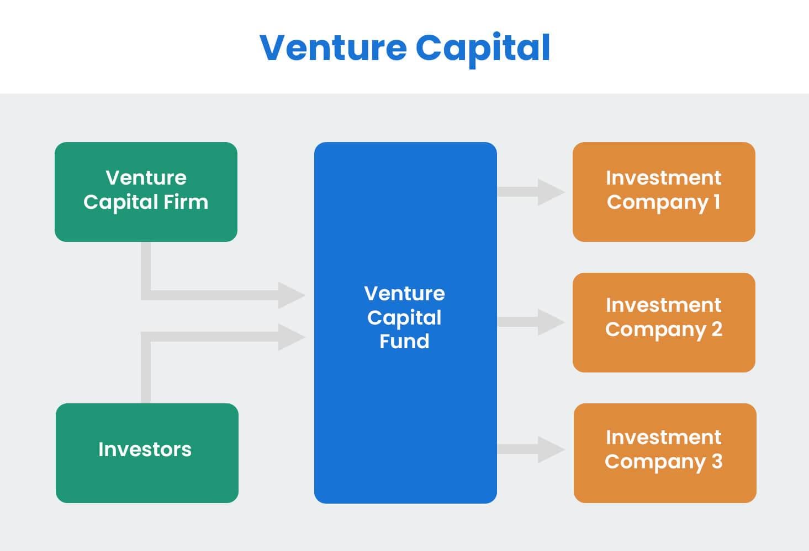

## Table of Contents

## What is private equity?

Private equity is a type of investment where money is put into companies that are not publicly traded on a stock exchange. Instead of buying shares that anyone can buy, private equity investors buy a part or all of a company directly. This can help the company grow or improve, and the investors hope to make a profit when they sell their part of the company later.

These investments are usually made by private equity firms, which collect money from wealthy people or big organizations like pension funds. The firms use this money to buy, fix up, and eventually sell companies. Because private equity deals are private, they can be riskier than public investments, but they can also offer bigger rewards if the company does well.

## How does private equity differ from public equity?

Private equity and public equity are two ways to invest in companies, but they are different in some big ways. Private equity means investing in companies that are not listed on a stock exchange. This means you can't just buy their shares on the open market like you can with public companies. Instead, private equity investors often buy a big part or all of a company directly. This can be riskier because there's less information available about the company, and it's harder to sell your investment if you need to. But, it can also be more rewarding if the company does well, because you might have more control over how the company is run.

Public equity, on the other hand, is when you buy shares of a company that is listed on a stock exchange. Anyone can buy these shares, and they are easy to buy and sell. Because these companies have to share a lot of information with the public, it's usually easier to know how they are doing. This can make public equity a safer investment, but it might not grow as fast as a private company that does really well. Also, with public companies, you usually have less say in how the company is run because you own a smaller piece of it.

## What are the main types of private equity investments?

Private equity investments come in different forms, but the main types are venture capital and buyouts. Venture capital is when investors give money to new, small companies that they think could grow big. These companies often don't have much money yet, so the investment helps them start up and grow. The investors hope that the company will become successful and valuable, so they can make a lot of money when they sell their part later.

Buyouts are different. This is when investors buy a big part or all of a company that is already running. Sometimes, the company might be having problems, and the investors think they can fix it and make it better. Other times, the company might be doing okay, but the investors think they can help it grow even more. After making changes, the investors will try to sell the company for more money than they paid for it.

There's also something called growth equity, which is a bit in between venture capital and buyouts. Growth equity is when investors give money to companies that are already doing well but need more money to grow even faster. These companies are not as new as the ones that get venture capital, but they're not big enough for a buyout yet. The investors help these companies expand, and then they hope to make money when they sell their part later.

## Can you provide examples of successful private equity firms?

One well-known private equity firm is Blackstone. They started in 1985 and have grown to be one of the biggest in the world. Blackstone invests in many different types of companies, from real estate to tech startups. They are famous for buying Hilton Hotels in 2007, fixing it up, and then selling it for a big profit. This shows how private equity can help companies improve and grow.

Another successful firm is KKR, which stands for Kohlberg Kravis Roberts. They were founded in 1976 and have been leaders in the buyout business. One of their most famous deals was buying RJR Nabisco in 1989, which was one of the biggest buyouts ever at the time. KKR helped RJR Nabisco become more efficient and profitable before selling it. KKR shows how private equity can transform big companies.

Carlyle Group is also a major player in private equity. They were started in 1987 and have made investments all over the world. Carlyle is known for their work in industries like defense, healthcare, and technology. For example, they bought a company called Booz Allen Hamilton in 2008, helped it grow, and then sold it for a profit. Carlyle's success shows how private equity can help companies in different fields become more valuable.

## What are the typical investment strategies used in private equity?

Private equity firms use different strategies to make money from their investments. One common strategy is called the leveraged buyout. This is when a private equity firm borrows a lot of money to buy a company. They use the company's own assets as a way to get the loan. After buying the company, the firm tries to make it more profitable by cutting costs or growing the business. Once the company is doing better, the firm can sell it for more money than they paid, and they use the profits to pay back the loan and keep the rest.

Another strategy is venture capital, where firms invest in new, small companies that they think could grow big. These companies often need money to start up and grow, so the private equity firm gives them the cash they need. In return, the firm gets a part of the company. If the company becomes successful, the value of the firm's part goes up, and they can sell it for a lot of money. This strategy is riskier because many new companies fail, but it can also be very rewarding if the company does well.

Growth equity is another strategy that private equity firms use. This is when they invest in companies that are already doing well but need more money to grow even faster. These companies are not as new as the ones that get venture capital, but they're not big enough for a buyout yet. The private equity firm helps these companies expand by giving them money and sometimes advice on how to grow. When the company gets bigger and more valuable, the firm can sell its part for a profit.

## How do private equity firms generate returns for their investors?

Private equity firms make money for their investors by buying companies, making them better, and then selling them for more money. They often use a strategy called a leveraged buyout, where they borrow money to buy a company. They use the company's own things, like buildings or machines, to get the loan. After buying the company, the firm works to make it more profitable. They might cut costs, make the business grow, or change how it runs. When the company is doing better, the firm sells it for a higher price. The profit from the sale pays back the loan and gives money to the investors.

Another way private equity firms make money is through venture capital. They invest in new, small companies that they think could become big and successful. These companies need money to start and grow, so the private equity firm gives them the cash they need. In return, the firm gets a part of the company. If the company does well and becomes valuable, the firm can sell its part for a lot of money. This way, the investors get a good return on their money. But it's riskier because many new companies fail.

Private equity firms also use growth equity to make money. They invest in companies that are already doing well but need more money to grow even faster. These companies are not as new as the ones that get venture capital, but they're not big enough for a buyout yet. The firm helps these companies get bigger by giving them money and sometimes advice. When the company grows and becomes more valuable, the firm can sell its part for a profit. This gives the investors a good return on their investment.

## What is the role of leverage in private equity deals?

Leverage plays a big part in private equity deals. It means using borrowed money to buy a company. Private equity firms often borrow a lot of money to buy a company, using the company's own things, like buildings or machines, as a way to get the loan. This is called a leveraged buyout. By using leverage, the firm doesn't need to put in as much of their own money to buy the company. This can make the deal bigger than they could do on their own and can lead to bigger profits if the company does well.

The use of leverage can help make the returns bigger for the investors. If the company becomes more profitable after the buyout, the firm can sell it for more money than they paid. The profit from the sale can be used to pay back the loan, and any extra money goes to the investors. But, using leverage also makes the deal riskier. If the company doesn't do well, the firm still has to pay back the loan, which can be hard if the company isn't making enough money. So, while leverage can help make big profits, it also adds more risk to the deal.

## What are the key stages of a private equity investment process?

The private equity investment process starts with finding a good company to invest in. Private equity firms look for companies that they think they can help grow or fix up. They do a lot of research to make sure the company is a good fit for their investment goals. Once they find a company they like, they talk to the owners about buying it. This can take a long time because they need to agree on the price and other details. If everything goes well, the firm buys the company, often using borrowed money in a process called a leveraged buyout.

After buying the company, the private equity firm works to make it better. They might cut costs, help the company grow, or change how it runs to make it more profitable. This part can take several years, and the firm keeps a close eye on the company to make sure it's doing well. When the company is in good shape and its value has gone up, the firm looks for a way to sell it. They might sell it to another company, take it public by listing it on a stock exchange, or sell it to another private equity firm. The money they make from selling the company goes to pay back any loans and give returns to their investors.

## How do private equity firms exit their investments?

Private equity firms have several ways to exit their investments, which means selling the company they bought to make a profit. One common way is through a trade sale, where they sell the company to another business. This can be a good option if the company fits well with another company's plans. Another way is through an initial public offering (IPO), where the company starts selling its shares on a stock exchange. This can be a good way to get a lot of money if the company is doing well and people want to buy its shares. Sometimes, they might sell the company to another private equity firm if they think the new firm can do even more to make the company better.

Another way to exit is through a secondary buyout, where the company is sold to another private equity firm. This can happen if the first firm has done all it can to improve the company, and another firm thinks it can do more. Sometimes, the firm might choose a recapitalization, where they take out a big loan against the company and use the money to pay back their investors. This way, they can keep running the company but still give money back to their investors. Each of these ways has its own risks and rewards, and the firm picks the one that they think will give the best return on their investment.

## What are the risks associated with private equity investments?

Private equity investments can be risky because they often use a lot of borrowed money. This is called leverage, and it means the firm might have to pay back big loans even if the company they bought isn't doing well. If the company doesn't make enough money, it can be hard to pay back the loans, and the firm could lose money. Also, private equity firms buy companies that are not listed on a stock exchange, so it's harder to know how the company is doing. There's less information available, and it can be hard to sell the investment if you need to.

Another risk is that the companies private equity firms invest in can fail. This is especially true for new companies that get venture capital. Many new businesses don't make it, so the firm could lose all the money they put into those companies. Even with bigger companies that get bought in a leveraged buyout, things can go wrong. The firm might not be able to make the company better or grow it as they planned. If they can't sell the company for more money than they paid, they might not make any profit, and their investors could lose money.

## How does the regulatory environment impact private equity?

The rules and laws that private equity firms have to follow can affect how they work and what they can do. In different countries, there are different rules about how much money private equity firms can borrow, what they have to tell the government about their investments, and how they can buy and sell companies. These rules are there to make sure that private equity firms are doing things in a fair and safe way. But, they can also make it harder for firms to do big deals or take more risks, which might mean they can't make as much money for their investors.

Sometimes, the rules can change, and that can make things even more complicated. For example, if the government decides to make new rules about how much debt a company can have, private equity firms might have to change how they do leveraged buyouts. Or if there are new rules about how much information firms have to share, it could take more time and money to follow them. All these rules can slow down private equity deals and make them more expensive, but they are important to keep the investment world safe and fair for everyone.

## What advanced strategies can private equity firms use to enhance value creation?

Private equity firms can use advanced strategies like operational improvements to make the companies they buy more valuable. This means they work closely with the company's management to find ways to make the business run better. They might help the company use new technology, change how it makes things, or find new ways to sell its products. By making these changes, the company can make more money and be worth more when the firm sells it. This strategy needs a lot of work and understanding of the business, but it can lead to big profits if done right.

Another strategy is to grow the company by buying other businesses that fit well with it. This is called a roll-up strategy. The private equity firm looks for smaller companies in the same industry and buys them to add to the main company. This can help the main company grow faster and become more valuable. It can also help the company save money by combining things like offices or factories. This strategy can be tricky because it takes a lot of planning and money, but it can make the company much bigger and more successful in the end.

## What are the Fundamentals of Investment Strategies?

Investment strategies are methodologies employed by investors to navigate and benefit from the ever-changing landscape of financial markets. At their core, these strategies revolve around key principles designed to exploit market opportunities while managing risks effectively. The primary objectives for any investment strategy include diversification, risk management, and optimizing returns, each playing a crucial role in building a robust investment portfolio.

**1. Diversification:**

Diversification involves spreading investments across various asset classes, sectors, or geographies to reduce exposure to any single risk. By doing so, investors can mitigate the impact of poor performance in a specific area, as gains in another may offset losses. Mathematically, diversification reduces the portfolio's overall risk as described by the formula for the variance of a portfolio:

$$
\sigma^2_p = \sum_{i=1}^{n}w_i^2\sigma_i^2 + \sum_{i=1}^{n-1}\sum_{j=i+1}^{n}2w_iw_j\sigma_i\sigma_j\rho_{ij}
$$

Where:
- $\sigma^2_p$ is the portfolio variance.
- $w_i$ and $w_j$ are the weights of the assets in the portfolio.
- $\sigma_i$ and $\sigma_j$ are the standard deviations of the assets.
- $\rho_{ij}$ is the correlation coefficient between the returns of assets $i$ and $j$.

**2. Risk Management:**

Effective risk management is paramount to shield investments from unforeseeable market changes. Investors often employ various tools and techniques such as stop-loss orders, options hedging, and leveraging to manage risks. Quantitative measures like Value at Risk (VaR) can estimate the potential loss in value of a portfolio, thereby assisting in making informed decisions.

**3. Maximizing Returns:**

Investors aim to maximize returns by selecting assets that have the potential for high yields, often balancing risk and return through the Sharpe Ratio, a common metric used to measure risk-adjusted return. The Sharpe Ratio is given by:

$$
\text{Sharpe Ratio} = \frac{E[R_p] - R_f}{\sigma_p}
$$

Where:
- $E[R_p]$ is the expected portfolio return.
- $R_f$ is the risk-free rate.
- $\sigma_p$ is the standard deviation of the portfolio's excess return.

**Key Foundational Strategies:**

1. **Value Investing:** This strategy involves picking stocks that are undervalued based on analysis of fundamental data like earnings, dividends, or book value, with the expectation that their true value will be recognized over time.

2. **Growth Investing:** Contrastingly, growth investing focuses on companies exhibiting signs of above-average growth, even if the stock seems overvalued in traditional metrics.

3. **Income Investing:** Investors seeking steady income often invest in bonds or high-dividend stocks to generate consistent cash flow.

**Asset Allocation and Portfolio Management:**

Asset allocation is integral to portfolio management, where capital is distributed among various investment types to align with an investor's financial goals and risk tolerance. A well-executed asset allocation strategy balances risk and reward by apportioning assets according to age, investment horizon, and financial situation.

**Conclusion:**

Understanding these fundamental principles and strategies equips investors with the ability to form a balanced and diversified investment approach, tailored to individual financial goals. By adhering to strategic diversification, effective risk management, and pursuing both value and growth opportunities, investors can navigate financial markets with greater confidence and success.

## References & Further Reading

[1]: Bergstra, J., Bardenet, R., Bengio, Y., & Kégl, B. (2011). ["Algorithms for Hyper-Parameter Optimization."](https://papers.nips.cc/paper/4443-algorithms-for-hyper-parameter-optimization) Advances in Neural Information Processing Systems 24.

[2]: ["Advances in Financial Machine Learning"](https://www.amazon.com/Advances-Financial-Machine-Learning-Marcos/dp/1119482089) by Marcos Lopez de Prado

[3]: ["Evidence-Based Technical Analysis: Applying the Scientific Method and Statistical Inference to Trading Signals"](https://www.amazon.com/Evidence-Based-Technical-Analysis-Scientific-Statistical/dp/0470008741) by David Aronson

[4]: ["Machine Learning for Algorithmic Trading"](https://github.com/stefan-jansen/machine-learning-for-trading) by Stefan Jansen

[5]: ["Quantitative Trading: How to Build Your Own Algorithmic Trading Business"](https://www.amazon.com/Quantitative-Trading-Build-Algorithmic-Business/dp/1119800064) by Ernest P. Chan