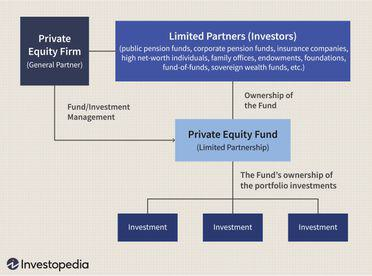

## Table of Contents

## What is private equity in real estate?

Private equity in real estate is when investors pool their money to buy, develop, or manage properties. These investors are usually wealthy individuals or big companies. They aim to make money by improving the properties and then selling them for more than they paid. This type of investment is different from public real estate, where anyone can buy shares in a company that owns properties.

The people who manage these private equity funds, called fund managers, look for properties that they think can be made more valuable. They might fix up old buildings, add new features, or change how the property is used. Once the property is improved and worth more, the fund managers sell it and share the profits with the investors. This can be a good way to make money, but it also comes with risks because the real estate market can go up and down.

## How does private equity investing in real estate differ from traditional real estate investing?

Private equity investing in real estate involves pooling money from investors to buy, improve, and sell properties for profit. This type of investing is usually done by large groups of investors, like wealthy individuals or big companies, who work together through a private equity fund. The fund managers look for properties that they think can be made more valuable. They might fix up old buildings, add new features, or change how the property is used. Once the property is improved and worth more, they sell it and share the profits with the investors.

Traditional real estate investing, on the other hand, is when someone buys a property on their own, usually to rent it out or to sell it later for a profit. This can be done by anyone, not just big investors. The person who buys the property is responsible for managing it, which includes finding tenants, handling repairs, and dealing with any problems that come up. Traditional real estate investing can be less risky because the investor has more control over the property, but it also requires more hands-on work and may not offer the same potential for large profits as private equity investing.

Both types of investing have their own risks and rewards. Private equity investing can lead to bigger profits because it involves larger investments and professional management, but it also means sharing those profits with other investors and the fund managers. Traditional real estate investing might offer more control and potentially lower risk, but it also means doing more work yourself and possibly earning less money overall.

## What are the typical sources of capital for private equity real estate investments?

The main sources of capital for private equity real estate investments come from wealthy individuals, called high-net-worth investors, and big companies, known as institutional investors. These investors put their money into a private equity fund, which is managed by professionals who know a lot about real estate. The fund managers use this money to buy properties that they think can be made more valuable. This way, the investors can make money without having to manage the properties themselves.

Another source of capital can be from pension funds, insurance companies, and endowments. These organizations have a lot of money to invest and they often look for ways to grow their funds over time. By investing in private equity real estate, they hope to earn good returns that can help them meet their financial goals. Sometimes, private equity firms also use borrowed money, or debt, to help buy properties. This can increase the potential profits, but it also adds more risk if the real estate market goes down.

## What types of real estate properties are commonly targeted by private equity firms?

Private equity firms often target properties that they believe can be improved and sold for a profit. They might focus on commercial real estate like office buildings, shopping centers, and hotels. These types of properties can be made more valuable by fixing them up, adding new features, or finding better tenants. For example, a private equity firm might buy an old office building, renovate it to make it more modern and attractive, and then lease it to high-paying businesses.

In addition to commercial properties, private equity firms also look at residential real estate, such as apartment buildings and housing developments. They might buy an apartment complex, improve the units, and raise the rent to increase the property's value. Another common target is distressed properties, which are properties that are in financial trouble. Private equity firms might buy these at a lower price, fix them up, and then sell them for a profit once they are worth more. By focusing on these types of properties, private equity firms aim to make the most money possible for their investors.

## How do private equity firms add value to real estate investments?

Private equity firms add value to real estate investments by buying properties that they think can be improved. They might find an old office building or a run-down apartment complex and see a chance to make it better. They use their money and expertise to fix up the property. This could mean renovating the building, adding new features like a gym or a pool, or making it more energy-efficient. By doing this, they can attract better tenants who are willing to pay more rent, which increases the property's value.

Once the property is improved and worth more, private equity firms can sell it for a profit. They might also change how the property is used to make it more valuable. For example, they could turn an old warehouse into fancy apartments or a shopping center into a mixed-use development with shops and homes. By being smart about what they buy and how they improve it, private equity firms can make a lot of money for their investors. This way, everyone who put money into the fund can share in the success of the real estate investments.

## What are the key stages of a private equity real estate investment lifecycle?

The first stage of a private equity real estate investment lifecycle is when the fund managers find and buy properties they think can be made more valuable. They look for places like old office buildings or run-down apartment complexes. They use the money from their investors to buy these properties. This stage is all about choosing the right properties and getting a good deal on them.

Once they have the properties, the next stage is to improve them. The fund managers might fix up the buildings, add new features, or change how the property is used. For example, they could turn an old warehouse into fancy apartments. This stage is about making the property worth more money so they can sell it for a profit later.

The final stage is when the private equity firm sells the improved property. They try to sell it for more than they paid for it, so they can make a profit. This profit is then shared with the investors who put money into the fund. This stage wraps up the investment lifecycle, and the fund managers might start looking for new properties to invest in all over again.

## What are the common strategies used by private equity firms to generate returns in real estate?

Private equity firms often use a strategy called value-add investing to make money in real estate. This means they buy properties that need some work, like old buildings or run-down apartments. They fix them up by renovating them, adding new features, or changing how they are used. For example, they might turn an old warehouse into fancy apartments. By doing this, they can attract better tenants who are willing to pay more rent. This makes the property worth more money, and when they sell it, they can make a profit.

Another common strategy is called opportunistic investing. With this approach, private equity firms look for properties that are in trouble or have a lot of potential for growth. They might buy a distressed property at a low price, fix it up, and then sell it for a lot more. They could also invest in big projects like new housing developments or shopping centers. These projects can be risky, but if they go well, they can bring in big profits. By being smart about what they buy and how they improve it, private equity firms can make a lot of money for their investors.

## How do private equity real estate funds structure their investments and what are the typical fee structures?

Private equity real estate funds usually structure their investments by pooling money from investors to buy properties. They look for properties that they think can be made more valuable, like old buildings or run-down apartments. Once they buy a property, they fix it up, add new features, or change how it is used to make it worth more money. They might turn an old warehouse into fancy apartments or improve an office building to attract better tenants. After the property is improved and its value goes up, the fund managers sell it and share the profits with the investors.

The typical fee structure for private equity real estate funds includes two main types of fees: management fees and performance fees. Management fees are usually a percentage of the total money invested in the fund, often around 1% to 2% per year. This fee pays for the fund managers' time and work in finding, buying, and improving properties. Performance fees, also called carried interest, are a share of the profits the fund makes. These fees are usually about 20% of the profits, but only after the investors get their original money back plus a certain rate of return, called a hurdle rate. This way, the fund managers are motivated to make the best investments possible to earn more for everyone involved.

## What are the risks associated with private equity investments in real estate?

Private equity investments in real estate can be risky because the real estate market can go up and down. If the market goes down, the value of the properties the fund bought might drop, and they could lose money when they try to sell them. Also, if the fund managers make bad choices about which properties to buy or how to fix them up, the investments might not be worth as much as they hoped. This can mean less profit or even losses for the investors.

Another risk is that private equity real estate funds often use borrowed money, called debt, to help buy properties. If they can't pay back this debt, especially if the property values go down, it can cause big problems for the fund. Plus, these investments usually need a lot of money and can be hard to sell quickly if the investors need their money back. This means the money might be tied up for a long time, which can be risky if something goes wrong or if the investors need their money for something else.

## How do private equity returns in real estate compare to other investment classes?

Private equity returns in real estate can be higher than what you might get from other types of investments, like stocks or bonds. This is because private equity firms buy properties that need work, fix them up, and then sell them for more money. This can lead to big profits if everything goes well. But, these returns can also be riskier because the real estate market can go up and down a lot. If the market goes down, the value of the properties might drop, and the fund could lose money.

Compared to other investment classes, private equity real estate can offer a good mix of potential returns and stability. For example, while stocks can grow a lot over time, they can also be very volatile, meaning their value can change a lot day to day. Bonds are usually safer but offer lower returns. Real estate, on the other hand, can provide steady income from rent and the chance for the property to grow in value. However, it takes a lot of money to invest in private equity real estate, and the money might be tied up for a long time, which is different from stocks or bonds that you can usually sell more quickly.

## What are the tax implications of investing in private equity real estate?

Investing in private equity real estate can have different tax effects depending on where you live and the type of investment you make. In the United States, for example, investors might have to pay taxes on the money they make from renting out properties, called rental income. They also might have to pay taxes when they sell a property for more than they paid for it, which is called capital gains tax. But, there are some tax benefits too. Investors can often deduct expenses like repairs, property management fees, and mortgage interest from their taxes. This can help lower the amount of taxes they have to pay.

Another important thing to know is about something called depreciation. This lets investors spread out the cost of a property over time and deduct it from their taxes each year. It can help reduce the taxes they owe on rental income. Also, private equity funds often use a special type of tax called carried interest. This means the fund managers pay taxes on their share of the profits at a lower rate than regular income. It's a good idea to talk to a tax professional to understand all the tax rules and how they apply to your specific situation.

## How can an investor evaluate the performance of a private equity real estate fund?

To evaluate the performance of a private equity real estate fund, an investor should look at a few key things. First, they should check the fund's return on investment (ROI). This tells them how much money the fund has made compared to how much was put in. A good ROI means the fund is doing well. Investors should also look at the internal rate of return (IRR), which shows how well the fund is doing over time. A higher IRR is usually better. Another thing to consider is the fund's track record. This means looking at how the fund has done in the past with other investments. If the fund has a history of making good choices and earning profits, it's a good sign.

Another important part of evaluating a private equity real estate fund is understanding the risks involved. Investors should look at how much debt the fund is using to buy properties. Too much debt can be risky if the real estate market goes down. They should also think about how easy it is to get their money back if they need it. Private equity investments can be hard to sell quickly, so this is something to keep in mind. Finally, talking to other investors or looking at reports from independent groups can give more information about how the fund is doing. By looking at all these things, an investor can get a good idea of whether a private equity real estate fund is a smart choice for them.

## What is the role of algorithmic trading in PERE?

Algorithmic trading automates investment processes by leveraging advanced data analysis and algorithmic models to execute trades more efficiently than traditional methods. In the context of private equity real estate (PERE), [algorithmic trading](/wiki/algorithmic-trading) is employed to enhance decision-making and optimize returns by processing large volumes of data quickly and identifying market trends that may not be visible through manual analysis.

### Benefits of Algorithmic Trading in PERE

1. **Speed and Efficiency**: Algorithmic trading allows for the rapid execution of trades based on predetermined criteria, reducing the time between market events and transactions. This speed enables investors to capitalize on fleeting opportunities in the real estate market, which can be particularly beneficial in volatile environments.

2. **Data-Driven Decisions**: Algorithms can process and analyze vast amounts of data to identify patterns and trends that inform investment decisions. By utilizing historical and real-time data, algorithms can predict future market movements more accurately, helping investors to make more informed choices in their PERE investments.

3. **Risk Management**: Algorithms can be designed to incorporate risk management strategies by setting stop-loss orders or diversifying investments automatically. This approach minimizes potential losses while maximizing the chances of securing profitable returns.

4. **Reduced Human Error**: By removing human biases from the decision-making process, algorithmic trading reduces the risk of errors that can arise from emotional decision-making or oversight. Automation ensures that trades are executed based on objective criteria, leading to more consistent outcomes.

### Challenges of Implementing Algorithmic Trading in PERE

1. **Complexity and Setup Costs**: Developing and implementing algorithmic trading systems can be complex and costly, requiring significant investment in technology and expertise. Investors must build or procure sophisticated algorithms tailored to the nuances of the real estate market.

2. **Technological Dependence and Failures**: While algorithms provide efficiency, they also introduce risks related to technological failures. Systems malfunction or unforeseen market changes can lead to substantial financial losses if not correctly managed.

3. **Data Quality and Availability**: The success of algorithmic trading heavily depends on the quality and availability of data. Poor data quality or incomplete datasets can lead to inaccurate predictions and suboptimal investment decisions.

4. **Regulatory Challenges**: Adherence to regulatory standards and compliance can be burdensome, as algorithmic trading strategies must conform to legal and ethical practices across different jurisdictions. Maintaining compliance necessitates continuous updates and monitoring of trading algorithms.

### Mathematical Representation

Algorithmic trading systems often use mathematical models to evaluate market conditions. For instance, a simple moving average (SMA) could be employed to identify trends:

$$
\text{SMA} = \frac{\sum_{i=1}^{n} P_i}{n}
$$

Where $P_i$ represents the price of the asset at time $i$, and $n$ is the number of periods used for calculating the average.

Python code can be used to implement such trading strategies:

```python
import numpy as np
import pandas as pd

# Example data: closing prices of a real estate fund
prices = pd.Series([100, 102, 105, 107, 108, 107, 110, 115])

# Calculate 3-day Simple Moving Average
sma = prices.rolling(window=3).mean()

print(sma)
```

This basic example illustrates how moving averages can be used to trigger trading decisions based on the calculated trends in asset prices. Such models, along with more advanced [machine learning](/wiki/machine-learning) techniques, can be integrated into PERE investment strategies to amplify returns while carefully managing risks.

## How can one maximize investment returns?

Combining private equity real estate (PERE) with algorithmic trading has the potential to generate robust and consistent returns by leveraging technological advancements and strategic investment insights. The proper application of these tools relies heavily on an understanding of market trends and the use of sophisticated financial modeling techniques.

One significant advantage of algorithmic trading in PERE is the ability to process large volumes of data swiftly, allowing investors to identify trends and make informed decisions rapidly. Algorithmic systems can analyze historical real estate data, current market conditions, and economic indicators to forecast future performance. By automating these analyses, the likelihood of bias is reduced, and decisions are made based on comprehensive data evaluation.

Financial modeling is essential to maximize returns when integrating algo trading with PERE. Effective models typically incorporate various factors such as cash flow projections, property appreciation, tenant occupancy rates, and macroeconomic influences. One common model used is the Discounted Cash Flow (DCF) analysis, which evaluates investment value based on projected cash flows and discounts them to present value. The formula for DCF is:

$$

DCF = \sum_{t=1}^{n} \frac{C_t}{(1 + r)^t} 
$$

where $C_t$ is the cash flow at time $t$, $r$ is the discount rate, and $n$ is the number of periods.

Incorporating machine learning algorithms further enhances the capability of forecasting and decision-making. For instance, regression models can predict property prices based on variables like location, size, and amenities. These models can adapt to new data, providing real-time insights into market fluctuations and investment opportunities.

Python is a popular choice for implementing these algorithms due to its extensive libraries such as Pandas for data manipulation, NumPy for numerical operations, and Scikit-learn for machine learning. Here is a basic example of using Python for linear regression in real estate price prediction:

```python
import pandas as pd
from sklearn.model_selection import train_test_split
from sklearn.linear_model import LinearRegression

# Load and prepare data
data = pd.read_csv('real_estate_data.csv')
X = data[['location', 'size', 'amenities']]
y = data['price']

# Split data
X_train, X_test, y_train, y_test = train_test_split(X, y, test_size=0.2, random_state=42)

# Train the model
model = LinearRegression()
model.fit(X_train, y_train)

# Predict
predictions = model.predict(X_test)
```

Innovative strategies, such as applying Natural Language Processing (NLP) to analyze market news and sentiments, can add another layer of insight into potential real estate investments. By assessing public sentiment about market trends and economic news, investors can predict shifts in the market and adjust their strategies accordingly.

To improve profitability, technology should be leveraged to enhance scalability and efficiency in managing a diverse portfolio. Cloud computing and data analytics can aid in gathering and processing data from various sources, ensuring timely and accurate investment analysis.

Ultimately, maximizing investment returns in PERE through algorithmic trading requires not just technology but also strategic foresight. While algorithms provide the tools for sophisticated analysis and prediction, investors must continually monitor these systems, adapt to new information, and maintain a comprehensive understanding of market dynamics and financial principles.

## References & Further Reading

[1]: Baum, A. (2009). ["Commercial Real Estate Investment: A Strategic Approach."](https://www.taylorfrancis.com/books/mono/10.4324/9780080963662/commercial-real-estate-investment-andrew-baum) Routledge.

[2]: Black, J., Osterwalder, F., & Maultasch, M. (2020). ["Real Estate Investment: A Strategic Approach."](https://www.semanticscholar.org/paper/Real-Estate-Investment%3A-A-Strategic-Approach-Baum/22f3f17c033d13e0f90d1c0c16d1db01524335fa) Wiley.

[3]: Lopez de Prado, M. (2018). ["Advances in Financial Machine Learning."](https://www.amazon.com/Advances-Financial-Machine-Learning-Marcos/dp/1119482089) Wiley.

[4]: Geltner, D., Miller, N. G., Clayton, J., & Eichholtz, P. (2013). ["Commercial Real Estate Analysis and Investments."](https://www.researchgate.net/publication/245702364_Commercial_Real_Estate_Analysis_and_Investments) OnCourse Learning.

[5]: Chan, E. (2013). ["Algorithmic Trading: Winning Strategies and Their Rationale."](https://github.com/ftvision/quant_trading_echan_book) Wiley.