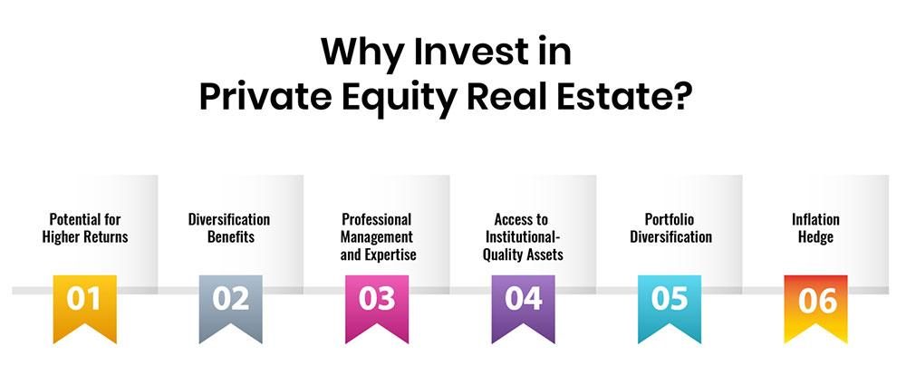

The world of investments is vast, offering numerous opportunities for wealth creation. Among these avenues, real estate investment and private equity are particularly notable for their potential to deliver high returns and offer diversification benefits. Real estate investment typically involves the acquisition of properties with the aim of generating income through renting, leasing, or selling. Private equity real estate, meanwhile, focuses on pooling funds from investors to acquire, improve, and eventually sell properties, often with an emphasis on creating value through property enhancements.

As technology has advanced, the nature of investment strategies has evolved, integrating more sophisticated tools to maximize outcomes. Algorithmic trading stands out as a transformative technology, enabling precise and efficient investment strategies. By leveraging algorithms—complex sets of rules or instructions programmed into a computer—investors can automate trading decisions, enhancing speed, accuracy, and consistency while reducing human error.



The combination of real estate investment, private equity, and algorithmic trading offers a powerful approach for optimizing investment strategies. By integrating data-driven insights and automated decision-making processes, these elements provide investors with a competitive edge in an ever-changing market environment. As we explore this intersection further, the potential for enhanced risk management, return optimization, and strategic diversification becomes apparent, positioning investors to capitalize on emerging opportunities and trends.

## Table of Contents

## Understanding Real Estate Investment and Private Equity

Real estate investment encompasses the purchase and management of properties with the aim of generating income or realizing capital appreciation over time. Such investments typically involve renting, leasing, or selling properties. Real estate as an asset class is known for its tangible nature and potential for steady cash flow, making it an attractive option for those seeking regular income streams and portfolio diversification. Key factors influencing real estate investments include location, market trends, economic conditions, and interest rates.

Private equity real estate represents a more specialized form of real estate investment that involves pooling capital from multiple investors to acquire and enhance properties. This approach focuses on increasing property value through strategic improvements, such as renovations, better management, or changes in tenant structure. The overarching goal is to sell these assets at a higher price, thereby generating substantial returns for investors.

Investors in private equity real estate typically include high-net-worth individuals and institutional investors such as pension funds, insurance companies, and endowments. These investors are drawn to the potential for high returns, often exceeding those available through traditional real estate investments or public markets. Private equity real estate firms play a crucial role by managing the investment process, from acquiring properties to executing value-enhancing strategies.

The fundamentals of real estate investment rely heavily on due diligence, including market research, financial analysis, and risk assessment. Investors must consider various factors, such as property location, condition, and potential for appreciation, when making investment decisions. Furthermore, financial metrics, such as net operating income (NOI), capitalization rate (cap rate), and internal rate of return (IRR), are essential tools for evaluating the profitability and viability of real estate investments.

Private equity involvement in real estate introduces additional complexities due to the nature of pooled investments. The structure typically involves the formation of a limited partnership, where the private equity firm acts as the general partner (GP) and investors are limited partners (LPs). The GP is responsible for identifying opportunities, managing properties, and ultimately executing an [exit](/wiki/exit-strategy) strategy to realize returns.

In essence, real estate investment and private equity both seek to capitalize on the lucrative opportunities present in the property market. While real estate investments focus on direct ownership and income generation, private equity introduces a layer of strategic enhancement and capital appreciation, appealing primarily to those with substantial financial resources and a higher appetite for risk. This combination offers the potential for significant gains while requiring careful planning and execution to navigate inherent risks and market fluctuations.

## Investment Strategies in Private Equity Real Estate

Private equity real estate strategies provide a range of options for investors seeking to optimize their portfolios according to risk tolerance and financial objectives. These strategies are typically grouped into four main categories: core, core-plus, value-added, and opportunistic investments.

Core strategies emphasize the acquisition of stable, income-producing properties that involve minimal risk. These properties are typically situated in prime locations with high occupancy rates and long-term leases with creditworthy tenants. The appeal of core investments lies in their ability to generate steady cash flows and preserve capital, making them suitable for risk-averse investors seeking modest but reliable returns.

Core-plus strategies build upon the core approach by targeting properties that require moderate enhancements to boost their value. These properties might involve slight physical upgrades or improved management practices, which can lead to increased rental income and appreciation. Core-plus investments are considered slightly riskier than core investments but offer the potential for higher returns due to their value enhancement opportunities.

Value-added strategies focus on properties that need significant improvements to realize substantial returns. This may involve extensive renovations, repositioning, or redevelopment to transform underperforming assets into high-demand properties. Investors engaging in value-added strategies accept a higher level of risk with the expectation of achieving greater returns upon successful execution of the enhancement plans.

Opportunistic strategies represent the highest risk category, involving investments in properties that require significant changes or are in distress. This includes ground-up development projects, properties with high vacancy rates, or those in emerging markets. Despite their inherent risk, opportunistic investments offer the potential for substantial returns, especially if the projects succeed against market odds.

The selection of a suitable investment strategy is primarily determined by the investor’s risk profile and financial objectives. Risk-averse investors might prefer core strategies for their stability, while those with a higher risk appetite might opt for opportunistic strategies in pursuit of greater returns. Investors must also consider market conditions, property characteristics, and other macroeconomic factors when choosing the appropriate strategy for their investment goals.

## The Role of Algorithmic Trading in Real Estate Investment

Algorithmic trading utilizes advanced computer algorithms to facilitate investment decisions and automate the process with heightened speed and accuracy. This technological advancement, traditionally associated with securities markets, is now increasingly applied within real estate investment, optimizing both timing and execution. By leveraging extensive market data, these algorithms can assess numerous variables impacting property markets, such as price trends, economic indicators, and supply-demand dynamics, enabling investors to make more informed and timely decisions. 

In real estate, [algorithmic trading](/wiki/algorithmic-trading) serves to optimize investment strategies by utilizing predictive analytics to foresee market shifts, thereby improving both the timing of property acquisitions or disposals and the overall execution of the investments. This precision helps in maximizing returns and minimizing risks associated with market variability.

A key benefit of algorithmic trading in real estate lies in risk management and return optimization. Algorithms are capable of processing vast amounts of data at speeds unattainable by human analysts, identifying patterns and correlations, and responding to market conditions more effectively. They can model and predict future market behaviors using [machine learning](/wiki/machine-learning) techniques, which can significantly reduce the exposure to unforeseen market downturns.

The automation inherent in algorithmic trading systems drastically reduces human error, which often stems from emotional decision-making and cognitive biases. By automating the investment decision-making process, investors can ensure consistency in outcomes, free from the influence of human emotions such as fear and greed. This systematic approach bolsters the reliability of investment strategies and aids in achieving consistent returns. 

Moreover, algorithmic systems can be programmed to execute trades based on specific criteria, adapting to market conditions in real-time. For instance, they can be set to automatically adjust investment portfolios when certain market thresholds are met, ensuring alignment with predefined investment objectives. This adaptability is crucial in dynamic real estate markets where rapid changes can impact asset values.

Overall, the integration of algorithmic trading within real estate investment represents a significant shift towards more data-driven and automated methodologies. It necessitates a robust understanding of both market dynamics and technological infrastructures, as well as continuous innovation and iteration to refine the underlying algorithms for long-term success. As technology continues to evolve, so too will the algorithms, offering ever-more sophisticated tools for optimizing real estate investment outcomes.

## Maximizing Returns with Algorithmic Trading in Private Equity Real Estate

Combining private equity real estate with algorithmic trading can be a compelling strategy for maximizing investment returns. Investors in this space have begun to harness data-driven insights and predictive analytics to make informed decisions, reducing the risks associated with market [volatility](/wiki/volatility-trading-strategies). Algorithmic trading employs sophisticated algorithms that analyze vast datasets to discern patterns, trends, and anomalies that human investors might overlook. This approach allows for precise timing in the acquisition and sale of real estate assets, potentially leading to improved capital gains and income yields.

Financial modeling and machine learning play a critical role in this strategy by enhancing market predictions. For example, machine learning algorithms can process historical and real-time market data to identify correlations and trends that inform future investment decisions. By employing predictive models, investors can simulate various scenarios and assess the potential outcomes, optimizing the risk-reward ratio. This is especially valuable in private equity real estate, where market conditions and property values can fluctuate significantly.

Practical applications of these techniques are already evident in the industry. For instance, certain private equity firms use algorithms to evaluate market conditions and property performance metrics, optimizing their portfolios by adjusting asset allocations or executing buy/sell decisions. A relevant case study is the application of machine learning to predict urban development trends, thereby identifying underappreciated property markets before they gain recognition.

To demonstrate these strategies in a real-world context, consider the following Python example utilizing a hypothetical dataset of property values and market indicators:

```python
import pandas as pd
from sklearn.model_selection import train_test_split
from sklearn.ensemble import RandomForestRegressor
from sklearn.metrics import mean_squared_error

# Load dataset
data = pd.read_csv('real_estate_data.csv')

# Define features and target
X = data.drop('property_value', axis=1)
y = data['property_value']

# Split data into training and test sets
X_train, X_test, y_train, y_test = train_test_split(X, y, test_size=0.2, random_state=42)

# Initialize and train the model
model = RandomForestRegressor(n_estimators=100, random_state=42)
model.fit(X_train, y_train)

# Make predictions
predictions = model.predict(X_test)

# Evaluate the model
mse = mean_squared_error(y_test, predictions)
print(f"Mean Squared Error: {mse}")
```

This example illustrates how a Random Forest model could be used to predict property values based on historical market data and other influencing factors. Through the integration of such data-driven methodologies, investors are better equipped to maximize returns and navigate the complex landscape of private equity real estate investments.

## Risks and Considerations

Algorithmic trading and private equity real estate investments, despite their advantages, entail several risks that investors must carefully manage. One of the primary concerns is market volatility, which can unpredictably affect asset values and returns. For instance, swift changes in economic conditions or interest rates can lead to significant fluctuations in real estate market prices, impacting the anticipated returns of an investment. Investors should employ robust risk management strategies, such as diversification and the use of financial derivatives, to shield their portfolios from excessive volatility.

Liquidity issues also pose significant challenges. Real estate assets are inherently illiquid, requiring considerable time to buy or sell. Coupled with private equity's long-term investment horizon, this illiquidity can restrict the ability to swiftly exit positions or reallocate funds in response to market shifts. To mitigate [liquidity](/wiki/liquidity-risk-premium) risks, investors might consider maintaining a portion of their portfolio in more liquid assets or funds with redemption rights that offer periodic liquidity.

Technological dependence is another critical risk [factor](/wiki/factor-investing), particularly concerning algorithmic trading. The reliance on complex algorithms and high-speed data processing introduces vulnerabilities such as software glitches, cybersecurity threats, and the potential for algorithmic biases. An algorithm could incorrectly interpret market data or fail to adapt to unforeseen market scenarios, leading to suboptimal trading decisions. Implementing rigorous algorithm testing, continuous system monitoring, and incorporating machine learning capabilities to adjust algorithms in real-time can help mitigate these risks.

Balancing traditional investment wisdom with technological advancements is essential for successful investing. While technology can enhance precision and efficiency, an over-reliance may overlook qualitative factors and market nuances that seasoned investors might catch. Therefore, integrating algorithmic tools with traditional due diligence and market analysis can provide a more comprehensive approach to risk management.

In summary, while algorithmic trading and private equity real estate investments offer substantial potential, recognizing and addressing associated risks is pivotal. Sound risk mitigation strategies, combining both innovative technology and time-tested investment principles, will fortify an investment strategy against the inherent challenges of these dynamic markets.

## Conclusion

Real estate investment combined with private equity and augmented by algorithmic trading offers powerful strategies for achieving substantial financial returns. This triad enables investors to navigate complex markets with increased precision and efficiency. However, to truly capitalize on these opportunities, investors must conduct a thorough evaluation of their risk tolerance, financial objectives, and an understanding of dynamic market conditions. 

Algorithmic trading brings a technological edge that can lead to better timing and execution of investments, reducing human error and emotional biases. Nevertheless, continuous learning and adaptability are imperative. The investment landscape is ever-evolving, and staying updated with market trends, technological advancements, and regulatory changes is crucial for sustained success.

By embracing innovation and leveraging expertise, investors can unlock the full potential of these investment strategies, ensuring a competitive advantage. Strategic integration of data-driven insights and predictive modeling can significantly enhance decision-making processes. As you engage with these strategies, remember that balancing conventional investment wisdom with cutting-edge technology is the key to unlocking significant financial gains.

## References & Further Reading

1. **Books on Real Estate Investment and Strategies**:
   - *The Real Estate Wholesaling Bible* by Than Merrill: This book provides insights into the wholesaling niche of real estate, focusing on strategies to identify and secure investment opportunities.
   - *Real Estate Investing for Dummies* by Eric Tyson and Robert S. Griswold: A comprehensive guide to real estate investing, covering everything from the basics to advanced strategies.
   - *The Millionaire Real Estate Investor* by Gary Keller: Explores the mindset and tactics of successful real estate investors with examples and case studies.

2. **Private Equity Ventures and Case Studies**:
   - *Private Equity at Work: When Wall Street Manages Main Street* by Eileen Appelbaum and Rosemary Batt: An analysis of the impact of private equity on businesses, providing case studies of both successes and failures.
   - Reports from the National Bureau of Economic Research (NBER) offer detailed studies on the private equity industry's effects on various sectors and economic parameters.
   - *Private Equity Operational Due Diligence: Tools to Evaluate Liquidity, Valuation, and Documentation* by Jason Scharfman: Offers insights and tools for effectively assessing private equity investments.

3. **Algorithmic Trading and Technical Guides**:
   - *Algorithmic Trading: Winning Strategies and Their Rationale* by Ernest P. Chan: A practical guide detailing quantitative finance and algorithmic trading strategies, with applications in real-world trading scenarios.
   - *Quantitative Trading: How to Build Your Own Algorithmic Trading Business* by Ernie Chan: Provides a roadmap for setting up and running a quantitative trading business, emphasizing the importance of research and back-testing.
   - *Python for Finance: Analyze Big Financial Data* by Yves Hilpisch: Focuses on using Python for finance, demonstrating how to use this programming language for financial analysis and algorithmic trading.

4. **Articles and Research Papers**:
   - Articles from the Journal of Real Estate Finance and Economics discuss economic theories and empirical analyses pertinent to real estate finance.
   - *The Journal of Private Equity* publishes research articles, case studies, and analytical commentary pertinent to the field of private equity.
   - Research papers from the Social Science Research Network (SSRN) often explore quantitative methods and statistical models employed in algorithmic trading.

5. **Online Learning Platforms and Courses**:
   - Coursera and edX offer courses such as "Analyzing and Visualizing Data with Python" and "Real Estate Finance and Investment" that delve into these fields with practical projects and case studies.
   - Udacity provides a "Machine Learning Engineer Nanodegree" which includes modules on financial trading systems.

These resources provide a solid foundation for understanding the complexities and opportunities present in real estate investment, private equity, and algorithmic trading. They cater to both beginners seeking fundamental knowledge and experienced investors looking to refine their strategies.

