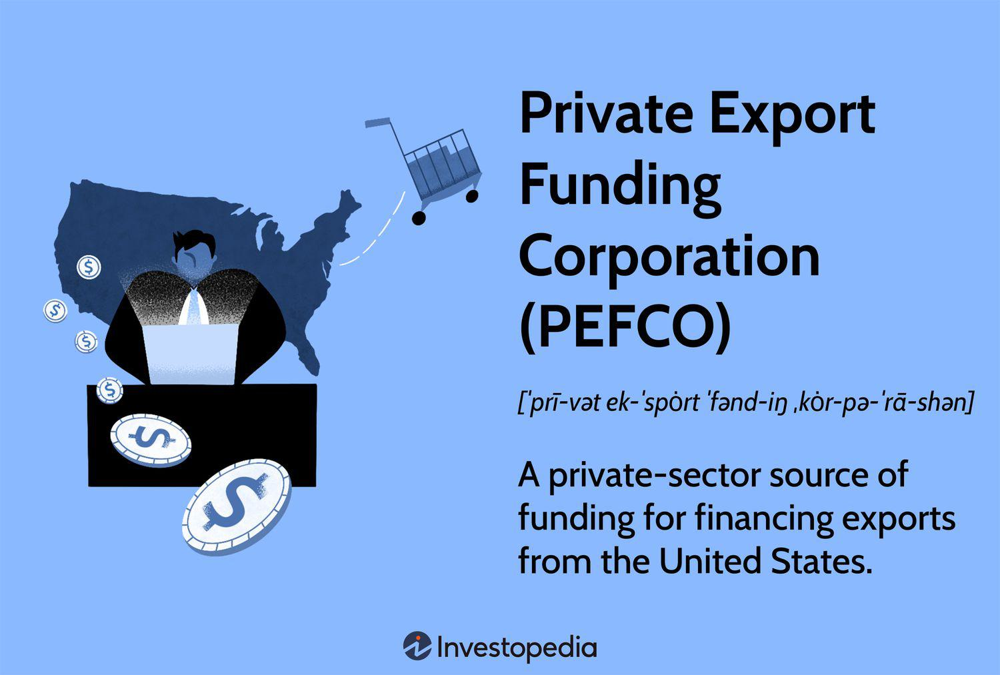

In today's rapidly changing financial landscape, identifying and capitalizing on the synergies between various financial entities and strategies is essential. Emerging technologies and financial institutions play significant roles in driving global trade and corporate efficiencies. The Private Export Funding Corporation (PEFCO) is a crucial entity in supporting U.S. exports, providing a critical link between financial assistance and global market expansion for businesses.

PEFCO stands as a pivotal organization by offering financial products and banking services to U.S. companies aiming to extend their operations internationally. Through strategic partnerships and financial underwriting, it assists in bridging the gap between domestic markets and international opportunities. This analysis includes PEFCO's operational dynamics, its strategic alliance with the Export-Import Bank of the United States (Ex-Im Bank), and how these elements collectively empower export initiatives.

Moreover, the integration of recent developments such as algorithmic trading into the fiscal strategies of corporations has profoundly influenced corporate finance landscapes. Algorithmic trading introduces the ability for financial professionals to implement faster and more efficient trade strategies, further enhancing investment decisions and risk management practices. This technology is reshaping the way companies approach international trade, providing data-driven insights that allow for more informed decision-making processes.

For financial professionals, understanding these elements is vital for optimizing export financing solutions and seizing global market opportunities. This article serves as a comprehensive overview, designed for those interested in wielding financial institutions and cutting-edge technology to bolster corporate governance and sharpen competitive advantage in today's interconnected markets. By examining these synergies, businesses are better equipped to navigate the complexities of international trade and secure sustainable growth.

## Table of Contents

## Understanding PEFCO and its Funding Mechanisms

Founded in April 1970, the Private Export Funding Corporation (PEFCO) emerged as an instrumental entity in advancing U.S. exports. It provides supplementary financing solutions to foreign importers of American goods and services. Operating predominantly as both a lender and a secondary market buyer of export loans, PEFCO offers a comprehensive catalogue of export finance programs designed to support and enhance U.S. export activities.

PEFCO's operations center around the unique requirement that all its loans are guaranteed by the Export-Import Bank of the United States (Ex-Im Bank). This partnership ensures an added layer of security for loans, bolstering trust among international traders and fostering global commerce. By securing the Ex-Im Bank's guarantee, PEFCO effectively mitigates repayment risks associated with export transactions, thereby encouraging foreign buyers to engage more readily in purchasing U.S. exports.

The shareholder structure of PEFCO further underlines its strategic importance in facilitating exports. Its shareholders encompass a mix of pivotal financial entities, including significant U.S. commercial banks, prominent export corporations, and influential financial service companies. This diverse stakeholder base not only solidifies PEFCO's financial backing but also integrates a broad spectrum of expertise and resources dedicated to the promotion of U.S. exports.

For businesses and financial professionals aiming to leverage PEFCO's services, understanding its operational mechanisms is essential. Engaging with PEFCO can serve as a critical strategy for enhancing export activities, offering financial flexibility and security. The strategic role of PEFCO in conjunction with the Ex-Im Bank highlights an effective model of public-private cooperation, designed to enhance the competitiveness of U.S. exports on a global stage. This collaboration underscores the pivotal role these entities play in the global trading environment and the importance for businesses to integrate such financial instruments to maximize their international reach and operational effectiveness.

## The Role of Corporate Finance in Export Funding

Corporate finance is integral to export funding, playing a critical role in a company’s ability to expand operations globally. It encompasses various strategic financial management practices that ensure businesses maximize available resources and opportunities. Institutions such as the Private Export Funding Corporation (PEFCO) and the Export-Import Bank provide substantial benefits to companies through export funding options. To capitalize on these benefits, companies must employ effective corporate finance strategies.

Smart financial management and strategic planning enable organizations to leverage external financing resources effectively. By aligning financial strategies with available export funding initiatives, businesses can enhance their international competitiveness. Corporate finance strategies such as capital structure management and risk assessment are essential for securing and effectively utilizing export funding. These strategies ensure that the company maintains an optimal mix of debt and equity to finance operations and growth, effectively managing risks associated with currency fluctuations and geopolitical uncertainties.

Capital structure management involves determining the appropriate proportion of debt and equity in a company's financial framework. This balance impacts the company's cost of capital and ability to sustain growth in international markets. A critical aspect of capital structure management is the evaluation of the weighted average cost of capital (WACC), an essential metric that businesses use to assess investment decisions. By minimizing the WACC, companies can reduce financing costs and increase shareholder value.

Risk assessment in corporate finance includes identifying, analyzing, and addressing potential risks that could impede a company’s export activities. This involves financial modeling and scenario analysis to predict variances in cash flow, interest rates, and market conditions. Financial professionals use these analyses to make informed decisions on hedging strategies to mitigate risks associated with foreign trade.

By integrating corporate finance practices with export financing options, companies can achieve significant growth in international markets. This integration requires understanding the specific terms and conditions associated with export loans and guarantees, including interest rates, repayment schedules, and the availability of insurance to protect against non-payment risks.

Alignment of corporate finance strategies with export funding opportunities requires a comprehensive approach that considers both short-term financial gains and long-term strategic positioning. This approach includes investing in technologies and infrastructure that facilitate export activities and sustaining relationships with international partners and financial institutions.

In conclusion, corporate finance professionals play a vital role in aligning financial strategies with export funding opportunities, thereby facilitating seamless global operations and fostering significant growth and competitiveness.

## Algorithmic Trading and its Impact on Corporate Finance

Algorithmic trading has revolutionized the financial sector through the use of sophisticated algorithms to automate and enhance trading decisions. These algorithms allow market participants to execute orders with speed and precision, thereby increasing efficiency and reducing transaction costs. In this context, [algorithmic trading](/wiki/algorithmic-trading) can be a significant asset within corporate finance strategies, offering several key benefits: optimization of asset management, risk hedging, and enhanced decision-making processes. 

Incorporating algorithmic trading into corporate finance strategies involves utilizing automated systems to streamline various aspects of financial management, thus optimizing asset allocation and resource management. By employing algorithms, companies can swiftly analyze large datasets to identify trading patterns, assess market risks, and make informed investments. The use of [machine learning](/wiki/machine-learning) models, for instance, can aid in predicting market trends and evaluating the risk/reward ratio of potential investments, thereby maximizing returns on investment (ROI).

Hedging risks is another critical function that algorithmic trading can enhance. Through real-time analysis and execution, algorithms can adjust positions swiftly to mitigate potential losses due to market [volatility](/wiki/volatility-trading-strategies). This capability is particularly useful when dealing with international markets where exchange rate fluctuations pose significant risks. By automating the hedging process, corporations can protect their portfolios more effectively, leading to greater financial stability.

Algo trading also provides real-time data insights, enabling corporations to make timely decisions about international investments and export expansions. The ability to process and analyze data from various global markets instantaneously allows businesses to react to market changes and opportunities with agility, maintaining a competitive edge. For instance, currency [arbitrage](/wiki/arbitrage) strategies can be automated to capitalize on price discrepancies between markets, ensuring favorable exchange rates for export financing.

The impact of algorithmic trading on corporate finance is highlighted by its potential to drive profitability and expand a company's global reach. By automating trading processes and leveraging advanced algorithms, businesses can optimize their financial operations, enter new markets with minimal risk, and achieve sustainable growth. The integration of algorithmic trading into corporate finance provides a sophisticated toolset for navigating the complexities of international markets and capitalizing on emerging opportunities.

For finance professionals, understanding these advanced trading tools is crucial for staying competitive. Knowledge of algorithmic trading enables professionals to adapt to the dynamic nature of international markets and efficiently manage the associated risks. As the financial landscape becomes more complex, the ability to employ algorithmic strategies will be indispensable for achieving success in the global market. 

Overall, algorithmic trading is a transformative force in corporate finance, offering substantial advantages in terms of efficiency, risk management, and market insight. By harnessing the power of algorithms, businesses can better prepare for the challenges of international trade and secure their position in an increasingly interconnected global economy.

## Leveraging PEFCO, Corporate Finance, and Algo Trading for Business Growth

Bringing together the strengths of PEFCO's export funding, corporate finance acumen, and algorithmic trading can significantly boost business growth. The integration of these elements requires a multifaceted approach that combines financial resources, strategic financial management, and advanced analytic techniques to navigate the complexities of international trade.

PEFCO's export funding provides a secure financial foundation for businesses seeking to expand internationally by facilitating access to capital. By leveraging PEFCO's financing mechanisms, companies can overcome the limitations of conventional funding sources, enhancing their ability to enter new markets effectively. The guaranteed loans offered by PEFCO ensure that businesses can pursue export opportunities with reduced risks, thus enabling a smoother expansion process.

Incorporating corporate finance strategies is essential for optimizing the use of export funding. Strategic management of financial resources involves meticulous planning and control over capital structures, ensuring that companies maintain the flexibility needed to adapt to changing economic conditions. Effective risk management practices, such as the use of futures contracts or options to hedge against currency fluctuations, are imperative for reducing exposure to volatile international markets.

Algorithmic trading, as a sophisticated tool in corporate finance, can further enhance the strategic edge of businesses. By utilizing algorithmic trading systems, companies can process large volumes of financial data in real-time, enabling more informed decision-making. For instance, algorithms can be used to predict market trends, inform timing of foreign investments, or identify arbitrage opportunities across different markets. The application of machine learning models can further refine these algorithms to improve their predictive capabilities over time.

An example of a successful integration of these strategies is seen in a U.S.-based manufacturer that used PEFCO's export loans to enter Asian markets. By applying robust corporate finance principles, the company managed its capital efficiently while employing algorithmic trading techniques to optimize its currency exchange operations, leading to a 15% increase in market share within two years.

For financial professionals aiming to achieve growth on a global scale, mastering the interplay between export funding, corporate governance, and advanced financial technology is crucial. An in-depth understanding of these components enables businesses to craft strategies that not only enhance their competitive positioning but also ensure long-term sustainable growth in the international arena.

This cohesive approach underscores the need for companies to harness the potential of financial innovations and partnerships with entities like PEFCO, ultimately fostering an environment where strategic agility and market insight drive success.

## Conclusion

In an ever-evolving global market, the significance of integrating export funding, corporate finance, and algorithmic trading becomes increasingly evident. The Private Export Funding Corporation (PEFCO) and similar institutions play a crucial role in supporting U.S. businesses by facilitating international trade, ensuring that these businesses are well-equipped to compete on a global scale. These organizations provide much-needed financial solutions that enable U.S. exporters to manage risks and explore new markets confidently.

The fusion of advanced financial practices and emergent technologies such as algorithmic trading enables businesses to address economic challenges while harnessing profitable opportunities. Algorithmic trading, with its ability to deliver real-time data insights and automated decision-making processes, optimizes resource management and enhances strategic investment decisions. When combined with the structured financial support of institutions like PEFCO, these technological advancements can lead to more efficient trading strategies and improved financial performance.

It is crucial for financial professionals and enterprises to understand and apply these strategies, securing their market position and achieving sustainable growth. By aligning corporate finance strategies with robust export funding mechanisms and leveraging cutting-edge technologies, businesses can overcome barriers and gain a competitive edge in the international marketplace.

This comprehensive examination of PEFCO, alongside the strategic integration of corporate finance and algorithmic trading, underscores the necessity for flexible and well-informed financial strategies in today's dynamic economic environment. As markets continue to evolve, these integrated approaches will be pivotal for businesses aiming to thrive and expand in the global arena.

## References & Further Reading

[1]: Export-Import Bank of the United States. ["Annual Reports and Financial Statements."](https://www.exim.gov/news/reports)

[2]: ["Private Export Funding Corporation Overview."](https://pefco.com/) 

[3]: Chordia, T., Roll, R., & Subrahmanyam, A. (2005). ["Evidence on the Speed of Convergence to Market Efficiency."](https://www.anderson.ucla.edu/documents/areas/fac/finance/17-01.pdf) The Journal of Financial and Quantitative Analysis, 40(4), 863–894.

[4]: Treanor, J. J. (2002). ["The Role of the Export-Import Bank and Private Export Funding Corporation in Financing U.S. Exports."](https://pmc.ncbi.nlm.nih.gov/articles/PMC2730950/) North Carolina Journal of International Law and Commercial Regulation, 28(3), 669–696.

[5]: Aldridge, I. (2013). ["High-Frequency Trading: A Practical Guide to Algorithmic Strategies and Trading Systems."](https://books.google.com/books/about/High_Frequency_Trading.html?id=6l0DDQAAQBAJ) 

[6]: Hasbrouck, J., & Saar, G. (2013). ["Low-Latency Trading."](https://www.sciencedirect.com/science/article/abs/pii/S1386418113000165) The Review of Financial Studies, 26(9), 2349–2391.