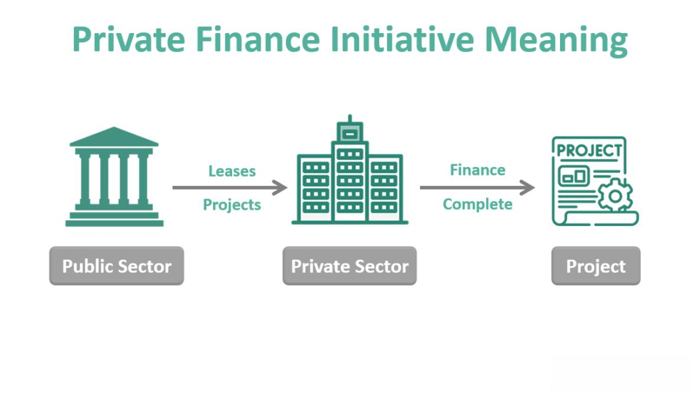

The Private Finance Initiative (PFI) is a pivotal model for funding public-sector projects through private-sector investment. Established originally in the United Kingdom, PFI involves private entities financing, building, and managing public projects while recouping their investments over time through government payments. This model transfers immediate financial burdens away from the public sector, theoretically leveraging private sector efficiencies and expertise in project delivery.

PFIs and Public-Private Partnerships (PPPs) are closely linked, representing significant frameworks for infrastructure development in various sectors such as transport, healthcare, and education. These partnerships enable the public sector to benefit from private sector innovation and management skills, while supposedly achieving enhanced value for money.



This article examines how PFIs and PPPs intersect with the expanding field of algorithmic trading, which automates trading processes using complex algorithms to execute orders with greater speed and precision than human traders. As both financial and technological landscapes undergo rapid transformation, the integration between PFI frameworks, public-private collaborations, and algorithmic trading methodologies becomes increasingly significant. Algorithmic trading may contribute to optimizing financial flows within PFIs and PPPs by providing data-driven insights, enhancing investment strategies, and improving risk management protocols.

The exploration covers the mechanics behind PFIs, assessing their benefits and shortcomings alongside the historical and contemporary perspectives. Additionally, implications for financial markets are considered, specifically through the lens of algorithmic trading technologies. Our objective is to clarify the broad repercussions of these interactions on public infrastructure and contemporary financial practices, alluding to potential transitions and innovations within these realms.

## Table of Contents

## Understanding PFI and Public-Private Partnerships

Private Finance Initiatives (PFIs) represent a strategic partnership model, primarily originating and utilized in the United Kingdom, designed to engage private sector entities in delivering and managing public projects. Under this framework, private firms are tasked with the responsibility of financing, constructing, and often operating public infrastructure projects. This effectively shifts the immediate financial burden away from government entities, allowing them to benefit from private sector investment and expertise without incurring upfront costs.

In a typical PFI setup, the private sector covers the initial costs required for the development of a public infrastructure project. This may include highways, hospitals, schools, and other crucial public services. The government, in turn, commits to repaying the investment over an extended period, usually ranging from 20 to 30 years. The repayment is structured as a series of regular payments, often termed "unitary charges," which include operating, maintenance costs, and a return on the investment. The primary aim of this model is to harness the efficiencies and innovations inherent in private sector management, thereby expediting project completion and potentially reducing lifetime costs.

Public-Private Partnerships (PPPs) extend beyond PFIs, encompassing various forms of collaborative arrangements between public and private sectors. These partnerships are not limited merely to financial engagements but involve a shared involvement in decision-making processes, risk-sharing mechanisms, and operational management. PPPs have gained widespread utility across diverse sectors such as infrastructure (railways, bridges), healthcare (hospitals, clinics), and education (schools, universities), where both parties contribute distinct resources and expertise to achieve common objectives.

The functionality of these partnerships hinges on well-defined contracts that outline the roles, responsibilities, and expectations of each entity involved. These agreements are crafted to maintain a balance, ensuring that neither party bears disproportionate financial or operational risks. Key players typically include government authorities, private investors, contractors, and operation and maintenance service providers. The contractual frameworks employed often incorporate risk management strategies, performance-based metrics, and financial benchmarks designed to secure successful project outcomes.

The success of PFIs and PPPs can often be attributed to their meticulous planning and the establishment of clear, attainable goals for all parties involved. An example of a common contractual framework is the "Design-Build-Finance-Operate" (DBFO) model, where private sectors are not only responsible for the project's upfront execution but also its ongoing management, thus incentivizing them to optimize lifecycle performance and cost-efficiency.

In essence, PFIs and PPPs are vital instruments for facilitating public infrastructure development in scenarios where direct government funding may be constrained. By leveraging private sector capabilities, these initiatives aim to deliver essential public services efficiently and sustainably, aligning public needs with private sector innovation and investment capabilities.

## The Role and Impact of Algorithmic Trading in PPPs

Algorithmic trading has significantly transformed financial markets, employing sophisticated algorithms to automate and optimize trading processes. This transformation offers unparalleled speed, efficiency, and precision compared to traditional manual trading methods. Within the context of Public Finance Initiatives (PFIs) and Public-Private Partnerships (PPPs), the incorporation of [algorithmic trading](/wiki/algorithmic-trading) represents a noteworthy advancement in financial management and capital funding.

Algorithmic trading within PFIs and PPPs enhances the management of financial investments by optimizing capital flow. This optimization stems from precise, data-driven decision-making processes that algorithms can facilitate. By analyzing vast datasets and executing trades at speeds unattainable by human traders, algorithms can ensure efficient allocation of resources, potentially lowering the costs associated with financing public projects.

The integration of algorithmic trading in PPP frameworks allows for refined financial planning and risk management. For instance, algorithms can assess market conditions in real-time and predict trends that influence financial strategies for public-private ventures. This capability enables decision-makers to manage risks more effectively by adjusting their strategies in response to dynamic market conditions.

To illustrate the transformative potential of algorithmic trading in public sector projects, one can consider situations where these algorithms have been employed successfully. For example, a public infrastructure project might use algorithmic systems to hedge against currency and [interest rate](/wiki/interest-rate-trading-strategies) fluctuations, ensuring financial stability throughout the project's lifecycle. The precise predictions and quick reactions offered by algorithmic trading systems can lead to significant cost savings and increased financial certainty.

Moreover, algorithmic trading can aid in the dynamic allocation and rebalancing of an investment portfolio in real-time, maximizing returns while minimizing risks inherent to the financial markets. This approach is especially beneficial for large-scale public initiatives that require substantial capital investment and long-term financial planning.

Algorithmic systems can also process and analyze complex financial models. For instance, consider the algorithm's function for optimizing investments, which could be represented in Python as follows:

```python
def optimize_investment(portfolio, market_conditions):
    # Placeholder for an optimization algorithm
    alpha = 0.01 # learning rate
    max_iterations = 1000

    for _ in range(max_iterations):
        adjustments = compute_adjustments(portfolio, market_conditions)
        portfolio = apply_adjustments(portfolio, adjustments, alpha)

        if has_converged(portfolio, market_conditions):
            break

    return portfolio

def compute_adjustments(portfolio, market_conditions):
    # Simulated function to compute portfolio adjustments
    return [condition * 0.01 for condition in market_conditions]

def apply_adjustments(portfolio, adjustments, alpha):
    # Apply adjustments to the portfolio
    return [asset + alpha * adjustment for asset, adjustment in zip(portfolio, adjustments)]

def has_converged(portfolio, market_conditions):
    # Simulated convergence check
    return sum(market_conditions) - sum(portfolio) < 0.001
```

This hypothetical scenario showcases algorithmic trading's potential to innovate traditional financial engagements in the public sector, emphasizing its role in efficient resource allocation and risk mitigation. As these systems continue to evolve, the strategic use of algorithmic trading within PFIs and PPPs will likely grow, providing stakeholders with enhanced tools for managing complex financial landscapes.

## Advantages and Disadvantages of PFIs

Private Finance Initiatives (PFIs) represent an innovative approach where private sector entities finance, construct, and operate public infrastructure projects. Over time, PFIs have witnessed both acclaim for their efficiencies and criticism for their financial implications. Here, we explore the dual nature of PFIs through the lens of their advantages and disadvantages.

### Advantages of PFIs

1. **Risk Transfer**: One of the primary advantages of PFIs is their ability to shift significant financial and operational risks from the public sector to private investors. This transfer incentivizes private entities to deliver projects on time and within budget, leveraging their expertise in management and technology. By contracting out these risks, governments can potentially minimize the impact of cost overruns and delays.

2. **Innovation and Expertise**: Engaging the private sector can drive innovation as these entities often possess specialized skills and experience not always available within the public sector. This can lead to improved quality and efficiency in project delivery. Private companies, motivated by profit, are inclined to seek innovative solutions to optimize resource use, resulting in potentially superior outcomes.

3. **Capital Availability**: PFIs facilitate access to private capital, which can be particularly beneficial in situations where public funds are limited. This mechanism allows for the development of essential infrastructure without immediate government expenditure. Private financing can accelerate project timelines, enabling quicker public access to improved facilities and services.

### Disadvantages of PFIs

1. **Long-term Financial Implications**: Despite the immediate benefits, PFIs often place long-term financial burdens on the public sector. The government is obligated to make regular payments over the project's lifespan, often spanning decades. The interest and maintenance costs associated with these payments can significantly exceed initial estimates, resulting in a greater overall financial commitment. This raises concerns about future liabilities and fiscal sustainability.

2. **Cost Efficiency Debates**: Critics argue that PFIs may not be as cost-effective as they appear. The private sector's profit margin and finance charges can inflate costs, making PFIs more expensive than traditional public financing in the long term. These concerns fuel discussions about the need for more balanced risk-sharing mechanisms that do not disproportionately favor private investors at the expense of taxpayers.

3. **Transparency Issues**: PFIs have been criticized for lacking transparency, particularly concerning the terms of contracts and the distribution of risks and rewards. This opacity can lead to public mistrust and hinder informed decision-making. Calls for improved transparency in the negotiation and execution of PFI contracts highlight the necessity for clear and accountable public-private engagements.

### Balancing the Scales

The continued evolution of PFI models seeks to address these criticisms and enhance their effectiveness. Advocates propose reforms to ensure a fairer distribution of risks, improved transparency, and accounting for the long-term financial impact on the public sector. As governments and private entities refine these partnerships, the dialogue surrounding PFIs remains crucial, evolving alongside emerging economic and technological trends.

## Case Studies and Examples

A comprehensive examination of successful Private Finance Initiative (PFI) projects highlights how this model functions across various sectors, demonstrating its practical applications and effectiveness. The application of PFIs varies greatly across global infrastructure projects, reflecting differing socio-economic landscapes and priorities.

### Infrastructure Projects 

1. **Highways** 

PFI projects have been integral in the development of road infrastructure. One notable example is the M25 motorway in the United Kingdom. This project illustrates the complexities involved in PFI contracts, where private partners are tasked with the design, construction, and long-term operation of road projects. In the case of the M25, concerns about cost overruns and contract management were prevalent, but the project ultimately succeeded in delivering significant infrastructure improvements, offering valuable lessons on risk sharing and contract management in PFI projects.[^1^]

2. **Airports**

In the aviation sector, the Terminal 5 project at London Heathrow Airport showcases a PFI model meeting large-scale infrastructure demands. Managed by private entities but owned by the public sector, the project's management model emphasized innovative construction methods and integration of technology, enabling the timely and on-budget delivery of the terminal. This example underscores the potential for PFIs to achieve efficiency and excellence when managed effectively and responsibly.[^2^]

### Social Infrastructure 

1. **Hospitals**

In healthcare, the construction of the Queen Elizabeth Hospital in Birmingham stands out as a successful PFI project. This hospital was designed, built, and is maintained under a PFI contract, reflecting the model's ability to facilitate large, complex public health infrastructure developments. The involvement of the private sector brought innovations in medical facilities and services, although it also sparked debates on the long-term financial implications of such financing structures on public health budgets.[^3^]

2. **Schools**

PFI has been employed extensively in the education sector to build and refurbish schools. The Edinburgh Schools Partnership in Scotland exemplifies the PFI approach in educational infrastructure. This initiative facilitated the construction of several state-of-the-art school facilities, with the private sector assuming construction and maintenance responsibilities. Despite some criticisms regarding cost and accountability issues, the project highlighted the potential of PFIs to deliver modern educational environments efficiently.[^4^]

### Global Adaptations

Different economies globally have tailored the PFI/PPP framework to fit their unique socio-economic contexts. In India, the Hyderabad Metro Rail project symbolizes a significant adaptation of the PFI model within a developing economy. By leveraging private investments, the project managed financial risks and optimized resources, proving vital in rapidly expanding urban infrastructure.[^5^]

Furthermore, Australia's experience with PFIs in developing its social and economic infrastructure, such as the Sydney Desalination Plant, reveals the adaptability of PFIs in contexts requiring strategic resource management and innovation to cater to climatic challenges.[^6^]

By examining these case studies, it is evident that PFIs and PPPs offer flexible frameworks capable of addressing diverse public sector needs worldwide. These examples illustrate the vital role of tailored strategies in maximizing the potential benefits while addressing inherent challenges in public-private collaborations.

[^1^]: HM Treasury (2006). "PFI: Strengthening Long-Term Partnerships". United Kingdom.
[^2^]: "Heathrow Terminal 5: Project summary sheet". 
[^3^]: Department of Health. "The Queen Elizabeth Hospital Birmingham".
[^4^]: "Edinburgh Schools Partnership Annual Report 2020". 
[^5^]: Government of Telangana. "Hyderabad Metro Rail".
[^6^]: Sydney Desalination Plant: "Annual Performance Review".

## Criticisms and Evolving Perspectives

Despite their recognized advantages in public infrastructure development, Private Finance Initiatives (PFIs) are frequently criticized for a range of issues relating to transparency, long-term financial risks, and socio-political implications. One of the primary concerns raised by critics is the potential for PFIs to obscure public sector liabilities. The intricate contractual agreements often associated with PFIs can make it challenging to ascertain the financial obligations assumed by taxpayers. These agreements may involve complex financial structures that are not readily accessible or comprehensible to the public, resulting in a lack of transparency in public financial commitments.

A related issue is the potential for PFIs to inflate costs over time. While the intention behind PFIs is to leverage the efficiency and innovation of the private sector, the costs associated with servicing these agreements can escalate, particularly when long-term maintenance and operational fees are considered. This cost inflation poses significant financial burdens on government budgets and, by extension, taxpayers. For instance, interest payments and ongoing service fees can accumulate, potentially making PFI-financed projects more expensive than projects funded through traditional public financing.

Furthermore, the global financial crisis of 2008 underscored the vulnerabilities inherent in heavily privatized public investment strategies. During the crisis, the reliance on private sector financing exposed public projects to broader economic instabilities, resulting in cautious public sentiment and necessitating policy reevaluation. This era highlighted the need for robust risk management frameworks to safeguard public interests in times of economic turbulence.

In response to these criticisms, there has been a call for the evolution of policies governing PFIs to enhance transparency, accountability, and financial sustainability. Ensuring that PFIs include clear, comprehensible documentation regarding financial obligations and risk distribution can help address transparency concerns. Additionally, adopting more balanced risk-sharing mechanisms between public and private sectors could mitigate long-term financial risks. A push for better regulatory oversight and the inclusion of performance-based incentives might also help align private sector motivations with public sector objectives, ensuring that costs remain controlled and projects deliver public value.

In conclusion, aligning PFI structures with sustainable practices involves careful consideration of the lessons learned from past implementations. The future of PFIs hinges on addressing these criticisms head-on, by fostering environments that prioritize transparency, balance financial risks, and respond adeptly to evolving socio-economic challenges. Through thoughtful policy adaptations, PFIs can continue to contribute viably to public infrastructure projects, leveraging private sector capabilities while safeguarding public interests.

## Conclusion

The Private Finance Initiative (PFI) and Public-Private Partnerships (PPPs) are essential mechanisms in addressing the financial constraints faced by public infrastructure projects. By leveraging private sector resources, these models enhance project delivery and relieve governments from immediate fiscal pressures. Algorithmic trading, by offering unprecedented financial optimization and efficiency, adds a modern dimension to these partnerships. It streamlines investment management, thus potentially reducing the overall financial risk and cost associated with complex, capital-intensive projects.

As infrastructure investments become more technologically advanced, the integration of algorithmic trading into PFI and PPP frameworks holds great promise. This integration aids in managing vast amounts of financial data, optimizing capital allocations, and improving the return on investments through precise, data-driven insights. Nevertheless, careful oversight is crucial, since the rapidity and scale of algorithmic trading can introduce systemic risks if not properly managed. Regulatory measures must evolve alongside these technological advancements to safeguard public interests and ensure transparency in these collaborative endeavors.

This discussion brings into focus the need for continual evaluation and adaptation of PFI and PPP models to align with fiscal, operational, and societal objectives. Key stakeholders, including governments, private investors, and financial markets, must engage in comprehensive planning and policy-making to navigate the complex interplay of public infrastructure needs and financial innovations. As such, maintaining a balance between harnessing technological efficiencies and upholding public accountability remains paramount for the successful implementation and sustainability of these frameworks.

## References & Further Reading

[1]: Grimsey, D., & Lewis, M. K. (2004). ["Public Private Partnerships: The Worldwide Revolution in Infrastructure Provision and Project Finance."](https://www.researchgate.net/publication/264158128_Public_private_partnerships_The_worldwide_revolution_in_infrastructure_provision_and_project_finance) Edward Elgar Publishing.

[2]: HM Treasury (2006). ["PFI: Strengthening Long-Term Partnerships."](https://www.ppiaf.org/sites/ppiaf.org/files/documents/toolkits/highwaystoolkit/6/bibliography/pdf/pfi_strengthening_long-term_partnerships_hm_treasury.pdf) United Kingdom.

[3]: Yescombe, E. R. (2011). ["Public-Private Partnerships: Principles of Policy and Finance."](https://ppp.worldbank.org/public-private-partnership/library/public-private-partnerships-principles-policy-and-finance) Elsevier.

[4]: Fischer, K., & Johnson, R. N. C. (2014). ["Private Financing of Public Infrastructure: Risk Management and Policy Implications."](https://psycnet.apa.org/record/2013-00944-025) Routledge.

[5]: Highways Agency. ["M25: Project Case Study."](https://www.highwaysindustry.com/m25-history-wonderful-road/) United Kingdom Department for Transport.

[6]: House of Commons Committee of Public Accounts. (2009). ["PFI in the NHS."](https://publications.parliament.uk/pa/cm201719/cmselect/cmpubacc/894/89406.htm) House of Commons.

[7]: "Hyderabad Metro Rail: Urban Mobility Project." Government of Telangana. [Link](https://timesofindia.indiatimes.com/india/set-up-special-panel-in-7-days-for-telangana-caste-survey-hc/articleshow/114793414.cms) 

[8]: "Sydney Desalination Plant: Annual Performance Review." (2019). [Link](https://www.pa.gov/en/agencies/education/programs-and-services/instruction/elementary-and-secondary-education/assessment-and-accountability/pennsylvania-system-of-school-assessment-pssa.html)
