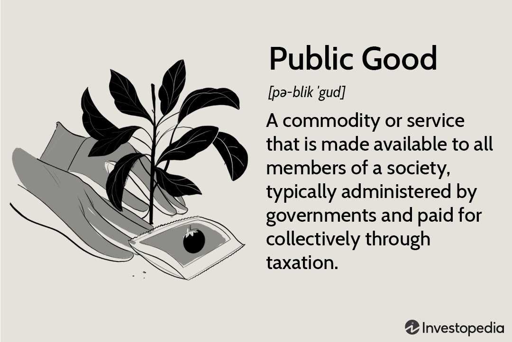

In economics, goods are categorized based on how they are consumed and accessed, playing a crucial role in understanding resource allocation. Such goods include private, public, and economic goods. Each category has distinct characteristics that affect economic interactions and policies. Private goods are typically characterized by excludability and rivalry, meaning consumption by one individual prevents another from consuming the same unit. Examples include consumer products like food and clothing. On the other hand, public goods are non-excludable and non-rivalrous, such as street lighting or national defense, accessible to all without reducing availability to others.

Meanwhile, economic goods encompass all goods that are scarce, prompting opportunity costs in their consumption. This broader term includes both private and public goods and highlights their significance in economic theory and practice.

The introduction of algorithmic trading has added complexity to the market dynamics surrounding these goods. Algorithmic trading involves using automated systems to execute trades based on predetermined criteria, drastically changing how goods are valued and exchanged. This technological advancement increases market efficiency, speed, and volume, impacting the liquidity and volatility of economic goods.

This article will explore the characteristics of private, economic, and public goods, examining how these categories influence economic strategies and market behavior. Additionally, the role of algorithmic trading within this context will be analyzed, offering insights into its impact on the valuation and exchange of goods. By the conclusion, readers will have a nuanced understanding of these economic categories and their relevance in modern trading environments, providing valuable insights for economists, investors, and market enthusiasts alike.

## Table of Contents

## Defining Private, Economic, and Public Goods

Private goods are a fundamental component of economic analysis, characterized by two main features: excludability and rivalry. Excludability means that it is possible to prevent individuals who have not paid for the good from consuming it. Rivalry implies that the consumption of the good by one individual reduces the availability of the same good for others. Everyday consumer items such as food, clothing, and electronics serve as prime examples of private goods. These items can be owned and used exclusively by the purchaser, and their consumption depletes the supply available for others.

Economic goods are a broader category that encompasses all goods that are scarce and incur an opportunity cost when consumed. In other words, they require resources for production and have alternative uses that must be foregone. The scarcity of these goods underlines their economic value; as they are not freely available, they demand a price. This scarcity principle applies universally, from tangible commodities like oil and wheat to intangible services like education and healthcare.

Public goods stand in contrast to private goods, as they are defined by their non-excludability and non-rivalrous nature. Non-excludability refers to the inability to prevent people from using the good once it has been provided. Non-rivalry means that one individual's use of the good does not reduce its availability to others. Classic examples of public goods include national defense and street lighting. These goods are typically provided by governments or organizations because their non-excludable nature makes them less attractive for private enterprises to supply.

The delineation between private, economic, and public goods is not merely academic; it has significant implications for market functioning and economic policy. For instance, the nature of public goods introduces challenges like the free-rider problem, where individuals benefit from resources without directly paying for them, leading to potential underinvestment in such goods. Conversely, the private market efficiently allocates resources for private goods through supply and demand mechanisms, as consumers are directly involved in the purchasing process.

Understanding these distinctions provides critical insights into how wealth and resources are allocated across different sectors of the economy. Economic policies often need to address the provision and funding of public goods, manage the efficient allocation of scarce resources, and regulate the consumption of private goods to ensure market stability and equity. These policies are crucial in shaping socioeconomic outcomes, dictating how goods are produced, distributed, and consumed within society.

## Comparison: Private vs. Public Goods

Private goods and public goods represent two distinct categories in economic theory, each with unique characteristics affecting their consumption and distribution. Private goods are both excludable and rivalrous. Excludability means that individuals can be prevented from using the good if they do not pay for it, and rivalry indicates that one person's use of the good reduces the availability for others. Items such as food, clothing, and personal electronics exemplify private goods, where ownership and use are confined to the purchaser.

In contrast, public goods are defined by their non-excludability and non-rivalry. Non-excludability implies that once a public good is provided, no one can be barred from its use, while non-rivalry means that one person's consumption does not diminish the availability for others. Examples of public goods include national defense and public street lighting, where usage is shared broadly without competition.

The economic implications of these distinctions are profound. For private goods, market dynamics are typically straightforward, as prices regulate demand and supply. In comparison, the provision of public goods often leads to market failures due to challenges such as the free-rider problem, where individuals might benefit from the good without contributing to its cost. This can result in under-provision of public goods, as private enterprises lack the incentive to supply them without guaranteed compensation.

To address these issues, governments frequently step in to manage and provide public goods through taxation and regulation. For instance, taxes collected from citizens are used to fund the construction and maintenance of roads or defense systems. Historically, this approach helped overcome the inefficiencies associated with free-riding.

The tragedy of the commons highlights another complexity associated with public goods or common resources. It describes a scenario where individual users, acting independently according to their self-interest, deplete a shared resource even though it is clear that it is not in anyone's long-term interest. Overfishing is a classic example, where unrestricted access leads to depletion of fish stocks.

From a historical perspective, the management of the commons has necessitated regulatory interventions to sustain resource use. In contemporary settings, digital platforms and technological advancements have prompted new forms of public goods, necessitating innovative governance models. For instance, the digital commons, such as open-source software, require community contributions and collaborative management strategies to thrive.

Overall, the comparison between private and public goods underscores varying allocation challenges and resource management strategies. Private goods rely on market mechanisms to determine distribution, whereas public goods often necessitate collective action and government intervention to ensure equitable access and sustainability. These dynamics highlight the ongoing need for effective economic policies and regulatory frameworks to balance individual interests with public welfare.

## The Rise of Algorithmic Trading

Algorithmic trading, commonly known as algo trading, revolutionizes the execution of trades through automated systems governed by pre-defined criteria. This technological breakthrough significantly influences market dynamics, especially in trading economic goods. By leveraging predefined algorithms, traders can execute orders with remarkable efficiency, speed, and precision, often far surpassing human capabilities.

One of the most notable impacts of [algorithmic trading](/wiki/algorithmic-trading) is on market [liquidity](/wiki/liquidity-risk-premium). By facilitating numerous transactions almost instantaneously, algorithmic systems contribute to higher market liquidity. This increase in liquidity can reduce the bid-ask spread, ultimately leading to cost reductions for traders. The enhanced speed of trade execution minimizes slippage between the expected and actual trade price, thus enhancing the efficiency of the market.

Despite these benefits, algorithmic trading also presents challenges and risks. Market [volatility](/wiki/volatility-trading-strategies) is a primary concern, as high-frequency trading strategies can contribute to rapid and significant price fluctuations. The phenomenon of flash crashes, characterized by sudden market drops within brief periods, is often attributed to the cascading effects of automated trading systems. For instance, during a flash crash, algorithms programmed to sell off assets when prices fall can trigger a domino effect, leading to significant market disruptions.

Additionally, the dominance of algorithmic trading raises concerns about market fairness. The advantage held by those with access to sophisticated trading algorithms and high-speed connections can create an uneven playing field. Regulatory bodies are increasingly scrutinizing high-frequency trading practices, with efforts to implement safeguards that mitigate systemic risks without stifling innovation.

Technology's influence on trading has fundamentally transformed how goods are valued and exchanged in financial markets. Algorithmic trading systems can analyze vast data sets and discern patterns beyond human capacity, allowing for more informed decision-making in asset valuation. However, as technology advances, so do the complexities and potential vulnerabilities within financial systems. Understanding and navigating these challenges is crucial for regulators, market participants, and stakeholders to ensure the stability and integrity of modern financial markets.

## Economic Implications and Market Behaviors

The intertwining of economic goods with algorithmic trading has significantly altered market behaviors, reshaping traditional economic paradigms. At its core, algorithmic trading employs automated systems to make trading decisions at speeds unattainable by human traders. This technological innovation has created new dynamics in how supply and demand are balanced for various economic goods.

Markets have progressively adapted to this blend of traditional economics and modern trading practices. Algorithms can synthesize vast amounts of data, quickly adjusting to market signals that signify changes in supply and demand. This capability enhances market efficiency, reducing the time and cost associated with trade execution. For economic goods, particularly those in financial markets, this means prices more accurately reflect real-time supply-demand dynamics, often reducing bid-ask spreads, thereby enhancing liquidity.

However, the advent of algorithmic trading has not been free from challenges. For instance, high-frequency trading—a subset of algorithmic trading—has been scrutinized for contributing to market volatility. The 2010 "Flash Crash" serves as a pivotal case study, where the Dow Jones Industrial Average plummeted nearly 1,000 points within minutes, primarily due to algorithmic trading strategies interacting in unforeseen ways. This event highlighted the potential destabilizing effects of relying heavily on algorithms for trading, particularly when market conditions are stressed.

Regulatory bodies have responded by imposing measures intended to mitigate these risks. In the United States, the Securities and Exchange Commission (SEC) has developed circuit breakers to halt trading temporarily during extreme market fluctuations, providing time to recalibrate and potentially adjust algorithmic strategies that could exacerbate volatility.

The European Union's Markets in Financial Instruments Directive (MiFID II) also exemplifies efforts to regulate algorithmic trading. MiFID II mandates stricter requirements for transparency and reporting, aiming to ensure that markets remain fair and competitive even with the presence of sophisticated trading algorithms.

Understanding these implications is crucial for stakeholders—ranging from regulators and investors to economists and policymakers—to navigate the evolving landscape of economic goods within trading ecosystems. The fusion of economic theory with technological advancements in trading continues to redefine how economic goods are perceived, valued, and exchanged. Stakeholders must remain vigilant and adaptable, embracing innovation while guarding against its potential pitfalls to maintain market integrity and stability.

## Conclusion

The exploration of private, economic, and public goods, in conjunction with the rise of algorithmic trading, offers a broad understanding of contemporary economic and market dynamics. By examining fundamental economic concepts, we have linked them to modern trading technologies, highlighting how these interactions continuously shape and redefine the economic landscape. 

The relationship between these goods and advanced trading methods is in a constant state of evolution, bringing both significant opportunities and notable challenges. Algorithmic trading, with its speed and efficiency, has revolutionized market operations, influencing the value and accessibility of various economic goods. This transformation prompts stakeholders to adjust strategies and consider the impact on both private and public sectors.

The ongoing advancement in technology and market strategies is poised to further affect how goods are consumed, traded, and regulated. As algorithmic models grow more sophisticated, they stand to enhance market efficiencies but also introduce complexities that necessitate robust regulatory frameworks to mitigate potential risks, such as market volatility and systemic disruptions.

In this dynamic environment, staying informed and prepared is essential for navigating the evolving terrain of global markets. The interplay between technology and traditional economic principles underscores the need for continuous adaptation and vigilance to seize emerging opportunities and address future market challenges effectively.

## References & Further Reading

[1]: Samuelson, P.A., & Nordhaus, W.D. (2010). ["Economics"](https://archive.org/details/economics0000samu), McGraw-Hill Education.

[2]: Kose, M.A., & Huhn, M.P. (2020). ["Public Goods and Market Failures: A Critical Examination"](https://scholar.google.com/citations?user=zxtvOKsAAAAJ&hl=en), Cambridge University Press.

[3]: Hull, J.C. (2017). ["Options, Futures, and Other Derivatives"](https://www.pearson.com/en-us/subject-catalog/p/options-futures-and-other-derivatives/P200000005938/9780136939917), Pearson Education.

[4]: Lopez de Prado, M. (2018). ["Advances in Financial Machine Learning"](https://www.amazon.com/Advances-Financial-Machine-Learning-Marcos/dp/1119482089), Wiley.

[5]: Fabozzi, F.J., & Focardi, S.M. (2012). ["Handbook of High-Frequency Trading"](https://pages.stern.nyu.edu/~bdonefer/presscites/HFTMMI.pdf), Wiley Finance.

[6]: Chan, E.P. (2009). ["Quantitative Trading: How to Build Your Own Algorithmic Trading Business"](https://github.com/ftvision/quant_trading_echan_book), Wiley.

[7]: MacKenzie, D. (2006). ["An Engine, Not a Camera: How Financial Models Shape Markets"](https://academic.oup.com/mit-press-scholarship-online/book/20588), MIT Press.