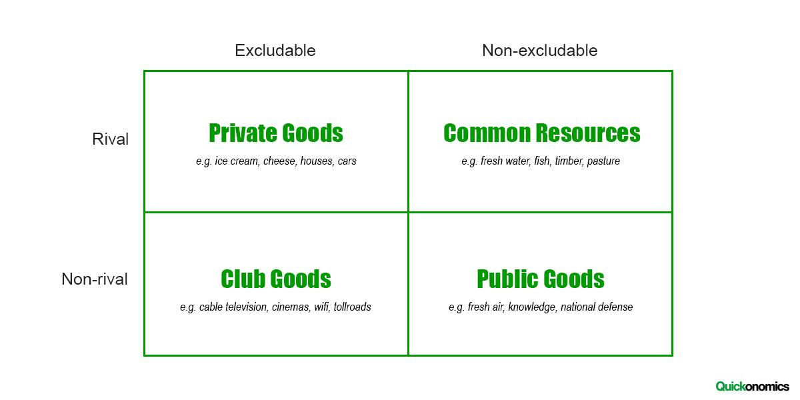

## Table of Contents

## What are private goods?

Private goods are things that you can own and use just for yourself. They are things like food, clothes, and toys. When you buy a private good, you can stop others from using it. For example, if you buy a sandwich, you can eat it and no one else can have it.

These goods are different from public goods because they can be used up and they can be kept private. If you use a private good, there is less of it for others. Also, you can control who gets to use it. This is why private goods are often bought and sold in stores.

## What are public goods?

Public goods are things that everyone can use and enjoy together. They are things like parks, street lights, and clean air. When you use a public good, it doesn't stop others from using it too. For example, if you go to a park, other people can still come and enjoy the park at the same time.

These goods are different from private goods because they can't be used up by one person and they are hard to keep just for yourself. If you use a public good, there is still enough for everyone else. Because of this, public goods are usually provided by the government or community, not bought and sold in stores.

## Can you give examples of private goods?

Private goods are things that you can own and use just for yourself. Some examples are food, like apples or sandwiches, clothes, like shirts or shoes, and toys, like dolls or action figures. When you buy these things, you can decide who gets to use them. If you buy a chocolate bar, you can eat it all by yourself or share it with a friend, but you control it.

Another example of a private good is a car. When you own a car, you can drive it whenever you want, and you can choose who else gets to ride in it. If you have a bicycle, it's the same thing – you can ride it, and no one else can use it at the same time unless you let them. These examples show how private goods can be controlled and used by the person who owns them.

## Can you give examples of public goods?

Public goods are things that everyone can use and enjoy together. One example is a park. When you go to a park, you can play on the swings, have a picnic, or just walk around. Other people can do the same things at the same time, and your use of the park doesn't stop them from enjoying it too. Another example is street lights. They light up the roads at night so everyone can see where they're going. If you walk under a street light, it doesn't mean that no one else can use it – everyone can benefit from the light.

Another public good is clean air. We all breathe the same air, and when it's clean, everyone can enjoy it. If one person breathes in clean air, it doesn't use it up for others. National defense is also a public good. It protects everyone in a country, and one person's safety doesn't take away from another's. These examples show how public goods are shared and used by everyone, without being used up or controlled by one person.

## What are the key characteristics of private goods?

Private goods are things that you can own and use just for yourself. They have two main characteristics: they can be used up, and they can be kept private. When you use a private good, like eating a sandwich, you use it up. Once you eat the sandwich, it's gone, and no one else can eat it. This means that if you use a private good, there is less of it for others.

The other characteristic of private goods is that you can control who gets to use them. If you own a toy, you can decide if you want to share it with a friend or keep it all to yourself. This is different from public goods, which everyone can use at the same time. Because private goods can be used up and controlled, they are often bought and sold in stores. When you buy a private good, you get to decide how it's used.

## What are the key characteristics of public goods?

Public goods are things that everyone can use and enjoy together. One key characteristic of public goods is that they can't be used up by one person. For example, if you go to a park, you can play and have fun, but other people can still come and enjoy the park at the same time. Your use of the park doesn't stop others from using it too. Clean air is another example. When you breathe clean air, it doesn't use it up for others. Everyone can still breathe the same clean air.

The other key characteristic of public goods is that they are hard to keep just for yourself. You can't stop others from using them. For example, street lights light up the roads for everyone at night. If you walk under a street light, it doesn't mean that no one else can use it. Everyone can benefit from the light. Because public goods can't be used up and are hard to control, they are usually provided by the government or community, not bought and sold in stores.

## How do private goods differ from public goods?

Private goods are things you can own and use just for yourself. They can be used up, like when you eat a sandwich, it's gone and no one else can eat it. You can also control who gets to use them. If you buy a toy, you can decide if you want to share it or keep it for yourself. This means that private goods are often bought and sold in stores because you can own them and decide how they're used.

Public goods are different because they can be used by everyone at the same time and they can't be used up. For example, if you go to a park, you can play and have fun, but other people can still come and enjoy the park too. You can't stop others from using public goods, like street lights or clean air. Because public goods are shared and can't be controlled by one person, they are usually provided by the government or community, not bought and sold in stores.

## What are the economic implications of private goods?

Private goods have a big impact on the economy because they can be bought and sold. When people buy private goods like food, clothes, and toys, they are spending money. This spending helps businesses make money, and it can also create jobs. For example, when a lot of people buy apples, the apple farmers make more money and might need to hire more workers to pick the apples. This means that private goods help keep the economy moving by encouraging people to spend money and by creating jobs.

Another economic implication of private goods is that they can be used up. If you eat a sandwich, it's gone, and no one else can eat it. This means that there is always a need to make more private goods. Companies have to keep producing things like food and clothes to meet the demand. This constant need for more goods can drive competition between businesses. They might try to make their products better or cheaper to attract more customers. This competition can lead to lower prices and more choices for people, which is good for the economy.

## What are the economic implications of public goods?

Public goods have a big impact on the economy because they are shared by everyone and can't be used up. Things like parks, street lights, and clean air help make life better for everyone. When the government or community provides these goods, it can help the economy by making people happier and healthier. For example, if there are nice parks in a city, more people might want to live there, which can help businesses and create jobs. Public goods can also make it easier for people to work and do things, like when street lights help people see at night.

But public goods can also be hard to pay for. Because everyone can use them and no one can be stopped from using them, it's hard to make people pay for them directly. This is called the "free rider problem." If people don't have to pay for something, they might not want to help pay for it, even if they use it. So, the government usually has to use taxes to pay for public goods. This means that everyone pays a little bit, even if they don't use the goods as much. This can be a challenge for the economy because the government has to balance how much to spend on public goods with other needs.

## How does the government typically handle the provision of public goods?

The government usually takes care of public goods because they are things that everyone can use and enjoy together. Things like parks, street lights, and clean air are important for everyone, but it's hard to make people pay for them directly. So, the government uses taxes to pay for these goods. When you pay taxes, some of that money goes to making sure there are nice parks to play in, street lights to help you see at night, and clean air to breathe. This way, everyone helps pay a little bit, even if they don't use the goods as much.

Sometimes, the government works with other groups to provide public goods. For example, they might work with local communities or non-profit organizations to build and take care of parks. This can help make sure that the public goods are well taken care of and meet the needs of the people who use them. By working together, the government can make sure that everyone has access to these important things, which can make life better for everyone in the community.

## What are some challenges in managing public goods?

One big challenge in managing public goods is the free rider problem. This happens when people use public goods without paying for them. For example, if you enjoy a park but don't help pay for it, you're a free rider. Because everyone can use public goods and no one can be stopped from using them, it's hard to make people pay. The government usually uses taxes to pay for public goods, but some people might not want to pay taxes if they think they don't use the goods as much. This can make it hard for the government to have enough money to take care of public goods.

Another challenge is deciding how much to spend on public goods. The government has to balance the money it spends on things like parks and street lights with other needs, like schools and hospitals. If they spend too much on public goods, there might not be enough money for other important things. But if they don't spend enough, the public goods might not be as good as they could be. This can be tricky because everyone might have different ideas about what's most important. So, the government has to listen to what people want and try to make the best choices for everyone.

## How can market failures related to public goods be addressed?

Market failures happen when the market can't provide public goods well. Public goods, like parks and clean air, are things everyone can use at the same time and they can't be used up. But because everyone can use them and no one can be stopped from using them, it's hard to make people pay for them. This is called the free rider problem. When people don't pay for something they use, there isn't enough money to keep the public goods in good shape. This can lead to not having enough parks or clean air, which makes life worse for everyone.

To fix this, the government usually steps in. They use taxes to pay for public goods. When everyone pays a little bit through taxes, there's enough money to take care of parks, street lights, and clean air. Sometimes, the government works with other groups, like local communities or non-profits, to help manage and take care of public goods. By working together, they can make sure everyone has what they need. This helps make sure that public goods are there for everyone to enjoy, even if the market can't provide them on its own.

## References & Further Reading

[1]: Samuelson, P.A., & Nordhaus, W.D. (2010). ["Economics"](https://archive.org/details/economics0000samu), McGraw-Hill Education.

[2]: Kose, M.A., & Huhn, M.P. (2020). ["Public Goods and Market Failures: A Critical Examination"](https://scholar.google.com/citations?user=zxtvOKsAAAAJ&hl=en), Cambridge University Press.

[3]: Hull, J.C. (2017). ["Options, Futures, and Other Derivatives"](https://www.pearson.com/en-us/subject-catalog/p/options-futures-and-other-derivatives/P200000005938/9780136939917), Pearson Education.

[4]: Lopez de Prado, M. (2018). ["Advances in Financial Machine Learning"](https://www.amazon.com/Advances-Financial-Machine-Learning-Marcos/dp/1119482089), Wiley.

[5]: Fabozzi, F.J., & Focardi, S.M. (2012). ["Handbook of High-Frequency Trading"](https://pages.stern.nyu.edu/~bdonefer/presscites/HFTMMI.pdf), Wiley Finance.

[6]: Chan, E.P. (2009). ["Quantitative Trading: How to Build Your Own Algorithmic Trading Business"](https://github.com/ftvision/quant_trading_echan_book), Wiley.

[7]: MacKenzie, D. (2006). ["An Engine, Not a Camera: How Financial Models Shape Markets"](https://academic.oup.com/mit-press-scholarship-online/book/20588), MIT Press.