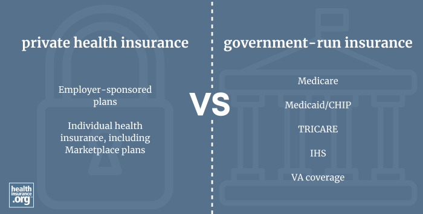

## Table of Contents

## What is private health insurance?

Private health insurance is a type of insurance that you buy from a company to help pay for your medical care. It is different from public health insurance, which is provided by the government. With private health insurance, you pay a monthly fee called a premium, and in return, the insurance company helps cover the costs of doctor visits, hospital stays, and other medical services. This can be helpful if you want to choose your own doctors or if you need treatments that are not covered by public insurance.

Sometimes, private health insurance can be more expensive than public insurance, but it often gives you more choices and faster access to care. For example, you might be able to see a specialist without waiting as long as you would with public insurance. However, it's important to read the details of your insurance plan carefully. Some plans might not cover everything you need, and you might have to pay extra out of your own pocket for certain services. It's a good idea to compare different plans to find one that fits your needs and budget.

## Why might someone consider purchasing private health insurance?

Someone might consider purchasing private health insurance because it can give them more choices about their medical care. With private insurance, you can often pick your own doctors and hospitals, which might not be possible with public insurance. This can be important if you have a doctor you really like or if you need to see a specialist quickly. Private insurance might also cover treatments or medications that public insurance does not, which can be helpful if you have specific health needs.

Another reason to consider private health insurance is the possibility of faster access to care. Sometimes, public health systems have long waiting times for appointments or surgeries, but private insurance can help you get seen more quickly. This can be a big relief if you're dealing with a health issue that needs attention sooner rather than later. While private insurance can be more expensive, the benefits of more choice and faster care might make it worth the cost for some people.

## How does private health insurance differ from public health insurance?

Private health insurance is insurance you buy from a company, while public health insurance is provided by the government. With private insurance, you pay a monthly fee called a premium, and the insurance company helps pay for your medical care. Public insurance, like Medicare or Medicaid in the U.S., is funded by taxes and aims to provide healthcare to everyone who qualifies, often at a lower cost or for free. The main difference is who provides the insurance and how it's paid for.

Private insurance often gives you more choices about your healthcare. You can usually pick your own doctors and hospitals, and it might cover treatments that public insurance doesn't. This can be really helpful if you need to see a specialist quickly or if you want to choose a doctor you trust. Public insurance might have fewer choices and longer waiting times for care, but it's usually more affordable or even free for those who qualify. So, private insurance can be more expensive but offers more flexibility and faster access to care, while public insurance is more about making sure everyone can get healthcare at a lower cost.

## What are the key factors to consider when choosing a private health insurance plan?

When choosing a private health insurance plan, it's important to think about what you need and what you can afford. First, look at the monthly cost, called the premium. You want to make sure you can pay this every month. Then, check what the plan covers. Some plans might not cover everything you need, like certain treatments or medications. Also, think about how much you might have to pay out of your own pocket for things like doctor visits or hospital stays. This is called a deductible or co-payment, and it can add up.

Another thing to consider is the network of doctors and hospitals. Some plans only work with certain doctors or hospitals, so make sure your favorite doctor is included. If you need to see a specialist, find out if the plan makes it easy to do that. Also, think about how quickly you can get care. Some plans let you see a doctor faster than others. Finally, read the fine print to understand any limits or exclusions in the plan. It's a good idea to compare different plans to find one that fits your needs and budget.

## How can one assess their health needs before buying private health insurance?

Before buying private health insurance, it's important to think about your health needs. Start by looking at your current health. Do you have any ongoing health issues, like diabetes or heart problems? If so, you might need a plan that covers treatments for these conditions. Also, think about your family's health history. Some health problems can run in families, so knowing this can help you choose a plan that covers the care you might need in the future.

Next, consider your lifestyle and habits. Do you exercise a lot, or do you have a job that's physically demanding? This might affect the kind of care you need. Also, think about any activities you enjoy, like sports or travel, because some plans might cover injuries or health issues related to these activities. By understanding your health needs, you can pick a private health insurance plan that fits you best and helps you stay healthy without spending too much money.

## What are the typical costs associated with private health insurance?

The costs of private health insurance can be split into a few main parts. The first part is the monthly premium, which is the amount you pay every month to keep your insurance. This can range from a little bit of money to a lot, depending on the plan you choose. The second part is the deductible, which is the amount you have to pay out of your own pocket before the insurance starts to help pay for your care. Some plans have high deductibles, which means you pay more before the insurance kicks in, but these plans might have lower monthly premiums.

Another cost to think about is the co-payment or co-insurance. A co-payment is a fixed amount you pay for things like doctor visits or medications. Co-insurance is when you pay a percentage of the cost of care, and the insurance pays the rest. For example, if you have a 20% co-insurance, you pay 20% of the bill, and the insurance pays 80%. Some plans might also have an out-of-pocket maximum, which is the most you'll have to pay in a year. Once you hit that limit, the insurance covers everything else. Understanding these costs can help you pick a plan that fits your budget.

## How do deductibles, co-pays, and premiums work in private health insurance?

In private health insurance, the premium is the amount of money you pay every month to keep your insurance. It's like a subscription fee. The premium can be different depending on the plan you choose. Some plans have high premiums but cover more, while others have lower premiums but might not cover as much. You need to pay this premium no matter what, even if you don't go to the doctor.

The deductible is the amount of money you have to pay out of your own pocket before your insurance starts to help pay for your medical care. For example, if your deductible is $1,000, you have to spend $1,000 on healthcare before the insurance company starts to pay. Some plans have high deductibles, which means you pay more before the insurance helps, but these plans might have lower monthly premiums. Once you meet your deductible, you still might have to pay co-pays or co-insurance.

Co-pays and co-insurance are other costs you might have to pay. A co-pay is a fixed amount you pay for things like doctor visits or medications. For example, you might pay $20 every time you see a doctor. Co-insurance is when you pay a percentage of the cost of care, and the insurance pays the rest. If you have a 20% co-insurance, you pay 20% of the bill, and the insurance pays 80%. These costs can add up, so it's important to understand them when choosing a plan.

## What are the common exclusions and limitations in private health insurance policies?

Private health insurance policies often have exclusions and limitations that you need to know about. Exclusions are things that the insurance won't cover at all. For example, some plans might not cover cosmetic surgery, like getting a nose job, because it's not seen as medically necessary. Other common exclusions can include treatments for certain mental health conditions, fertility treatments, or experimental treatments that haven't been proven to work yet. It's important to read the policy carefully to see what's not covered so you don't get surprised later.

Limitations are rules about how much the insurance will pay for certain things or how often you can get them. For example, a plan might limit how many physical therapy sessions you can have in a year, or it might only cover a certain amount of money for a specific treatment. Some plans also have waiting periods, which means you have to wait a certain amount of time before you can use certain benefits. Understanding these limitations can help you pick a plan that fits your needs and avoid unexpected costs.

## How can one compare different private health insurance plans effectively?

To compare different private health insurance plans effectively, start by looking at the monthly cost, which is called the premium. You need to make sure you can afford to pay this every month. Then, check what each plan covers. Some plans might cover more treatments or medications than others, so think about what you need. Also, look at the deductible, which is the amount you have to pay before the insurance starts to help. Some plans have high deductibles, which means you pay more out of pocket before the insurance kicks in, but these plans might have lower monthly premiums. Don't forget to consider co-pays and co-insurance, which are the amounts you pay for doctor visits or treatments.

Next, think about the network of doctors and hospitals that each plan works with. Some plans only cover care from certain doctors or hospitals, so make sure your favorite doctor is included. If you need to see a specialist, find out if the plan makes it easy to do that. Also, think about how quickly you can get care with each plan. Some plans let you see a doctor faster than others. Finally, read the fine print to understand any exclusions or limitations in the plan. By comparing these factors, you can find a plan that fits your needs and budget.

## What are the tax implications of purchasing private health insurance?

When you buy private health insurance, you might be able to save some money on your taxes. In some countries, you can take the money you spend on health insurance off your income before you pay taxes. This is called a tax deduction. It means you pay less in taxes because you're spending money on health insurance. But, the rules about this can be different depending on where you live, so it's a good idea to check with a tax expert or look at the rules in your country.

Also, some countries have special tax credits or benefits for people who buy private health insurance. These can help lower the cost of your insurance. For example, you might get money back from the government at the end of the year if you have private health insurance. Again, the rules can be different in different places, so make sure to find out what applies to you. Understanding these tax implications can help you make a smarter choice about buying private health insurance.

## How does the process of filing claims and getting reimbursements work with private health insurance?

When you need to use your private health insurance, you usually have to file a claim to get reimbursed for your medical costs. To do this, you'll need to fill out a form from your insurance company. This form asks for details about your medical visit or treatment, like the date, the doctor's name, and what the treatment was for. You'll also need to attach any bills or receipts from the healthcare provider. Once you send in the form and the documents, the insurance company will review your claim to make sure it's covered by your plan. If everything is okay, they'll send you the money to cover the costs, minus any deductibles or co-pays you owe.

Sometimes, your doctor or hospital can file the claim for you, which is called direct billing. In this case, they send the bill directly to your insurance company, and the insurance company pays them directly. You might still have to pay your part, like the deductible or co-pay, but it can be easier because you don't have to handle the paperwork yourself. It's important to keep track of your claims and make sure you understand how the reimbursement process works with your specific insurance plan, so you know what to expect and when you'll get your money back.

## What advanced strategies can be used to optimize private health insurance benefits and coverage?

To make the most out of your private health insurance, it's a good idea to understand your plan really well. Look at what treatments and medications are covered, and pay attention to any limits or exclusions. Sometimes, you can save money by choosing doctors or hospitals that are in your insurance's network. Also, think about using health savings accounts or flexible spending accounts if they're available to you. These accounts let you put money aside before taxes to pay for medical expenses, which can help lower your overall costs. If your plan has a high deductible, these accounts can be really helpful because you can use the money to pay for care before your insurance starts to help.

Another way to optimize your private health insurance is by staying healthy and using preventive care services. Many plans cover things like yearly check-ups, vaccinations, and screenings for free or at a low cost. By using these services, you can catch health problems early and avoid bigger, more expensive treatments later. Also, consider talking to your insurance company about wellness programs they might offer. These programs can help you stay healthy and might even give you rewards or discounts on your premiums. By being proactive about your health and understanding your insurance plan, you can get the most out of your coverage and save money in the long run.

## References & Further Reading

[1]: Bergstra, J., Bardenet, R., Bengio, Y., & Kégl, B. (2011). ["Algorithms for Hyper-Parameter Optimization."](https://papers.nips.cc/paper/4443-algorithms-for-hyper-parameter-optimization) Advances in Neural Information Processing Systems 24.

[2]: ["Advances in Financial Machine Learning"](https://www.amazon.com/Advances-Financial-Machine-Learning-Marcos/dp/1119482089) by Marcos Lopez de Prado

[3]: ["Evidence-Based Technical Analysis: Applying the Scientific Method and Statistical Inference to Trading Signals"](https://books.google.com/books/about/Evidence_Based_Technical_Analysis.html?id=jbD47VkOHAEC) by David Aronson

[4]: ["Machine Learning for Algorithmic Trading"](https://github.com/stefan-jansen/machine-learning-for-trading) by Stefan Jansen

[5]: ["Quantitative Trading: How to Build Your Own Algorithmic Trading Business"](https://github.com/LucindaYa/quant-resources/blob/master/Quantitative%20Trading%20How%20to%20Build%20Your%20Own%20Algorithmic%20Trading%20Business.pdf) by Ernest P. Chan