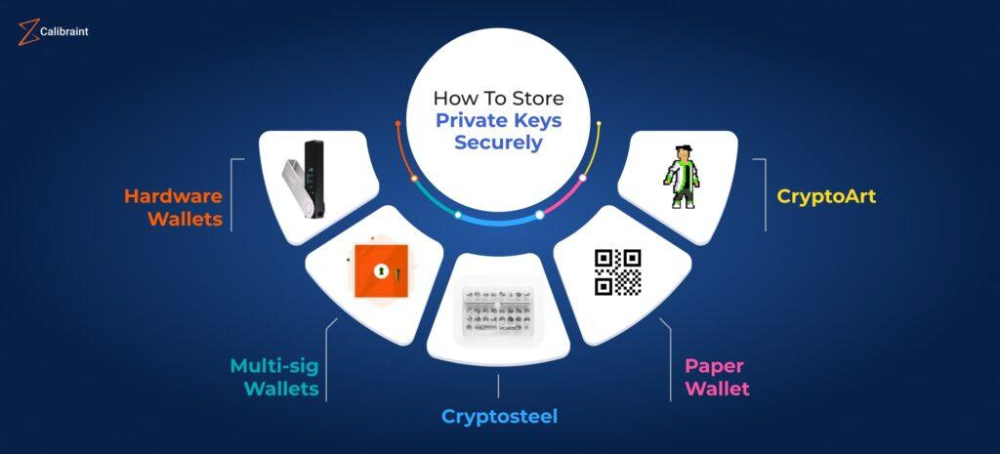

## Table of Contents

## What is a private key and why is it important in cryptography?

A private key is a secret code that only you know. It's like a special key that you use to unlock things that are meant just for you. In cryptography, which is the science of keeping messages secret, the private key helps to keep your information safe. When you want to send a secret message to someone, you use your private key to sign the message. This way, the person receiving the message knows it really came from you and hasn't been changed by anyone else.

The private key is important because it keeps your information private and secure. If someone else gets your private key, they could pretend to be you and read your secret messages or even send messages that look like they came from you. That's why you need to keep your private key very safe and not share it with anyone. By using a private key, you can be sure that your secret messages stay secret and that you can trust the messages you receive.

## How does a private key function in digital signatures?

When you want to sign a document or a message digitally, you use your private key. Think of it like signing your name on a piece of paper, but instead, you use your private key to create a special code. This code is called a digital signature. You make this signature by using a math formula that mixes your private key with the message you want to sign. This way, the signature is unique to you and the message.

The digital signature is important because it proves that the message really came from you and hasn't been changed. When someone gets your message, they can use your public key, which is like the opposite of your private key, to check the signature. If the signature matches, they know the message is from you and it hasn't been tampered with. This helps keep your messages safe and trustworthy.

## What role does a private key play in encryption and decryption?

A private key is super important when you want to keep your messages secret. In encryption, you use your private key along with the message to create a secret code that no one else can read. It's like locking a diary with a special key that only you have. When you want to send a secret message to someone, you use your private key to scramble the message so that it looks like a jumble of letters and numbers. This way, even if someone else sees the message, they won't be able to understand it without your private key.

In decryption, the private key helps you unlock the secret message. When you get a message that's been scrambled with your public key, you use your private key to unscramble it back to normal. It's like using the special key to open your locked diary and read what's inside. This way, you can read the secret message that was meant just for you. Keeping your private key safe is really important because if someone else gets it, they could read your secret messages or even send messages pretending to be you.

## What are the common formats for storing private keys?

Private keys can be stored in different ways, depending on what you need them for. One common format is PEM (Privacy-Enhanced Mail). PEM files are text files that start and end with special lines, and the private key is in the middle, usually as a long string of letters and numbers. Another format is DER (Distinguished Encoding Rules), which is a binary format. It's not as easy to read as PEM, but some systems prefer it because it's more compact.

Another format you might see is PKCS#8 (Public-Key Cryptography Standards #8). This format can store both the private key and some extra information about how to use it. PKCS#8 can be in either PEM or DER format, so it's pretty flexible. Lastly, there's the PFX/P12 format, which is often used to store not just the private key, but also the certificate that goes with it. This format is good for when you need to move keys and certificates between different systems or applications.

Each of these formats has its own use, but they all do the same thing: they keep your private key safe and make it easy to use with different programs and systems. It's important to know which format your system or application needs, so you can use your private key the right way.

## How should a private key be securely generated?

To securely generate a private key, you need to use a good random number generator. This means using something that can create numbers that are very hard to guess. Computers have special programs called cryptographic random number generators that use things like the time, mouse movements, or other unpredictable events to make these numbers. When you generate a private key, you want it to be unique and secret, so using a strong random number generator is really important. This way, no one else can guess or predict your private key.

Once you have a good random number generator, you need to make sure no one can see or change the key while it's being made. This means doing it on a safe computer that no one else can get into. Sometimes, people use special devices called hardware security modules (HSMs) to generate keys. These devices are made to be very secure and keep your key safe from the moment it's created. By using a strong random number generator and keeping everything secure, you can be sure your private key is safe and secret.

## What are the best practices for storing a private key on a personal computer?

When you store a private key on your personal computer, it's important to keep it safe. You should encrypt the private key file with a strong password. This means you add another layer of protection so that even if someone gets the file, they can't use it without knowing your password. You can use a program like VeraCrypt or BitLocker to do this. Also, make sure to save the encrypted file in a place where no one else can easily find it, like a hidden folder or a secure part of your computer.

Another good practice is to limit who can see the private key. Set up your computer so that it asks for a password when it starts up and when it wakes up from sleep. This way, if someone else tries to use your computer, they won't be able to get to your private key. It's also a good idea to use antivirus software to protect against viruses or malware that could try to steal your key. By keeping your private key encrypted and your computer secure, you can help make sure your private key stays safe.

## Can you explain the use of hardware wallets for private key storage?

Hardware wallets are special devices that help keep your private keys safe. They are like tiny computers that you can hold in your hand. When you use a hardware wallet, your private key stays inside the device and never leaves it. This means that even if someone hacks into your computer or phone, they can't get to your private key because it's not stored there. You can use the hardware wallet to sign messages or make transactions, but the private key itself stays safe inside the device.

Using a hardware wallet is a good idea because it adds an extra layer of security. These devices are made to be very secure and are hard for hackers to break into. They usually have a special chip that makes them even safer. When you want to use your private key, you connect the hardware wallet to your computer or phone, and it does the work without showing the key to anyone. This way, you can keep your private key safe and still use it when you need to.

## What are the risks associated with storing private keys on cloud services?

Storing private keys on cloud services can be risky because these services are connected to the internet. This means that hackers might try to break into the cloud to steal your keys. Even if the cloud service has good security, there's always a chance that someone could find a way to get in. Also, the people who run the cloud service might be able to see your private keys if they're not stored right. This is a big problem because your private key should be a secret that only you know.

Another risk is that you might lose control of your private keys. If the cloud service has a problem or goes out of business, you might not be able to get your keys back. It's also hard to be sure that the cloud service will always keep your keys safe. They might change their security rules or make mistakes that let someone else see your keys. Because of these risks, it's usually better to keep your private keys on your own computer or a special device like a hardware wallet, where you have more control over their safety.

## How does key management software enhance private key security?

Key management software helps keep your private keys safe by organizing them and making sure they are protected. This software can store your keys in a secure place that only you can get into. It uses strong passwords and encryption to make sure no one else can see your keys. It also keeps track of who uses the keys and when, so you can see if anyone else is trying to use them without your permission.

The software also helps you manage your keys better. It can create new keys for you using good random number generators, so your keys are always strong and unique. It can also help you back up your keys safely, so you don't lose them, but it makes sure the backups are also protected. By using key management software, you can keep your private keys safe and make sure they are used the right way.

## What are the advanced methods for private key recovery and backup?

When you want to make sure you can get your private key back if something goes wrong, you can use a few advanced methods. One way is to split your private key into pieces using something called "secret sharing." This means you break your key into several parts and give each part to different people or store them in different places. You need all the pieces to put the key back together, so it's safer because no one person can use the key without the others. Another method is to use a "threshold signature scheme," where you need a certain number of people to agree before you can use the key. This adds an extra layer of security because it's harder for someone to misuse the key without others knowing.

Another good way to back up your private key is to use a hardware security module (HSM). An HSM is a special device that keeps your key safe and can help you recover it if you lose it. It's like a safe box for your key that's very hard to break into. You can also use encryption to make your backups even safer. This means you turn your key into a secret code that you can only unlock with a password. By using these advanced methods, you can make sure your private key is safe and you can get it back if you need to.

## How can multi-signature wallets improve the security of private keys?

Multi-signature wallets make your private keys safer by needing more than one person to agree before you can use them. Imagine you have a safe that needs two or more keys to open. In a multi-signature wallet, you set it up so that a few people each have their own private key. To do something like send money or sign a message, you need a certain number of these people to agree and use their keys together. This way, it's much harder for someone to steal your money or use your keys without permission because they would need to trick more than one person.

This system also helps if you lose one of your keys. Since you don't need all the keys to work, you can still use the wallet even if one key is missing. It's like having backup keys for your safe. By spreading out the responsibility and making it harder for one person to do something alone, multi-signature wallets add an extra layer of security to keep your private keys safe.

## What are the emerging technologies for private key storage and management?

New technologies are making private key storage and management even safer. One of these is called "quantum-resistant cryptography." This is a way to keep your keys safe even if super-powerful computers called quantum computers become common. These computers could break the codes we use now, but quantum-resistant cryptography uses special math problems that even quantum computers can't solve easily. This means your private keys will stay secret no matter how strong computers get.

Another cool technology is "decentralized key management." Instead of keeping your keys in one place, like on your computer or a cloud service, you spread them out across many different places. This makes it harder for hackers to find and steal your keys because they would need to break into lots of different spots at the same time. It's like hiding your treasure in different parts of a big forest instead of keeping it all in one spot. By using these new technologies, you can keep your private keys safer and more secure.

## What is the role of cryptographic storage in algorithmic trading?

Algorithmic trading leverages advanced technologies such as [machine learning](/wiki/machine-learning) and high-speed data processing to execute trades autonomously, necessitating reliable security measures to safeguard sensitive information. Cryptographic storage is fundamental in protecting trade strategies and performance metrics, ensuring they remain confidential and secure from competitive threats. 

Ensuring the integrity and confidentiality of [algorithmic trading](/wiki/algorithmic-trading) data requires the implementation of robust encryption and key management systems. Encryption converts sensitive data into a secure format that can only be read by those possessing the necessary decryption key. Advanced Encryption Standard (AES) is frequently utilized due to its efficiency and security. An AES-encrypted message can be represented as:

$$
C = E_{K}(P)
$$

where $C$ is the ciphertext, $E_{K}$ is the encryption function using key $K$, and $P$ is the plaintext. The security of this ciphertext depends on the key's confidentiality and the robustness of the cryptographic algorithm employed.

Key management systems (KMS) are vital in handling the lifecycle of cryptographic keys, covering their generation, distribution, rotation, and destruction. In algorithmic trading, these systems ensure that only authorized entities have access to sensitive data. They manage keys securely and automatically, minimizing manual interventions that could lead to potential vulnerabilities. The National Institute of Standards and Technology (NIST) provides guidelines for effective key management practices to enhance security measures ([NIST, 2020](https://csrc.nist.gov/publications/detail/sp/800-57-part-1/rev-5/final)).

Moreover, balancing security with the high-performance requirements of algorithmic trading can be challenging. The deployment of encryption should not impede the speed at which trades are executed. Optimizing cryptographic processes is essential, often involving the use of hardware security modules (HSMs) to handle cryptographic operations efficiently without bottlenecking trade execution.

In conclusion, the integrity and confidentiality of algorithmic trading data hinge on sophisticated cryptographic storage solutions and efficient key management systems. As data breaches and cyber-attacks become increasingly sophisticated, robust encryption and effective key handling remain central to protecting trading algorithms and their sensitive information.

## References & Further Reading

[1]: Diffie, W., & Hellman, M. E. (1976). ["New Directions in Cryptography,"](https://www.cs.jhu.edu/~rubin/courses/sp03/papers/diffie.hellman.pdf) IEEE Transactions on Information Theory, 22(6), 644–654.

[2]: Nakamoto, S. (2008). ["Bitcoin: A Peer-to-Peer Electronic Cash System,"](https://nakamotoinstitute.org/library/bitcoin/) Bitcoin.org.

[3]: National Institute of Standards and Technology (2020). ["NIST Special Publication 800-57 Part 1 Revision 5: Recommendation for Key Management."](https://csrc.nist.gov/pubs/sp/800/57/pt1/r5/final)

[4]: Boneh, D., & Shoup, V. (2017). ["A Graduate Course in Applied Cryptography,"](https://toc.cryptobook.us/) Draft.

[5]: Lopez de Prado, M. (2018). ["Advances in Financial Machine Learning,"](https://www.amazon.com/Advances-Financial-Machine-Learning-Marcos/dp/1119482089) John Wiley & Sons.

[6]: Stinson, D. R., & Paterson, M. (2018). ["Cryptography: Theory and Practice,"](https://www.taylorfrancis.com/books/mono/10.1201/9781315282497/cryptography-douglas-robert-stinson-maura-paterson) CRC Press.

[7]: Narayanan, A., Bonneau, J., Felten, E., Miller, A., & Goldfeder, S. (2016). ["Bitcoin and Cryptocurrency Technologies."](https://press.princeton.edu/books/hardcover/9780691171692/bitcoin-and-cryptocurrency-technologies) Princeton University Press.