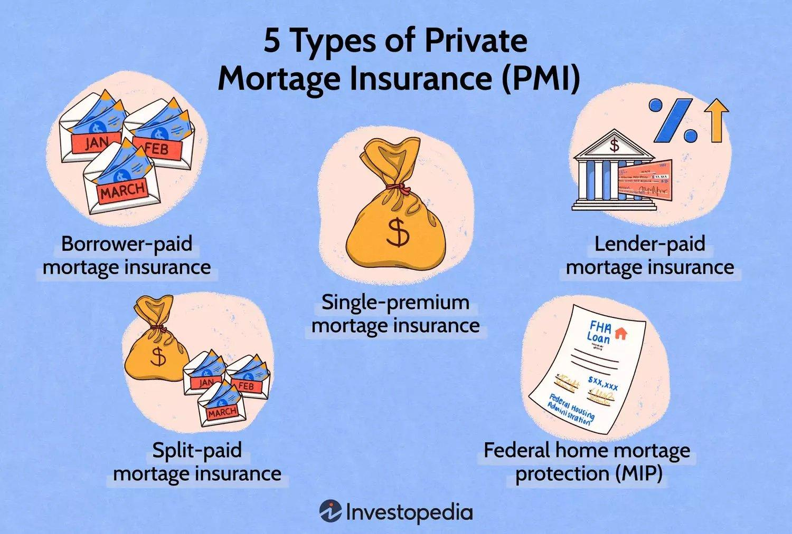

## Table of Contents

## What is Private Mortgage Insurance (PMI)?

Private Mortgage Insurance (PMI) is a type of insurance that protects the lender if you stop making payments on your home loan. It's usually required when you buy a home with a down payment of less than 20% of the home's purchase price. This insurance helps make it possible for people to buy homes without having to save up a large down payment, but it adds an extra cost to your monthly mortgage payments.

PMI is not permanent. Once you have paid down your loan enough that you owe less than 80% of the home's value, you can ask your lender to remove the PMI. This usually happens automatically when your loan balance reaches 78% of the original purchase price, but you can request it earlier if you've made enough payments or if the value of your home has increased. Getting rid of PMI can save you a lot of money over the life of your loan.

## Why is PMI required and who needs it?

PMI is required by lenders to protect themselves if you can't pay your mortgage. When you buy a home with less than a 20% down payment, the lender sees it as a bigger risk. If you stop paying, they might lose money because they have to sell the house for less than what you owe. PMI helps the lender get some of that money back, so they are more willing to give you a loan even if you don't have a big down payment.

People who need PMI are usually first-time homebuyers or anyone who can't afford to put down 20% of the home's price. It's a way for more people to buy homes without saving up a huge amount of money first. But, it means you'll have to pay a little extra each month until you've paid off enough of your loan or the value of your home goes up enough that you owe less than 80% of what the home is worth.

## How is the cost of PMI calculated?

The cost of PMI depends on a few things, like how much you borrowed, how much you put down, and your credit score. Lenders usually look at these details to figure out how risky your loan is. The more risk they see, the more you'll pay for PMI. For example, if you have a lower credit score or a smaller down payment, your PMI will cost more.

PMI is usually added to your monthly mortgage payment. The exact amount can change, but it's often between 0.3% to 1.5% of your original loan amount each year. So, if you borrowed $200,000, you might pay between $600 and $3,000 a year for PMI, which comes out to $50 to $250 a month. The good news is, once you've paid down your loan enough, you can get rid of PMI and save that extra money each month.

## What are the average PMI rates and how do they vary?

PMI rates usually fall between 0.3% and 1.5% of the original loan amount each year. This means if you borrowed $200,000, you could be paying anywhere from $600 to $3,000 a year for PMI, which breaks down to about $50 to $250 a month. The exact rate you get depends on a few things, like your credit score, how much you borrowed, and how much you put down as a down payment.

These rates can vary a lot because different insurance companies might charge different amounts, and lenders might have different deals with them. Also, if you have a higher credit score or a bigger down payment, you might get a lower PMI rate because the lender sees you as less of a risk. On the other hand, if your credit score is lower or you put down less money, you'll likely have to pay more for PMI.

## How can PMI be paid - monthly, upfront, or other options?

PMI can be paid in different ways. The most common way is to pay it every month along with your mortgage payment. This means you'll have a little extra added to what you pay each month until you've paid off enough of your loan or the value of your home goes up enough.

Another way to pay PMI is to pay it all at once, upfront, when you get your loan. This is called single-premium PMI. It can save you money in the long run because you won't have the extra monthly cost, but you'll need to have the cash ready to pay it all at once.

Some lenders also offer a mix of both, called split-premium PMI. With this option, you pay part of the PMI upfront and the rest monthly. This can be a good middle ground if you don't want to pay everything at once but still want to lower your monthly payments.

## What are the tax implications of PMI payments?

Paying for PMI used to be a tax write-off, but things changed in 2018. Before that, you could take the amount you paid for PMI and subtract it from your taxable income, which could lower how much tax you had to pay. But now, unless you buy a house in 2021 or later and meet certain income limits, you can't do that anymore.

If you bought a house in 2021 or later and your income is below a certain level, you might still be able to deduct your PMI payments on your taxes. The income limits change every year, so you'll need to check what they are when you file your taxes. If you can deduct your PMI, it means you can subtract what you paid from your income, which might lower your tax bill.

## How can one request PMI cancellation and what are the requirements?

To request PMI cancellation, you need to contact your lender and ask them to remove it. You can do this once you've paid down your loan enough that you owe less than 80% of what your home was worth when you bought it. You'll need to show your lender that you've been making your payments on time and that you haven't taken out any other loans against your home. Sometimes, you might need to get your home appraised to prove its current value.

Lenders are required by law to automatically cancel PMI when your loan balance reaches 78% of the original purchase price, as long as you're up to date on your payments. But if you want to get rid of PMI earlier, you can ask for it once you hit that 80% mark. Keep in mind that your lender might have some extra rules or fees for canceling PMI early, so it's a good idea to check with them first.

## What are the automatic PMI termination rules?

Lenders have to cancel your PMI automatically when you pay down your loan to 78% of what your home was worth when you bought it. This happens as long as you've been making your payments on time. It's a rule set by the government to help homeowners save money on their monthly payments once they've paid off a good chunk of their loan.

If you want to get rid of PMI even earlier, you can ask your lender to cancel it once you reach 80% of the original home value. You'll need to show that you've been making your payments on time and that you haven't taken out any other loans against your home. Sometimes, you might need to get your home appraised to prove its current value. Your lender might have some extra rules or fees for canceling PMI early, so it's a good idea to check with them first.

## What strategies can be used to avoid PMI altogether?

One way to avoid PMI is to save up enough money for a down payment of at least 20% of the home's price. This might take a while, but it means you won't have to pay the extra cost of PMI each month. You could save money by cutting back on spending, getting a side job, or putting money into a savings account that earns interest. If you can wait to buy a home until you have enough saved, you'll save money in the long run.

Another strategy is to look for special loan programs that don't require PMI. Some loans, like VA loans for veterans or USDA loans for rural areas, don't need PMI even if you put down less than 20%. There are also some lenders that offer piggyback loans, where you take out a second, smaller loan to cover the down payment so you can avoid PMI. These options might have different rules and costs, so it's important to do your research and see if they work for you.

If you're buying a home with someone else, like a partner or family member, you might be able to combine your savings to reach that 20% down payment. This can be a good way to avoid PMI if neither of you can afford it on your own. Just make sure you both understand the responsibilities of owning a home together before you take this step.

## How does a piggyback loan help in avoiding PMI?

A piggyback loan is a way to avoid PMI by taking out two loans instead of one. When you buy a home, you can get a main loan for most of the price and a smaller second loan to cover the rest of what you need. This second loan is called a piggyback loan. If you use the piggyback loan to make your down payment bigger than 20% of the home's price, you won't need PMI. This can save you money because you won't have to pay the extra cost of PMI each month.

Piggyback loans can be a good choice if you don't want to wait to save up a big down payment. But, they come with their own costs. The second loan might have a higher [interest rate](/wiki/interest-rate-trading-strategies) than the main loan, and you'll have to make payments on both loans. It's important to think about whether the savings from avoiding PMI are worth the extra cost of the piggyback loan. Talking to a lender can help you figure out if a piggyback loan is the right choice for you.

## What role does a larger down payment play in PMI avoidance?

A larger down payment helps you avoid PMI because it makes your loan less risky for the lender. When you put down at least 20% of the home's price, the lender sees that you have a lot of your own money invested in the home. This means they are more likely to get their money back if you stop paying, so they don't need PMI to protect themselves.

Saving up for a bigger down payment might take some time, but it can save you a lot of money in the long run. You won't have to pay the extra cost of PMI each month, which can add up over the years. Plus, a larger down payment can sometimes get you a better interest rate on your loan, making your home even more affordable.

## How can home price appreciation affect PMI and its potential removal?

Home price appreciation can help you get rid of PMI sooner. When the value of your home goes up, it means you owe less of the home's total value. If your home's value increases enough, you might reach the point where you owe less than 80% of what your home is worth now, even if you haven't paid down your loan that much. At that point, you can ask your lender to remove PMI.

To show that your home's value has gone up, you might need to get an appraisal. This is where someone comes to your home to check its value. If the appraisal shows your home is worth more, and you owe less than 80% of the new value, your lender should agree to cancel PMI. This can save you money because you won't have to pay the extra cost of PMI anymore.

## References & Further Reading

[1]: ["The New Successful Mortgage & Real Estate Investing"](https://www.businessinsider.com/personal-finance/investing/how-to-invest-in-real-estate-make-money) by Steve Berges

[2]: ["Private Mortgage Insurance: Policy Options for the Federal Home Loan Mortgage Corporation"](https://www.zillow.com/learn/private-mortgage-insurance/) by William E. O'Brien

[3]: ["Advances in Financial Machine Learning"](https://www.amazon.com/Advances-Financial-Machine-Learning-Marcos/dp/1119482089) by Marcos Lopez de Prado

[4]: ["Quantitative Trading: How to Build Your Own Algorithmic Trading Business"](https://www.amazon.com/Quantitative-Trading-Build-Algorithmic-Business/dp/1119800064) by Ernest P. Chan

[5]: ["Homebuyers Beware: Strategies & Solutions for Debunking the U.S. Real Estate Myth"](https://www.zillow.com/learn/home-buying-myths/) by Carolyn Warren

[6]: ["The Oxford Handbook of Quantitative Asset Management"](https://academic.oup.com/edited-volume/41255) edited by Bernd Scherer

