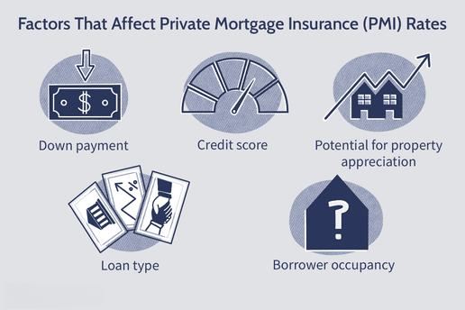

Navigating the complexities of home financing is a significant challenge for prospective homeowners, particularly when considering additional costs such as Private Mortgage Insurance (PMI). PMI is a type of insurance that lenders often require from borrowers who are unable to make a down payment of at least 20% on a conventional loan. Although PMI protects the lender against potential default, it represents a significant extra cost for homebuyers, potentially impacting their financial wellbeing.

This article investigates the nuances of PMI and its implications for home financing. It aims to provide clarity on how PMI affects home affordability, illustrating its impact through various financial examples. Furthermore, we will examine strategies that homebuyers can employ to avoid PMI, thereby maintaining a healthier financial posture when investing in real estate.

Additionally, this guide will briefly touch on algorithmic trading's role within finance—an area that has substantially reshaped conventional market operations. Understanding financial trends through data-driven insights, typically derived from such trading, can empower individuals when making key decisions around the timing and methods of financing a home. This knowledge is integral to bypassing unnecessary costs, such as PMI, and making more informed decisions about real estate investments.

By the conclusion of this guide, readers will be equipped with practical strategies and insights to circumvent PMI costs, enhancing their ability to invest wisely in the housing market. As the financial environment continues to evolve, staying informed about market trends and financial tools becomes ever more crucial, enabling smarter, more strategic real estate decisions.

## Table of Contents

## Understanding PMI in Home Financing

Private Mortgage Insurance (PMI) is a financial product frequently encountered in the context of home financing. When a homebuyer is unable to make a down payment of 20% or more on a conventional loan, lenders often require PMI as a safety net. The core function of PMI is to mitigate the lender's risk in scenarios where the borrower might default on the loan. By providing this layer of security, lenders are more likely to approve loans that pose a higher risk profile. However, this advantage comes with added costs for the borrower.

The cost of PMI is integrated into the borrower's mortgage payments, leading to increased monthly obligations. This additional expense can strain household budgets, adversely affecting both affordability and long-term financial planning. The impact of PMI on a borrower's financial health extends beyond immediate costs and necessitates careful consideration when planning to purchase a home.

One of the common misconceptions about PMI is that it serves a protective function for the homeowner, which it does not. PMI solely acts as a safeguard for lenders and offers no direct financial benefit to homeowners. Another prevalent misunderstanding is the perceived inevitability of PMI in low down payment scenarios. While it is a requisite in many conventional loan situations, various strategies and loan products exist that can either reduce or eliminate the need for PMI.

Despite its cost, PMI is sometimes unavoidable, especially for first-time homebuyers who may struggle to amass the 20% down payment typically required to bypass it. In such cases, PMI enables individuals to enter the housing market sooner than they might otherwise. This access can be vital, particularly in rising property markets where waiting to save a larger down payment could result in higher purchase prices.

Understanding the detailed implications of PMI within the context of home financing is crucial for any potential homeowner. By recognizing both its role and impact, homebuyers can better navigate their financial obligations and make informed decisions that align with their long-term economic goals.

## The Financial Impact of PMI Costs

Private Mortgage Insurance (PMI) represents an additional cost that can notably influence the financial dynamics of home ownership. This insurance, which is generally required for borrowers unable to make a down payment of 20% or more, ensures protection for lenders against potential default by the borrower. Despite its role in safeguarding lenders, it places an extra financial burden on homeowners.

PMI premiums typically range between 0.5% and 2.25% of the total mortgage loan annually. This percentage depends significantly on factors such as the borrower's credit score and the size of the loan. To illustrate, for a $300,000 mortgage, PMI could cost between $1,500 and $6,750 annually. These figures might be broken down into monthly payments, adding between $125 and $562.50 to the homeowner's monthly expenses. 

To elucidate further, assume a borrower secures a mortgage of $250,000 with a PMI rate of 1%. The annual PMI cost equals $2,500, resulting in an additional monthly expense of approximately $208. Over a decade, this cost accumulates to $25,000, demonstrating how PMI can incrementally impact long-term financial health.

The cumulative effect of PMI on monthly budgets can be profound. This extra recurring expense can strain household finances, limiting funds available for other essential expenditures or investments. Moreover, carrying these additional costs can pose psychological burdens, leading to stress and anxiety concerning personal financial security. Unanticipated fluctuations in income or expenses can exacerbate these concerns, highlighting the practical impacts of PMI on homeowners' lives.

In summary, while initially seeming negligible, the cost of PMI aggregates over time, potentially hampering financial stability and personal well-being. Understanding these impacts can empower homebuyers to strategize effectively, ensuring sound financial decisions in their real estate endeavors.

## Strategies to Avoid Paying PMI

To avoid paying Private Mortgage Insurance (PMI), one can consider several strategies that may either eliminate the necessity for PMI or help to remove it in the future:

1. **Making a 20% Down Payment**: The most straightforward way to avoid PMI is by making a down payment of at least 20% of the home's purchase price. This approach not only circumvents the need for PMI but also reduces the loan principal, resulting in lower monthly payments. For instance, if the purchase price of a home is $300,000, a down payment of $60,000 (20% of $300,000) would be required to avoid PMI.

2. **Piggyback Loans**: Another common strategy is to utilize a piggyback loan, also known as an 80-10-10 loan. In this arrangement, the homebuyer takes out a primary mortgage for 80% of the home's value, a second mortgage or home equity loan for 10%, and then makes a 10% down payment. This structure effectively reduces the loan-to-value (LTV) ratio of the primary mortgage, eliminating the need for PMI. However, it’s essential to consider that the second mortgage may have a higher interest rate, affecting long-term costs.

3. **Lender-Paid PMI**: Some lenders offer the option of lender-paid PMI, where the lender covers the insurance cost upfront, often in exchange for a higher interest rate on the mortgage. This strategy can eliminate monthly PMI payments, but it may result in a more expensive loan over time due to the increased interest. Borrowers should carefully calculate and compare the total cost of lender-paid PMI against traditional PMI payments.

4. **Achieving a Lower Loan-to-Value Ratio**: Homebuyers can work towards increasing their home equity more rapidly, thereby reducing the LTV ratio. Options include making extra payments towards the mortgage principal or utilizing any bonuses, tax refunds, or windfalls to pay down the loan balance. As the LTV decreases to 78% or below, PMI can typically be cancelled.

5. **Refinancing**: Refinancing the mortgage can be an effective way to remove PMI, particularly if the home’s value has appreciated or if substantial principal payments have been made. By securing a new loan with an LTV ratio of less than 80%, refinancing can eliminate the need for PMI. It is advisable to evaluate the refinancing terms and associated costs to ensure that this option will be financially beneficial.

In summary, these strategies offer various pathways to lessen or completely sidestep PMI payments. Each option comes with unique financial implications, and it is crucial to assess one's financial situation and future plans when selecting the best approach.

## Algorithmic Trading: An Emerging Tool in Financing

Algorithmic trading is a modern approach to financial markets that involves the use of computer algorithms to execute trade orders at optimal conditions. By leveraging complex mathematical models and pre-designed trading instructions, [algorithmic trading](/wiki/algorithmic-trading) aims to buy or sell financial instruments at the most advantageous times. This method has dramatically enhanced the efficiency and speed of trading, allowing traders to process a large [volume](/wiki/volume-trading-strategy) of transactions with minimal human intervention.

One pivotal impact of algorithmic trading is its ability to quickly analyze market trends and patterns. In the housing and mortgage market, algorithmic trading can process vast amounts of data, such as interest rates, housing prices, and economic indicators, to predict future movements. This data-driven approach provides valuable insights into market dynamics, enabling financial institutions and individual investors to better understand potential changes and make informed decisions regarding mortgages and home financing.

For individual homebuyers and investors, algorithmic trading can serve as a powerful tool to navigate the complexities of the mortgage market. By analyzing real-time data, algorithms can identify the best periods to enter or [exit](/wiki/exit-strategy) the housing market, helping individuals optimize their financing strategies. For example, algorithms can assess the impact of macroeconomic factors, such as an [interest rate](/wiki/interest-rate-trading-strategies) hike by the Federal Reserve, on mortgage affordability. By evaluating historical trends and current economic data, these algorithms can offer predictions that guide individuals on when it might be strategically advantageous to refinance a mortgage or purchase property.

Understanding algorithmic trading and its implications requires a foundation in financial literacy. As financial markets continue to evolve with advanced technologies, possessing this knowledge becomes crucial in making sound investment choices. Investors and homebuyers must familiarize themselves with the basic principles of algorithmic trading to capitalize on its benefits. By doing so, they can effectively utilize data-driven insights to navigate the often-unpredictable nature of financial markets and reduce the risks associated with hurried or poorly informed decisions.

In summary, as algorithmic trading continues to transform traditional financial landscapes, it plays a significant role in shaping better financing decisions within the housing market. By empowering individuals with precise market analyses and predictions, it enhances the decision-making process, making financial literacy essential for those seeking to leverage these modern tools for successful real estate investment and management.

## Conclusion

In conclusion, understanding Private Mortgage Insurance (PMI) is crucial for homebuyers seeking to navigate the complexities of home financing efficiently. PMI, while providing security to lenders, can add a significant financial burden to borrowers. Strategies to avoid PMI, such as achieving a 20% down payment or opting for alternatives like piggyback loans and lender-paid PMI, play a pivotal role in maintaining home financing within manageable limits.

Furthermore, algorithmic trading emerges as a transformative tool in strategic financial planning, offering data-driven insights that empower individuals to make informed home financing decisions. By analyzing market trends, algorithmic trading aids in predicting potential shifts in the housing and mortgage sectors, helping homebuyers time their investments more effectively.

Continuous education and awareness of market dynamics are essential for circumventing unnecessary financial burdens. Homebuyers and investors should remain proactive in exploring a diverse range of financial tools and educational resources, thereby enhancing their decision-making skills when purchasing real estate. By doing so, they can ensure a sound investment strategy and avoid pitfalls associated with undue financial strain.

## FAQs

### How can PMI be removed from a mortgage outside of reaching 20% equity?
PMI can be removed from a mortgage through several mechanisms apart from reaching 20% equity. One method is refinancing the mortgage, which could be advantageous if current interest rates are lower than those of the original loan. Refinancing might allow for a revaluation of the property, potentially demonstrating 20% equity based on the appraised value. Another strategy is to explore lender-specific guidelines, as some lenders may cancel PMI based on strong payment history or when the mortgage balance reaches 78% of the original property value, irrespective of the equity due to rising property values or accelerated payments.

### What other forms of insurance might a homeowner need besides PMI?
Homeowners often require additional types of insurance to safeguard their investment. Homeowners insurance is essential, covering the structure, personal property, and liability for damages or injuries occurring on the property. Flood insurance is crucial in flood-prone areas since standard homeowners insurance typically excludes flood damage. Earthquake insurance is another consideration in regions susceptible to seismic activity. It's also recommended to consider umbrella insurance for additional liability coverage beyond the limits of homeowners insurance.

### How does PMI differ from FHA mortgage insurance terms?
PMI is applicable to conventional loans and is meant to protect lenders in cases of borrower default, typically required when the down payment is less than 20%. It is based on factors like loan amount and credit score. Conversely, FHA mortgage insurance applies to FHA loans, typically requiring a lower down payment and offering more relaxed credit requirements. FHA mortgage insurance includes both an upfront mortgage insurance premium (UFMIP) and an annual premium calculated based on the average outstanding loan balance. Unlike PMI, FHA mortgage insurance remains for the term of the loan unless the borrower refinances into a conventional mortgage or pays down the principal to 78% of the home's value.

### Can PMI be tax-deductible under any circumstances?
PMI has been tax-deductible in the past, depending on legislation. Tax deductibility for PMI means borrowers could include the cost of PMI as an itemized deduction on their federal tax returns, subject to income limitations. Historically, this benefit has phased out at higher income levels, and the deduction has not been permanent, requiring renewal by Congress. It's essential for homeowners to consult current tax rules or a tax advisor to determine if they qualify for this deduction.

### What role do credit scores play in determining PMI rates?
Credit scores significantly influence PMI rates. Lenders use credit scores to assess the risk associated with insuring a mortgage. Borrowers with higher credit scores may benefit from lower PMI premiums, reflecting a reduced perceived risk of default. Conversely, lower credit scores can result in higher PMI rates, increasing the overall cost of borrowing. The relationship between credit scores and PMI rates underscores the importance of maintaining good credit health for potential homebuyers seeking to minimize additional mortgage-related expenses.

## References & Further Reading

[1]: ["The New Successful Mortgage & Real Estate Investing"](https://www.businessinsider.com/personal-finance/investing/how-to-invest-in-real-estate-make-money) by Steve Berges

[2]: ["Private Mortgage Insurance: Policy Options for the Federal Home Loan Mortgage Corporation"](https://www.zillow.com/learn/private-mortgage-insurance/) by William E. O'Brien

[3]: ["Advances in Financial Machine Learning"](https://www.amazon.com/Advances-Financial-Machine-Learning-Marcos/dp/1119482089) by Marcos Lopez de Prado

[4]: ["Quantitative Trading: How to Build Your Own Algorithmic Trading Business"](https://www.amazon.com/Quantitative-Trading-Build-Algorithmic-Business/dp/1119800064) by Ernest P. Chan

[5]: ["Homebuyers Beware: Strategies & Solutions for Debunking the U.S. Real Estate Myth"](https://www.zillow.com/learn/home-buying-myths/) by Carolyn Warren

[6]: ["The Oxford Handbook of Quantitative Asset Management"](https://academic.oup.com/edited-volume/41255) edited by Bernd Scherer

