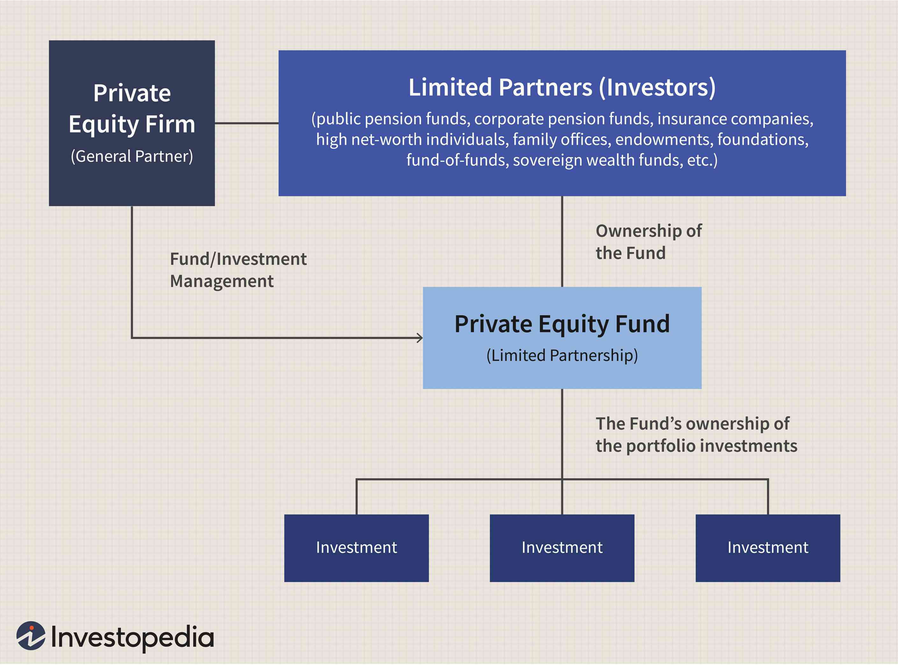

In today's fast-paced financial markets, strategies like private purchase and direct transactions are increasingly becoming focal points for investors. With advancements in technology and innovative financial strategies, the area of personal buying and algorithmic trading is seeing a notable transformation. This article aims to explore how these strategies intersect, offering insights on how they can be utilized to optimize investments.

Private purchases involve acquiring shares in privately-held firms, a process that often bypasses the public capital markets. Understanding the mechanism behind these transactions can offer a competitive edge to investors by potentially accessing higher returns and unique investment opportunities. Engaging in private purchases necessitates a deep understanding of the company's operations, market position, and financial health, as these factors can significantly influence the investment outcomes.



On the other hand, algorithmic trading is revolutionizing trading execution by integrating technology with strategic insight. By utilizing computer algorithms to make trade decisions, this form of trading allows for enhanced speed and precision in executing trades. It reduces human error and bias, thereby providing more consistent results. Algorithmic trading strategies include high-frequency trading, market making, and arbitrage, each offering unique advantages and requiring specialized knowledge.

This comprehensive guide provides an in-depth examination of these concepts, offering a roadmap for investors seeking to adopt these modern approaches. By strategically employing private purchase and algorithmic trading strategies, investors can navigate today's complex financial markets with increased efficacy and potential for success.

## Table of Contents

## Understanding Private Purchase

Private purchase refers to the acquisition of ownership interest in a privately held company. Unlike public transactions, which occur through stock exchanges, private purchases typically bypass the public capital markets. This process involves negotiating directly with the company's existing shareholders or through private offerings that are not accessible to the general public.

These transactions often require the involvement of a broker or an investment bank, serving as intermediaries to facilitate the negotiation and execution of the deal. They are particularly prevalent among venture capital and private equity firms aiming to invest in promising companies that are not publicly accessible. By acquiring stakes in privately held companies, these firms seek to develop and eventually [exit](/wiki/exit-strategy) the investment at a higher valuation.

Private purchases are generally restricted to accredited investors. The designation of "accredited investor" usually implies that the individual or entity meets certain financial criteria established by regulatory bodies. This classification helps mitigate the risks involved in private transactions, as these investments can be illiquid and [carry](/wiki/carry-trading) substantial financial risks. The regulatory requirements often stipulate that accredited investors must have a net worth exceeding a specific threshold or possess a certain level of income, among other criteria.

The process of executing a private purchase involves several critical steps, each requiring thorough due diligence. Due diligence is the investigative process of reviewing the financial statements, market position, management capabilities, and potential liabilities of the target company. This step is essential to understanding the intrinsic value of the company, identifying potential risks, and ensuring that the investment aligns with the investor's strategy and risk tolerance.

Essential steps in a private purchase process include:

1. **Identification of Target Company**: Investors identify potential investment opportunities through market research and networking. 

2. **Valuation and Offer**: Determining the company's market value using valuation techniques such as discounted cash flow (DCF) analysis, comparable company analysis, or precedent transactions. An offer is then made based on the valuation.

3. **Negotiation**: Engaging in negotiations with the company's shareholders or board of directors to agree on the purchase terms, price, and conditions.

4. **Due Diligence**: Conducting a thorough review of the company's operations, finances, legal matters, and market conditions. This step is critical to uncover any issues that could affect the investment's outcome.

5. **Transaction Structuring**: Deciding on the transaction structure, such as whether the purchase will be equity-based or involve debt financing.

6. **Closing the Deal**: Finalizing the legal documents and completing the transaction. This stage involves signing agreements, transferring funds, and updating ownership records.

7. **Post-Acquisition Integration**: Depending on the investor's involvement, there may be efforts to integrate or align the acquired company with existing investments or strategic goals.

The intricate process of private purchase demands meticulous planning and execution. Failing to conduct adequate due diligence can lead to unforeseen challenges and financial losses. As such, investors and firms engaging in private purchases strive to comprehensively understand the target company and the market landscape, ensuring informed decision-making throughout the transaction.

## Algorithmic Trading: An Overview

Algorithmic trading, commonly referred to as algo trading, represents a paradigm shift in the execution of trades in financial markets. This method leverages computer algorithms to automate trading based on pre-defined instructions, including timing, price, or [volume](/wiki/volume-trading-strategy). The use of algorithms in trading enhances execution speed and precision, capitalizing on market opportunities that might be fleeting if executed manually.

The core of [algorithmic trading](/wiki/algorithmic-trading) lies in its ability to process complex data sets and execute trades at speeds unattainable by human traders. This capability stems from advances in technology, particularly in high-performance computing, data analytics, and telecommunications. These technological advancements have reduced latency, which is the time delay between the initiation and execution of a trade. By minimizing latency, algo trading allows for the rapid exploitation of minute price discrepancies in the market.

Popular strategies within algorithmic trading include high-frequency trading ([HFT](/wiki/high-frequency-trading-strategies)), [market making](/wiki/market-making), and [arbitrage](/wiki/arbitrage). High-frequency trading exploits small price inefficiencies at an extraordinarily fast pace, often holding positions for mere seconds. Market making involves providing [liquidity](/wiki/liquidity-risk-premium) to the market by simultaneously offering to buy and sell securities. Arbitrage, on the other hand, seeks to profit from price differences of identical or similar financial instruments across different markets or forms.

Algorithmic trading comprises several key components, including data analysis, strategy formulation, [backtesting](/wiki/backtesting), and real-time execution. Data analysis involves collecting and processing vast quantities of market data to identify patterns and inform strategy development. Strategy formulation translates insights from data analysis into actionable trading rules. Backtesting assesses how strategies might have performed in the past using historical data, which aids in refining these strategies before they are deployed. Real-time execution ensures strategies are carried out without human intervention, utilizing fast communication networks and direct market access.

The benefits of algorithmic trading are manifold. It reduces human error and emotional bias, ensuring that trades are executed based on stringent, pre-set criteria. By operating around the clock and reacting to real-time market conditions, algo trading can capture opportunities across global markets. Additionally, it allows for the execution of complex strategies that would be infeasible for human traders to implement manually.

The adoption of algorithmic trading has been extensive across various financial sectors, from equities and foreign exchange to commodities and fixed-income markets. Its influence is markedly growing, driven by the need for efficiency, cost reduction, and the pursuit of enhanced returns. As the financial industry continues to innovate, algorithmic trading is poised to play an increasingly integral role in the landscape of modern finance.

## The Intersection of Private Purchase and Direct Transactions

Direct transactions in private purchases and algorithmic trading frameworks present a significant evolution in the financial markets, offering enhanced investment efficiency and outcomes. Direct transactions, avoiding traditional brokerage and intermediary involvement, underscore the importance of transparency and cost efficiency. These transactions typically translate to lower fees since investors deal directly with the acquirer or issuer of the securities, thereby reducing the layers of intermediary expenses.

Moreover, when integrated within algorithmic trading frameworks, direct transactions further expedite the investment process. Algorithmic trading, with its reliance on sophisticated algorithms to execute trades at optimal prices and timing, can harness direct transactions to enhance speed—one of its core advantages. Through automated systems, trades are executed within milliseconds, capitalizing on algorithmic precision and market opportunities without manual intervention.

The intersection of these strategies also improves market transparency. With direct transactions, there is a clearer view of the transaction process and asset pricing. This transparency plays a crucial role in competitive markets, allowing investors to make informed decisions based on readily available information, free from the obscurities often associated with traditional brokerage transactions.

In practical terms, leveraging direct transactions within algorithmic trading strategies may involve setting up automated systems that connect directly to private markets or trading platforms offering such capabilities. The code could involve APIs that streamline the trading process. Here's a simplified Python example of how an investor might use an API to automate direct transactions:

```python
import requests

def execute_direct_transaction(api_endpoint, credentials, transaction_data):
    headers = {'Authorization': f"Bearer {credentials['token']}"}
    response = requests.post(api_endpoint, headers=headers, json=transaction_data)

    if response.status_code == 200:
        print("Transaction executed successfully!")
        return response.json()
    else:
        print("Error in transaction execution.")
        return None

# Example usage
api_endpoint = "https://api.tradingplatform.com/direct_transaction"
credentials = {'token': 'your_api_token_here'}
transaction_data = {
    'asset': 'PrivateEquity',
    'amount': 50000,
    'price': 100,
    'action': 'buy'
}

execute_direct_transaction(api_endpoint, credentials, transaction_data)
```

The convergence of these strategies is poised to reshape investment landscapes by providing streamlined access to private equity and other non-public traded securities, fostering financial inclusivity. This approach not only maximizes returns by minimizing fees and enhancing speed but also equips investors with more control and real-time insights into their investments. As financial technology progresses, such intersections are expected to offer even more sophisticated tools for achieving competitive and optimized investment outcomes, which align with rapidly evolving market dynamics.

## Benefits and Risks of Algorithmic Trading

Algorithmic trading, often referred to as algo trading, provides numerous advantages that enhance trading efficiency and effectiveness. One of the primary benefits is the minimization of human error and emotional biases, which often lead to inconsistent and suboptimal trading decisions. By using predefined rules and algorithms to execute trades, algorithmic trading ensures that trades are conducted with precision, based on data and statistical models rather than human judgment. This leads to more consistent outcomes and can significantly increase the reliability of trading strategies.

Algo trading also benefits from increased speed and accuracy. Computerized systems can process market data and execute orders at speeds far beyond human capability, sometimes completing trades in fractions of a second. This speed allows traders to capitalize on short-lived market opportunities and implement strategies such as high-frequency trading and [statistical arbitrage](/wiki/statistical-arbitrage) with great efficiency. Moreover, algorithms can simultaneously track and analyze multiple market variables, providing traders with a comprehensive view of the market dynamics, further supporting informed trading strategies.

Despite these advantages, algorithmic trading is not without risks. One notable risk is the possibility of technology failures. System outages, software bugs, or connectivity issues can lead to unintended trading outcomes or missed opportunities. For example, a software glitch could execute erroneous trades, potentially causing significant financial losses or contributing to market disruptions, as seen in events like the "Flash Crash" of 2010.

Algorithmic trading can also exacerbate market [volatility](/wiki/volatility-trading-strategies). High-frequency trading, a subset of algo trading, can lead to rapid price fluctuations due to the sheer volume and speed of trades. This heightened volatility can impact market stability and make it challenging for traditional traders to adapt to rapidly changing prices.

Risk management in algorithmic trading involves implementing robust monitoring and control systems. Traders should conduct rigorous testing and validation of algorithms under various market conditions to ensure they perform as intended. Setting up safety checks, such as circuit breakers or kill switches, can help mitigate the effects of potential algorithmic mishaps. Additionally, maintaining redundant systems and comprehensive backup plans can prevent data loss or trading downtime during unexpected failures.

In conclusion, while algorithmic trading offers significant advantages in enhancing trading precision and efficiency, it is crucial for traders to be aware of the inherent risks. By adopting comprehensive risk management strategies, traders can maximize the benefits of algorithmic trading while minimizing potential downsides.

## Legal and Regulatory Considerations

Investors engaged in private purchases must navigate a complex legal landscape, particularly in relation to the regulations enforced by the U.S. Securities and Exchange Commission (SEC). Private purchases typically involve the acquisition of shares in privately-held companies, which are not subject to the same disclosure requirements as public companies. However, they are governed by specific regulations designed to protect investors and ensure fair market practices. Accredited investor status is typically required for participation in private placements, as outlined under Regulation D of the Securities Act of 1933. This regulation provides exemptions that allow companies to raise capital without registering with the SEC, conditional upon specific compliance measures being met, such as limits on the number of investors and restrictions on resale.

Algorithmic trading, an area that has seen significant regulatory scrutiny, involves the use of complex algorithms to automate trade execution. The speed and volume inherent in algorithmic trading have prompted regulatory bodies to establish rules aimed at mitigating systemic risks and promoting market stability. The SEC and the Commodity Futures Trading Commission (CFTC) have been specifically focused on ensuring that algorithmic systems do not contribute to market manipulation or precipitous market moves that could impact market integrity.

Regulation SCI (Systems Compliance and Integrity) is pivotal in the regulatory framework for algorithmic trading. Implemented by the SEC, this rule requires essential market participants, including those using algorithmic strategies, to ensure that their technological infrastructure is robust and reliable. Participants must maintain and regularly test their systems' capacity and integrity, ensuring compliance with strict reporting guidelines in the event of disruptions.

Moreover, the European Union's Markets in Financial Instruments Directive II (MiFID II) sets stringent requirements for algorithmic trading, promoting transparency and strengthening investor protection. Key aspects include pre-trade transparency measures, mandatory testing of trading algorithms, and detailed transaction reporting.

Compliance best practices include conducting thorough due diligence, maintaining transparent reporting protocols, and implementing comprehensive risk management strategies. For private purchases, staying abreast of SEC guidelines and consulting with legal professionals helps mitigate regulatory risks. For algorithmic trading, regular system audits, backtesting of trading algorithms, and adhering to international best practices are essential for achieving compliance and maintaining operational integrity.

In conclusion, navigating the regulatory frameworks governing private purchases and algorithmic trading requires a detailed understanding of applicable laws and proactive compliance strategies. As regulatory landscapes continue to evolve in response to technological advancements and market dynamics, staying informed and adaptable is crucial for investors seeking to leverage these innovative investment strategies.

## Future Trends in Private and Algorithmic Trading

As technology continues to advance, the integration of [artificial intelligence](/wiki/ai-artificial-intelligence) (AI) and [machine learning](/wiki/machine-learning) into private purchasing and algorithmic trading is anticipated to have a transformative impact. These technologies promise to optimize both speed and decision-making accuracy, fundamentally changing how investments are executed and managed.

AI and machine learning are expected to enhance algorithmic trading by enabling systems to adapt to new information and market conditions autonomously. Machine learning algorithms can analyze historical data and recognize patterns, which can be used to predict price movements and optimize trading strategies. This adaptability allows for more sophisticated strategies that are responsive to market dynamics.

Moreover, the use of AI extends to private purchasing through advanced data analytics, which can provide deeper insights into privately-held companies. Investors will likely use AI tools to better assess a firm's potential by analyzing large datasets for risk assessment, performance metrics, and market trends. This could lead to more informed decision-making and better investment outcomes.

The landscape of direct transactions is also expected to undergo significant changes. Emerging platforms may leverage blockchain technology to increase transparency and reduce transaction costs, facilitating a more direct and efficient trading environment. This could result in greater accessibility for a wider range of investors, potentially democratizing access to private purchasing and algorithmic trading opportunities.

These advancements hold the potential to redefine the boundaries of traditional investment strategies, offering enhanced efficiency and accessibility. As these technologies mature, the financial industry is likely to see innovative solutions that bridge the gap between private purchasing and algorithmic trading, making these sophisticated strategies available to a broader audience of investors.

## Conclusion

The fields of private purchase and algorithmic trading present dynamic opportunities for investors looking to optimize their participation in today's financial markets. By effectively harnessing these approaches, individuals and institutions can enhance their decision-making processes, leading to increased precision and potentially improved returns.

Private purchases allow investors to access unique opportunities in privately-held companies, bypassing traditional public market channels. This approach affords the advantages of negotiating terms directly and potentially securing investments at attractive valuations. Meanwhile, algorithmic trading has transformed the way trades are executed, leveraging sophisticated algorithms to conduct transactions with speed and accuracy, thus reducing the impact of human errors and biases.

Strategically deploying these methodologies enables investors to capitalize on market inefficiencies and tailor their investment strategies to their specific risk profiles and objectives. For instance, by incorporating algorithmic trading into private purchase strategies, investors might reduce costs and enhance the transparency of their transactions, thereby maximizing efficiency and returns.

This article has explored the foundational principles underlying private purchase and algorithmic trading, equipping investors with the necessary awareness to further refine their strategies. Continued learning and adaptation are crucial as financial technologies evolve, offering exciting prospects for integration and innovation. As technology and financial markets advance, staying informed about regulatory changes and emerging trends will be vital for maintaining a competitive edge.

## References & Further Reading

[1]: Lopez de Prado, M. (2018). ["Advances in Financial Machine Learning"](https://www.amazon.com/Advances-Financial-Machine-Learning-Marcos/dp/1119482089). Wiley.

[2]: Aronson, D. R. (2006). ["Evidence-Based Technical Analysis: Applying the Scientific Method and Statistical Inference to Trading Signals"](https://www.amazon.com/Evidence-Based-Technical-Analysis-Scientific-Statistical/dp/0470008741). Wiley.

[3]: Jansen, S. (2020). ["Machine Learning for Algorithmic Trading"](https://github.com/stefan-jansen/machine-learning-for-trading). Packt Publishing.

[4]: Chan, E. (2009). ["Quantitative Trading: How to Build Your Own Algorithmic Trading Business"](https://github.com/ftvision/quant_trading_echan_book). Wiley.

[5]: Bergstra, J., Bardenet, R., Bengio, Y., & Kégl, B. (2011). ["Algorithms for Hyper-Parameter Optimization."](https://proceedings.neurips.cc/paper/2011/file/86e8f7ab32cfd12577bc2619bc635690-Paper.pdf) Advances in Neural Information Processing Systems 24.