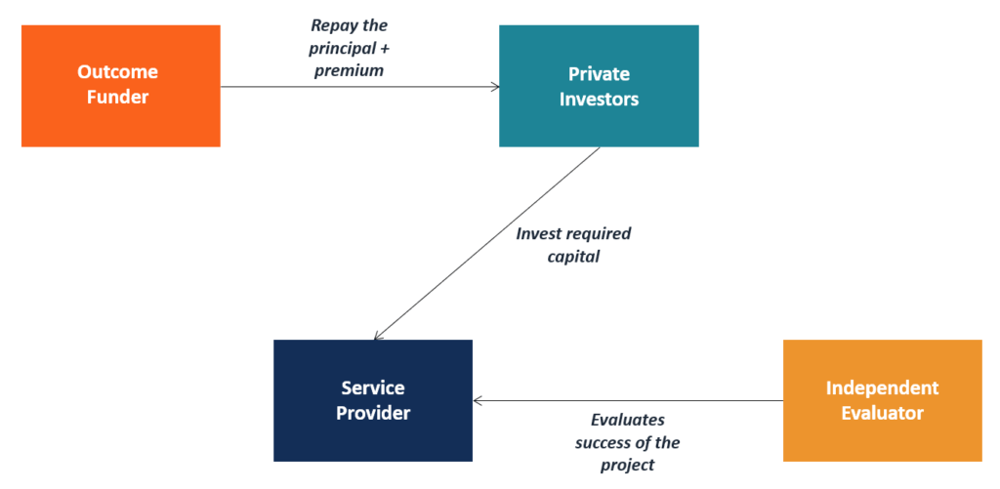

## Table of Contents

## What are private-purpose bonds?

Private-purpose bonds are a type of bond that governments issue to help private companies or projects. These bonds are different from regular government bonds because the money raised is used for things that mainly benefit private groups, not the public. For example, a city might issue a private-purpose bond to help build a new sports stadium that a private team will use.

Even though the money from these bonds goes to private projects, the interest people earn from them is usually not taxed. This makes them attractive to investors. However, there are strict rules about what kinds of projects can use these bonds. The projects have to meet certain criteria to make sure they are in the public interest, even if they mainly benefit private companies.

## How do private-purpose bonds differ from public-purpose bonds?

Private-purpose bonds and public-purpose bonds are both types of bonds issued by governments, but they have different goals. Private-purpose bonds are used to help private companies or projects. For example, a government might issue a private-purpose bond to help build a new factory that a private business will own. The main benefit goes to the private company, but the project might also create jobs or bring other benefits to the community. The interest earned on these bonds is usually tax-free, which makes them attractive to investors.

On the other hand, public-purpose bonds are used for projects that mainly benefit the public. These projects include things like building new schools, roads, or parks. The money raised from these bonds goes directly to improving public services and infrastructure. Because these bonds are for public projects, they also offer tax-free interest to investors. The key difference is that public-purpose bonds focus on projects that serve the community as a whole, while private-purpose bonds support projects that primarily benefit private entities.

## What are the main uses of private-purpose bonds?

Private-purpose bonds are used by governments to help private companies or projects that might not get funding otherwise. These bonds can be used to build things like sports stadiums, factories, or housing developments. The idea is that even though the project is mainly for a private company, it can also bring benefits to the community, like creating jobs or improving the local economy.

The money from private-purpose bonds goes to these private projects, but the interest people earn from them is usually not taxed. This makes the bonds attractive to investors. However, there are strict rules about what kinds of projects can use these bonds. They have to meet certain criteria to make sure they are in the public interest, even if they mainly benefit private companies.

## Who can issue private-purpose bonds?

Private-purpose bonds are usually issued by government bodies like cities, states, or other local governments. These governments use the bonds to help private companies or projects that might not get funding otherwise. For example, a city might issue a private-purpose bond to help build a new sports stadium that a private sports team will use.

The money from these bonds goes to the private project, but the interest people earn from them is usually not taxed. This makes the bonds attractive to investors. However, there are strict rules about what kinds of projects can use these bonds. They have to meet certain criteria to make sure they are in the public interest, even if they mainly benefit private companies.

## What are the eligibility criteria for projects funded by private-purpose bonds?

Projects that want to use private-purpose bonds have to meet certain rules to make sure they are good for the public, even if they mainly help private companies. The main rule is that the project must have a clear public benefit, like creating jobs, improving the local economy, or helping the community in some way. For example, a new factory might create jobs for local people, which is good for the community.

There are also rules about how much of the bond money can go to private companies. Usually, no more than 10% of the bond money can be used for private business use. This means that the project must be mostly for the public good. The government body issuing the bonds has to make sure that the project meets all these rules before the bonds can be used.

## How are private-purpose bonds structured?

Private-purpose bonds are like loans that governments give to help private companies or projects. These bonds have a set amount of money, a time when they need to be paid back, and an interest rate. When people or investors buy these bonds, they are lending money to the government, which then uses that money to help the private project. The investors get their money back over time, plus interest, which is usually not taxed. This makes the bonds attractive because people can earn more money without paying taxes on the interest.

To make sure the bonds are used the right way, there are rules about how the money can be spent. The project must have a clear benefit for the public, like creating jobs or helping the local economy. Usually, no more than 10% of the bond money can be used just for the private company's benefit. The government has to check that the project follows all these rules before they can use the bonds. This helps make sure that even though the project helps a private company, it also does some good for the community.

## What are the tax implications of investing in private-purpose bonds?

When you invest in private-purpose bonds, the interest you earn is usually not taxed. This means you get to keep all the interest money without having to pay taxes on it. This can be a big benefit because it makes the bonds more attractive to investors. They can earn more money than they would with other investments that do have taxes on the interest.

However, there are some rules you need to know. If you sell the bond before it matures, you might have to pay capital gains tax on any profit you make from the sale. Also, if the bond is used for a project that doesn't follow the rules about public benefit, the tax-free status of the interest could be at risk. So, it's important to make sure the project meets all the criteria before you invest.

## How do private-purpose bonds impact the economy?

Private-purpose bonds help the economy by giving money to private projects that might not get funding otherwise. These projects, like building new factories or sports stadiums, can create jobs and boost the local economy. When a factory is built, it needs workers, which means more people have jobs. This can make the community richer because people have more money to spend on things like food, clothes, and other stuff. So, even though the money from the bonds goes to a private company, it can still help the whole community.

However, there are also some downsides to think about. If too much money is spent on private projects that don't really help the public, it could take money away from important public projects like schools or roads. This could make the community worse off in the long run. Also, if the private project fails, the government might have to pay back the bond money, which could hurt the government's budget. So, it's important for the government to carefully choose which projects get to use private-purpose bonds to make sure they really help the economy and the community.

## What are the risks associated with private-purpose bonds?

Private-purpose bonds come with some risks for the government and the investors. For the government, one big risk is that if the private project fails, they might have to pay back the money they borrowed. This could hurt the government's budget and make it harder for them to spend money on other important things like schools or roads. Also, if the project doesn't really help the public as much as it should, people might get upset that the government is spending money on private companies instead of public services.

For investors, the main risk is that the interest they earn might not be tax-free if the project doesn't follow the rules. If the project doesn't meet the criteria for public benefit, the tax-free status of the interest could be taken away. Another risk is that if the investor sells the bond before it matures, they might have to pay capital gains tax on any profit they make. So, it's important for investors to check that the project follows all the rules before they buy the bonds.

## How can the effectiveness of private-purpose bonds be measured?

The effectiveness of private-purpose bonds can be measured by looking at how well they help the community. If the project creates jobs, boosts the local economy, or improves the area in other ways, then the bonds are working well. For example, if a new factory built with bond money leads to more people having jobs and more money being spent in local stores, that's a sign that the bonds are effective. Governments and researchers often look at these kinds of outcomes to see if the money spent on private projects is really helping the public.

However, measuring the effectiveness of private-purpose bonds isn't always easy. Sometimes, the benefits to the community are hard to see right away or might not be as big as expected. Also, if the project fails or doesn't meet the rules about public benefit, the bonds might not be effective at all. Governments need to keep a close eye on these projects and make sure they are meeting their goals to see if the bonds are really worth it.

## What regulatory considerations must be taken into account when issuing private-purpose bonds?

When issuing private-purpose bonds, governments need to follow strict rules to make sure the money is used in a way that helps the public. The main rule is that the project must have a clear public benefit, like creating jobs or helping the local economy. No more than 10% of the bond money can be used just for the private company's benefit. The government has to check that the project follows all these rules before they can use the bonds. This helps make sure that even though the project helps a private company, it also does some good for the community.

There are also rules about how the bonds are sold and who can buy them. The government needs to make sure they are following all the laws about selling bonds, including rules set by the Securities and Exchange Commission (SEC). They have to give clear information about the bond and the project to potential investors. If the project doesn't follow the rules or if the bond money is used the wrong way, the tax-free status of the interest could be at risk. So, it's important for the government to carefully choose which projects get to use private-purpose bonds and to keep a close eye on how the money is spent.

## What are some case studies of successful private-purpose bond implementations?

One successful case of using private-purpose bonds happened in Atlanta, Georgia. The city used these bonds to help build the Mercedes-Benz Stadium, which is home to the Atlanta Falcons football team. The money from the bonds helped pay for the stadium, and in return, the project created lots of jobs during construction and brought in more money to the local economy through events and tourism. People who bought the bonds got tax-free interest, which made it a good deal for them. The stadium has been a big success and has really helped the community.

Another good example is in California, where private-purpose bonds were used to build affordable housing. The bonds helped a private company build homes that people with lower incomes could afford. This project not only gave the company money to build the homes but also helped the community by giving people a place to live. The project met the rules about public benefit because it created housing for people who needed it. Investors were happy because they got tax-free interest, and the community was happy because more people had homes.

## What is the Intersection of Private-Purpose Bonds and Algorithmic Trading?

Algorithmic trading has progressively become a transformative force in financial markets, influencing various types of securities, including private-purpose bonds. The integration of [algorithmic trading](/wiki/algorithmic-trading) in this market segment is reshaping price discovery and capital allocation, creating both challenges and opportunities for municipal finance managers.

### Influence on Market Dynamics

Algorithmic trading introduces automated decision-making processes fueled by vast data analytics and computational power, which can significantly impact the market for private-purpose bonds. By leveraging algorithms, traders can analyze extensive datasets to identify trading opportunities, forecast market trends, and execute trades with remarkable speed and precision. This enhanced efficiency facilitates a more dynamic and liquid market environment, potentially leading to tighter bid-ask spreads and improved market depth.

### Price Discovery and Capital Allocation

In a digitized trading environment, price discovery for private-purpose bonds is increasingly influenced by the algorithms' ability to process information rapidly. Algorithms assess variables such as interest rates, economic indicators, and issuer creditworthiness, allowing market participants to determine bond prices more accurately. The formula for this might include a multi-[factor](/wiki/factor-investing) model such as:

$$
P = f(R, C, M, D)
$$

where $P$ is the price of the bond, $R$ represents interest rates, $C$ is the credit rating, $M$ denotes market conditions, and $D$ factors in demand metrics. This precise pricing supports efficient capital allocation, as resources are directed toward bonds reflecting true market value.

### Challenges and Opportunities

For municipal finance managers, engaging with algorithmic traders can present a complex landscape. Challenges include the need for real-time data integration systems, the potential for increased [volatility](/wiki/volatility-trading-strategies) due to high-frequency trades, and the necessity of transparency in algorithmic strategies to mitigate information asymmetry. Conversely, opportunities abound in leveraging algorithmic trading for enhanced bond portfolio management and ensuring competitive pricing for bond issuance.

### Regulatory Considerations and Case Studies

The emergence of algorithmic trading in bond markets has prompted regulatory scrutiny to address potential systemic risks. Agencies like the SEC are exploring frameworks to ensure market stability and integrity. Regulatory measures may include stricter algorithm disclosure requirements and the implementation of circuit breakers to prevent flash crashes.

While specific case studies on private-purpose bonds remain sparse, parallels can be drawn from broader bond market dynamics. Instances such as the rapid trading of municipal bonds during [interest rate](/wiki/interest-rate-trading-strategies) hikes exemplify how algorithmic trading can cause swift market reactions and impact bond valuations.

### Future Trends

Looking forward, algorithmic trading is expected to further permeate private-purpose bond markets. Potential trends include the adoption of [artificial intelligence](/wiki/ai-artificial-intelligence) and [machine learning](/wiki/machine-learning) to enhance predictive accuracy and the development of bespoke algorithms tailored to the unique characteristics of privately purposed municipal bonds. As technology continues to advance, the role of algorithmic trading in shaping the bonds sector will likely become increasingly pronounced, urging municipalities to integrate technological competencies into their financial strategies.

In conclusion, the intersection of private-purpose bonds and algorithmic trading poses a transformative potential for market dynamics, urging stakeholders to adapt while also navigating inherent challenges. As algorithms become more sophisticated, their influence on this niche segment of the bond market is poised to grow, driving significant change in municipal finance management practices.

## References & Further Reading

[1]: Simonsen, M. (2019). ["Municipal Finance: A Bibliography,"](https://www.researchgate.net/profile/Mark-Robbins-9/publication/228266283_Measuring_Municipal_Borrowing_Costs_How_Missing_Cost_Information_Biases_Interest_Rate_Calculations/links/5bc9c502458515f7d9c9da8d/Measuring-Municipal-Borrowing-Costs-How-Missing-Cost-Information-Biases-Interest-Rate-Calculations.pdf) Vance Bibliographies.

[2]: Tuckman, B. (2011). ["Fixed Income Securities: Tools for Today's Markets,"](https://www.amazon.com/Fixed-Income-Securities-Todays-Markets/dp/0470891696) John Wiley & Sons.

[3]: Mayo, H. B. (2011). ["Investments: An Introduction,"](https://archive.org/details/investments00herb) Cengage Learning.

[4]: Fabozzi, F. J. (2007). ["Bond Markets, Analysis, and Strategies,"](https://books.google.com/books/about/Bond_Markets_Analysis_and_Strategies_ten.html?id=bQpNEAAAQBAJ) Prentice Hall.

[5]: Biais, B., & Foucault, T. (2014). ["HFT, Algorithmic Trading, and the Market for Liquidity."](https://papers.ssrn.com/sol3/papers.cfm?abstract_id=2024360) Review of Financial Studies, 28(7), 1805-1849.