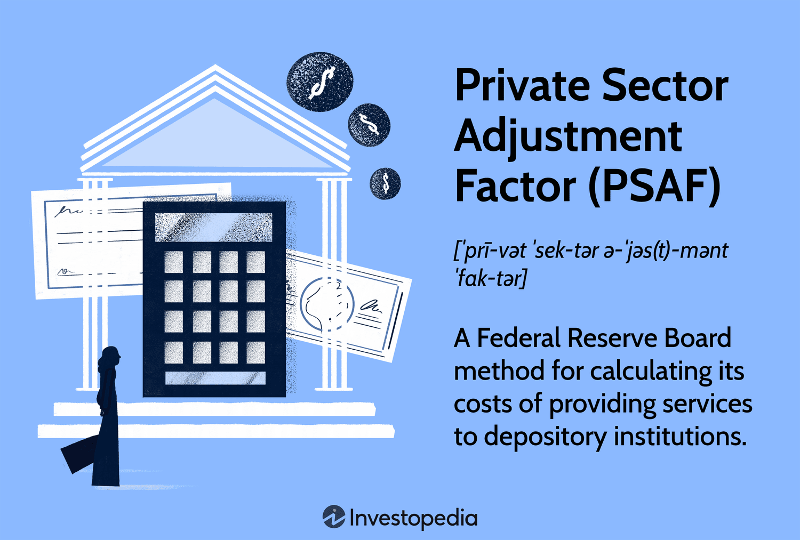

## Table of Contents

## What is the Private Sector Adjustment Factor (PSAF)?

The Private Sector Adjustment Factor (PSAF) is a tool used by some countries to help manage their economies. It's a way to adjust the exchange rate of a country's currency to make sure that the private sector, which includes businesses and people, can compete well in the global market. This adjustment can help make a country's goods and services cheaper for other countries to buy, which can lead to more sales and a stronger economy.

In simpler terms, think of the PSAF as a special dial that a country can turn to make its money worth a bit more or less on the world stage. By doing this, the country can help its businesses sell more stuff abroad. This tool is especially useful for countries that want to grow their economy by making sure their private sector can do well against businesses from other countries.

## Why was the Private Sector Adjustment Factor created?

The Private Sector Adjustment Factor was created to help countries manage their economies better. It's like a tool that lets a country change how much its money is worth compared to other countries' money. This can make the country's products cheaper for people in other countries to buy. When this happens, businesses in the country can sell more stuff abroad, which can help the economy grow.

Countries use the PSAF because they want their private businesses to do well in the global market. If a country's money is too strong, its products can become too expensive for other countries to buy. By adjusting the exchange rate with the PSAF, the country can make its products more competitive. This helps businesses sell more and can lead to more jobs and a stronger economy at home.

## How does the Private Sector Adjustment Factor affect government contracts?

The Private Sector Adjustment Factor (PSAF) can change how much government contracts are worth. When a country uses the PSAF to make its money worth less, it can make government contracts cheaper for foreign companies to bid on. This means more companies from other countries might want to do business with the government, which can lead to more competition and possibly better deals for the government.

On the other hand, if the PSAF makes the country's money worth more, government contracts can become more expensive for foreign companies. This might mean fewer foreign companies will want to bid on these contracts. As a result, the government might have fewer choices and could end up paying more for the same services or products.

## What are the key components of the Private Sector Adjustment Factor?

The Private Sector Adjustment Factor, or PSAF, has a few main parts that help it work. One important part is the exchange rate, which is how much one country's money is worth compared to another country's money. The PSAF changes this rate to make a country's products cheaper or more expensive for other countries to buy. Another part is the economic policy of the country, which includes rules and plans that the government makes to help the economy grow. These policies can affect how the PSAF is used and how much it changes the exchange rate.

Another key component is the balance of trade, which is the difference between what a country sells to other countries and what it buys from them. If a country sells more than it buys, it has a trade surplus, and if it buys more than it sells, it has a trade deficit. The PSAF can help a country with a trade deficit by making its products cheaper for other countries to buy, which can help increase sales and reduce the deficit. All these parts work together to help the private sector, which includes businesses and people, do well in the global market.

## How is the Private Sector Adjustment Factor calculated?

The Private Sector Adjustment Factor, or PSAF, is calculated by looking at a few important things. One of these is the exchange rate, which is how much one country's money is worth compared to another country's money. To calculate the PSAF, experts look at how much they need to change this rate to make the country's products cheaper or more expensive for other countries to buy. They also consider the country's economic policies, which are the rules and plans the government makes to help the economy grow. These policies can affect how much the exchange rate needs to change.

Another thing that goes into calculating the PSAF is the balance of trade, which is the difference between what a country sells to other countries and what it buys from them. If a country sells more than it buys, it has a trade surplus, and if it buys more than it sells, it has a trade deficit. To calculate the PSAF, experts look at this balance and figure out how much they need to adjust the exchange rate to help the country sell more and reduce any trade deficit. All these factors are put together to come up with the PSAF, which helps the private sector, including businesses and people, do well in the global market.

## Can you provide an example of how the Private Sector Adjustment Factor is applied in a real-world scenario?

Imagine a country called Sunnyland that makes a lot of solar panels. Sunnyland wants to sell more solar panels to other countries, but its currency, the Sunny, is very strong. This makes the solar panels expensive for other countries to buy. To help its businesses, Sunnyland decides to use the Private Sector Adjustment Factor (PSAF). They adjust the exchange rate so that the Sunny is worth a bit less compared to other currencies. Now, the solar panels are cheaper for other countries to buy, and Sunnyland's businesses start selling more solar panels abroad.

This change helps Sunnyland's economy grow. More people in Sunnyland get jobs making solar panels, and the country starts to have a trade surplus because it's selling more than it's buying. The government of Sunnyland is happy because the PSAF helped make their private sector more competitive in the global market. By using the PSAF, Sunnyland was able to boost its economy and help its businesses do well.

## What are the benefits of using the Private Sector Adjustment Factor for businesses?

Using the Private Sector Adjustment Factor (PSAF) can really help businesses. When a country uses the PSAF to make its money worth less, it makes the country's products cheaper for other countries to buy. This means businesses can sell more stuff abroad. For example, if a company makes toys and the country uses the PSAF, those toys become cheaper for people in other countries to buy. This can lead to more sales and more money for the business.

Another big benefit is that the PSAF can help businesses compete better in the global market. If a country's money is too strong, its products can be too expensive for other countries to buy. By adjusting the exchange rate with the PSAF, the country can make its products more competitive. This means businesses don't have to lower their prices as much to sell their products abroad. It can also help businesses grow and create more jobs, which is good for the whole economy.

## What challenges or criticisms are associated with the Private Sector Adjustment Factor?

Using the Private Sector Adjustment Factor (PSAF) can be tricky. One big problem is that it can make things more expensive for people at home. If a country's money is worth less because of the PSAF, then things that the country buys from other places, like food or medicine, can cost more. This can make life harder for people who live there, especially if they don't have a lot of money. Another challenge is that the PSAF can be hard to get right. If a country changes the exchange rate too much, it might cause big problems for its economy. It's like trying to balance on a seesaw; it takes a lot of care to get it just right.

Some people also criticize the PSAF because they think it's not fair. They say it can give some countries an advantage over others in the global market. For example, if one country uses the PSAF to make its products cheaper, it can be hard for businesses in other countries to compete. This can lead to tension between countries and even trade fights. Critics also worry that the PSAF can be used in ways that hurt the environment or workers' rights, because businesses might focus more on selling cheap products than on taking care of people and the planet.

## How does the Private Sector Adjustment Factor compare to other adjustment factors used in public sector procurement?

The Private Sector Adjustment Factor (PSAF) is different from other adjustment factors used in public sector procurement because it focuses on helping private businesses sell more stuff in other countries. The PSAF does this by changing the exchange rate, which is how much one country's money is worth compared to another's. This makes the country's products cheaper for other countries to buy. On the other hand, adjustment factors in public sector procurement often focus on things like making sure the government gets the best deal or following rules about who can bid on contracts. These factors might look at things like the cost of the product, how good the product is, or if the company follows certain laws.

For example, in public sector procurement, there might be an adjustment factor that gives extra points to companies that use green energy or pay their workers well. This helps the government meet its goals for the environment or workers' rights. The PSAF doesn't focus on these things. Instead, it's all about making the country's products more competitive in the global market. So, while the PSAF helps private businesses sell more abroad, public sector adjustment factors help the government get what it needs while also meeting other goals.

## What recent changes or updates have been made to the Private Sector Adjustment Factor?

Recently, there have been some changes to how the Private Sector Adjustment Factor (PSAF) is used. Some countries have started to use the PSAF more carefully because they want to make sure it doesn't cause too many problems at home. They are trying to find a balance so that their products can be cheaper for other countries to buy, but not so cheap that it makes things more expensive for people living in their own country. This means they are adjusting the exchange rate in smaller steps and watching closely to see how it affects their economy.

Another update is that some countries are now using the PSAF along with other tools to help their businesses. For example, they might use the PSAF to make their products cheaper, but also give money to businesses that use green energy or treat their workers well. This way, they can help their private sector compete in the global market while also meeting other goals like protecting the environment or supporting workers' rights. These changes show that countries are trying to use the PSAF in a smarter way to help their economies grow without causing too many problems.

## How can businesses optimize their strategies to better leverage the Private Sector Adjustment Factor?

Businesses can optimize their strategies to better leverage the Private Sector Adjustment Factor (PSAF) by keeping a close eye on how their country's exchange rate changes. When the PSAF makes their country's money worth less, businesses should quickly take advantage of this by selling more of their products abroad. They can do this by reaching out to new customers in other countries or by offering special deals to make their products even more attractive. By being proactive and ready to sell more when the exchange rate is in their favor, businesses can boost their sales and grow their market share.

Another way businesses can make the most of the PSAF is by planning ahead. They should always be ready to adjust their prices or find new ways to sell their products when the exchange rate changes. This means having a good understanding of how the PSAF works and staying informed about any changes their government might make to it. By being prepared and flexible, businesses can quickly adapt to the new exchange rate and keep their products competitive in the global market. This can help them not only survive but also thrive in the face of changing economic conditions.

## What future trends or developments might impact the use of the Private Sector Adjustment Factor?

In the future, the use of the Private Sector Adjustment Factor (PSAF) might change because of new technology and global trade rules. As more countries use digital money and online trading, it could be easier for them to change their exchange rates quickly. This means they might use the PSAF more often to help their businesses sell more stuff abroad. Also, if countries agree on new trade rules, they might have to use the PSAF in different ways to follow these rules. This could make it harder for some countries to use the PSAF to help their businesses, but it could also make trade fairer for everyone.

Another thing that might affect the PSAF is how people think about the environment and workers' rights. More and more, people want businesses to be good to the planet and treat their workers well. So, countries might start using the PSAF along with other tools to help businesses that do these things. For example, they might give extra help to businesses that use green energy or pay their workers fairly. This way, the PSAF can still help businesses sell more abroad, but it can also help make the world a better place.

## References & Further Reading

[1]: ["The Monetary Control Act of 1980: Provisions and Implications"](https://www.supermoney.com/encyclopedia/monetary-control-act) - Federal Reserve Board.

[2]: Committee on Payment and Settlement Systems, Bank for International Settlements. ["The Implications of Electronic Trading in Financial Markets"](https://www.bis.org/publ/bppdf/bispap07.pdf).

[3]: Hull, J. C. (2017). ["Options, Futures, and Other Derivatives"](https://www.semanticscholar.org/paper/Options%2C-Futures%2C-and-Other-Derivatives-Hull/89bdee500c8623864fc9eb7a471546aa713acc44) (10th edition). Pearson Education.

[4]: U.S. Federal Reserve. ["Federal Reserve Banks' Financial Services"](https://www.frbservices.org/news/fed360/issues/060324/fed-facts-origin-12-reserve-banks).

[5]: Hasbrouck, J. (2003). ["Intraday Price Formation in U.S. Equity Index Markets"](https://onlinelibrary.wiley.com/doi/10.1046/j.1540-6261.2003.00609.x). Journal of Finance.

[6]: ["Algorithmic Trading and the Dynamic Nature of Markets"](https://www.semanticscholar.org/paper/ALGORITHMIC-TRADING%3A-A-COMPREHENSIVE-REVIEW-OF-AND-Garg/94ead853e1835e7caae78d080e8b0e2f5f504607) by Tucker Balch.

[7]: Gomber, P., Arndt, B., Lutat, M., & Uhle, T. (2011). ["High-Frequency Trading"](https://papers.ssrn.com/sol3/papers.cfm?abstract_id=1858626). Interdisciplinary Perspectives on the Ethics of High-Frequency Trading.