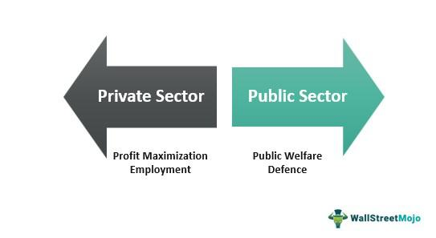

## Table of Contents

## What is the private sector?

The private sector is made up of businesses and organizations that are not owned or run by the government. These can be small shops, big companies, or anything in between. They all work to make money and provide goods or services to people. For example, a local bakery, a tech company like Apple, and a car manufacturer like Toyota are all part of the private sector.

The private sector is important because it creates jobs and helps the economy grow. When these businesses do well, they can hire more people and pay them, which means more money is being spent in the economy. The private sector also comes up with new ideas and products, which can make life better for everyone. For instance, private companies have developed smartphones, new medicines, and many other things we use every day.

## How does the private sector differ from the public sector?

The private sector and the public sector are two different parts of the economy. The private sector includes all the businesses and organizations that are owned by individuals or groups of people, not by the government. These businesses aim to make a profit by selling goods or services. For example, a restaurant, a clothing store, or a tech company like Google are all part of the private sector. The main goal of these businesses is to make money for their owners or shareholders.

On the other hand, the public sector includes all the organizations and services that are owned and run by the government. This includes things like schools, hospitals, police departments, and government offices. The public sector's main goal is to serve the public and provide essential services that everyone needs, not to make a profit. For example, a public school is run by the government to educate children, and it doesn't aim to make money from this service.

In summary, the key difference between the private and public sectors is their ownership and goals. The private sector is driven by profit and owned by private individuals or companies, while the public sector is driven by the need to serve the public and is owned by the government. Both sectors play important roles in the economy and in our daily lives.

## What are some common types of businesses in the private sector?

In the private sector, you can find many different kinds of businesses. Some common ones are small businesses like local shops, restaurants, and hair salons. These are often owned by one person or a family. They serve the community by providing everyday goods and services. For example, a local bakery might sell bread and pastries to people in the neighborhood.

There are also bigger businesses in the private sector, like corporations. These are companies that might sell products all over the world. Examples include tech companies like Microsoft, car manufacturers like Ford, and clothing brands like Nike. These big businesses often have many employees and aim to make a lot of profit for their shareholders.

Another type of business in the private sector is the service industry. This includes companies that provide services instead of physical products. Examples are banks, insurance companies, and consulting firms. These businesses help people manage their money, protect their assets, or solve problems. They are important because they support other businesses and individuals in many ways.

## Can you provide examples of small businesses in the private sector?

Small businesses in the private sector are often owned by one person or a family. They are important because they provide goods and services to the local community. For example, a local bakery might sell bread and pastries to people in the neighborhood. Another example is a family-owned restaurant where people can enjoy meals together. These small businesses help make the community a better place to live by offering things that people need every day.

There are also small shops that sell different products, like a local bookstore where people can buy [books](/wiki/algo-trading-books) and gifts. A hair salon is another type of small business where people can get their hair cut or styled. These businesses are usually run by people who live in the area, so they know what the community needs. They help create jobs and keep money in the local economy, which is good for everyone.

## What are some examples of large corporations in the private sector?

Large corporations in the private sector are big companies that often sell products all over the world. They have many employees and aim to make a lot of profit for their shareholders. Some examples of these big corporations are tech companies like Apple and Microsoft. Apple makes popular products like the iPhone and MacBook, while Microsoft is known for its Windows operating system and software like Microsoft Office. These companies have a huge impact on the economy and technology because they create jobs and develop new products that people use every day.

Another example of a large corporation is a car manufacturer like Toyota. Toyota makes cars that are sold all around the world, and they have factories in many different countries. They work hard to make good cars and keep their customers happy. Clothing brands like Nike are also big corporations. Nike makes sports shoes and clothes that are popular with people of all ages. These large corporations play a big role in the economy by creating jobs and selling products that people need and want.

## How do private sector businesses contribute to the economy?

Private sector businesses help the economy grow by creating jobs and making money. When these businesses do well, they can hire more people. This means more people have jobs and can earn money to buy things they need. For example, a new factory might open and hire workers from the local area. Those workers then spend their earnings at other businesses, like shops and restaurants, which helps the whole economy.

Private sector businesses also come up with new ideas and products. This can make life better for everyone. For instance, tech companies like Apple create new smartphones and computers that help people stay connected and do their work. When these businesses succeed, they pay taxes to the government. This money can be used to build roads, schools, and hospitals, which everyone in the community can use. So, the private sector plays a big role in making the economy strong and improving our lives.

## What are the key characteristics of a successful private sector business?

A successful private sector business usually has a clear goal and a good plan to reach it. They know what they want to achieve and work hard to make it happen. This means they have a strong idea of what they are selling and who their customers are. They also make sure to keep their customers happy by giving them good products or services. For example, a restaurant might focus on making tasty food and giving great service to keep people coming back.

Another important thing for a successful business is being able to change and grow. This means they can adapt to new situations and find new ways to make money. They might start selling their products in new places or come up with new ideas to keep up with what people want. A tech company, for instance, might keep updating its software to make it better and more useful. By doing this, they can stay ahead of other businesses and keep making money.

Lastly, successful businesses often have good leaders and a strong team. The people who run the business need to be smart and make good decisions. They also need to work well with their employees and make sure everyone is doing their best. When everyone works together and feels valued, the business can do better. For example, a company might have a great boss who knows how to motivate the team and make sure everyone is working towards the same goals.

## How do private sector businesses impact local communities?

Private sector businesses help local communities by creating jobs. When a new store or factory opens, it can hire people from the area. This means more people have work and can earn money to buy things they need. For example, a new bakery might hire local people to bake bread and serve customers. When these workers spend their earnings at other local businesses, like shops and restaurants, it helps the whole community. This is good because it keeps money moving around in the local economy.

Private sector businesses also provide important goods and services that people use every day. A local grocery store makes sure people can buy food easily, and a family doctor's office helps keep everyone healthy. These businesses make life better for everyone in the community. They also pay taxes, which the government can use to build roads, schools, and other things that everyone needs. So, private sector businesses play a big role in making local communities stronger and happier.

## What role does innovation play in the private sector?

Innovation is really important in the private sector. It means coming up with new ideas and ways to do things. When businesses innovate, they can make better products or find new ways to serve their customers. For example, a tech company might create a new smartphone that does more things than older phones. This helps the company stay ahead of others and make more money. Innovation also helps the economy grow because it can lead to new jobs and industries.

Innovation also makes life better for people. When businesses come up with new ideas, they can solve problems and make things easier. For instance, a company might invent a new medicine that helps people get better from a sickness. Or a car company might make a new kind of car that is safer and uses less gas. These innovations help everyone in the community by making life healthier and easier. So, innovation in the private sector is good for both businesses and people.

## How do private sector businesses adapt to economic changes?

Private sector businesses have to change when the economy does. If people have less money to spend, businesses might lower their prices or offer sales to keep customers coming. They might also find new ways to make money, like selling their products online instead of just in stores. Sometimes, they have to let go of workers or close some stores to save money. This helps them keep going even when times are tough.

On the other hand, when the economy is doing well, businesses might grow. They could open new stores, hire more workers, or start making new products. This is a good time for them because people have more money to spend. Businesses always need to watch the economy and be ready to change what they do. This way, they can keep making money and helping their communities, no matter what is happening in the economy.

## What are the challenges faced by private sector businesses in different industries?

Private sector businesses in different industries face many challenges. One big challenge is competition. There are often many businesses selling the same things, so they have to work hard to make their products or services better or cheaper. This can be tough, especially for small businesses that don't have as much money to spend on advertising or new ideas. Another challenge is keeping up with technology. Industries like tech and manufacturing need to keep improving their products to stay ahead. If they don't, other businesses might take their customers.

Another challenge is dealing with economic changes. When the economy is bad, people might not have as much money to spend, so businesses need to find ways to save money or make their products more affordable. This can be hard, especially if it means letting go of workers or closing stores. On the other hand, when the economy is good, businesses need to grow quickly to take advantage of more customers. This can be risky if they don't have enough money or if the good times don't last long. All these challenges make running a private sector business difficult, but also rewarding when they can overcome them.

## How can private sector businesses leverage technology for growth and efficiency?

Private sector businesses can use technology to grow and work better. One way is by using the internet to sell things. This means they can reach more people all over the world, not just in their local area. They can also use websites and social media to tell people about their products and get feedback from customers. This helps them make their products better and keep their customers happy. Another way technology helps is by making things easier inside the business. They can use computers and software to keep track of their money, manage their workers, and plan for the future. This saves time and helps them make better decisions.

Technology also helps businesses be more efficient. For example, they can use machines and robots to make things faster and with fewer mistakes. This is especially important in factories where they need to make a lot of products quickly. Also, businesses can use data and special computer programs to see what their customers like and don't like. This helps them make smarter choices about what to sell and how to sell it. By using technology in these ways, businesses can grow bigger and work better, which is good for them and the people they serve.

## References & Further Reading

[1]: Bergstra, J., Bardenet, R., Bengio, Y., & Kégl, B. (2011). ["Algorithms for Hyper-Parameter Optimization."](https://proceedings.neurips.cc/paper/2011/file/86e8f7ab32cfd12577bc2619bc635690-Paper.pdf) Advances in Neural Information Processing Systems 24.

[2]: ["Advances in Financial Machine Learning"](https://www.amazon.com/Advances-Financial-Machine-Learning-Marcos/dp/1119482089) by Marcos Lopez de Prado

[3]: ["Evidence-Based Technical Analysis: Applying the Scientific Method and Statistical Inference to Trading Signals"](https://www.amazon.com/Evidence-Based-Technical-Analysis-Scientific-Statistical/dp/0470008741) by David Aronson

[4]: ["Machine Learning for Algorithmic Trading"](https://github.com/PacktPublishing/Machine-Learning-for-Algorithmic-Trading-Second-Edition) by Stefan Jansen

[5]: ["Quantitative Trading: How to Build Your Own Algorithmic Trading Business"](https://books.google.com/books/about/Quantitative_Trading.html?id=j70yEAAAQBAJ) by Ernest P. Chan