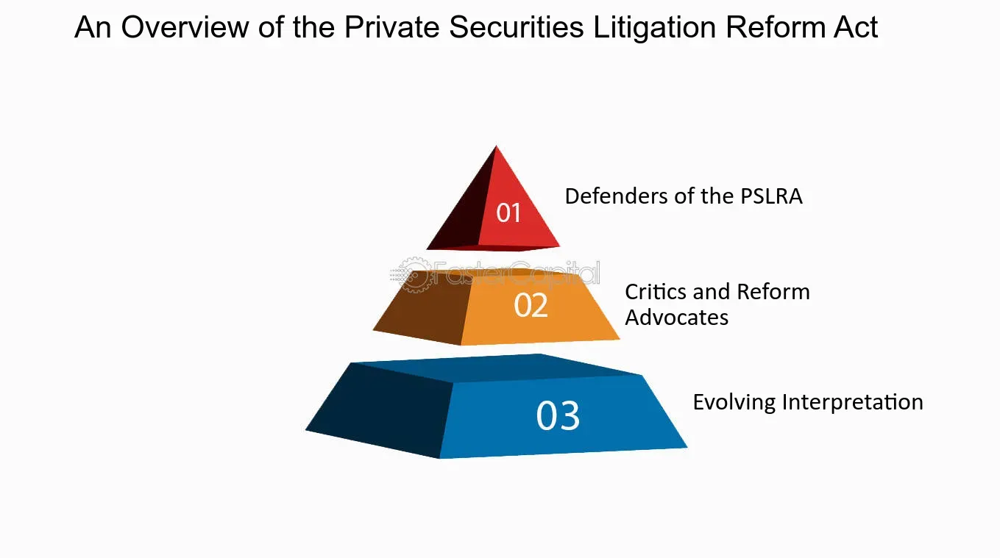

## Table of Contents

## What is the Private Securities Litigation Reform Act (PSLRA)?

The Private Securities Litigation Reform Act (PSLRA) is a law passed by the United States Congress in 1995. It was created to help protect companies from being sued too easily for securities fraud. Before the PSLRA, it was easier for investors to file lawsuits against companies if they thought the company had lied about something important. The law made it harder for these lawsuits to be filed by setting stricter rules that investors had to follow before they could sue.

One of the main changes the PSLRA made was that investors now have to provide more detailed evidence when they file a lawsuit. They need to show that the company made a false statement on purpose and that it caused them to lose money. This is called proving "scienter," which means the company knew what they were doing was wrong. The PSLRA also encouraged more honest communication from companies by giving them a "safe harbor" for certain forward-looking statements, as long as those statements were clearly labeled and had proper warnings.

## When was the PSLRA enacted and why was it needed?

The Private Securities Litigation Reform Act (PSLRA) was enacted on December 22, 1995. Before this law, it was too easy for investors to sue companies if they thought the company had lied about something important. This led to a lot of lawsuits, and companies felt they were being sued too often, even when they didn't do anything wrong on purpose.

The PSLRA was needed to make it harder for investors to sue companies without good reason. The law set stricter rules that investors had to follow before they could file a lawsuit. It required investors to provide more detailed evidence to show that the company made a false statement on purpose and that it caused them to lose money. This helped protect companies from being sued too easily and encouraged them to be more open about their future plans without fear of being sued.

## What are the main goals of the PSLRA?

The main goals of the Private Securities Litigation Reform Act (PSLRA) are to make it harder for investors to sue companies without good reason and to protect companies from being sued too easily. Before the PSLRA, it was easy for investors to file lawsuits against companies if they thought the company had lied about something important. This led to a lot of lawsuits, and companies felt they were being sued too often, even when they didn't do anything wrong on purpose. The PSLRA set stricter rules that investors had to follow before they could file a lawsuit, making it more difficult to sue without strong evidence.

Another goal of the PSLRA is to encourage companies to be more open about their future plans. The law gives companies a "safe harbor" for certain forward-looking statements, as long as those statements are clearly labeled and have proper warnings. This means companies can talk about what they think will happen in the future without being afraid of getting sued if things don't turn out as expected. By making it harder to sue and encouraging honest communication, the PSLRA aims to create a fairer and more transparent environment for both companies and investors.

## How does the PSLRA affect class action lawsuits?

The Private Securities Litigation Reform Act (PSLRA) makes it harder for investors to start class action lawsuits against companies. Before the PSLRA, it was easier for a group of investors to sue a company if they thought the company had lied about something important. Now, the PSLRA says that investors need to show more detailed evidence before they can start a class action lawsuit. They have to prove that the company made a false statement on purpose and that it caused them to lose money. This is called proving "scienter," which means the company knew what they were doing was wrong.

The PSLRA also changes how class action lawsuits are managed. It says that the person who lost the most money should be the lead plaintiff in the lawsuit. This is to make sure that the person leading the lawsuit has a big reason to make sure the lawsuit is done well. The PSLRA also makes it so that lawyers can't get paid too much if they win the lawsuit. This is to stop lawyers from starting lawsuits just to make money. By making these changes, the PSLRA tries to make sure that only serious and well-thought-out class action lawsuits are filed against companies.

## What are the key provisions of the PSLRA?

The Private Securities Litigation Reform Act (PSLRA) has several important rules that make it harder for investors to sue companies. One key rule is that investors need to show more detailed evidence before they can start a lawsuit. They have to prove that the company made a false statement on purpose and that it caused them to lose money. This is called proving "scienter," which means the company knew what they were doing was wrong. The PSLRA also says that the person who lost the most money should be the lead plaintiff in the lawsuit. This makes sure that the person leading the lawsuit has a big reason to make sure the lawsuit is done well.

Another important rule of the PSLRA is that it tries to stop lawyers from starting lawsuits just to make money. The law says that lawyers can't get paid too much if they win the lawsuit. The PSLRA also gives companies a "safe harbor" for certain forward-looking statements. This means companies can talk about what they think will happen in the future without being afraid of getting sued if things don't turn out as expected. By making these changes, the PSLRA tries to make sure that only serious and well-thought-out lawsuits are filed against companies.

## How does the PSLRA change the pleading standards for securities fraud cases?

The Private Securities Litigation Reform Act (PSLRA) makes it harder for investors to sue companies for securities fraud by changing the rules about what they need to show in their lawsuit. Before the PSLRA, investors could start a lawsuit if they thought a company lied about something important. Now, the PSLRA says that investors need to show more detailed evidence right from the start. They have to prove that the company made a false statement on purpose and that it caused them to lose money. This is called proving "scienter," which means the company knew what they were doing was wrong.

The PSLRA also changes how investors have to present their case. They need to be very clear and specific about what the company said that was wrong and how it affected them. This makes it more difficult to start a lawsuit without strong evidence. By setting these higher standards, the PSLRA aims to protect companies from being sued too easily and to make sure that only serious and well-thought-out lawsuits are filed.

## What is the safe harbor provision for forward-looking statements under the PSLRA?

The safe harbor provision in the Private Securities Litigation Reform Act (PSLRA) helps companies talk about their future plans without being afraid of getting sued. It says that if a company makes a statement about what they think will happen in the future, and they clearly say it's a guess and give warnings, they can't be sued easily if things don't turn out as expected. This rule is meant to encourage companies to be more open and honest about their future plans.

The safe harbor applies to statements that are clearly labeled as forward-looking and come with proper warnings. For example, if a company says they expect to make more money next year but things don't go as planned, they won't be sued just because their guess was wrong. This helps companies feel safer about sharing their thoughts on the future, which can help investors make better decisions.

## How does the PSLRA impact the lead plaintiff process in securities class actions?

The Private Securities Litigation Reform Act (PSLRA) changes how the lead plaintiff is picked in securities class action lawsuits. Before the PSLRA, lawyers could pick who they wanted to be the lead plaintiff. Now, the law says that the person who lost the most money should be the lead plaintiff. This means that the person who was hurt the most by the company's actions gets to be in charge of the lawsuit. It helps make sure that the lead plaintiff has a big reason to make sure the lawsuit is done well and not just to help the lawyers make money.

The PSLRA also makes it harder for lawyers to control the lawsuit just to get paid a lot. The law says that the lead plaintiff has to be someone who really cares about the case because they lost a lot of money. This rule helps stop lawyers from starting lawsuits just to make money for themselves. By making these changes, the PSLRA tries to make sure that the lead plaintiff in a securities class action lawsuit is someone who will work hard to make the lawsuit fair and successful.

## What are the implications of the PSLRA on attorney fees and costs?

The Private Securities Litigation Reform Act (PSLRA) changes how much money lawyers can get paid in securities class action lawsuits. Before the PSLRA, lawyers could sometimes get paid a lot of money even if they didn't win much for the investors. Now, the law says that lawyers can't get paid too much. The amount they can get is based on how much money they win for the investors. This rule helps stop lawyers from starting lawsuits just to make money for themselves. It makes sure that lawyers work hard to win as much money as they can for the investors who were hurt.

The PSLRA also makes it so that lawyers have to pay some of the costs if they lose the lawsuit. Before, the company that was sued had to pay all the costs, even if they won the case. Now, if the investors lose, their lawyers might have to pay some of the costs. This rule makes lawyers think more carefully before they start a lawsuit. It helps make sure that only serious lawsuits with good evidence are filed. By changing the rules about attorney fees and costs, the PSLRA tries to make the legal system fairer for everyone.

## How has the PSLRA influenced the overall landscape of securities litigation?

The Private Securities Litigation Reform Act (PSLRA) has made a big change in how often and why companies get sued for securities fraud. Before the PSLRA, it was easy for investors to start lawsuits if they thought a company lied about something important. But the PSLRA made it harder by saying that investors need to show more detailed evidence right from the start. They have to prove that the company made a false statement on purpose and that it caused them to lose money. This rule, called proving "scienter," has led to fewer lawsuits because it's harder to start one without strong evidence. The PSLRA also changed who can be the lead plaintiff in these lawsuits, making sure it's the person who lost the most money. This helps make sure the lawsuit is taken seriously and not just started to make money for lawyers.

Another big change from the PSLRA is how it deals with what companies can say about the future. The law gives companies a "safe harbor" for forward-looking statements. This means if a company clearly says that a statement is a guess about the future and gives warnings, they can't be sued easily if things don't turn out as expected. This encourages companies to be more open about their future plans, which helps investors make better decisions. The PSLRA also affects how much money lawyers can get paid in these lawsuits. It says that lawyers can't get paid too much and might have to pay some costs if they lose. This makes lawyers think more carefully before starting a lawsuit, leading to fewer cases that are not well thought out. Overall, the PSLRA has made the legal system for securities fraud fairer and more focused on serious cases.

## What criticisms have been leveled against the PSLRA, and what reforms have been suggested?

Some people think the PSLRA makes it too hard for investors to sue companies when they need to. They say that because the PSLRA makes investors show more detailed evidence, it stops them from getting justice when companies lie on purpose. Critics also worry that the PSLRA makes it easier for companies to hide bad news by saying it's just a guess about the future. They think this "safe harbor" rule lets companies say things that aren't true and not get in trouble for it. Another big criticism is that the PSLRA might make lawyers less likely to take on cases that are important but hard to win, because they might have to pay costs if they lose.

Because of these criticisms, some people have suggested changes to the PSLRA. One idea is to make it easier for investors to sue by lowering the amount of evidence they need to show at the start. This could help more investors get justice when companies do something wrong on purpose. Another suggestion is to change the "safe harbor" rule so that companies can't use it to hide lies. People also want to make sure that lawyers aren't scared away from taking on important cases, so they suggest rules that would protect lawyers from having to pay too much if they lose. These changes could make the PSLRA fairer for everyone involved.

## How have courts interpreted and applied the PSLRA since its enactment?

Since the PSLRA was passed, courts have been careful about how they use its rules. They take the PSLRA's requirement for detailed evidence very seriously. This means that when investors want to sue a company, they have to show strong proof right away that the company lied on purpose and that it made them lose money. Courts often throw out cases if the investors can't meet this high standard. They also pay close attention to the PSLRA's rule about who can be the lead plaintiff, making sure it's the person who lost the most money. This helps make sure the lawsuit is led by someone who really cares about winning and not just helping lawyers make money.

Courts have also been clear about the PSLRA's "safe harbor" rule for forward-looking statements. They say that if a company clearly says a statement is a guess about the future and gives warnings, they can't be sued easily if things don't go as planned. But, courts also make sure companies don't use this rule to hide lies. They look closely at what the company said and how it was said to see if it should be protected. Overall, courts have used the PSLRA to make sure only serious lawsuits with good evidence go forward, which has changed how securities fraud cases are handled.

## References & Further Reading

[1]: ["The Private Securities Litigation Reform Act of 1995"](https://www.congress.gov/bill/104th-congress/house-bill/1058) - U.S. Congress.

[2]: Fox, M. B., Fox, M. J., & Gilson, R. J. (2005). ["Economic Crisis and the Integration of Law and Finance: The Impact of Volatility"](https://www.jstor.org/stable/43744119?googleloggedin=true). National Bureau of Economic Research.

[3]: ["Flash Crash: A Trading Savant, a Global Manhunt, and the Most Mysterious Market Crash in History"](https://www.amazon.com/Flash-Crash-Trading-Manhunt-Mysterious/dp/0385543654) by Liam Vaughan

[4]: Harris, L. (2003). ["Trading and Exchanges: Market Microstructure for Practitioners"](https://academic.oup.com/book/52292) - Oxford University Press.

[5]: MacKenzie, D. (2015). ["Mechanizing the Merc: Capital Markets, Computing, and the Restructuring of American Mercantile Exchanges"](https://pubmed.ncbi.nlm.nih.gov/26387525/) - Economy and Society.