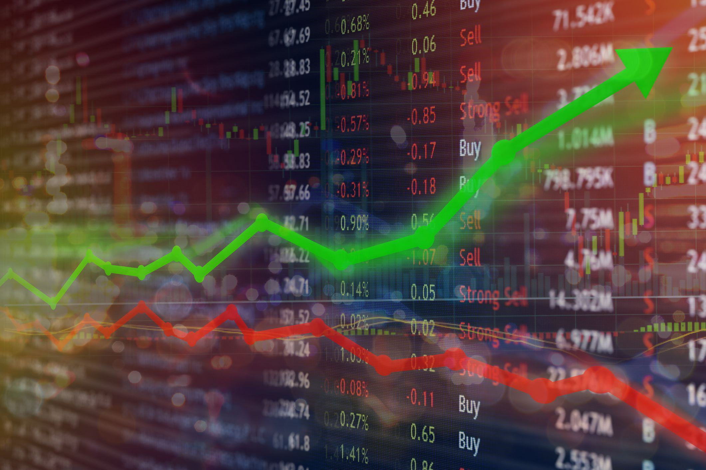

In recent years, the interconnectedness of financial crises, economic policy, corporate economics, and algorithmic trading has become increasingly significant. These issues are not standalone phenomena; instead, they form a complex system that influences the stability and growth of the global economy. Financial crises, characterized by sharp declines in asset prices and disruptions in financial institutions, prompt significant policy responses that aim to stabilize markets. Economic policies, both fiscal and monetary, are crucial in mitigating the adverse impacts of these crises. Policymakers must understand how to adapt these strategies to protect economies from prolonged instability.

Corporate economics plays a pivotal role in how these policies are received and implemented, as companies navigate through volatile economic conditions. The decisions made by corporations during crises can have far-reaching effects on market dynamics, influencing the overall efficacy of policy measures. The concept of 'too big to fail' has highlighted the necessity of scrutinizing corporate actions and their potential to amplify financial instabilities.

Algorithmic trading represents a significant technological advancement that has transformed financial markets by facilitating high-frequency trading and improving market efficiency. However, it also introduces new risks, such as algorithmic collusion and market manipulation, requiring robust regulatory oversight to ensure market integrity. The advent of algorithmic trading underscores the need to integrate technological considerations into economic policy frameworks.

Understanding the interplay between these elements is crucial for developing policies that not only respond to immediate financial challenges but also enhance long-term economic resilience. As the global financial system evolves, it is imperative to anticipate how these interconnected components will interact and shape future economic conditions. This informed and adaptive approach is essential for safeguarding against future financial instability and fostering a more robust global economy.

## Table of Contents

## Understanding Financial Crises

Financial crises are significant events that have profound impacts on the global economy, often characterized by abrupt declines in asset prices, severe disruptions of financial institutions, and widespread economic repercussions. These crises disrupt economic stability, impacting employment, income, and often leading to long-term economic challenges. Governmental intervention is frequently required to stabilize affected economies, restore confidence, and prevent further decline.

A historical examination of financial crises reveals several common triggers and systemic vulnerabilities. Notable crises include the Great Depression of the 1930s, the Asian Financial Crisis of 1997, the dot-com bubble burst in the early 2000s, the Global Financial Crisis of 2008, and more recently, the financial strains during the COVID-19 pandemic. These events often share triggers like excessive borrowing, speculative bubbles, and inadequate regulatory frameworks, which exacerbate their effects.

One recurring issue in recent financial crises is the notion of 'privatizing profits and socializing losses.' This phrase describes situations where financial institutions or major corporations, driven by profit, engage in risky behaviors that may lead to huge profits when successful but demand taxpayer-funded bailouts when they fail. The 2008 financial crisis is a prime example, as numerous banks and financial firms received government bailouts due to their 'too big to fail' status, ensuring their survival and preventing further economic turmoil.

Such interventions highlight systemic vulnerabilities within the financial system, where incentives for excessive risk-taking may prevail due to the assumption of government support in times of crisis. This situation underscores the necessity for robust regulatory frameworks and economic policies to mitigate the impact of financial crises.

In summary, understanding the dynamics and triggers of financial crises is essential for crafting effective economic policies that can prevent or mitigate their impact. Policymakers must balance fostering economic growth with ensuring financial stability, demanding ongoing vigilance and adaptive strategies to safeguard against future financial instability.

## Economic Policy Response to Crises

Economic policy during financial crises often requires swift and decisive action to stabilize markets and restore economic confidence. Such interventions typically involve both fiscal and monetary policies, aimed at mitigating the negative impacts of the crisis and facilitating recovery. Central banks and governments thus become pivotal players in managing these economic downturns.

Central banks undertake monetary policy measures by adjusting interest rates and providing [liquidity](/wiki/liquidity-risk-premium) to financial institutions. During periods of financial stress, central banks may lower interest rates to make borrowing cheaper, thereby encouraging investment and consumption. Additionally, they may engage in quantitative easing (QE), which involves purchasing securities to inject liquidity directly into the economy. Such was the case during the 2008 financial crisis when the Federal Reserve in the United States reduced interest rates to near zero and launched multiple rounds of QE to stabilize financial markets and support economic growth.

On the fiscal policy front, governments often introduce stimulus packages including increased public spending and tax cuts to spur economic activity. The rationale is to enhance aggregate demand and provide a safety net for affected industries and individuals. For instance, the American Recovery and Reinvestment Act of 2009, enacted in response to the Great Recession, involved approximately $831 billion in government spending and tax incentives to stimulate economic growth.

The COVID-19 pandemic presented another significant test for economic policy. Central banks worldwide, including the European Central Bank and the Bank of England, reduced interest rates and expanded their QE programs. Concurrently, governments implemented substantial fiscal stimulus measures. In the United States, the Coronavirus Aid, Relief, and Economic Security (CARES) Act of 2020 provided over $2 trillion in relief through direct payments to individuals, enhanced unemployment benefits, and support for businesses.

Despite these measures, the effectiveness of such policies is often a subject of debate. Critics argue that while these interventions can prevent immediate economic collapse, they may lead to long-term fiscal imbalances and increased public debt. Moreover, low [interest rate](/wiki/interest-rate-trading-strategies) environments could potentially foster asset bubbles and financial instability.

To bolster the resilience of economic systems against future crises, reforms are needed. Emphasis on sustainable fiscal policies, improving the regulatory framework governing financial institutions, and enhancing international cooperation can prove beneficial. Additionally, strengthening social safety nets and investing in infrastructure can provide long-term economic stability and reduce the severity of future downturns.

In summary, while fiscal and monetary interventions are vital in responding to financial crises, the adaptation and reform of these policies are essential for building a resilient economic architecture capable of withstanding future shocks.

## Corporate Economics in the Context of Crises

Corporate economics plays a critical role in how companies navigate financial crises, adapting to shifting economic policies and volatile market conditions. At the center of this analysis is the concept of 'too big to fail,' which pertains to institutions whose collapse would have catastrophic effects on the economy. The 2008 financial crisis exemplified this concept, as several large financial entities received government bailouts to prevent systemic failure. This approach, while stabilizing in the short term, raises questions about moral hazard, where firms might engage in risky behaviors under the assumption they would be rescued during downturns.

Corporations utilize various strategies to manage economic crises, leveraging both their intrinsic resources and external economic policies. Balance sheet management becomes paramount, as firms aim to maintain liquidity and solvency. This often involves restructuring debt, optimizing asset allocation, and employing hedging techniques to mitigate financial risk. Additionally, during downturns, companies may turn to cost-cutting strategies, including workforce reductions, expense optimizations, and renegotiation of supplier contracts.

Innovation is another strategic response during economic downturns. Companies may invest in research and development to stay competitive, anticipate emerging market needs, and create new revenue streams. For instance, during past recessions, some firms successfully pivoted to digital solutions and adopted new technologies that later positioned them advantageously in recovering markets.

The interaction between corporate decision-making and economic policy becomes particularly evident when considering regulatory responses and monetary adjustments. Companies often adjust their operational and financial strategies in anticipation of policy changes, such as interest rate fluctuations and fiscal stimulus measures. For example, a reduction in interest rates by central banks can lower borrowing costs, prompting firms to finance expansions or refinance existing debt.

Corporate economics underscores the necessity for businesses to adapt dynamically to rapidly changing economic landscapes. The interdependence between corporate strategies and policy frameworks highlights the importance of resilient and forward-thinking decision-making processes in maintaining stability and growth amid adversity.

## The Rise of Algorithmic Trading

Algorithmic trading has significantly transformed financial markets by facilitating high-frequency trading ([HFT](/wiki/high-frequency-trading-strategies)) and improving market efficiency. Algorithms execute pre-defined instructions for trading based on variables such as time, price, and [volume](/wiki/volume-trading-strategy), enabling rapid decision-making and execution far surpassing human capabilities. 

### Benefits of Algorithmic Trading

One of the primary benefits of [algorithmic trading](/wiki/algorithmic-trading) is enhanced market efficiency through increased liquidity. By acting swiftly on available market information, these algorithms reduce bid-ask spreads and facilitate smoother price discovery processes. Additionally, algorithmic trading can mitigate market impact, as trades are divided into smaller, strategically timed orders, thus minimizing disruption.

Algorithmic trading also supports diverse strategies. For example, [arbitrage](/wiki/arbitrage) algorithms exploit price differentials across markets to secure risk-free profits, while trend-following algorithms analyze historical price trends to predict future movements. These strategies contribute to market dynamism and offer profitable opportunities for traders.

### Challenges and Risks

Despite its benefits, algorithmic trading introduces several challenges, particularly concerning market stability. Flash crashes, characterized by rapid, significant drops in asset prices, highlight the potential for algorithms to exacerbate market [volatility](/wiki/volatility-trading-strategies). The May 2010 Flash Crash is a prominent case where algorithmic trading, primarily through HFT, contributed to a sudden and severe market downturn.

Algorithmic collusion and market manipulation represent additional risks. Algorithms could potentially act in concert, intentionally or unintentionally, to manipulate prices or coordinate trading strategies, undermining the fairness of the market. Academic studies have begun to suggest that seemingly independent algorithms can learn to collude without explicit instructions, posing substantial regulatory challenges.

### AI-Powered Trading

Artificial intelligence (AI) has become increasingly integral to algorithmic trading, with [machine learning](/wiki/machine-learning) models providing sophisticated data analysis and predictive capabilities. By analyzing vast datasets, AI-driven algorithms can identify nuanced market patterns and make informed trading decisions, influencing price formation and market dynamics. However, their reliance on complex models presents risks associated with model opacity and the potential for unpredictable behavior in unforeseen market conditions.

### Regulatory Frameworks

Effective regulation is crucial to ensure the integrity and stability of financial markets in the age of algorithmic trading. Regulatory bodies, such as the U.S. Securities and Exchange Commission (SEC) and the Commodity Futures Trading Commission (CFTC), have crafted guidelines to oversee these practices. Key regulatory measures include imposing speed bumps to reduce excessive HFT, mandating real-time surveillance systems to detect suspicious trading activities, and enacting circuit breakers to curb volatile market swings.

Despite these efforts, the rapid evolution of trading algorithms continues to challenge regulatory frameworks. Continuous adaptation and international collaboration are necessary to address emerging risks and safeguard market stability in a technologically driven financial environment.

## Navigating Future Financial Challenges

As we look to the future, the interconnectedness of financial crises, economic policy, corporate economics, and algorithmic trading becomes increasingly significant. Developing robust economic policies that account for the complexities of modern financial systems is vital.

A comprehensive approach to economic policy entails considering the multifaceted dynamics of global finance. Policymakers must focus on designing regulations that can mitigate systemic risks without stifling innovation. Given the rapid pace of technological advancements, especially in algorithmic trading and financial technology (fintech), continuous updates to regulatory frameworks are essential. These frameworks should ensure transparency, fairness, and stability in financial markets.

Collaboration between governments, financial institutions, and corporations is crucial to enhancing economic resilience. Such partnerships can facilitate information sharing, hastening the response to potential financial threats. For example, joint efforts in crisis simulations and stress testing can help identify vulnerabilities within the financial system. By engaging both the public and private sectors, these collaborations can foster an environment conducive to sustainable economic growth.

Technological advancements should be harnessed to improve market efficiency while managing risks effectively. Machine learning and [artificial intelligence](/wiki/ai-artificial-intelligence) (AI) are increasingly used to analyze market data and predict potential disruptions. However, implementing these technologies requires careful consideration of ethical implications and potential biases. Ensuring the security and privacy of data used in these technologies is paramount. Employing advanced cybersecurity measures can protect against malicious attacks that could compromise market integrity.

A key strategy for navigating future financial challenges involves promoting financial literacy and education. By equipping individuals and businesses with the knowledge needed to understand economic policies and market dynamics, societies can become more resilient to economic shocks. Education initiatives should focus on demystifying the complexities of financial instruments and the implications of economic policies.

Moreover, diversifying economic activities and fostering innovation in other industrial sectors can reduce dependence on volatile markets. Encouraging research and development, offering incentives for startups, and investing in sustainable industries can pave the way for a more stable economic future.

In summary, addressing future financial challenges requires a dynamic and multifaceted strategy. Integrating technological innovations with sound economic policy, fostering collaboration among key stakeholders, and emphasizing education will be instrumental in maintaining global economic stability and resilience.

## Conclusion

The intricate relationship between financial crises, economic policies, corporate economics, and algorithmic trading necessitates a nuanced understanding and informed policymaking. To address vulnerabilities within the financial system, a coordinated approach is critical, involving collaboration across several sectors, including governmental bodies, financial institutions, and corporations. This multifaceted strategy ensures that responses to economic disturbances are not only swift but also comprehensive.

By reflecting on past financial crises, such as the 2008 subprime mortgage crisis and the economic disruptions caused by the COVID-19 pandemic, we gain valuable insights into systemic weaknesses and the effectiveness—or lack thereof—of various policy interventions. These historical lessons underscore the need for adaptable policies that can swiftly respond to the ever-evolving economic landscape.

As algorithmic trading continues to grow, its integration into financial markets demands ongoing regulatory oversight. The complexity and speed of algorithmic systems can introduce risks previously unseen in traditional trading environments, such as erratic market behaviors and flash crashes. Consequently, regulators must evolve to manage these new risks, ensuring market integrity is not compromised.

Ultimately, proactive and adaptive strategies are essential to maintain economic stability in an increasingly interconnected and complex world. This includes fostering technological innovation while simultaneously implementing rigorous safeguards. The goal is to create a dynamic yet resilient economic system that can withstand future shocks, thereby securing economic prosperity for future generations.

## References & Further Reading

[1]: Bernanke, B. S. (2015). ["The Courage to Act: A Memoir of a Crisis and Its Aftermath."](https://archive.org/details/couragetoactmemo0000bern) W. W. Norton & Company.

[2]: Johnson, B. (2010). ["Algorithmic Trading & DMA: An introduction to direct access trading strategies."](https://archive.org/details/algorithmictradi0000john) 4Myeloma Press.

[3]: Akerlof, G. A., & Shiller, R. J. (2015). ["Phishing for Phools: The Economics of Manipulation and Deception."](https://www.jstor.org/stable/j.ctvc777w8) Princeton University Press.

[4]: French, K. R., & Baily, M. N. (2009). ["The Squam Lake Report: Fixing the Financial System."](https://www.amazon.com/Squam-Lake-Report-Fixing-Financial/dp/0691148848) Princeton University Press.

[5]: Hardman, D. (2016). ["Algorithmic Trading in Financial Markets."](https://www.ecb.europa.eu/press/financial-stability-publications/fsr/focus/2016/pdf/ecb~1c31d95af7.fsrbox201605_03.pdf) Taylor & Francis.