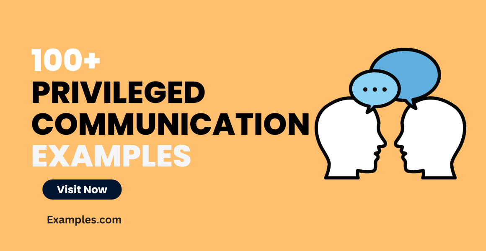

## Table of Contents

## What is privileged communication?

Privileged communication is a special kind of talk or information that is kept secret between certain people. It is protected by law, so it cannot be shared in court or with others without permission. This kind of communication usually happens between people like lawyers and their clients, doctors and their patients, or priests and those who confess to them. The main reason for this protection is to help people feel safe to share important information with these professionals without worrying that it will be used against them.

For example, when you talk to your lawyer about a problem, what you say is privileged communication. This means your lawyer cannot tell anyone else what you said, even if they are asked in court. The same goes for when you tell your doctor about your health issues; that information is private and protected. This helps people trust their lawyers, doctors, and other professionals, knowing their secrets are safe.

## What are the main types of privileged communication?

There are several main types of privileged communication. The first is attorney-client privilege. This means that when you talk to your lawyer about your case, what you say is secret. Your lawyer can't tell anyone else, even in court, without your permission. This helps you be honest with your lawyer so they can help you better. Another type is doctor-patient privilege. When you tell your doctor about your health, that information is private. Your doctor can't share it with others without your okay. This makes you feel safe to tell your doctor everything so they can take good care of you.

Another important type is priest-penitent privilege. If you confess something to a priest, that stays between you and the priest. They can't tell anyone else, even if asked in court. This helps people feel they can talk openly about their mistakes and seek forgiveness. There's also spousal privilege, which means that what you say to your husband or wife is private. They don't have to share it in court. This helps keep trust in marriages. Each of these types of privileged communication helps people feel safe to share important information with certain professionals or family members.

## Who are the parties typically involved in privileged communication?

The parties typically involved in privileged communication are usually professionals and the people they help. For example, lawyers and their clients have attorney-client privilege. This means that when a client talks to their lawyer about their case, what they say is secret. The lawyer can't tell anyone else, even in court, without the client's permission. This helps the client be honest with their lawyer so the lawyer can help them better. Doctors and their patients also have privileged communication. When a patient tells their doctor about their health, that information is private. The doctor can't share it with others without the patient's okay. This makes the patient feel safe to tell their doctor everything so the doctor can take good care of them.

Another group involved in privileged communication is priests and the people who confess to them. This is called priest-penitent privilege. If someone confesses something to a priest, that stays between them. The priest can't tell anyone else, even if asked in court. This helps people feel they can talk openly about their mistakes and seek forgiveness. Lastly, there's spousal privilege, which involves husbands and wives. What one spouse says to the other is private. They don't have to share it in court. This helps keep trust in marriages. Each of these types of privileged communication helps people feel safe to share important information with certain professionals or family members.

## What is the purpose of privileged communication?

The main purpose of privileged communication is to help people feel safe when they share important information with certain professionals or family members. When people know that what they say will stay secret, they are more likely to be honest and open. This is important because it helps lawyers, doctors, priests, and others do their jobs better. For example, if a client tells their lawyer everything about their case, the lawyer can give better advice and help more effectively. If a patient tells their doctor all about their health, the doctor can provide the best care possible.

Another reason for privileged communication is to protect people's privacy and rights. When someone talks to their lawyer, doctor, or priest, they expect that what they say will not be used against them in court or shared with others without their permission. This protection helps build trust between people and the professionals they rely on. It also encourages people to seek help when they need it, knowing their secrets are safe. For example, someone might be more willing to confess to a priest if they know it will stay confidential, or a person might feel more comfortable discussing sensitive health issues with their doctor.

## Can you provide examples of privileged communication in legal contexts?

In legal contexts, one common example of privileged communication is attorney-client privilege. This means that when a person talks to their lawyer about their case, what they say is secret. The lawyer can't tell anyone else, even in court, without the client's permission. This helps the client be honest with their lawyer so the lawyer can help them better. For example, if someone is accused of a crime, they can tell their lawyer everything that happened without worrying that the lawyer will share it with the police or the judge.

Another example is the work product doctrine. This protects the notes, memos, and other documents that lawyers create while preparing for a case. These documents are private and can't be seen by the other side in a lawsuit. This helps lawyers do their job without worrying that their strategies or thoughts will be used against their clients. For instance, if a lawyer writes down their thoughts on how to defend a client, those notes are protected and can't be shared with the other side.

## How does privileged communication apply in medical settings?

In medical settings, privileged communication is called doctor-patient privilege. This means that when you talk to your doctor about your health, what you say is private. Your doctor can't share it with others without your permission. This helps you feel safe to tell your doctor everything so they can take good care of you. For example, if you have a sensitive health issue, you can tell your doctor without worrying that they will tell your family, friends, or anyone else.

Another important part of privileged communication in medical settings is the protection of medical records. Your health information, like test results and treatment plans, is kept secret. Only people who need to know, like other doctors helping with your care, can see it. This helps keep your health information private and safe. For instance, if you have a medical condition, your records are protected so that only your healthcare team can access them to provide you with the best care possible.

## What are the exceptions to privileged communication?

There are some times when privileged communication can be shared, even though it's usually secret. One big reason is if someone is planning to hurt themselves or others. For example, if a patient tells their doctor they want to harm someone, the doctor might have to tell the police to keep everyone safe. Another reason is if a court decides that the information is really important for a case. If a judge thinks that what was said in a private talk is needed to make a fair decision, they might allow it to be shared in court.

Also, in some places, there are laws that say certain kinds of information have to be reported. For example, if a doctor finds out that a child is being hurt, they have to tell the right people to help the child. This is called mandatory reporting. Another exception can happen if the person who shared the secret gives permission for it to be told to others. If a client says it's okay for their lawyer to share what they talked about, then the lawyer can do that. These exceptions help balance keeping secrets with making sure people are safe and justice is served.

## How is privileged communication protected by law?

Privileged communication is protected by law to keep certain talks secret. This means that when you talk to your lawyer, doctor, or priest, what you say stays between you and them. The law says they can't tell anyone else, even if asked in court, without your permission. This helps you feel safe to share important things with these professionals so they can help you better. For example, if you tell your lawyer about your case, they can't share it with others, which helps them give you the best advice.

There are special rules that make sure this protection works. For example, attorney-client privilege is a law that keeps what you say to your lawyer secret. Doctor-patient privilege does the same for talks with your doctor. These laws are there to protect your privacy and rights. But there are some times when these secrets can be shared, like if someone is in danger or if a court really needs the information for a fair decision. These exceptions help balance keeping secrets with making sure people are safe and justice is served.

## What are the potential consequences of breaching privileged communication?

If someone breaks privileged communication, there can be big problems. For example, if a lawyer tells someone else what their client said, they could get in big trouble. They might lose their job or even go to jail. This is because the law says that what clients tell their lawyers is secret, and breaking that rule is a big deal. It can also hurt the person who shared the secret with their lawyer, because their private information might be used against them in court or shared with others.

Breaking privileged communication can also make people lose trust in professionals like lawyers, doctors, and priests. If people think that what they say won't stay secret, they might not want to talk openly with these professionals. This can make it hard for lawyers to help their clients, for doctors to take care of their patients, and for priests to help people who need to confess. So, keeping privileged communication secret is important for building trust and helping professionals do their jobs well.

## How do different jurisdictions vary in their treatment of privileged communication?

Different places around the world have their own rules about privileged communication. In some countries, like the United States, attorney-client privilege is very strong. This means that what you tell your lawyer stays secret, and your lawyer can't share it with anyone else, even in court, without your permission. But in other countries, like some in Europe, the rules might be different. For example, in some places, the privilege might not be as strong, and there might be more times when the secret can be shared, like if it's needed for a big court case.

Also, the rules for doctor-patient privilege can change from one place to another. In many countries, what you tell your doctor is private, and they can't share it without your okay. But in some places, there might be more exceptions. For example, if a doctor thinks a patient is going to hurt someone, they might have to tell the police, even if it's usually secret. So, it's important to know the rules in your area because they can affect how safe you feel when talking to professionals like lawyers and doctors.

## What ethical considerations must professionals keep in mind regarding privileged communication?

Professionals like lawyers, doctors, and priests must think about ethics when dealing with privileged communication. This means they have to keep what people tell them a secret, even if it's hard. They need to understand that keeping secrets is important for building trust with the people they help. If a lawyer tells someone else what their client said, the client might not trust them anymore. So, professionals have to be very careful to keep these secrets safe and not share them, unless the law says they have to.

Sometimes, there are tough choices to make. If a doctor finds out that a patient is planning to hurt themselves or others, they might have to break the secret to keep everyone safe. This can be hard because it goes against the promise of keeping things private. But professionals have to think about what's best for everyone, not just the person who told them the secret. Balancing these ethical choices is a big part of their job, and they have to do it carefully to make sure they are doing the right thing.

## How has the concept of privileged communication evolved with digital communication technologies?

The idea of privileged communication has changed a lot because of digital communication technologies. Before, people would talk to their lawyer, doctor, or priest in person or over the phone. Now, they can use email, text messages, and video calls. This means that what they say can be written down and saved on computers or phones. Because of this, professionals have to be very careful to keep these digital talks secret. They need to use special ways to keep the information safe, like using passwords and secure apps, so that no one else can see it.

There are also new problems that come with digital communication. For example, if someone hacks into a computer or phone, they might be able to read secret messages. This is a big worry because it could mean that private talks are no longer private. Also, laws about digital communication can be different in different places. So, professionals have to know the rules in their area and make sure they follow them. This helps keep the trust between them and the people they help, even when they are using new ways to talk.

## References & Further Reading

[1]: Fischer, T. & Krauss, C. (2018). ["Deep learning with long short-term memory networks for financial market predictions."](https://www.sciencedirect.com/science/article/pii/S0377221717310652) European Journal of Operational Research.

[2]: Lopez de Prado, M. (2018). ["Advances in Financial Machine Learning."](https://www.amazon.com/Advances-Financial-Machine-Learning-Marcos/dp/1119482089) Wiley.

[3]: Hull, J. C. (2018). ["Options, Futures, and Other Derivatives."](https://www.semanticscholar.org/paper/Options%2C-Futures%2C-and-Other-Derivatives-Hull/89bdee500c8623864fc9eb7a471546aa713acc44) Pearson.

[4]: Pardo, R. (2011). ["The Evaluation and Optimization of Trading Strategies."](https://onlinelibrary.wiley.com/doi/book/10.1002/9781119196969) Wiley.

[5]: Aronson, D. (2007). ["Evidence-Based Technical Analysis: Applying the Scientific Method and Statistical Inference to Trading Signals."](https://www.amazon.com/Evidence-Based-Technical-Analysis-Scientific-Statistical/dp/0470008741) Wiley.

[6]: Chan, E. P. (2008). ["Quantitative Trading: How to Build Your Own Algorithmic Trading Business."](https://github.com/ftvision/quant_trading_echan_book) Wiley.

[7]: Jansen, S. (2020). ["Machine Learning for Algorithmic Trading: Predictive models to extract signals from market and alternative data for systematic trading strategies with Python."](https://www.amazon.com/Machine-Learning-Algorithmic-Trading-alternative/dp/1839217715) Packt Publishing.