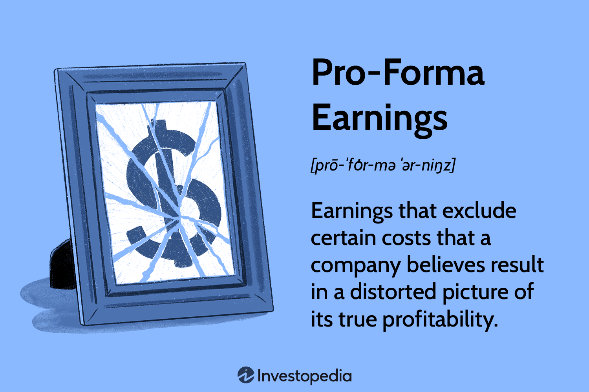

## Table of Contents

## What are pro-forma earnings?

Pro-forma earnings are a company's earnings that have been adjusted to show what the earnings would have been if certain events had or had not happened. These events could include things like mergers, acquisitions, or unusual expenses. Companies use pro-forma earnings to give investors a clearer picture of their ongoing business performance by removing one-time or non-recurring events that might distort the true financial health of the company.

However, pro-forma earnings can sometimes be misleading because companies might choose which expenses to exclude, potentially making their financial performance look better than it really is. It's important for investors to look at both the pro-forma earnings and the Generally Accepted Accounting Principles (GAAP) earnings to get a complete understanding of a company's financial situation. GAAP earnings include all expenses and provide a standardized way of reporting financial results.

## How do pro-forma earnings differ from GAAP earnings?

Pro-forma earnings and GAAP earnings are two ways companies show their money results, but they are different. Pro-forma earnings are adjusted numbers. This means a company takes out some costs or events that they think don't show their normal business work. For example, if a company had a big one-time cost, like a lawsuit, they might not include it in pro-forma earnings. This helps investors see what the company usually earns without those unusual costs.

GAAP earnings, on the other hand, follow strict rules that all companies must use. These rules, called Generally Accepted Accounting Principles, make sure everyone reports their money the same way. GAAP earnings include all costs, even the unusual ones. So, GAAP earnings give a full picture of a company's money, including everything that happened in that time.

Because pro-forma earnings can be changed by the company, they might look better than GAAP earnings. But, they can also be confusing because different companies might take out different costs. That's why it's good to look at both pro-forma and GAAP earnings to really understand how a company is doing financially.

## Why do companies report pro-forma earnings?

Companies report pro-forma earnings to give investors a clearer picture of their regular business performance. They do this by taking out one-time or unusual costs that might make their earnings look worse than they usually are. For example, if a company had to pay a lot of money because of a lawsuit, they might not include that cost in their pro-forma earnings. This way, investors can see what the company earns most of the time, without those unusual events getting in the way.

However, pro-forma earnings can sometimes be tricky because companies can choose which costs to leave out. This means different companies might report their pro-forma earnings differently, which can make it hard to compare them. That's why it's important for investors to also look at GAAP earnings, which follow strict rules and include all costs. By looking at both, investors get a full and honest view of how a company is doing financially.

## What are the advantages of using pro-forma earnings?

Pro-forma earnings help companies show investors what their business usually earns. By taking out one-time or unusual costs, like a big lawsuit or a factory closing, companies can give a clearer picture of their regular money-making. This makes it easier for investors to see how well the company is doing most of the time, without being confused by things that don't happen often.

Another advantage is that pro-forma earnings can be useful for comparing a company's performance over time. If a company always takes out the same kinds of unusual costs, investors can see if the business is getting better or worse without those one-time events getting in the way. This can help investors make smarter choices about whether to buy or sell the company's stock.

## What are the potential drawbacks or criticisms of pro-forma earnings?

One big problem with pro-forma earnings is that companies can choose what costs to leave out. This means they might make their earnings look better than they really are. For example, a company might not include a big one-time cost like a lawsuit in their pro-forma earnings, making it seem like they made more money than they did. This can be confusing for investors because different companies might leave out different costs, making it hard to compare them fairly.

Another criticism is that pro-forma earnings can hide the true financial health of a company. By taking out costs that the company says are unusual, they might not show all the money problems they have. This can make investors think the company is doing better than it really is. That's why it's important for investors to also look at GAAP earnings, which include all costs and give a full picture of the company's money situation.

## How are pro-forma earnings calculated?

Pro-forma earnings are calculated by starting with a company's actual earnings and then making adjustments. These adjustments involve taking out costs or events that the company thinks don't show their normal business work. For example, if a company had to pay a lot of money for a lawsuit, they might not include that cost in their pro-forma earnings. They might also take out costs from things like closing a factory or selling a part of their business. The goal is to show what the company usually earns without these unusual events getting in the way.

The process of calculating pro-forma earnings can be different for each company because they can choose which costs to leave out. This means that one company might take out different costs than another company, even if they are in the same business. Because of this, investors need to be careful and look at both the pro-forma earnings and the GAAP earnings. GAAP earnings follow strict rules and include all costs, so they give a complete picture of the company's money. By comparing both, investors can get a better understanding of how well the company is really doing.

## Can you provide an example of a company that uses pro-forma earnings and explain why?

A well-known example of a company that uses pro-forma earnings is Amazon. Amazon often reports pro-forma earnings to show investors what their business usually earns without including one-time or unusual costs. For instance, if Amazon had to pay a lot of money because of a lawsuit or spent a lot on opening new warehouses, they might not include those costs in their pro-forma earnings. By doing this, Amazon can give investors a clearer picture of how their regular business is doing, without those unusual events making their earnings look worse than they normally are.

Using pro-forma earnings helps Amazon show investors that their core business, like selling things online and providing services, is doing well. It's important for investors to know that Amazon's regular business is strong, even if there are some unusual costs that happen sometimes. However, investors should also look at Amazon's GAAP earnings, which include all costs, to get a full understanding of the company's financial health. By comparing both, investors can make smarter decisions about whether to buy or sell Amazon's stock.

## What role do pro-forma earnings play in financial analysis and investment decisions?

Pro-forma earnings help people who study money and make investment choices by giving them a clearer picture of a company's regular business earnings. By taking out one-time or unusual costs, like a big lawsuit or closing a factory, pro-forma earnings show what a company usually makes. This can be very useful for investors because it helps them see if the company's main business is doing well without being confused by things that don't happen often. For example, if a company like Amazon reports pro-forma earnings, investors can see how their online sales and services are doing, without being distracted by costs from opening new warehouses.

However, pro-forma earnings can also be tricky because companies can choose which costs to leave out. This means different companies might report their pro-forma earnings differently, making it hard to compare them fairly. It's important for investors to not just look at pro-forma earnings but also at GAAP earnings, which follow strict rules and include all costs. By looking at both, investors can get a full and honest view of a company's financial health. This helps them make smarter decisions about whether to buy, hold, or sell a company's stock.

## How do regulatory bodies view the use of pro-forma earnings?

Regulatory bodies, like the Securities and Exchange Commission (SEC) in the United States, are careful about how companies use pro-forma earnings. They worry that companies might use pro-forma earnings to make their money look better than it really is. The SEC has rules to make sure companies don't trick investors. They want companies to clearly explain what they take out of their pro-forma earnings and why. This way, investors can understand what the numbers mean and not be fooled.

The SEC and other regulators think it's important for companies to show both pro-forma and GAAP earnings. GAAP earnings follow strict rules and include all costs, giving a full picture of a company's money. By showing both, companies can help investors see the whole story. Regulators want to make sure that pro-forma earnings are used in a way that helps investors, not in a way that hides the truth about a company's financial health.

## What are some common adjustments made in pro-forma earnings?

Companies often make adjustments to their earnings to create pro-forma earnings. One common adjustment is taking out one-time costs, like money spent on a lawsuit or closing a factory. These costs don't happen every day, so companies think they don't show what their business usually earns. Another adjustment is not including costs from selling a part of their business or buying another company. These big changes can make earnings look different, so companies take them out to show what their regular business is doing.

Another type of adjustment is taking out costs that the company thinks are not part of their main business. For example, if a company has to pay a lot for something that doesn't help them make money, like a fine for breaking a rule, they might not include it in pro-forma earnings. Also, companies might adjust for things like stock options given to employees. These can make earnings look lower, so companies might take them out to show what they think their true earnings are. By making these adjustments, companies try to give investors a clearer picture of how their business usually performs.

## How can investors critically evaluate pro-forma earnings reports?

Investors need to be careful when looking at pro-forma earnings reports. They should always check what costs the company took out and why. Companies can choose which costs to leave out, so it's important to see if those costs really don't show the company's regular business. For example, if a company takes out a big cost like a lawsuit, investors should think about if that cost might happen again or if it's really unusual. They should also compare the pro-forma earnings to the GAAP earnings, which include all costs. By looking at both, investors can see if the company is trying to make their earnings look better than they really are.

Another way to critically evaluate pro-forma earnings is to look at how other companies in the same business report their earnings. If one company takes out different costs than another, it can be hard to compare them fairly. Investors should also read what the company says about why they made those adjustments. If the company's explanation doesn't make sense or seems like they're trying to hide something, that's a warning sign. By being careful and looking at all the information, investors can make smarter choices about whether to trust the pro-forma earnings and use them to decide if they should buy, hold, or sell the company's stock.

## What future trends or regulatory changes might impact the use of pro-forma earnings?

In the future, there might be more rules about how companies can use pro-forma earnings. Regulators like the SEC might make stricter rules to stop companies from using pro-forma earnings to make their money look better than it really is. They might want companies to explain more clearly what costs they take out and why. This would help investors understand the numbers better and not be tricked. Also, new technology and ways of sharing information might make it easier for investors to see and compare pro-forma earnings from different companies, making it harder for companies to hide the truth.

Another trend could be that investors start to trust pro-forma earnings less. If more people learn about how companies can change their earnings to look better, they might not believe the pro-forma numbers as much. This could make companies use pro-forma earnings less or be more careful about how they use them. Investors might also start to use other ways to check a company's money, like looking at cash flow or other financial measures, to get a better idea of how the company is really doing.

## References & Further Reading

[1]: Gu, H., & Lev, B. (2011). ["The Role of Pro Forma Earnings Disclosures in M&A Transactions."](https://www.scirp.org/reference/referencespapers?referenceid=2666526) Journal of Accounting Research, 49(3), 629-665.

[2]: Li, F. (2010). ["The Information Content of Forward‐Looking Statements in Corporate Filings—A Naive Bayesian Machine Learning Approach."](https://onlinelibrary.wiley.com/doi/10.1111/j.1475-679X.2010.00382.x) Journal of Accounting Research, 48(5), 1049-1102.

[3]: Dechow, P. M., Myers, L. A., & Shakespeare, C. (2010). ["Fair Value Accounting and Gains from Asset Securitizations: A Convenient Earnings Management Tool with Compensation Side-benefits."](https://www.sciencedirect.com/science/article/pii/S0165410109000524) Review of Accounting Studies, 15(3), 310-323.

[4]: ["Financial Statement Analysis and Security Valuation"](https://cie-advances.asme.org/files-library-Documents/financial-statement-analysis-and-security-valuation.pdf) by Stephen H. Penman

[5]: Brown, L. D., & Sivakumar, K. (2003). ["Comparing the Value Relevance of Two Operating Income Measures."](https://link.springer.com/article/10.1023/A:1027328418571) Review of Accounting Studies, 8(3), 561-572.