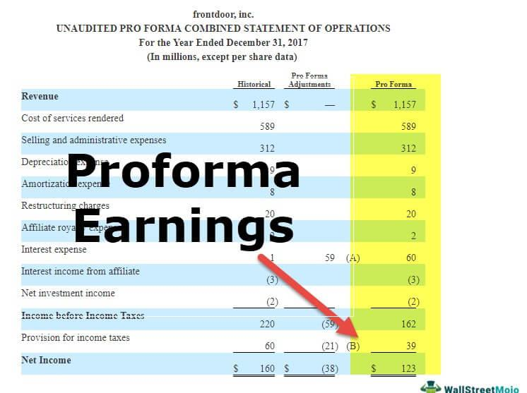

The landscape of corporate finance and financial reporting is vast and intricate. One critical component within this domain is pro-forma earnings. Unlike figures that adhere to Generally Accepted Accounting Principles (GAAP), pro-forma earnings aim to present a company's profitability by excluding certain costs. These earnings typically omit non-recurring costs, such as restructuring charges, asset impairments, and litigation expenses—elements that companies argue obscure their true financial health. While proponents of pro-forma earnings suggest they offer a clearer picture of operational success, there is skepticism regarding their authenticity due to the subjective nature of such exclusions.

A comprehensive understanding of pro-forma earnings is vital for navigating today's financial environment. They not only interact with traditional financial reporting structures but also play a significant role in corporate finance, particularly in strategic areas such as mergers and acquisitions. Additionally, in the era of algorithmic trading, where automated systems process vast quantities of data to make rapid investment decisions, variations introduced by pro-forma earnings can significantly influence market behavior. 



In this article, we aim to explore how pro-forma earnings are integrated into financial reporting, their implications in corporate finance, and their effect on algorithmic trading systems. Furthermore, we will provide guidance for investors on how to critically assess these reports to make informed investment decisions, balancing the insights they offer with a skeptical evaluation of their potential for presenting an overly optimistic view of a company's financial performance. Such a balanced approach is essential for understanding a company's genuine value beyond the figures presented.

## Table of Contents

## Understanding Pro-Forma Earnings

Pro-forma earnings represent adjustments made to traditional financial statements with the intent of providing a more accurate picture of a company's ongoing operational performance. These adjustments typically exclude non-recurring costs such as asset impairments, restructuring expenses, and litigation costs, among others. The premise behind excluding these items is that they do not reflect the usual business activities and financial health of the company.

The concept of pro-forma earnings allows companies to highlight their core operational efficiency, free from the influence of irregular, temporary, or non-operational charges. However, the use of pro-forma earnings is often met with skepticism, as it can sometimes mask the true financial condition of the company. For instance, by frequently excluding items that are considered non-recurring, companies might present an overly optimistic view of their financial health and profitability, particularly if such exclusions are recurrent in nature. This makes it crucial for investors and stakeholders to scrutinize these figures closely and with a critical eye.

To illustrate how pro-forma earnings are applied, consider a scenario where a company reports a significant legal settlement as a one-time expense. In its pro-forma earnings report, this company might choose to exclude this cost, claiming that it does not impact the day-to-day operations or ongoing profit-generating potential. However, if such settlements occur frequently, the pro-forma earnings wouldn't accurately represent sustainable profitability, potentially misleading stakeholders.

The regulatory environment surrounding pro-forma earnings is less stringent than for Generally Accepted Accounting Principles (GAAP)-compliant figures. While GAAP ensures standardization and comparability across financial statements, pro-forma earnings lack uniform regulations, leading to varied practices among companies. Despite the issuance of guidelines and warnings from regulatory bodies like the U.S. Securities and Exchange Commission (SEC), which urges companies to reconcile pro-forma figures with their GAAP counterparts, the nature and extent of adjustments remain largely at the company's discretion. This variability emphasizes the need for transparent reporting and thorough investor analysis to ensure a truthful understanding of a company's financial performance.

## The Role of Pro-Forma Earnings in Corporate Finance

Pro-forma earnings play a significant role in corporate finance by providing a lens through which companies can plan and evaluate future financial scenarios with greater strategic clarity. These alternative metrics exclude non-recurring costs such as restructuring charges, asset impairments, and extraordinary legal expenses, allowing for a clearer focus on ongoing operational performance. 

In mergers and acquisitions (M&A), pro-forma earnings are particularly invaluable. They enable corporations to assess the financial impact of a potential transaction by presenting financial statements as if the M&A event had already occurred. This adjustment aids in identifying synergies and ensuring that one-time transactional costs do not obscure the analysis of future performance. For instance, pro-forma statements might include anticipated revenue increases or cost savings expected from the merger, providing a comprehensive picture of financial viability and potential value addition without the distortion of temporary financial events.

Financial managers leverage pro-forma earnings for strategic decision-making and efficient resource allocation. These earnings distill financial data into actionable insights, separating core operating results from peripheral accounting entries. As these reports offer an altered perspective, they assist in benchmarking performance against industry standards, preparing forecasts, and adjusting corporate strategies to maximize shareholder value. By stripping out [volatility](/wiki/volatility-trading-strategies) from irregular expenses, pro-forma earnings can lead to a more stable representation of profit trends, aiding stakeholders in making informed decisions.

The influence of pro-forma earnings extends to shaping investor perceptions. Investors often regard company strategies as more credible and appealing when distilled through pro-forma financial lenses, as they seem to better reflect an entity's fundamental [earning](/wiki/earning-announcement) potential. However, this practice is not without scrutiny. There is a need for transparency in what is excluded in pro-forma disclosures to maintain investor trust and prevent the portrayal of an artificially optimistic business outlook. Hence, while pro-forma earnings are powerful tools within corporate finance, they require careful and judicious application to align with shareholder expectations and underpin genuine business valuations.

## Implications of Pro-Forma Earnings on Financial Reporting

The primary goal of financial reporting is to present a transparent and precise depiction of a company's financial condition. This standard is fundamentally grounded in Generally Accepted Accounting Principles (GAAP), which aim to ensure consistency, reliability, and comparability of financial statements across entities. However, pro-forma earnings present an alternative view by excluding certain expenses like asset impairments, restructuring costs, and other non-recurring items that companies argue obscure true operational performance. These adjustments can be insightful for isolating core operational metrics, but they also introduce several implications worth examining.

**Benefits of Pro-Forma Earnings**

Pro-forma earnings can offer clarity in specific scenarios by stripping out non-recurring charges or revenues, and thus isolating the ongoing potential of a company’s operational capabilities. Investors and analysts can gain a clearer view of sustainable earnings, which aids in assessing long-term performance and strategic alignment. For instance, during mergers and acquisitions, pro-forma earnings can provide a more realistic picture of future profitability by excluding one-off integration costs or acquisition adjustments. This approach helps in evaluating whether the transaction adds intrinsic value to the entity's operations.

**Pitfalls of Pro-Forma Earnings**

Despite their utility, pro-forma earnings also possess significant drawbacks. Because these earnings are adjusted versions of GAAP figures, companies might use them to present a more favorable financial position than what GAAP portrays. This practice can lead to inconsistencies and misinterpretations, as each company may have its own criteria for what is excluded from pro-forma calculations. In extreme cases, such discretionary adjustments might lead to the creation of misleading financial messages that can compromise stakeholders' trust. Investors could be deceived if they rely solely on pro-forma figures without adequate scrutiny of the adjustments made.

**Impact on Stakeholder Trust**

Trust is a crucial element in financial markets; it hinges on transparency and the expectation that companies present honest, unbiased financial information. Pro-forma earnings, by their nature, can distort this trust as stakeholders might question the credibility of earnings that deviate significantly from GAAP standards. Misrepresentation or the semblance of manipulation in financial reporting can undermine confidence, leading stakeholders to question managerial integrity and, by extension, the company's future prospects.

**Broader Implications for Financial Market Integrity**

The integrity of financial markets heavily relies on the consistency, reliability, and objectivity of financial information disseminated to market participants. Pro-forma reporting, when not carefully regulated or disclosed, can introduce ambiguity into the financial markets, potentially leading to irrational investor behavior and increased volatility. Regulators and standard-setting bodies play an essential role in ensuring that pro-forma figures are accompanied by adequate disclosures that clarify the reasons for adjustments and the methodology used. Without such disclosures, market participants might find it challenging to reconcile pro-forma figures with standard GAAP accounting, leading to potential inefficiencies and misinterpretations in market valuations.

In conclusion, while pro-forma earnings have the capability to offer valuable insights into a company's operational efficiency by emphasizing sustainable performance, they also present challenges to financial reporting standards. It is crucial for investors and analysts to critically evaluate the context and adjustments of pro-forma figures to maintain an accurate interpretation of a company's financial health and to safeguard the integrity of financial markets.

## Algorithmic Trading and Its Intersection with Financial Reporting

Algorithmic trading, a method that relies on computer algorithms to automate buy and sell orders in financial markets, has revolutionized investment strategies. These systems process large datasets, including detailed financial reports, to make informed trading decisions quickly and efficiently. One critical aspect of these financial reports is the inclusion of pro-forma earnings, which provide an adjusted view of a company's profitability by excluding certain irregular or non-recurring expenses. The variability inherent in these pro-forma earnings poses unique challenges and opportunities for [algorithmic trading](/wiki/algorithmic-trading) systems.

Pro-forma earnings can significantly influence the calculations and decisions made by algorithms. Unlike GAAP-compliant figures, pro-forma earnings can be more volatile due to their subjective nature, as companies often adjust these figures based on management's discretion. This variability requires algorithmic systems to account for both the adjusted figures and any potential biases or inaccuracies. Advanced [machine learning](/wiki/machine-learning) models are often employed to differentiate between genuine operational performance indicators and potentially misleading adjustments. For example, natural language processing (NLP) techniques can analyze financial reports and earnings call transcripts to discern management's tone and intent, thereby gauging the credibility of pro-forma adjustments.

The precision of financial reporting is crucial for algorithmic trading systems. High-frequency trading ([HFT](/wiki/high-frequency-trading-strategies)) algorithms, which execute trades in fractions of a second, depend on precise and accurate financial data to minimize risk and maximize profit margins. Any discrepancies or errors in pro-forma earnings can lead to misinformed decisions, causing unwanted volatility in the market. This underscores the importance for companies to maintain transparency and consistency in their reporting practices. Markets that rely heavily on algorithmic trading can experience amplification of reactions to pro-forma earnings announcements, especially when the adjusted figures deviate significantly from analysts' expectations.

Algorithmic trading not only affects individual stock prices but can also impact overall market behavior. When multiple algorithms make similar interpretations of pro-forma earnings adjustments, their collective trading actions can trigger substantial price movements. This phenomenon, known as herding, can increase market volatility and disrupt normal trading activity. To mitigate these effects, algorithmic traders often incorporate risk management techniques, such as stop-loss orders and diversification strategies, to cushion against potential market swings resulting from pro-forma earnings announcements.

Moreover, there's a growing emphasis on enhancing the algorithms' capacity to assimilate and analyze unstructured data, thereby refining their ability to interpret pro-forma earnings. By integrating [artificial intelligence](/wiki/ai-artificial-intelligence) (AI) and [deep learning](/wiki/deep-learning), these systems can gain a more nuanced understanding of financial narratives, beyond the quantitative data present in the reports. Here's a simplified example of how an algorithm might process earnings data using Python:

```python
import pandas as pd
from sklearn.linear_model import LinearRegression

# Dummy data representing pro-forma and GAAP earnings
data = pd.DataFrame({
    'ProFormaEarnings': [3.50, 4.00, 4.50, 5.00],
    'GAAPEarnings': [3.10, 3.60, 4.20, 4.70],
    'StockPriceChange': [0.05, 0.06, 0.08, 0.09]
})

# Linear regression model to determine effect of earnings on stock price
X = data[['ProFormaEarnings', 'GAAPEarnings']]
y = data['StockPriceChange']
model = LinearRegression().fit(X, y)

print("Regression Coefficients:", model.coef_)
```

This example illustrates a basic mechanism through which an algorithm could evaluate the influence of both pro-forma and GAAP earnings on stock price movements. The integration of complex data analysis tools allows algorithms to discern subtle trends and make more informed decisions.

In conclusion, as algorithmic trading continues to evolve, the integrity and precision of financial reporting, including the reporting of pro-forma earnings, become essential. Traders and companies alike must acknowledge the potential for these figures to influence market dynamics and ensure that the data being processed by algorithms is as accurate and transparent as possible. This approach not only promotes healthier trading environments but also fosters trust in financial markets.

## Best Practices for Investors

Investors seeking to accurately gauge a company’s performance must exercise discernment when evaluating pro-forma earnings. These earnings figures usually omit specific costs that companies argue do not reflect recurring financial realities. However, this selective exclusion can sometimes mask the true economic health of a business. Therefore, a few best practices should be employed to ensure a comprehensive understanding.

### Cross-Referencing with GAAP-Compliance

One of the foremost practices for investors is to cross-reference pro-forma earnings with Generally Accepted Accounting Principles (GAAP) compliant reports. While pro-forma statements aim to present a clearer picture by excluding certain non-recurring costs, GAAP-compliant reports adhere to standardized accounting practices that offer a uniform approach to financial reporting.

By comparing both sets of figures, investors can identify discrepancies or adjustments that a company has made. This comparison can reveal the impact of excluded items on overall profitability and provide a more balanced view of performance. For instance, a large discrepancy between pro-forma and GAAP earnings might indicate substantial adjustments made to enhance perceived operational success.

### Understanding the Context of Exclusions

Understanding the context of exclusions in pro-forma earnings is critical. Companies typically exclude items like restructuring costs, litigation expenses, or asset impairments, which they deem unrelated to ongoing business performance. However, it's essential to assess whether these exclusions are genuinely non-recurring or if they might reappear in future periods.

Investors should scrutinize historical financial statements to evaluate the frequency and size of excluded items. If certain costs are consistently excluded, it raises questions about their non-recurring nature. Moreover, investors should consider the strategic decisions behind these exclusions, determining whether they align with long-term business objectives or are a means to superficially enhance financial outcomes.

### Transparency and Accuracy in Analysis

For transparency and accuracy, investors should demand clear reconciliation statements from companies. These statements explain adjustments made from GAAP to pro-forma earnings. Analyzing these reconciliations helps in understanding the rationale behind exclusions and assessing their legitimacy.

Furthermore, investors should consider external factors influencing the company's performance, such as industry trends, economic conditions, and competitive dynamics. This broader analysis complements financial evaluations, providing a more robust basis for decision-making.

### Quantitative Analysis

Investors can also employ quantitative methods to assess the impact of exclusions. Techniques such as ratio analysis can be insightful. For instance, calculating both GAAP and pro-forma profit margins could provide insights into how adjustments affect perceived profitability. Similarly, using software or programming languages like Python to analyze historical data trends can help forecast potential future financial scenarios, fostering more informed investment decisions.

```python
import pandas as pd

# Example of loading historical financial data
data = pd.read_csv('historical_financial_data.csv')

# Compute GAAP vs Pro-forma Profit Margins
data['GAAP_margin'] = (data['GAAP_Earnings'] / data['Revenue']) * 100
data['ProForma_margin'] = (data['ProForma_Earnings'] / data['Revenue']) * 100

# Analyze the impact of exclusions
discrepancies = data['ProForma_margin'] - data['GAAP_margin']
print(discrepancies.describe())
```

By applying these best practices, investors not only dissect pro-forma earnings critically but also ensure that their investment strategies are based on transparent and accurate financial insights, reflecting an authentic evaluation of a company’s value.

## Conclusion

Pro-forma earnings function as a double-edged sword within financial reporting and corporate finance. On one hand, they can provide clarity into the fundamental operations of a business by excluding irregular or non-recurring costs that may distort the underlying profitability. This allows stakeholders, particularly investors, to evaluate the ongoing operational efficiency and core profitability of a company. For instance, by removing temporary expenses, pro-forma earnings can offer insights that are more aligned with future performance.

On the other hand, the flexibility inherent in pro-forma earnings can lead to potential misuse. Companies may exclude certain expenses to present a more favorable financial position than what is depicted under Generally Accepted Accounting Principles (GAAP). This can result in a skewed perception of financial health and may diminish stakeholder trust if the adjustments are overly optimistic or frequent, as entities could strategically select exclusions to manipulate earnings perception.

As algorithmic trading gains prominence, the precision of financial reporting, including pro-forma figures, becomes increasingly crucial. Algorithmic trading systems utilize complex algorithms and machine learning to parse through large sets of financial data and execute trades at rapid speeds. In scenarios where pro-forma earnings lack transparency or consistency, there is a heightened risk of inaccurate data influencing trading algorithms, potentially leading to market volatility.

Investors are thus urged to critically engage with both GAAP-compliant and pro-forma reports to discern the genuine value of a company. Thorough analysis involves understanding the context behind exclusions and challenging their relevance. By adopting such a scrutinous approach, investors can ensure their decisions are based on a comprehensive evaluation of a company's financial performance, transcending beyond just the pro-forma figures. This practice aligns investment choices with a realistic appreciation of the company’s enduring value.

## References & Further Reading

[1]: Gu, H., & Lev, B. (2011). ["The Role of Pro Forma Earnings Disclosures in M&A Transactions."](https://www.scirp.org/reference/referencespapers?referenceid=2666526) Journal of Accounting Research, 49(3), 629-665.

[2]: Li, F. (2010). ["The Information Content of Forward‐Looking Statements in Corporate Filings—A Naive Bayesian Machine Learning Approach."](https://onlinelibrary.wiley.com/doi/10.1111/j.1475-679X.2010.00382.x) Journal of Accounting Research, 48(5), 1049-1102.

[3]: Dechow, P. M., Myers, L. A., & Shakespeare, C. (2010). ["Fair Value Accounting and Gains from Asset Securitizations: A Convenient Earnings Management Tool with Compensation Side-benefits."](https://www.sciencedirect.com/science/article/pii/S0165410109000524) Review of Accounting Studies, 15(3), 310-323.

[4]: ["Financial Statement Analysis and Security Valuation"](https://cie-advances.asme.org/files-library-Documents/financial-statement-analysis-and-security-valuation.pdf) by Stephen H. Penman

[5]: Brown, L. D., & Sivakumar, K. (2003). ["Comparing the Value Relevance of Two Operating Income Measures."](https://link.springer.com/article/10.1023/A:1027328418571) Review of Accounting Studies, 8(3), 561-572.