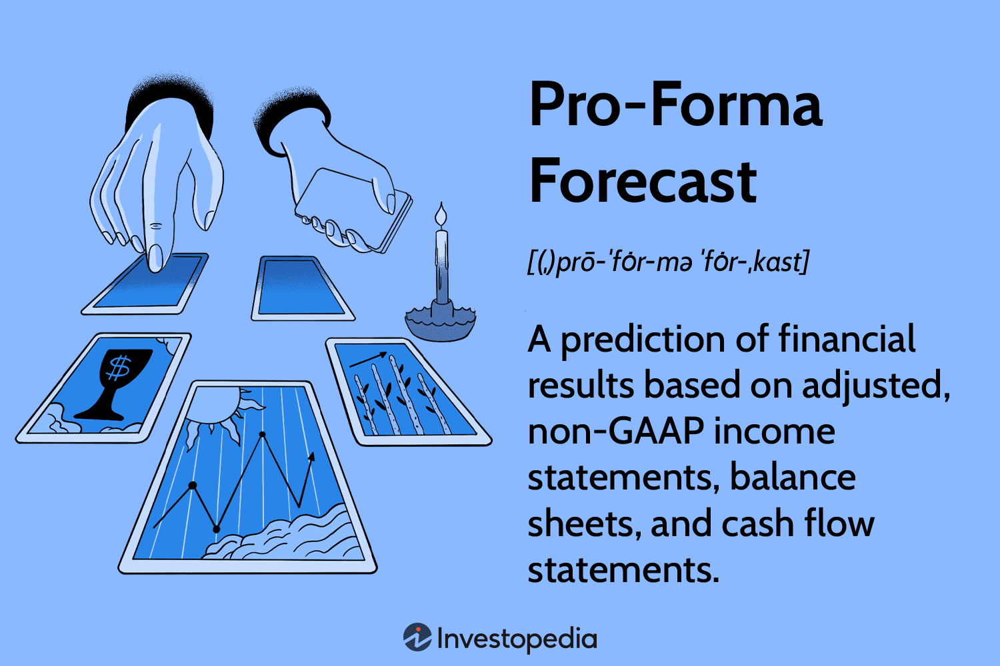

## Table of Contents

## What is pro-forma forecasting?

Pro-forma forecasting is a way to predict a company's future financial performance by creating a set of financial statements that show what the company's finances might look like in the future. These statements are called pro-forma statements, and they help business owners and managers make plans and decisions based on what they think will happen.

To make a pro-forma forecast, people usually start with the company's past financial data and then make guesses about things like sales growth, expenses, and other financial changes. This helps them see how different decisions might affect the company's future. Pro-forma forecasting is useful for planning things like new projects, expansions, or investments, and it helps businesses prepare for different possible future scenarios.

## Why is pro-forma forecasting important for businesses?

Pro-forma forecasting is important for businesses because it helps them plan for the future. By creating financial statements that show what might happen, business owners can see how their decisions might affect their company's money. This helps them make smart choices about things like starting new projects, expanding their business, or making investments. Without pro-forma forecasting, businesses might not know if they can afford to do these things, and they might make choices that don't work out well.

Another reason pro-forma forecasting is important is that it helps businesses prepare for different situations. Sometimes things don't go as planned, and having a forecast can show what might happen if sales go down, costs go up, or something unexpected happens. This way, businesses can have a plan ready for different possibilities and be more ready to handle problems. In the end, pro-forma forecasting helps businesses be more stable and successful by giving them a clearer picture of their future financial health.

## How does pro-forma forecasting differ from traditional forecasting?

Pro-forma forecasting and traditional forecasting both try to predict a company's future, but they do it in different ways. Traditional forecasting usually looks at past data and uses it to guess what will happen next. It often uses numbers and math to make these guesses. For example, if a company's sales went up by 5% last year, traditional forecasting might say they will go up by 5% again this year. This kind of forecasting is good for seeing patterns and trends, but it might not be as good at showing what could happen if the company makes big changes.

On the other hand, pro-forma forecasting is more about imagining different futures based on what the company might do. It starts with the company's past numbers, but then it adds in guesses about new projects, changes in the business, or other big moves. This means pro-forma forecasting can show what might happen if the company starts a new product line or opens a new store. It's more flexible and can help the company plan for different possibilities, not just what has happened before.

## What are the key components of a pro-forma financial statement?

A pro-forma financial statement includes a few important parts that help a business see its future money situation. One key part is the pro-forma income statement, which shows how much money the business might make and spend in the future. This includes things like sales, costs of goods sold, and other expenses. By looking at these numbers, the business can see if it will make a profit or a loss.

Another important part is the pro-forma balance sheet, which shows what the business owns and owes at a certain time in the future. This includes assets like money in the bank, buildings, and equipment, as well as liabilities like loans and bills. The balance sheet helps the business understand its financial health and see if it has enough money to cover what it owes.

The last key part is the pro-forma cash flow statement, which shows how money moves in and out of the business over time. It includes money coming in from sales and money going out for things like buying supplies or paying salaries. This statement helps the business make sure it will have enough cash to keep running and growing. Together, these three parts give a full picture of what the business's finances might look like in the future.

## Can you explain the process of creating a pro-forma forecast?

Creating a pro-forma forecast starts with gathering the company's past financial data. This includes looking at old income statements, balance sheets, and cash flow statements to see how the business has done before. Once you have this information, you can start making guesses about the future. You think about things like how much sales might grow, what expenses could change, and if there will be any big projects or changes in the business. These guesses help you make a new set of financial statements that show what the company's money might look like in the future.

After you have your guesses, you put them into the pro-forma financial statements. First, you make a pro-forma income statement, which shows future sales, costs, and profits. Then, you create a pro-forma balance sheet to see what the business might own and owe in the future. Finally, you make a pro-forma cash flow statement to understand how money will move in and out of the business. Once you have these statements, you can look at them to see how different choices might affect the company's future. This helps you plan better and be ready for different situations that might happen.

## What are common assumptions made in pro-forma forecasting?

When making a pro-forma forecast, people usually start with some guesses about what might happen in the future. One common guess is about how much sales will grow. They might think sales will go up by a certain percent each year based on what happened before or what they hope will happen. Another guess is about costs. They might think that the cost of making things or running the business will stay the same or go up a little bit each year. They also guess about big changes, like starting a new product or opening a new store, and how these changes might affect the business.

Another set of guesses in pro-forma forecasting is about money coming in and going out. People might think that customers will pay their bills on time, so money comes into the business at a steady pace. They also guess about how much money the business will need to spend on things like buying supplies, paying workers, and keeping the lights on. Sometimes, they guess about getting loans or investments and how these will affect the business's money. All these guesses help make a picture of what the business's money might look like in the future, but they need to be careful because if the guesses are wrong, the forecast might not be right either.

## How can pro-forma forecasts be used for strategic planning?

Pro-forma forecasts are a big help for businesses when they want to plan for the future. They show what the business's money might look like if they make certain choices. For example, if a business wants to start a new project, they can use a pro-forma forecast to see if they will have enough money to do it. They can also see how much profit they might make or if they need to find more money. This helps them decide if the project is a good idea or if they should try something else.

These forecasts also help businesses be ready for different things that might happen. If the business thinks sales might go down or costs might go up, they can use a pro-forma forecast to plan for these situations. This way, they can make a plan to save money, find new ways to make money, or change their business in other ways. By using pro-forma forecasts, businesses can make better choices and be more ready for whatever comes their way.

## What are the potential pitfalls and limitations of pro-forma forecasting?

Pro-forma forecasting can be really helpful, but it also has some problems. One big problem is that it depends a lot on guesses about the future. If these guesses are wrong, the whole forecast might not be right. For example, if a business thinks sales will go up a lot, but they don't, the forecast won't match what really happens. This can make the business make bad choices because they thought things would be different.

Another problem is that pro-forma forecasts can be hard to make and understand. They need a lot of numbers and guesses, and if someone doesn't know how to do it right, they might mess up. Also, different people might make different guesses, so two forecasts for the same business might look very different. This can make it hard for everyone to agree on what the future might look like and what the business should do.

Lastly, pro-forma forecasts can be too simple. They might not show all the little details that can affect a business. For example, they might not think about things like changes in the economy, new laws, or what competitors are doing. If the business doesn't think about these things, their forecast might not be very useful. So, while pro-forma forecasts are helpful, businesses need to know their limits and be careful when they use them.

## How does sensitivity analysis enhance pro-forma forecasts?

Sensitivity analysis makes pro-forma forecasts better by helping businesses see how changes in their guesses can affect the future. It lets them try out different numbers for things like sales, costs, and other guesses to see what happens to the forecast. This way, they can understand which guesses are most important and how much they can change without messing up their plans. For example, if a business wants to see what happens if sales go down by 10%, sensitivity analysis can show them how that would affect their money and if they can still do what they planned.

Using sensitivity analysis also helps businesses be ready for surprises. By looking at different possibilities, they can make plans for what to do if things don't go as expected. This makes their forecasts more useful because they can see not just one future, but many different ones. It helps them make better choices and be more ready for whatever might happen, making their pro-forma forecasts a stronger tool for planning.

## Can you provide an example of a pro-forma income statement?

A pro-forma income statement shows what a business thinks its money might look like in the future. Let's say a small bakery wants to see how opening a new store might change its money next year. They start by guessing that their sales will go up by 20% because of the new store. They also guess that their costs for things like flour, sugar, and rent will go up a bit too. They think they will sell more bread and cakes, but they will also need to pay more for ingredients and a bigger space.

Using these guesses, the bakery makes a pro-forma income statement for next year. It shows that their sales might be $120,000, which is 20% more than this year's $100,000. Their costs for ingredients and rent might go up to $72,000 from $60,000. After subtracting these costs, they think they will have $48,000 left. Then, they take out other costs like paying workers and utilities, which they guess will be $20,000. This leaves them with a profit of $28,000 for next year, which is more than this year's $20,000 profit. This pro-forma income statement helps the bakery see if opening the new store is a good idea.

## How should one validate and adjust pro-forma forecasts based on actual performance?

To make sure a pro-forma forecast is right, you need to check it against what really happens in the business. You do this by comparing the numbers in the forecast with the real numbers from the business's financial statements. If the forecast says sales will be $100,000 next month, but they are really $90,000, you need to see why they are different. Maybe sales didn't go up as much as you thought, or maybe costs went up more than you expected. By looking at these differences, you can learn what parts of the forecast need to be changed.

After you know where the forecast was wrong, you can make it better. You might need to change your guesses about how much sales will grow or how much costs will go up. For example, if sales keep coming in lower than expected, you might need to guess a smaller increase next time. Or if costs keep going up more than you thought, you might need to guess a bigger increase. By making these changes, your next forecast will be closer to what really happens, and you can make better plans for the future.

## What advanced techniques can be applied to improve the accuracy of pro-forma forecasts?

One way to make pro-forma forecasts more accurate is by using something called scenario analysis. This means making different forecasts for different situations that might happen. For example, a business might make one forecast for if sales go up a lot, another for if they stay the same, and another for if they go down. By looking at all these different possibilities, the business can see which guesses are most important and be ready for whatever happens. This helps them make better plans because they can think about many different futures, not just one.

Another way to improve pro-forma forecasts is by using statistical methods like regression analysis. This helps the business see how different things are connected. For example, they can use past data to see how sales change when they spend more on advertising. By understanding these connections, they can make better guesses about the future. They can also use something called [machine learning](/wiki/machine-learning) to look at a lot of data and find patterns that might be hard to see otherwise. These advanced techniques help make the guesses in pro-forma forecasts more accurate and useful for planning.

## What is a Pro-Forma Forecast?

Pro-forma forecasts are hypothetical financial representations used to project a business's financial future based on certain assumptions. These forecasts typically include pro-forma income statements, balance sheets, and cash flow statements. By leveraging these financial tools, businesses can simulate potential outcomes and make informed decisions about future operations and strategies.

### Components of Pro-Forma Forecasts

1. **Pro-Forma Income Statements**: These statements project future revenues, expenses, and profits, allowing businesses to assess operational efficiency and profitability under various scenarios. The primary components include projected revenues, cost of goods sold (COGS), operating expenses, and net income. An example formula for projected net income is:
$$
   \text{Net Income} = (\text{Revenue} - \text{COGS} - \text{Operating Expenses}) \times (1 - \text{Tax Rate})

$$

2. **Pro-Forma Balance Sheets**: These provide a snapshot of a company's projected financial position, including assets, liabilities, and equity, helping assess liquidity, solvency, and capital structure. The balance sheet components are crucial in determining the firm's ability to fund operations and growth initiatives.

3. **Pro-Forma Cash Flow Statements**: These forecast cash inflows and outflows, providing insights into a company's future cash position. They incorporate operating, investing, and financing activities to evaluate the business's ability to generate cash and manage financial obligations.

### Role and Flexibility of Pro-Forma Forecasts

Pro-forma forecasts serve as a guide to potential financial conditions, enabling businesses to explore various hypothetical scenarios. Unlike traditional financial statements, they are not bound by Generally Accepted Accounting Principles (GAAP), granting flexibility to incorporate strategic assumptions that reflect an ideal future vision. This flexibility allows businesses to tailor forecasts to specific goals, such as launching a new product, entering a new market, or merging with another entity.

### Hypothetical Nature and Potential Discrepancies

The forward-looking nature of pro-forma forecasts means there may be significant discrepancies between projected and actual results. This variance arises from the inherent uncertainties in estimating future economic conditions, market trends, and internal business developments. For instance, changes in consumer demand, regulatory shifts, or unexpected competitive actions may impact financial outcomes, diverging from initial projections. It is crucial for businesses to continuously update and adjust pro-forma forecasts to reflect new data and evolving circumstances, ensuring they remain relevant and informative.

In summary, pro-forma forecasts are essential for strategic financial planning, offering flexibility to model various future scenarios. While they are powerful tools for envisioning potential business outcomes, users must acknowledge their hypothetical nature and the possibility of substantial deviations from actual results.

## How do you create a pro-forma income statement: A step-by-step guide?

Creating a pro-forma income statement is a valuable exercise in financial planning, enabling businesses to project their future income and expenses. This guide provides a systematic approach to crafting a pro-forma income statement, helping organizations to simulate financial outcomes under various scenarios.

1. **Identifying Revenue Streams**: Begin by listing all potential sources of revenue. This includes direct sales, service fees, and any recurring income such as subscriptions or membership fees. For example, if a company sells both products and services, each should be treated as a separate revenue stream.

2. **Estimating Revenue Figures**: After identifying revenue streams, the next step involves estimating the amounts expected from each. This can be done using historical data, market analysis, or sales projections. For instance, if a business predicts an annual growth rate of 5%, it would apply this percentage to last year's figures to forecast future revenue.
$$
   \text{Projected Revenue} = \text{Current Revenue} \times (1 + \text{Growth Rate})

$$

3. **Calculating Cost of Goods Sold (COGS)**: Determine the direct costs associated with producing goods or delivering services. COGS include materials, labor, and overhead expenses. By subtracting COGS from revenue, you derive the gross margin.
$$
   \text{Gross Margin} = \text{Revenue} - \text{COGS}

$$

4. **Projecting Operating Expenses**: Estimate all other expenses necessary to run the business, such as administrative salaries, rent, utilities, and marketing. These are typically forecasted based on historical spending patterns or percentage of revenue.

5. **Adjusting for Non-Operating Items**: Include forecasts for non-operating income and expenses, which may comprise interest income, dividend income, and irregular expenses like lawsuit settlements or one-time gains.

6. **Projecting Net Income**: Compute the projected net income by subtracting total expenses, including COGS and operating expenses, from total revenue, and adjusting for taxes. 
$$
   \text{Net Income} = (\text{Revenue} - \text{COGS} - \text{Operating Expenses}) \times (1 - \text{Tax Rate})

$$

7. **Creating Multiple Forecast Scenarios**: Construct best-case, worst-case, and most likely scenarios to assess the range of possible financial outcomes. This involves tweaking assumptions, such as sales growth rates, expense inflation, or market conditions, to see their impact on net income.

   **Python Example for Scenario Analysis**:
   ```python
   def forecast_net_income(revenue_growth_rate, cogs_percentage, operating_expenses, tax_rate):
       projected_revenue = current_revenue * (1 + revenue_growth_rate)
       cogs = projected_revenue * cogs_percentage
       gross_margin = projected_revenue - cogs
       net_income = (gross_margin - operating_expenses) * (1 - tax_rate)
       return net_income

   current_revenue = 1000000  # Example current revenue
   best_case = forecast_net_income(0.10, 0.40, 200000, 0.21)
   worst_case = forecast_net_income(0.02, 0.50, 300000, 0.25)

   print(f"Best Case Net Income: ${best_case}")
   print(f"Worst Case Net Income: ${worst_case}")
   ```

8. **Periodic Review and Updates**: Regularly update pro-forma income statements to reflect the latest business environment, market conditions, and financial data. This iterative process ensures that projections remain relevant and useful for decision-making. Periodic assessments allow for adjustments in assumptions, accommodating for new information or changed circumstances.

Adhering to this structured approach aids businesses in understanding potential financial trajectories, enhances strategic planning, and supports informed decision-making.

## How can one estimate future financial positions?

Pro-forma balance sheets are integral to projecting future financial positions, offering insights into an entity's prospective [liquidity](/wiki/liquidity-risk-premium), solvency, and capital structure. They provide a framework for evaluating how future operational and strategic decisions may impact the business's financial stance.

**Balance Sheet Projections and Financial Health**

Liquidity assessment through pro-forma balance sheets involves projecting current assets and liabilities to determine whether a company can meet its short-term obligations. A business with more current assets than liabilities is likely to maintain positive liquidity, ensuring operational stability. Key indicators include the current ratio and quick ratio, defined respectively as:

$$
\text{Current Ratio} = \frac{\text{Current Assets}}{\text{Current Liabilities}}
$$

$$
\text{Quick Ratio} = \frac{\text{Cash + Marketable Securities + Receivables}}{\text{Current Liabilities}}
$$

For solvency evaluation, long-term liabilities and equity are compared to assess a business's ability to sustain operations long-term. Important metrics are the debt to equity ratio and interest coverage ratio, calculated as:

$$
\text{Debt to Equity Ratio} = \frac{\text{Total Debt}}{\text{Total Equity}}
$$

$$
\text{Interest Coverage Ratio} = \frac{\text{EBIT}}{\text{Interest Expense}}
$$

An optimal capital structure balances debt and equity, minimizing the cost of capital while maximizing financial health.

**Strategic Decision-Making with Balance Sheet Projections**

Case studies illustrate that firms employ balance sheet projections for strategic decisions such as mergers and acquisitions, expansion, or restructuring. For instance, prior to acquiring a competitor, a company can project its balance sheet to ascertain post-acquisition liquidity and capital adequacy. This foresight assists in negotiating terms and securing necessary financing under favorable conditions.

Consider a hypothetical tech startup planning expansion. By projecting future balance sheets, the startup determines the potential impact on equity dilution if external funding is pursued or how additional debt may affect its financial leverage. Balance sheet forecasts can thus facilitate informed decisions regarding optimal financing strategies.

**Role of Assumptions and Adjustments**

Accurate pro-forma balance sheets hinge on sound assumptions regarding revenue growth, cost fluctuations, and market conditions. Adjustments, such as changes in inventory management or amortization policies, are pivotal in aligning projections with anticipated real-world scenarios. For example, if a projected economic downturn implies reduced sales, adjustments in revenue forecasts and corresponding cost reductions will yield a more realistic balance sheet.

Robust assumptions necessitate continual revision as new data emerges, maintaining an adaptive approach to financial forecasting. Incorporating sophisticated tools like Monte Carlo simulations can further refine projections by evaluating the impact of variable uncertainties.

In conclusion, pro-forma balance sheets are invaluable in gauging potential financial positions, enabling businesses to prepare for future contingencies and capitalize on strategic opportunities.

## References & Further Reading

[1]: ["Financial Analysis and Planning: The Cornerstone of Entrepreneurial Success"](https://fastercapital.com/content/Financial-Analysis-and-Planning--Entrepreneurial-Finance--From-Planning-to-Profitability.html) by John B. Guerard Jr.

[2]: ["Financial Forecasting, Analysis, and Modelling: A Framework for Long-Term Forecasting"](https://onlinelibrary.wiley.com/doi/book/10.1002/9781118921111) by Michael Samonas

[3]: ["Equity Valuation: Models from Leading Investment Banks"](https://onlinelibrary.wiley.com/doi/book/10.1002/9781119208754) by Frank J. Fabozzi

[4]: ["Investment Valuation: Tools and Techniques for Determining the Value of Any Asset"](https://archive.org/details/investmentvaluat0000damo_n6k9) by Aswath Damodaran

[5]: ["Principles of Forecasting: A Handbook for Researchers and Practitioners"](https://link.springer.com/book/10.1007/978-0-306-47630-3) by J. Scott Armstrong