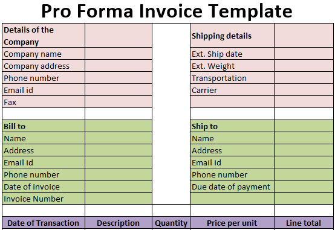

Pro forma invoices play a pivotal role in modern business transactions, serving as instrumental tools in detailing preliminary sales arrangements. These documents provide a comprehensive snapshot of the terms of sale before the commitment of ownership or the exchange of goods. By furnishing a non-binding estimate of costs, including item descriptions, quantities, and estimated fees, pro forma invoices facilitate clearer communication between buyers and sellers, thereby enhancing the efficiency and transparency of business dealings. Their ubiquity across various industries underscores their utility in streamlining the pre-sales process and fostering informed decision-making.

Understanding the essential elements and formats of pro forma invoices is crucial for businesses aiming to optimize their transaction processes. These invoices are particularly significant in sectors dealing with international trade, where accurate tax, customs, and shipping information are paramount to avoid future disputes and ensure smooth operations. Therefore, knowing what to include in a pro forma invoice can aid businesses in maintaining accurate accounts and developing effective financial strategies.



In today's rapidly evolving financial landscape, where algorithmic trading has become a cornerstone of financial markets, the relevance of pro forma invoices extends to ensuring precise cost prediction and transaction terms. Algorithmic trading, characterized by the use of computer algorithms to execute financial transactions at high speeds, necessitates exact and strategic forecasting of expenses and conditions. Pro forma invoices, by offering detailed sales estimates, aid in creating a robust framework for deploying algorithmic strategies efficiently. 

This article aims to elucidate the core requirements of pro forma invoices, provide a detailed example for reference, and explore their application in the context of algorithmic trading. By doing so, we aspire to highlight the indispensable value of pro forma invoices in contemporary business and financial operations.

## Table of Contents

## What is a Pro Forma Invoice?

A pro forma invoice is a preliminary bill of sale that businesses utilize to outline the details of a potential transaction. Unlike standard invoices, which are official requests for payment, pro forma invoices provide an estimated cost of goods or services before they are delivered. This document is not legally binding as a payment demand but acts as an initial agreement reflecting the buyer’s and seller’s intentions regarding the sale.

Serving primarily as a quotation, a pro forma invoice itemizes and describes the products or services being offered, including quantities, prices, and any applicable terms. It allows the buyer to see the total cost comprised of item prices, potential taxes, customs duties, and shipping fees. This transparency helps in budgeting and financial planning for both local and international transactions.

The distinction between a pro forma and a standard invoice lies in their purpose and timing within the sales process. A standard invoice is issued after delivery and signifies the amount due for payment. Conversely, a pro forma invoice is generated earlier and contains anticipated sales terms agreed upon by both parties, ensuring that there are no misunderstandings about what the final invoice will entail.

Utilizing pro forma invoices can help businesses efficiently manage their resources and cash flow by providing clarity on expected transactions and associated costs. For instance, in international trade, where shipping durations and customs clearance might be involved, having a detailed pro forma invoice can facilitate smoother logistical operations and minimize delays.

## Required Information in a Pro Forma Invoice

A pro forma invoice is a crucial document that outlines preliminary sales details, providing a clear framework for both the seller and the buyer to understand the terms of a potential transaction. Here are the essential components typically found in a pro forma invoice and the significance of each:

1. **Seller and Buyer Details**: The identification of both parties is fundamental for establishing the context of the transaction. This includes names, addresses, and contact information. Correct identification is crucial for legal clarity and accountability.

2. **Item Descriptions**: A comprehensive description of the goods or services being offered is necessary. This section should include the type, model, quantity, and specifications of the items. Clear item descriptions prevent ambiguity and help all parties understand precisely what is being agreed upon.

3. **Pricing Information**: This consists of the unit price, total price, discounts, or any applicable surcharges. Pricing details ensure that both parties have a mutual understanding of the financial aspects of the transaction. It is essential that this section is accurate and transparent to avoid any financial disputes.

4. **Terms of Sale**: This includes payment terms, delivery timelines, and any special conditions attached to the transaction. Terms of sale set the expectations for both parties and form the basis of the contractual agreement, outlining how the transaction will be completed.

5. **Tax Information**: Accurate tax details ensure compliance with fiscal regulations. This may include value-added tax (VAT), sales taxes, or any other applicable duties that the buyer must account for. Tax information is especially important for international transactions, where cross-border tax obligations need to be clearly delineated.

6. **Customs Information**: For international transactions, customs details such as harmonized system codes and documentation requirements must be included. This information streamlines the customs clearance process and prevents delays, fines, or legal issues.

7. **Shipping Information**: Shipping terms, including the method of shipment, delivery dates, and any associated costs, should be clearly defined. Shipping details are critical for planning logistics and ensuring that the buyer and seller agree on how and when the products will be delivered.

Detailed documentation in a pro forma invoice helps prevent future disputes by ensuring that all transaction terms are agreed upon in advance. By setting clear expectations, both parties reduce the risk of misunderstandings and ensure a smooth transaction process. Accurate and comprehensive pro forma invoices are particularly important in international transactions, where miscommunications can lead to significant logistical and regulatory issues.

## Example of a Pro Forma Invoice

A pro forma invoice is an essential document in international trade and various business environments, providing an estimated invoice before the actual transaction takes place. To understand its structure and utility, let's explore a detailed example of a pro forma invoice, highlighting its key components.

### Example of a Pro Forma Invoice

#### 1. Header Information

- **Title:** "Pro Forma Invoice" – This clearly indicates the nature of the document to the recipient.
- **Invoice Number:** Unique identifier, e.g., "PFI-2023-001", which allows tracking and referencing.
- **Date of Issue:** The date the pro forma invoice was issued, providing a timeline for the transaction, e.g., "October 1, 2023".
- **Validity Period:** e.g., "Valid until October 31, 2023", outlining how long the prices and terms are applicable.

#### 2. Seller and Buyer Details

- **Seller Information:**
  - Company Name: "ABC Exporters Ltd."
  - Address: "123 Elm Street, New York, NY, USA"
  - Contact: "John Doe, +1 234 567 890"

  This section identifies the party offering the goods or services.

- **Buyer Information:**
  - Company Name: "XYZ Importers Inc."
  - Address: "456 Oak Avenue, London, UK"
  - Contact: "Jane Smith, +44 700 123 456"

  This specifies the party intending to receive the goods or services.

#### 3. Description of Goods/Services

- **Itemized List with Descriptions:**
  | Item Code | Description       | Quantity | Unit Price (USD) | Total Price (USD) |
  |-----------|-------------------|----------|------------------|-------------------|
  | ABC123    | Widget A          | 100      | 10.00            | 1,000.00          |
  | DEF456    | Gadget B          | 50       | 20.00            | 1,000.00          |

  Each item is detailed with a unique code, description, quantity, unit price, and total price to ensure clarity.

#### 4. Pricing and Costs

- **Subtotal:** The sum of all item total prices, e.g., "USD 2,000.00".
- **Shipping Costs:** e.g., "USD 200.00", reflecting estimated transportation charges.
- **Total Amount:** Final amount, including shipping, e.g., "USD 2,200.00".

#### 5. Terms of Sale

- **Payment Terms:** e.g., "Net 30 days", indicating payment is due within 30 days of invoice date.
- **Incoterms:** e.g., "FOB New York", specifying the freight term and point of delivery responsibility.
- **Currency:** "USD" – Ensures both parties agree on the currency for the transaction.

#### 6. Additional Notes

- **Taxes and Duties:** The note might state, "Taxes and import duties payable by the buyer", clarifying financial responsibilities beyond the invoice amount.
- **Special Instructions:** Any additional conditions or instructions relevant to the shipment or payment.

### Significance for Businesses

This example serves as a prototype helping businesses to anticipate sales conditions effectively. By providing a breakdown of costs and terms, businesses can plan logistics, calculate cash flow needs, and prepare for negotiations, ensuring smoother operations. Accurate and detailed pro forma invoices enhance trust and clarify expectations, mitigating potential disputes, especially in international trade contexts where clarity in terms and pricing is vital.

## Pro Forma Invoices in Algorithmic Trading

Algorithmic trading, often referred to as algo trading, is a method of executing orders using pre-programmed and automated trading instructions. This approach relies on complex algorithms to analyze market data and execute trades with precision and speed. The primary advantage of [algorithmic trading](/wiki/algorithmic-trading) is its ability to handle substantial volumes of transactions at a scale and speed that would be impossible for human traders. This is particularly significant in high-frequency trading ([HFT](/wiki/high-frequency-trading-strategies)), where the focus is on achieving very small profits at high turnover rates.

In the context of algorithmic trading, pro forma invoices can be an essential tool for predicting and managing the financial aspects of trades. They provide an estimated breakdown of transaction costs and terms before the actual trades occur. This preliminary financial documentation allows traders to anticipate potential expenses and obligations, contributing to more informed and strategic decision-making.

Pro forma invoices serve several crucial roles in automated financial transactions. First, they allow traders to estimate transaction fees, taxes, and potential shipping or handling charges for physical assets or securities before executing trades. Having this information in advance is particularly beneficial in algorithmic environments, where speed and accuracy are paramount. By integrating pro forma invoices, traders can program their algorithms to account for these anticipated costs, ensuring that they align with strategic financial goals.

Moreover, in high-frequency trading contexts, pro forma invoices can aid in reducing errors and discrepancies that might otherwise occur in the rapid exchange of assets. By providing a detailed account of expected transaction elements, these invoices serve as a reference point for algorithms to verify parameters before executing orders. This minimizes the risk of financial loss due to unforeseen expenses or contractual conditions, thereby enhancing the reliability of trading programs.

In real-world applications, companies engaged in algorithm-driven financial operations may use pro forma invoices to streamline their activities. For instance, a trading firm might use these invoices to:

```python
def calculate_net_profit(est_profit, est_transaction_cost, est_taxes):
    """
    Function to estimate net profit based on pro forma invoice data.

    :param est_profit: Estimated gross profit from trading activity
    :param est_transaction_cost: Estimated transaction costs from pro forma invoice
    :param est_taxes: Estimated taxes applicable from pro forma invoice
    :return: Estimated net profit
    """
    return est_profit - est_transaction_cost - est_taxes

# Example usage
estimated_profit = 10000  # Estimated gross profit
transaction_cost = 500    # Estimated transaction costs
taxes = 150               # Estimated taxes

net_profit = calculate_net_profit(estimated_profit, transaction_cost, taxes)
print(f"Estimated Net Profit: ${net_profit}")
```

In the above Python example, traders can automatically calculate the net profit by deducting estimated transaction costs and taxes from the anticipated gross profit. This computation, based on pro forma invoice data, exemplifies how automated systems can benefit from such detailed preliminary information.

In conclusion, pro forma invoices can play a substantial role in algorithmic trading by anticipating costs and terms, thereby facilitating more precise and strategic operations. They help streamline processes, particularly in high-frequency environments, ensuring that trading algorithms execute with maximum efficiency and minimal risk of unforeseen losses due to inaccurate cost estimations.

## Conclusion

Pro forma invoices play a crucial role in providing clarity and transparency in business transactions across varying industries. By detailing preliminary sales information, they allow both the seller and the buyer to agree on transaction terms before the delivery of goods or services. This preliminary agreement minimizes the risk of future disputes, ensuring smoother transactional processes. For international trade, detailed and accurate pro forma invoices are indispensable. They offer precise documentation that can include tax, customs, and shipping details, vital for navigating complex international regulations efficiently.

In the context of algorithmic trading, pro forma invoices are instrumental for strategic planning and execution. Given the reliance on precise, quantitative transactions in algo trading, the ability to anticipate costs and terms using pro forma invoices can significantly enhance operational efficiency. The preliminary nature of these invoices allows firms to adjust their trading algorithms based on projected costs, optimizing financial strategies and maximizing profitability.

Businesses are encouraged to integrate pro forma invoicing into their financial strategies, leveraging their detailed nature to ensure efficient and dispute-free operations. With the ability to provide accurate sales projections and anticipate potential transactional issues, pro forma invoices support businesses in navigating both regular and complex international deals effectively. By summarizing these key points, the advantages offered by pro forma invoices in promoting transparency, efficiency, and strategic planning are reaffirmed.

## References & Further Reading

[1]: ["Advances in Financial Machine Learning"](https://www.amazon.com/Advances-Financial-Machine-Learning-Marcos/dp/1119482089) by Marcos Lopez de Prado

[2]: ["Machine Learning for Algorithmic Trading"](https://github.com/stefan-jansen/machine-learning-for-trading) by Stefan Jansen

[3]: ["Quantitative Trading: How to Build Your Own Algorithmic Trading Business"](https://www.amazon.com/Quantitative-Trading-Build-Algorithmic-Business/dp/1119800064) by Ernest P. Chan

[4]: ["Evidence-Based Technical Analysis: Applying the Scientific Method and Statistical Inference to Trading Signals"](https://www.amazon.com/Evidence-Based-Technical-Analysis-Scientific-Statistical/dp/0470008741) by David Aronson

[5]: ["International Trade: Theory and Policy"](https://open.umn.edu/opentextbooks/textbooks/19) by Paul Krugman and Maurice Obstfeld

[6]: ["Incoterms® 2020: ICC Rules for the Use of Domestic and International Trade Terms"](https://iccwbo.org/business-solutions/incoterms-rules/incoterms-2020/) by the International Chamber of Commerce