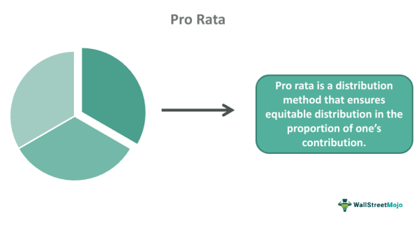

## Table of Contents

## What is the basic definition of pro rata?

Pro rata means dividing something fairly based on a certain share or portion. It is a Latin term that translates to "in proportion." When something is distributed pro rata, each person or part gets an amount that is fair according to their share. For example, if a company has to lay off 10% of its employees, it might do this pro rata across all departments, so each department loses the same percentage of staff.

This concept is used in many areas, like finance, insurance, and business. In finance, if you invest in a fund partway through the year, you might get dividends pro rata, meaning you get a share based on how long you've been invested. In insurance, if you cancel your policy early, you might get a pro rata refund, which means you get back a part of your premium based on the time left on your policy. Pro rata helps make sure things are shared or paid out in a way that is fair and proportional.

## How is pro rata commonly used in everyday situations?

Pro rata is often used when people share costs. Imagine you and your friends rent a house together. If you move in halfway through the month, you might only pay half the rent for that month. That's pro rata - you pay a fair share based on the time you actually lived there. It's the same if you split a bill at a restaurant but some people leave early. They might only pay for what they ate and drank, not the whole bill.

Another common use of pro rata is in work and pay. If someone starts a new job in the middle of a pay period, they might get paid pro rata. This means they get paid for the days they actually worked, not the full pay period. It's fair because they only get money for the time they were at work. Also, if an employee leaves a job before the end of the month, their final paycheck might be calculated pro rata, so they get paid only for the days they worked that month.

## Can you explain the concept of pro rata in the context of insurance?

In insurance, pro rata is used when someone cancels their policy before it ends. If you cancel your car insurance early, you might get some of your money back. This is called a pro rata refund. It means you get back part of your premium, based on how much time is left on your policy. So, if you paid for a whole year but cancel after six months, you might get half your money back.

Pro rata is also used when someone wants to change their insurance coverage. If you decide to increase your coverage in the middle of your policy term, you might have to pay more, but only for the time left on your policy. This way, you pay a fair share for the extra coverage. It's all about making sure you pay or get back money in a way that matches the time you were covered.

## What is the formula for calculating pro rata?

The formula for calculating pro rata is simple. You take the total amount and divide it by the total time or units, then multiply by the time or units you want to find the pro rata amount for. For example, if you paid $1200 for a year of rent but only lived in the place for 6 months, you would divide $1200 by 12 months to get $100 per month. Then, you multiply $100 by the 6 months you lived there to get your pro rata amount of $600.

This formula works the same way for other things too. If you want to know how much of a yearly insurance premium you should get back after canceling early, you divide the total premium by the total months, then multiply by the months left on your policy. It's all about breaking down the total into fair, smaller pieces based on time or units.

## How does pro rata apply to dividend distributions in finance?

In finance, pro rata is used when a company pays out dividends to its shareholders. If a company decides to distribute dividends, it does this based on how many shares each person owns. So, if you own 100 shares out of a total of 1,000 shares, you get 10% of the total dividend. This is fair because everyone gets a piece of the pie that matches their ownership in the company.

If you buy shares in the middle of a dividend period, you might still get some of the dividend. But it will be pro rata, which means you get a share based on how long you've owned the shares. For example, if the company pays dividends quarterly and you buy shares halfway through the quarter, you might get half of the full quarterly dividend for those shares. This way, you only get paid for the time you actually owned the shares, which is fair to everyone involved.

## In what ways is pro rata used in business partnerships?

In business partnerships, pro rata is often used when partners share profits or losses. If a business makes money, the partners might split it based on how much each partner put into the business. For example, if one partner owns 60% of the business and the other owns 40%, they would share the profits in those same percentages. This way, everyone gets a fair share based on their investment.

Pro rata also comes into play when partners need to put more money into the business. If the business needs more cash, each partner might be asked to add more money pro rata to their ownership. So, if the business needs $10,000 and one partner owns 75% of the business, they would need to put in $7,500. This keeps things fair and makes sure each partner is contributing in line with their ownership stake.

## How can pro rata be applied in the allocation of resources?

Pro rata can help when you need to share things like time or money in a group. Imagine you and your friends are working on a project and you have to split up the work. If there are 5 of you, you might decide to split the work evenly, so each person gets 20% of the work. That's pro rata - everyone gets a fair share based on how many people are in the group. It's the same if you're sharing money. If you have $100 to spend on supplies and there are 4 people, each person might get $25 to spend. It's all about making sure everyone gets an equal part.

Pro rata is also useful when you have to share limited resources, like office space. If a company has a big office and wants to share it fairly among different teams, they might use pro rata. For example, if the marketing team has 10 people and the sales team has 20 people, the sales team might get twice as much space as the marketing team. This way, the space is shared based on the size of each team. Pro rata helps make sure that everyone gets a fair amount of whatever is being shared, whether it's time, money, or space.

## What are the legal implications of pro rata in contract law?

In contract law, pro rata is often used to make sure things are shared or paid out fairly. When people sign contracts, they might agree to split costs, profits, or responsibilities based on pro rata. For example, if a group of people invest in a project, the contract might say that profits will be shared pro rata, meaning each person gets a share based on how much they invested. This helps avoid arguments because everyone knows they will get a fair piece of whatever is being shared.

Sometimes, contracts need to change, and pro rata can help with that too. If a contract is canceled early, the people involved might get a pro rata refund or payment. This means they get back or pay only for the time the contract was in effect. For example, if someone pays for a year-long service but cancels after six months, they might get half their money back. Using pro rata in contracts helps make sure everyone is treated fairly, even if things don't go as planned.

## How does pro rata affect the calculation of employee benefits?

Pro rata is used to make sure employees get a fair share of benefits, like vacation time or bonuses, based on how long they've worked. For example, if a company gives employees 20 days of vacation each year, someone who starts halfway through the year might only get 10 days. That's because they only worked half the year, so they get half the vacation time. It's the same with bonuses. If a company gives out a yearly bonus and someone leaves before the end of the year, they might get a smaller bonus, based on the months they worked.

This way of sharing benefits helps keep things fair for everyone. If someone only works part of the year, it wouldn't be fair for them to get the same amount of vacation or the same bonus as someone who worked the whole year. Using pro rata means everyone gets a piece of the benefits that matches the time they worked. It's a simple way to make sure everyone is treated the same, no matter when they start or leave the job.

## What are some advanced applications of pro rata in financial modeling?

In financial modeling, pro rata is often used to predict how companies will share profits or losses among investors. Imagine a company is planning to raise money by selling new shares. Financial models might use pro rata to figure out how the new shares will change the ownership of the company. If an investor already owns 10% of the company and they buy 10% of the new shares, their ownership might stay the same. But if they don't buy any new shares, their ownership could go down. Financial models help companies and investors understand these changes before they happen.

Pro rata also helps in modeling how dividends will be paid out. If a company expects to make a certain amount of money next year, financial models can show how much each shareholder will get based on their ownership. This is important for investors who want to know how much money they might make. By using pro rata in these models, companies can plan their finances better and investors can make smarter choices about where to put their money.

## How does pro rata play a role in bankruptcy proceedings?

In bankruptcy proceedings, pro rata is used to make sure that everyone who is owed money gets a fair share of what's left. When a company goes bankrupt, it often can't pay back all its debts. So, the money that is available gets split up among the people the company owes money to. This is done pro rata, which means each person gets a piece of the money based on how much they are owed. For example, if a company owes $100,000 to one person and $200,000 to another, and it only has $30,000 left, the first person might get $10,000 and the second person might get $20,000. This way, everyone gets a fair share, even if it's not the full amount they were hoping for.

Pro rata also helps in deciding how to share the value of a bankrupt company's assets. If a company has to sell off its things to pay back debts, the money from those sales is shared pro rata among the people who are owed money. This means that if one creditor is owed a lot more than another, they will get a bigger piece of the money from the sales, but still in proportion to what they are owed. Using pro rata in bankruptcy helps make sure that the process is fair and that everyone gets treated the same way, even when there isn't enough money to go around.

## Can you discuss any recent changes or trends in the application of pro rata across different industries?

In recent years, the use of pro rata has seen changes and trends across different industries, especially in tech and finance. In the tech industry, startups often use pro rata to manage how they share new funding among existing investors. This helps keep the ownership fair when the company raises more money. In finance, pro rata is becoming more important in the way companies handle stock buybacks. When a company buys back its own shares, it often does this pro rata to make sure all shareholders have a fair chance to sell their shares back to the company.

Another trend is in the insurance industry, where pro rata is used more often to calculate refunds or premiums for short-term policies. With more people buying insurance for shorter periods, like travel or event insurance, companies need a fair way to handle payments and refunds. Pro rata helps them do this by making sure people pay or get back money based on the time they were covered. Across these industries, the use of pro rata is growing because it helps keep things fair and clear for everyone involved.

## What is Pro Rata: Definition and Formula?

The term 'pro rata' originates from the Latin phrase meaning 'in proportion.' In finance, pro rata calculations are used to allocate an amount among several entities in proportion to their share of the whole. The pro rata formula is straightforward: 

$$
\text{Pro Rata Amount} = \left( \frac{\text{Specific Share}}{\text{Total Share}} \right) \times \text{Total Amount}
$$

This calculation method is integral for scenarios where equitable distribution of resources or obligations is required.

### Illustrative Examples of Pro Rata Calculations

1. **Dividend Distribution**: Consider a company issuing a dividend of $1,000 to its shareholders. If a shareholder owns 200 shares out of a total of 2,000 shares issued by the company, the dividend received by this shareholder is calculated as follows:
$$
   \text{Dividend Received} = \left( \frac{200}{2000} \right) \times 1000 = 100

$$

   This calculation ensures that the dividend distribution aligns with the shareholder's percentage ownership in the company.

2. **Loan Repayment**: Pro rata calculations are frequently used in loan repayments. For instance, if a borrower with multiple co-signers repays a loan, the repayment amounts can be segmented pro rata based on each co-signer's financial responsibility. Suppose three co-signers are responsible for 40%, 35%, and 25% of a $10,000 repayment, their respective repayment amounts would be:
$$
   \text{Co-signer 1's Payment} = 0.40 \times 10000 = 4000

$$
$$
   \text{Co-signer 2's Payment} = 0.35 \times 10000 = 3500

$$
$$
   \text{Co-signer 3's Payment} = 0.25 \times 10000 = 2500

$$

Understanding pro rata calculations is crucial for managing financial commitments and allocations accurately. Whether it's distributing dividends, managing shared expenses, or handling loan repayments, pro rata ensures that each party receives or contributes a fair share based on their stake in the total arrangement. This rational approach facilitates transparency and equity, which are paramount in financial planning and execution.

## References & Further Reading

[1]: ["Algorithms for Hyper-Parameter Optimization"](https://dl.acm.org/doi/10.5555/2986459.2986743) by Bergstra, J., Bardenet, R., Bengio, Y., & Kégl, B., Advances in Neural Information Processing Systems 24 (2011).

[2]: ["Advances in Financial Machine Learning"](https://www.amazon.com/Advances-Financial-Machine-Learning-Marcos/dp/1119482089) by Marcos Lopez de Prado.

[3]: ["Evidence-Based Technical Analysis: Applying the Scientific Method and Statistical Inference to Trading Signals"](https://www.wiley.com/en-us/Evidence+Based+Technical+Analysis%3A+Applying+the+Scientific+Method+and+Statistical+Inference+to+Trading+Signals-p-9780470008744) by David Aronson.

[4]: ["Machine Learning for Algorithmic Trading"](https://github.com/PacktPublishing/Machine-Learning-for-Algorithmic-Trading-Second-Edition) by Stefan Jansen.

[5]: ["Quantitative Trading: How to Build Your Own Algorithmic Trading Business"](https://www.amazon.com/Quantitative-Trading-Build-Algorithmic-Business/dp/0470284889) by Ernest P. Chan.