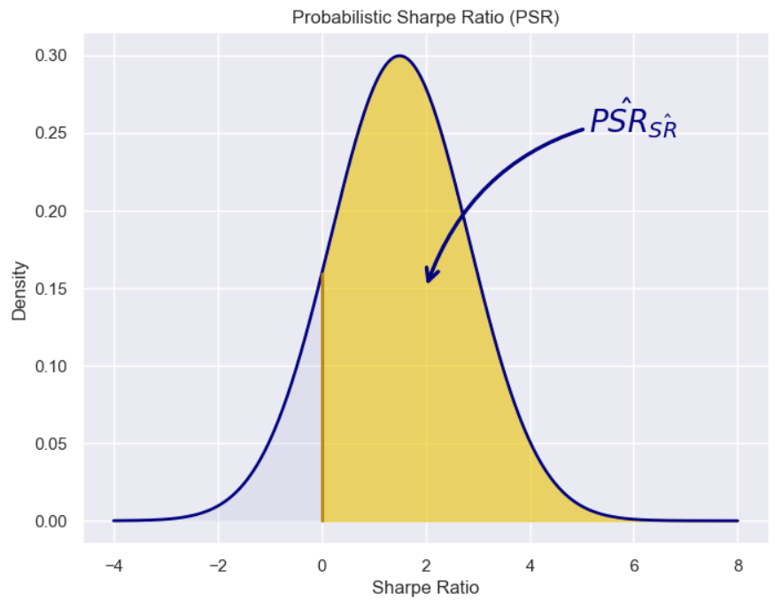

Algorithmic trading, often referred to as algo trading, is at the forefront of transforming financial markets. By leveraging automated algorithms to execute trade orders, it enables rapid decision-making far beyond manual trading capabilities. Central to evaluating the effectiveness of these trading strategies is the use of various performance metrics, among which the Sharpe Ratio stands out due to its widespread recognition. 

Developed by William F. Sharpe, the Sharpe Ratio is a measure of risk-adjusted return that provides insight into the return per unit of risk for an investment portfolio. It is calculated by subtracting the risk-free rate from the portfolio's return and then dividing the result by the standard deviation of the portfolio’s return. Despite its popularity, the Sharpe Ratio is not without its limitations. One significant drawback is its inherent assumption that investment returns are normally distributed, a condition not always met in financial markets.



This limitation has paved the way for the Probabilistic Sharpe Ratio (PSR), which offers a more intricate approach. PSR enhances the traditional Sharpe Ratio by incorporating additional statistical measures such as skewness and kurtosis into its calculation. By doing so, it offers investors a nuanced perspective on risk and return that better accounts for the non-normal distributions commonly observed in market data.

The intention of this article is to examine the Probabilistic Sharpe Ratio and highlight its relevance and advantages in the context of algorithmic trading. Through this exploration, we aim to understand how PSR provides a robust alternative to its predecessor and contributes to more informed investment decisions.

## Table of Contents

## Understanding the Sharpe Ratio

The Sharpe Ratio is a widely used metric in finance for assessing the risk-adjusted return of an investment. It was developed by William F. Sharpe and serves as a tool to evaluate how much excess return you are receiving for the extra [volatility](/wiki/volatility-trading-strategies) that you endure for holding a riskier asset. The formula for calculating the Sharpe Ratio is as follows:

$$
\text{Sharpe Ratio} = \frac{R_i - R_f}{\sigma_i}
$$

Where:
- $R_i$ is the return of the investment,
- $R_f$ is the risk-free rate, typically represented by a government bond yield,
- $\sigma_i$ is the standard deviation of the investment returns.

This calculation reflects the average return earned in excess of the risk-free rate per unit of volatility or total risk. The higher the Sharpe Ratio, the better the investment's returns have been relative to the amount of risk taken.

Despite its popularity, the Sharpe Ratio carries certain limitations. A primary assumption of the Sharpe Ratio is that the investment returns are normally distributed. However, in practical scenarios, financial returns often exhibit skewness (asymmetry) and kurtosis (fat tails), which means that the distribution of returns may diverge significantly from a normal distribution. This misalignment leads to potential inaccuracies when using the Sharpe Ratio to evaluate investment strategies under real-world conditions.

The implication of assuming normally distributed returns is particularly significant in the context of [algorithmic trading](/wiki/algorithmic-trading) and other sophisticated investment strategies where return distributions may be influenced by market anomalies or structural breaks. In such cases, relying solely on the traditional Sharpe Ratio might not provide a comprehensive risk-return assessment, necessitating alternatives that can better account for these irregularities.

## Limitations of the Traditional Sharpe Ratio

The traditional Sharpe Ratio is a widely utilized metric in the evaluation of investment performance, measuring the risk-adjusted return by considering the excess return over a risk-free rate relative to the standard deviation of returns. However, its effectiveness is largely contingent upon the assumption of normally distributed returns, an assumption that often does not hold true in financial markets. Financial asset returns frequently exhibit skewness and kurtosis, deviating significantly from the normal distribution, thus challenging the applicability of the Sharpe Ratio in such contexts.

Firstly, the Sharpe Ratio functions as a point estimate, focusing solely on the mean and variance of the investment returns while overlooking the underlying distribution's shape. This limitation poses significant issues in capturing the complexities and uncertainties inherent in financial data. By not considering the distribution of potential returns, the Sharpe Ratio provides a singular, potentially misleading perspective on an investment's risk-return profile. This lack of depth can be problematic, especially when attempting to understand the full spectrum of an asset's performance.

Moreover, the Sharpe Ratio is often inadequate for evaluating investment strategies with non-linear risk-return profiles. Complex financial instruments or strategies, such as those involving options or derivatives, may demonstrate return distributions that are asymmetric or exhibit fat tails. The traditional Sharpe Ratio does not account for these characteristics, potentially leading to erroneous conclusions regarding the effectiveness and reliability of such strategies. In essence, its simplistic framework may fail to accommodate the intricacies of certain trading methodologies, thereby necessitating a more nuanced approach for a comprehensive analysis.

In summary, while the traditional Sharpe Ratio provides a baseline measure for risk-adjusted returns, its inherent assumptions and limitations necessitate caution. It lacks the capacity to fully capture the risk dynamics associated with non-normally distributed returns and non-linear strategies, underscoring the need for more advanced metrics to deliver a robust evaluation of investment performance.

## What is the Probabilistic Sharpe Ratio (PSR)?

The Probabilistic Sharpe Ratio (PSR) is an advanced risk-adjusted return metric that enhances the traditional Sharpe Ratio by addressing its limitations, specifically concerning the distributional assumptions of asset returns. Developed by David H. Bailey and Marcos López de Prado, the PSR offers a more comprehensive tool for evaluating the performance of trading strategies by incorporating skewness and kurtosis into its calculations.

Traditional Sharpe Ratios operate under the assumption of normally distributed returns, an assumption frequently violated in financial markets. These discrepancies can lead to misleading performance evaluations, particularly for strategies with asymmetric or heavy-tailed return distributions. The PSR, however, adjusts for these factors by estimating the likelihood that the Sharpe Ratio exceeds a predefined benchmark, taking into account higher moments of the return distribution.

The PSR evaluates the probability distribution of Sharpe Ratios considering skewness (the asymmetry of the distribution) and kurtosis (the tail behavior and peak of the distribution). This approach allows for a more accurate estimation of performance, especially in environments where returns exhibit significant deviations from normality. The formula for the PSR includes these [statistics](/wiki/bayesian-statistics), refining the assessment of both risk and prospective returns.

By incorporating a benchmark Sharpe Ratio into its evaluation, the PSR introduces a probabilistic framework that offers traders and portfolio managers a more nuanced view of strategy validity and performance sustainability. This probabilistic context provides valuable insights into the robustness of an investment strategy, facilitating better-informed decision-making in the face of uncertainty.

Overall, the PSR stands as a robust alternative to the Sharpe Ratio, designed to accommodate the complex, non-normal characteristics inherent in many financial return distributions, thus providing a more reliable assessment tool for algorithmic traders and financial analysts.

## Mathematical Foundation of PSR

The Probabilistic Sharpe Ratio (PSR) refines the evaluation of investment performance by integrating higher statistical moments beyond the mean and standard deviation considered in the classic Sharpe Ratio. This enhancement is particularly crucial in reflecting the true characteristics of return distributions, which are often skewed and exhibit excess kurtosis, deviating from the assumption of normality.

Mathematically, the PSR assesses the likelihood that an observed Sharpe Ratio surpasses a predetermined benchmark. This calculation incorporates the cumulative distribution function (CDF) of the Sharpe Ratio, adjusted for skewness ($\gamma$) and kurtosis ($\kappa$). The formula for PSR can be derived using the following approach:

1. **Sharpe Ratio Adjustment**: The observed Sharpe Ratio ($SR$) is modified to reflect non-normality. This involves adjusting for skewness and kurtosis to obtain a standardized measure that accounts for the distribution's asymmetry and tail behaviour.

2. **Use of the Cumulative Distribution Function**: The PSR leverages the CDF to determine the probability that the adjusted Sharpe Ratio exceeds a specified benchmark ($SR_{bench}$). The probability is influenced by the return distribution's skewness and kurtosis, captured through a modified Sharpe measure.
$$
   PSR = \Phi\left(\frac{(\overline{SR} - SR_{bench}) \sqrt{n-1}}{\sqrt{1 - \gamma \cdot SR + \frac{\kappa - 3}{4} \cdot (SR)^2}}\right)

$$

   Here, $\Phi$ denotes the CDF of the standard normal distribution, $n$ is the number of observations, $\overline{SR}$ is the sample Sharpe Ratio, and $\gamma$ and $\kappa$ represent the sample skewness and excess kurtosis, respectively.

3. **Incorporation of Higher-Order Moments**: The inclusion of skewness and kurtosis allows PSR to adjust the Sharpe Ratio in a manner that aligns with the true nature of financial returns, thereby providing a more reliable metric for performance evaluation.

This nuanced approach ensures that portfolio strategies are assessed against a more realistic backdrop of market conditions, facilitating better decision-making and risk management. The mathematical design of PSR effectively addresses the limitations associated with assuming normal distribution, making it a valuable tool for evaluating investment strategies.

## Advantages of Using PSR in Algo Trading

The Probabilistic Sharpe Ratio (PSR) offers significant advantages for algorithmic trading over the traditional Sharpe Ratio by providing a more comprehensive assessment of strategy performance. Firstly, PSR offers a realistic measure of performance under irregular return distributions. Traditional approaches tend to assume normality in return distributions, which is often not the case for financial instruments. The PSR adjusts for this by incorporating skewness and kurtosis, providing a nuanced view that reflects real-world conditions more accurately.

Moreover, the PSR improves decision-making by adjusting Sharpe Ratios for higher-order statistical moments. This adjustment is crucial because financial returns may exhibit skewness (asymmetry) and kurtosis (heavy tails) that the traditional Sharpe Ratio does not account for. By incorporating these moments, PSR delivers a more comprehensive risk assessment, enabling traders to evaluate strategies with a deeper understanding of potential risks and returns.

Additionally, PSR facilitates better risk management and more reliable assessments in portfolio optimization. By evaluating the probability that a strategy's Sharpe Ratio exceeds a benchmark, PSR allows traders to make decisions with a clearer perspective on the likelihood of achieving desired performance levels. This probabilistic approach to measuring risk-adjusted returns aids in constructing portfolios that can withstand extreme market movements and align with investment objectives more effectively.

In conclusion, adopting PSR in algorithmic trading provides a robust solution to overcome the limitations of traditional risk-adjusted performance metrics, leading to more informed strategic decisions and improved portfolio outcomes.

## Implementing PSR in Python: A Practical Guide

Python is a versatile and widely-used tool for quantitative finance, making it ideal for implementing Probabilistic Sharpe Ratio (PSR) calculations. Thanks to a rich ecosystem of scientific libraries, including NumPy and SciPy, traders can efficiently compute PSR and integrate it into their algorithmic trading strategies.

### Calculating PSR Using Python

To calculate the Probabilistic Sharpe Ratio, it is essential to first comprehend the formula involved. The PSR is derived by adjusting the traditional Sharpe Ratio to account for the skewness and kurtosis in the return distributions. The formula can be expressed as follows:

$$

PSR = \Phi\left( \frac{SR - SR^*}{\sigma_{SR}} \right) 
$$

Here, $\Phi$ denotes the cumulative distribution function of the standard normal distribution, $SR$ is the observed Sharpe Ratio, $SR^*$ is the benchmark Sharpe Ratio, and $\sigma_{SR}$ is the standard deviation of the Sharpe Ratio.

### Python Code Implementation

Below is a basic Python implementation to compute the PSR using the NumPy and SciPy libraries:

```python
import numpy as np
from scipy.stats import norm

def calculate_sharpe_ratio(returns, risk_free_rate=0):
    excess_returns = np.mean(returns) - risk_free_rate
    std_dev = np.std(returns, ddof=1)
    return excess_returns / std_dev

def calculate_psr(returns, benchmark_sr, risk_free_rate=0):
    sr = calculate_sharpe_ratio(returns, risk_free_rate)
    skewness = np.mean((returns - np.mean(returns))**3) / np.std(returns)**3
    kurtosis = np.mean((returns - np.mean(returns))**4) / np.std(returns)**4 - 3
    sr_std = (1 / np.sqrt(len(returns))) * np.sqrt(1 + 0.5 * sr**2 - skewness * sr + (kurtosis - 3) / 4)
    psr_value = norm.cdf((sr - benchmark_sr) / sr_std)
    return psr_value

# Example data
returns = np.array([0.01, 0.02, -0.01, 0.03, 0.005])  # Example returns
benchmark_sr = 0.5  # Example benchmark Sharpe Ratio

psr = calculate_psr(returns, benchmark_sr)
print(f"Probabilistic Sharpe Ratio: {psr}")
```

### Explanation

- **`calculate_sharpe_ratio` Function:** This function calculates the traditional Sharpe Ratio by first computing the excess returns over the risk-free rate and then dividing by the standard deviation of returns.

- **`calculate_psr` Function:** This function computes the PSR. It starts by calculating the Sharpe Ratio using `calculate_sharpe_ratio`. Then, it adjusts for skewness and kurtosis, accounting for the higher-order characteristics of the return distribution that can distort the Sharpe Ratio. The cumulative distribution function from SciPy is used to translate the adjusted ratio into a probability value, resulting in the PSR.

This implementation provides a foundation for traders to incorporate PSR calculations into their trading algorithms, allowing for a more refined assessment of their strategies under non-normal return distributions.

## Conclusion

The Probabilistic Sharpe Ratio (PSR) provides a substantial advancement over the traditional Sharpe Ratio by addressing its fundamental limitations, such as the assumption of normally distributed returns. In the domain of algorithmic trading, incorporating PSR aids in making more informed investment decisions by adjusting for higher-order statistical moments like skewness and kurtosis. This probabilistic approach allows traders to better assess the risk-adjusted return, offering a clearer picture of the performance and inherent risks associated with different trading strategies.

By transitioning from the conventional Sharpe Ratio to PSR, financial analysts can greatly enhance portfolio performance. PSR's ability to account for the true distribution of asset returns results in more accurate and reliable evaluations of trading strategies. Consequently, algorithmic traders are equipped to make more confident decisions, ultimately leading to optimized risk management and improved financial outcomes. Through its nuanced analysis, PSR stands as an invaluable tool for those committed to achieving a deeper understanding of the complexities of financial markets.

## Key Takeaways

The Probabilistic Sharpe Ratio (PSR) represents an advanced approach for evaluating financial returns, accounting effectively for skewness and kurtosis. Unlike the traditional Sharpe Ratio, which assumes a normal distribution of returns and consequently may offer an incomplete picture, the PSR considers the distribution's tail risks and asymmetries. The incorporation of skewness and kurtosis enables a more comprehensive evaluation of return probabilities, accommodating the actual behavior of financial data which seldom fits a perfect bell curve.

In providing a probabilistic perspective, the PSR surpasses the binary outcomes of its predecessor by determining the likelihood that the Sharpe Ratio of a given investment strategy will surpass a pre-established benchmark. This probabilistic insight yields a more nuanced understanding of risk-adjusted returns, offering traders a valuable tool for discerning the potential reliability of their strategies.

Adopting the PSR within algorithmic trading involves adjusting for higher-order statistical moments, facilitating more informed decisions. Its implementation can lead to metrics that reflect more accurately the intricacies of market behavior, paving the way for enhanced confidence in strategy assessments. This probabilistic methodology, alongside practical programming tools in Python, empowers traders to utilize data-driven insights effectively, ensuring their strategies are built upon a robust framework to navigate volatility and uncertainty in financial markets.

## References & Further Reading

[1]: Marcos López de Prado (2018). ["Advances in Financial Machine Learning"](https://www.amazon.com/Advances-Financial-Machine-Learning-Marcos/dp/1119482089). Wiley.

[2]: Bailey, D. H., & López de Prado, M. (2012). ["The Sharpe Ratio Efficient Frontier."](https://papers.ssrn.com/sol3/papers.cfm?abstract_id=1821643) Journal of Risk.

[3]: David Aronson (2007). ["Evidence-Based Technical Analysis: Applying the Scientific Method and Statistical Inference to Trading Signals"](https://www.amazon.com/Evidence-Based-Technical-Analysis-Scientific-Statistical/dp/0470008741). Wiley.

[4]: Stefan Jansen (2020). ["Machine Learning for Algorithmic Trading"](https://github.com/stefan-jansen/machine-learning-for-trading). Packt Publishing.

[5]: Chan, E. P. (2009). ["Quantitative Trading: How to Build Your Own Algorithmic Trading Business"](https://github.com/ftvision/quant_trading_echan_book). Wiley.