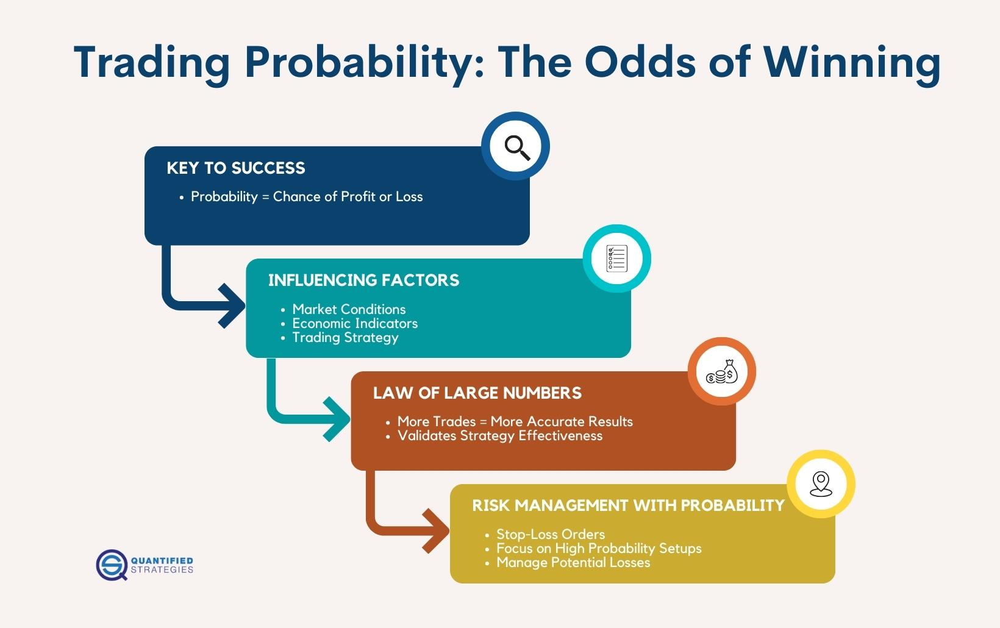

## Table of Contents

## What is a successful trade in the context of trading?

A successful trade in the context of trading happens when a trader makes a profit from buying and selling something. This could be stocks, currencies, or other financial products. The trader buys at a lower price and then sells at a higher price. The difference between these two prices is the profit. For example, if a trader buys a stock for $10 and sells it later for $15, the successful trade results in a $5 profit.

To have a successful trade, a trader needs to do a lot of research and understand the market well. They need to know when to buy and when to sell. Sometimes, traders use special tools and strategies to help them make good decisions. A successful trade is not just about making money once, but also about managing risks so that the trader does not lose too much money if things go wrong. It's important for traders to keep learning and adapting to changes in the market to keep having successful trades.

## How do basic probability concepts apply to trading?

Basic probability concepts are really important in trading because they help traders understand the chances of making money or losing it. When traders look at the market, they use probability to guess what might happen next. For example, if a stock has gone up in price 70% of the time in the past month, a trader might think there's a good chance it will go up again. But, they also know that past results don't guarantee future results, so they use probability to weigh the risks and rewards of their trades.

Traders also use probability to manage their money. They might decide to only risk a small amount of their money on each trade, knowing that even if they have a good chance of winning, they could still lose. This is called risk management. By understanding probability, traders can make smarter decisions about how much to bet on each trade and when to cut their losses. It's all about balancing the chance of winning with the potential loss, and probability helps them do that.

## What factors influence the probability of a successful trade?

The probability of a successful trade depends on many things. One big thing is how well a trader understands the market. If a trader knows a lot about the stocks or other things they are trading, they can make better guesses about what will happen next. Another thing is how much a trader knows about the news and events that can change prices. For example, if a company is about to release a new product, that might make its stock price go up. Traders who know about this news can use it to make smart trades.

Another [factor](/wiki/factor-investing) is how a trader manages their money. If a trader only risks a little bit of money on each trade, they can keep trading even if they lose sometimes. This is called risk management. Also, the tools and strategies a trader uses can help. Some traders use special computer programs to help them decide when to buy and sell. These programs can look at a lot of data quickly and find patterns that humans might miss. All these things together can make the probability of a successful trade higher.

## How can a beginner assess the risk versus reward in a trade?

A beginner can assess the risk versus reward in a trade by first looking at how much they could lose if the trade goes wrong. This is the risk. For example, if you buy a stock for $100, the most you could lose is $100 if the stock price drops to zero. But usually, traders set a stop-loss order, which means they decide to sell the stock if it drops to a certain price, like $90. This limits their risk to $10. Next, they need to think about the reward, which is how much they could make if the trade goes well. If they think the stock could go up to $120, then the reward is $20 per share.

To figure out if the trade is worth it, a beginner should compare the risk to the reward. A common rule is to look for trades where the reward is at least twice as big as the risk. In the example above, the risk is $10 and the reward is $20, so the reward is twice the risk. This is a good ratio. But it's also important to think about how likely it is that the stock will actually go up to $120. If it's not very likely, then the trade might not be worth it, even if the reward is big. By thinking about both the risk and the reward, and how likely each is, a beginner can make smarter trading decisions.

## What are common statistical tools used to predict trade success?

Traders use different statistical tools to help them guess if a trade will be successful. One common tool is the moving average, which helps traders see the average price of a stock over a certain time. If the current price is above the moving average, it might mean the stock is doing well and could keep going up. Another tool is the standard deviation, which shows how much the price of a stock moves around. If the standard deviation is high, it means the price can change a lot, which can be riskier but also offer bigger rewards.

Another important tool is the correlation coefficient, which helps traders see how two different stocks or markets move together. If two stocks have a high positive correlation, they tend to go up and down together. This can help traders decide if they should buy or sell both stocks at the same time. Lastly, traders often use regression analysis to predict future prices based on past data. By looking at how prices have changed in the past, traders can make educated guesses about what might happen next. These tools help traders make better decisions by giving them more information about the market.

## How does market volatility affect trade probabilities?

Market [volatility](/wiki/volatility-trading-strategies) is how much the price of something, like a stock, goes up and down. When the market is very volatile, it means the prices can change a lot and very quickly. This can make trading riskier because it's harder to predict what will happen next. If a stock's price is jumping around a lot, the chance of making a successful trade can go down because it's harder to know if the price will keep going up or start to go down.

On the other hand, high volatility can also mean bigger rewards. If a trader can guess right and the price moves in the direction they want, they could make more money than in a less volatile market. But, it's a double-edged sword. The same volatility that could make a trader a lot of money could also make them lose a lot if the price moves against them. So, traders need to be careful and use tools like stop-loss orders to protect themselves when the market is very volatile.

## What role does a trader's experience play in achieving successful trades?

A trader's experience is really important for making successful trades. When someone has been trading for a long time, they learn a lot about the market. They know how to read charts and understand what different patterns mean. They also get better at figuring out when news or events might change prices. This knowledge helps them make smarter decisions about when to buy and sell. Experienced traders also learn from their mistakes, so they know how to avoid common pitfalls and manage their money better.

Experience also helps traders stay calm when the market gets crazy. New traders might panic and make bad decisions when prices start moving a lot, but someone with experience knows that this is normal and can stick to their plan. They also get better at using tools and strategies that help them predict what might happen next. Over time, all these things add up to make the chances of a successful trade higher. So, while anyone can start trading, it's the experience that really makes a big difference in the long run.

## How can technical analysis improve the probability of a successful trade?

Technical analysis is a way of looking at past prices and patterns to guess what might happen next in the market. It helps traders see trends and understand how prices move. By using charts and tools like moving averages and support and resistance levels, traders can spot good times to buy or sell. For example, if a stock keeps bouncing off a certain price, that's called support. If it keeps hitting a certain high price and then going down, that's resistance. Knowing these levels can help a trader decide when to make a move.

Using technical analysis can make a trader's guesses more accurate. It's not perfect, but it gives traders more information to work with. When a trader sees a pattern that has worked before, they might feel more confident about their trade. This can lead to better decisions and a higher chance of making money. But, it's important to remember that technical analysis is just one tool. Good traders use it along with other things, like understanding the news and managing their money wisely, to improve their chances of success.

## What are the psychological factors that impact trading success?

One big psychological factor that impacts trading success is emotions. When traders feel scared or excited, they might make quick decisions without thinking them through. For example, if a trader sees their stock going down, they might panic and sell it too soon, even if it could go back up later. On the other hand, if a trader is feeling too confident, they might take big risks and lose a lot of money. Staying calm and sticking to a plan can help traders make better choices and increase their chances of success.

Another important psychological factor is discipline. Trading takes a lot of patience and self-control. A good trader knows when to wait for the right moment to buy or sell, instead of jumping in just because they feel like it. They also follow their rules about how much money to risk on each trade. This discipline helps them avoid big losses and keep trading over the long term. By managing their emotions and staying disciplined, traders can improve their chances of making successful trades.

## How do different trading strategies alter the probabilities of success?

Different trading strategies can change the chances of a trader making money. Some strategies focus on short-term gains, like [day trading](/wiki/day-trading-spy), where traders buy and sell stocks quickly within the same day. This can be risky because the market can change a lot in a short time, but it can also lead to quick profits if the trader guesses right. On the other hand, long-term strategies, like buy-and-hold, involve buying stocks and keeping them for a long time. This can be less risky because it's based on the idea that the market will go up over time, but it might take longer to see big profits.

Another strategy is [trend following](/wiki/trend-following), where traders try to find and follow big movements in the market. If they can spot a trend early, they can make money as the trend continues. But, if the trend changes suddenly, they might lose money. Then there's the value investing strategy, where traders look for stocks that they think are underpriced and hold onto them until the price goes up. This can be a good way to make money if the trader is right about the stock's value, but it can take a long time for the price to catch up. Each strategy has its own risks and rewards, and the right one depends on the trader's goals and how much risk they're willing to take.

## What advanced quantitative models are used to forecast trade outcomes?

Advanced quantitative models help traders predict what might happen in the market by using math and computers. One popular model is the Black-Scholes model, which traders use to figure out the price of options. Options are like bets on whether a stock will go up or down. The Black-Scholes model looks at things like the stock's price, how much it moves around, how long until the option expires, and how much money you could make or lose. By using this model, traders can decide if an option is a good deal or not.

Another advanced model is the GARCH (Generalized Autoregressive Conditional Heteroskedasticity) model, which helps traders understand how much a stock's price might change in the future. It looks at past price changes to guess how much the price might move around in the future. This is really helpful for traders who want to know how risky a trade might be. Both of these models, and others like them, use a lot of data and math to give traders better guesses about what might happen next in the market.

## How can one continuously improve their trading success rate over time?

To keep getting better at trading, it's important to always learn and practice. One way to do this is by keeping a trading journal where you write down what you did and what happened. This helps you see what works and what doesn't. You can look back at your trades and figure out why some were successful and others weren't. It's also good to read [books](/wiki/algo-trading-books), take courses, and learn from other traders. The more you know about the market and different strategies, the better you can make decisions. Trying out new strategies and tools can also help you find what works best for you.

Another way to improve your trading success rate is by managing your emotions and sticking to a plan. Trading can be stressful, and it's easy to make bad choices when you're feeling scared or excited. By staying calm and following your rules, you can avoid big mistakes. It's also important to keep learning about risk management. This means knowing how much money to risk on each trade and when to cut your losses. Over time, as you learn more and get better at managing your emotions and money, your chances of making successful trades will go up.

## References & Further Reading

[1]: Bergstra, J., Bardenet, R., Bengio, Y., & Kégl, B. (2011). ["Algorithms for Hyper-Parameter Optimization."](https://dl.acm.org/doi/10.5555/2986459.2986743) Advances in Neural Information Processing Systems 24.

[2]: ["Advances in Financial Machine Learning"](https://www.amazon.com/Advances-Financial-Machine-Learning-Marcos/dp/1119482089) by Marcos Lopez de Prado

[3]: ["Evidence-Based Technical Analysis: Applying the Scientific Method and Statistical Inference to Trading Signals"](https://www.amazon.com/Evidence-Based-Technical-Analysis-Scientific-Statistical/dp/0470008741) by David Aronson

[4]: ["Machine Learning for Algorithmic Trading"](https://github.com/stefan-jansen/machine-learning-for-trading) by Stefan Jansen

[5]: ["Quantitative Trading: How to Build Your Own Algorithmic Trading Business"](https://github.com/LucindaYa/quant-resources/blob/master/Quantitative%20Trading%20How%20to%20Build%20Your%20Own%20Algorithmic%20Trading%20Business.pdf) by Ernest P. Chan