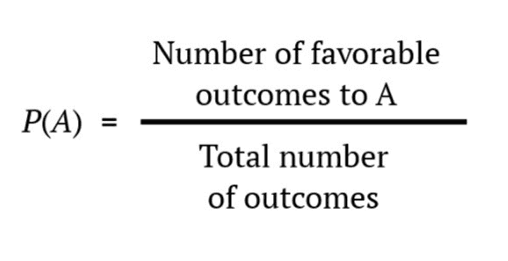

Understanding the probability of a successful trade is crucial for any trader. Trading in financial markets involves inherent uncertainties, and quantifying these uncertainties using probability allows traders to make informed decisions. Probability enables traders to assess the potential outcomes of their trades, helping them to manage risk and plan their strategies effectively.

Incorporating technology and algorithms can significantly enhance trading odds. With the advent of high-speed computing and sophisticated algorithms, traders now have the tools to process vast amounts of data quickly. Algorithms can analyze market trends, historical data, and live feeds to identify trading opportunities that may not be immediately visible to human traders. They can help minimize human error, ensuring that trades are executed with precision and consistency.



Algorithmic trading, also known as algo trading, represents the integration of technology into trading, offering pathways to developing winning trade strategies. Algo trading employs advanced mathematical models and statistical methods to evaluate and execute trades based on predefined criteria, allowing traders to ensure favorable trading conditions are met. This approach can be advantageous in capturing market inefficiencies or leveraging short-term trading opportunities that require rapid decision-making.

Overall, successful trading hinges on the combined forces of probability, technology, and strategic planning. While understanding the probability of outcomes helps in forecasting and managing risks, algorithms provide traders with a robust framework to act on those probabilities efficiently. Traders who harness these tools effectively can increase their chances of success and maintain a competitive edge in ever-evolving financial markets.

## Table of Contents

## The Role of Probability in Successful Trading

Probability plays a central role in successful trading, akin to the equal chances observed in a coin toss. When flipping a fair coin, the probability of landing on heads or tails is 50%. Similarly, in trading, each transaction carries inherent risks and rewards that may seem equally balanced at first glance. However, unlike a simple coin flip, trading involves numerous variables, market conditions, and individual decisions that alter the probability of a successful outcome.

Understanding random events and streaks is crucial for traders. Markets are a complex system influenced by countless factors, and seemingly random streaks akin to hot hands in sports can occur. These streaks, whether beneficial or detrimental, must be meticulously analyzed. Without a robust understanding of probability, traders might misinterpret streaks as persistent trends, leading to misguided decisions. Randomness does not negate the effect of patterns, but it complicates their recognition, necessitating careful statistical analysis.

Long-term success in trading transcends mere reliance on probability. While understanding probability is foundational, traders must also develop strategies and skills to shift probability in their favor. Consistent success comes from a blend of disciplined strategy execution, rigorous risk management, and the ability to identify when the odds are favorable. An effective trader recognizes the limits of probability and leverages tools and insights to navigate complex market environments.

To achieve long-term success, traders need to integrate more than just the basics of probability. They must apply superior risk-reward evaluation techniques, cultivate a deep understanding of market dynamics, and maintain an adaptability to shifting market conditions. The art of trading lies in harnessing probability through actionable insights, supported by a comprehensive approach to analyzing market patterns and integrating advanced tools that extend beyond mere chance.

## Understanding Trading Odds

Trading odds are influenced by several factors beyond mere chance. A well-crafted strategy is vital in shifting the balance of these odds in a trader's favor. Strategies in trading are systematic approaches designed to achieve a particular financial goal, and they play a crucial role in determining the likelihood of profitable trades.

One of the fundamental ways strategies alter trading odds is by setting specific rules for entering and exiting trades. These rules can be based on various technical indicators, market conditions, or economic news. For example, a trader might employ a moving average crossover strategy, which involves buying when a short-term moving average crosses above a long-term moving average, and selling when the opposite occurs. This strategy attempts to capitalize on the [momentum](/wiki/momentum) of stock prices, thereby potentially increasing the odds of successful trades.

Statistical analysis is another indispensable tool for traders looking to enhance their trading odds. By analyzing historical market data, traders can identify patterns and make informed predictions about future price movements. Statistical methods such as regression analysis, hypothesis testing, and probability distributions enable traders to evaluate the performance of their strategies and optimize them for higher accuracy and profitability.

For instance, using Python, a trader can backtest a strategy to simulate its potential performance over historical data:

```python
import pandas as pd
import numpy as np
import matplotlib.pyplot as plt

# Load historical price data
data = pd.read_csv('historical_prices.csv')
data['MA50'] = data['Close'].rolling(window=50).mean()
data['MA200'] = data['Close'].rolling(window=200).mean()

# Create a strategy condition
data['Signal'] = np.where(data['MA50'] > data['MA200'], 1, 0)
data['Position'] = data['Signal'].diff()

# Calculate returns
data['Returns'] = data['Close'].pct_change()
data['StrategyReturns'] = data['Position'].shift(1) * data['Returns']

# Plot the results
data[['Returns', 'StrategyReturns']].cumsum().apply(np.exp).plot()
plt.show()
```

This example demonstrates how traders can test a moving average crossover strategy using historical data, allowing them to assess its effectiveness before deploying it in real-time trading.

Moreover, the concept of risk-reward ratio is integral to strategy development. By analyzing the potential risk involved in a trade against the expected reward, traders can decide on the viability of their strategies. A higher risk-reward ratio suggests that the potential rewards justify the risks taken, thus improving trading odds.

In summary, understanding and improving trading odds involves moving beyond luck to leverage strategies and statistical analysis. These tools allow traders to make data-driven decisions, refine their approaches, and potentially increase their chances of achieving successful trades.

## Algorithmic Trading: Enhancing Trading Success

Algorithmic trading, often referred to as algo trading, involves using complex algorithms to execute trades based on specific criteria. These algorithms can process vast amounts of data far quicker than a human trader, enabling the swift execution of trades with precision and reduced latency. This speed and accuracy can lead to enhanced trading success, particularly in markets that react swiftly to new information. 

Algorithms can analyze myriad data points in real-time, ranging from historical price data to real-time news feeds. By swiftly identifying patterns and trends, these algorithms can predict market movements and execute trades at optimal times. For example, a moving average crossover strategy can be automated to buy or sell equities when short-term moving averages cross long-term moving averages. The pseudocode for such a strategy in Python might look like:

```python
def moving_average_crossover_strategy(data, short_window=40, long_window=100):
    signals = pd.DataFrame(index=data.index)
    signals['price'] = data['close']
    signals['short_mavg'] = data['close'].rolling(window=short_window, min_periods=1, center=False).mean()
    signals['long_mavg'] = data['close'].rolling(window=long_window, min_periods=1, center=False).mean()
    signals['signal'] = 0.0
    signals['signal'][short_window:] = np.where(signals['short_mavg'][short_window:] > signals['long_mavg'][short_window:], 1.0, 0.0)   
    signals['positions'] = signals['signal'].diff()
    return signals
```

In addition to speed, [algorithmic trading](/wiki/algorithmic-trading) allows for executing trades based on predefined criteria without human intervention. This can be particularly advantageous in maintaining consistency in trading strategies and avoiding the pitfalls of emotional decision-making. The algorithms can be programmed to follow complex rules and criteria, ranging from simple conditions like trigger price levels to complex statistical models like mean reversion or [arbitrage](/wiki/arbitrage).

Moreover, algo trading facilitates high-frequency trading ([HFT](/wiki/high-frequency-trading-strategies)), a strategy that capitalizes on minute price differences and executes thousands of trades in seconds. Such techniques exploit the smallest of market inefficiencies, providing traders with a competitive edge in volatile markets. By reducing human error and incorporating [backtesting](/wiki/backtesting) mechanisms, algorithmic trading not only enhances the probability of successful trades but also solidifies strategic approaches to mitigate risks.

Overall, by leveraging high-speed data analysis and executing trades based on robust, predefined criteria, algorithmic trading significantly enhances the prospects of trading success and manages risks more effectively than traditional trading methods.

## Developing a Winning Trading Strategy

Designing an effective trading strategy necessitates aligning personal goals with market conditions and employing meticulous methods for strategy development. One critical approach is defining clear objectives, such as risk tolerance and desired return, which guide the selection and customization of trading strategies. Equally important is market understanding, requiring an awareness of different market conditions like bullish, bearish, and neutral states, and choosing strategies that perform optimally within these contexts.

Backtesting is a pivotal aspect of developing a reliable trading strategy. It involves applying a strategy to historical data to evaluate its effectiveness without risking actual capital. The backtesting process consists of validating the assumptions made during strategy design and refining the strategy based on performance metrics such as Sharpe ratio, maximum drawdown, and return consistency. Using software tools like Python’s pandas and [backtrader](/wiki/backtrader) libraries, traders can efficiently simulate trades and analyze outcomes:

```python
import pandas as pd
import backtrader as bt

class MyStrategy(bt.Strategy):
    def __init__(self):
        self.sma = bt.indicators.SimpleMovingAverage(self.data.close, period=14)

    def next(self):
        if self.data.close[0] > self.sma[0]:
            self.buy(size=10)
        elif self.data.close[0] < self.sma[0]:
            self.sell(size=10)

cerebro = bt.Cerebro()
data = bt.feeds.YahooFinanceData(dataname='AAPL', fromdate=pd.datetime(2020, 1, 1), todate=pd.datetime(2021, 1, 1))
cerebro.adddata(data)
cerebro.addstrategy(MyStrategy)
cerebro.run()
```

Algorithmic trading strategies like trend-following and arbitrage leverage computational algorithms to capitalize on market inefficiencies. Trend-following is based on the notion that prices tend to move in sustained directions and involves using indicators such as moving averages or the Relative Strength Index (RSI) to identify directional movement. Conversely, arbitrage exploits price discrepancies across markets or securities, aiming to profit from momentary differences without bearing directional risk.

Both strategies require meticulous implementation, considering factors such as transaction costs and slippage, which can significantly impact profitability. Trend-following strategies, for instance, might face challenges during sideways markets, while arbitrage opportunities demand rapid execution and substantial computational resources.

Ultimately, a winning trading strategy is not static; it requires ongoing evaluation and adjustment in response to changing market dynamics. Regular performance reviews and updates to strategies and algorithms ensure that traders can adapt to new patterns and continue to achieve their financial goals.

## The Psychology of Trading

The impact of emotions on trading decisions is a critical [factor](/wiki/factor-investing) that can significantly influence outcomes. Human emotions such as fear, greed, and overconfidence can lead to suboptimal trading decisions, often causing traders to deviate from their planned strategies. For instance, fear may prevent a trader from entering a potentially profitable trade, while greed can lead to holding a position too long, ultimately resulting in losses. Overconfidence might cause excessive risk-taking, underestimating the potential for adverse market movements.

Algorithmic trading offers a solution to the psychological pitfalls inherent in manual trading. By relying on pre-defined criteria and automated systems, algorithmic trading reduces the influence of emotional biases on trading decisions. Algorithms execute trades based strictly on logic and statistical analysis, adhering to set rules regardless of market [volatility](/wiki/volatility-trading-strategies) or emotional impulses. This approach can lead to more consistent decision-making.

One of the key psychological advantages of algorithmic trading is its ability to maintain discipline. Traditional trading requires constant decision-making and adjustments, which can be mentally exhausting and increase the likelihood of errors due to emotional distress. In contrast, algorithmic trading systems are designed to act decisively in accordance with the programmed set of rules, thereby eliminating emotional interference.

Moreover, algorithmic trading enhances objectivity in trades. By utilizing vast amounts of historical and real-time data, algorithms can identify patterns and opportunities without being clouded by subjective judgment. This objectivity ensures that each trading decision is based on data-driven insights rather than emotional whims.

In conclusion, while trading psychology remains a complex and influential factor in financial markets, the integration of algorithmic trading can significantly mitigate the impact of emotional biases. By automating decision-making processes, traders can maintain strategic consistency, improve discipline, and enhance the overall efficiency of their trading activities.

## Improving Your Odds: Real-World Applications

Algorithmic trading has transformed the landscape of financial markets, offering traders tools to enhance their odds of success. Here, we examine real-world applications of algorithmic strategies, providing insights into their effectiveness and practical advice on integrating technology into trading practices.

### Case Studies of Algorithmic Strategies

1. **Trend-Following Algorithms**: Trend-following strategies capitalize on market momentum by identifying and riding long-term trends. A notable case study is that of the Turtle Traders, a group of novices trained by Richard Dennis who used a simple trend-following strategy to achieve exceptional returns in the 1980s. The algorithm detected price movements, triggering buy or sell orders when a certain threshold was reached. Despite market fluctuations, the strategy iteratively adjusted positions based on trend direction, thereby improving odds of profitability.

2. **Arbitrage Strategies**: In quantitative finance, arbitrage exploits price discrepancies across different markets or instruments. Statistical arbitrage, for instance, employs complex algorithms to analyze historical price data and predict future correlations. Successful traders like Renaissance Technologies have utilized proprietary algorithms to synchronize simultaneous trades, effectively capturing market inefficiencies.

3. **Market-Making Algorithms**: Market-making involves providing liquidity by simultaneously placing buy and sell orders. Algorithms here play a crucial role, rapidly adjusting to market conditions and capturing bid-ask spreads. Jane Street, a major player in the financial markets, employs market-making algorithms that continuously analyze order books, optimize inventories, and manage risk exposure, thereby increasing the likelihood of profitable trades.

### Incorporating Technology into Trading Routines

To successfully integrate algorithmic strategies, traders should begin by familiarizing themselves with essential programming languages like Python. Python’s robust libraries such as NumPy, pandas, and scikit-learn can facilitate data analysis and model building. Below is a basic example of how Python can be used to calculate moving averages, a fundamental component of many trading algorithms:

```python
import pandas as pd

# Example: Calculating moving averages
def moving_average(data, window_size):
    return data.rolling(window=window_size).mean()

# Load historical price data
data = pd.read_csv('price_data.csv')
data['MA_20'] = moving_average(data['Close'], 20)

print(data[['Close', 'MA_20']].tail())
```

Practical advice includes starting with backtesting—examining how an algorithm performs on historical data to assess its potential effectiveness. This step is crucial for understanding algorithm behavior under various market conditions.

### Avoiding Common Pitfalls

While algorithmic trading offers significant advantages, there are pitfalls not to overlook. One common mistake is over-optimization, where strategies are excessively fine-tuned to past data, increasing the risk of poor performance in future markets. To avoid this, traders should employ robust out-of-sample testing—testing algorithms on unseen data—to ensure they generalize well beyond the backtest period.

Additionally, technical glitches can pose risks. An algorithm malfunction or a server downtime could lead to significant losses. To mitigate these risks, traders should incorporate fail-safes and redundancy measures, ensuring the strategy deactivates or transitions to manual control during unexpected events.

Lastly, maintaining a disciplined approach to risk management is fundamental. Algorithms must enforce position sizing and stop-loss orders to safeguard capital against adverse market moves.

In conclusion, algorithmic strategies are powerful tools for improving trading odds. Through case studies and practical insights, traders can enhance their proficiency, building robust systems that leverage technology to navigate the complexities of financial markets effectively.

## Conclusion

Successful trading is a multifaceted endeavor that hinges significantly on understanding both probability and the strategic use of algorithmic tools. As traders strive to enhance their trading odds, it's imperative to recognize that success is not solely dictated by chance but by informed decisions and technological integration.

Probabilistic analysis is fundamental for assessing potential outcomes in trading. Just like in calculating the probability $P(A)$ of an event with a finite sample space, traders must weigh potential market scenarios based on historical data and market trends. This analytical approach underscores the importance of considering not just individual trades, but an entire portfolio strategy over time.

Algorithmic trading stands at the forefront of enhancing trading odds through its ability to mitigate human errors and leverage large datasets for better decision-making. These systems can process information and execute trades with precision, transcending the cognitive limitations that human traders encounter. However, the implementation of these technologies should be approached with due diligence. The judicious use of algorithms involves comprehensive backtesting, continuous refinement, and monitoring to ensure alignment with market dynamics and personal trading goals.

Adapting to the ever-evolving market conditions is essential for long-term success. Continuous learning and flexibility in strategies enable traders to respond effectively to new challenges and opportunities. Engaging with educational resources, market analysis, and technological advancements fosters an environment where traders can enhance their skills and adapt their strategies accordingly.

In summary, successful trading is a balanced interplay of probability, technology, and continual learning. By embracing these elements, traders can enhance their trading odds and establish a resilient approach that adapts and thrives in diverse market conditions.

## References & Further Reading

[1]: Bergstra, J., Bardenet, R., Bengio, Y., & Kégl, B. (2011). ["Algorithms for Hyper-Parameter Optimization."](https://dl.acm.org/doi/10.5555/2986459.2986743) Advances in Neural Information Processing Systems 24.

[2]: ["Advances in Financial Machine Learning"](https://www.amazon.com/Advances-Financial-Machine-Learning-Marcos/dp/1119482089) by Marcos Lopez de Prado

[3]: ["Evidence-Based Technical Analysis: Applying the Scientific Method and Statistical Inference to Trading Signals"](https://www.amazon.com/Evidence-Based-Technical-Analysis-Scientific-Statistical/dp/0470008741) by David Aronson

[4]: ["Machine Learning for Algorithmic Trading"](https://github.com/stefan-jansen/machine-learning-for-trading) by Stefan Jansen

[5]: ["Quantitative Trading: How to Build Your Own Algorithmic Trading Business"](https://github.com/LucindaYa/quant-resources/blob/master/Quantitative%20Trading%20How%20to%20Build%20Your%20Own%20Algorithmic%20Trading%20Business.pdf) by Ernest P. Chan