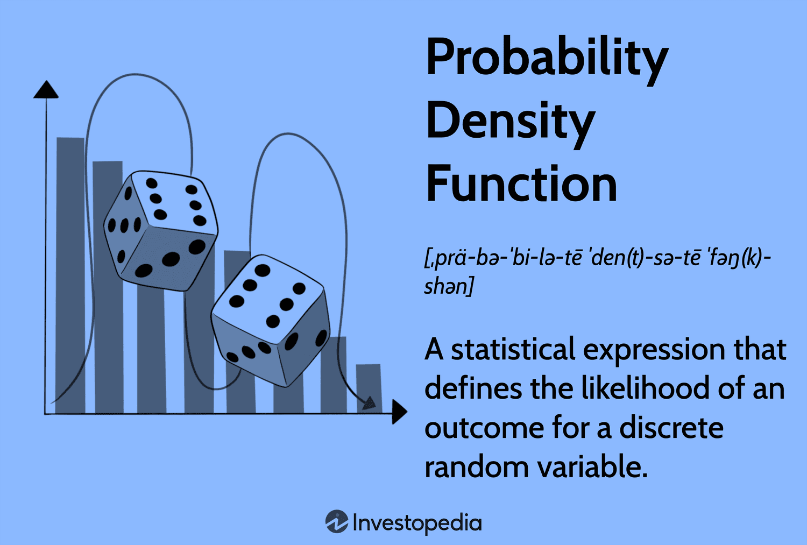

## Table of Contents

## What is a probability density function (PDF)?

A probability density function (PDF) is a way to show how likely it is for a random event to happen within a certain range. It's like a special graph that shows the probability of different outcomes. Instead of showing the chance of a specific number, it shows the chance of getting a number in a small range. For example, if you roll a die, the PDF would show the chances of rolling a number between 1 and 2, between 2 and 3, and so on.

The PDF is really useful because it helps us understand the spread of possible outcomes. The area under the curve of a PDF graph always adds up to 1, which means all possible outcomes are covered. This is important because it makes sure that the total probability is always 100%. By looking at the shape of the PDF, you can see where the outcomes are more likely to happen, which can help in making predictions and decisions.

## How does a PDF differ from a probability mass function (PMF)?

A probability density function (PDF) and a probability mass function (PMF) are both used to describe how likely different outcomes are, but they are used for different types of data. A PDF is used for continuous data, like height or temperature, where the outcomes can be any number within a range. It shows the likelihood of a value falling within a small interval, and the total area under the PDF curve always equals 1, representing all possible outcomes.

On the other hand, a PMF is used for discrete data, like the number of heads when flipping a coin or the number rolled on a die. It gives the exact probability of each specific outcome happening. For example, if you roll a die, the PMF would tell you the chance of rolling a 1, a 2, and so on, and the sum of all these probabilities also equals 1.

In simple terms, if you're dealing with data that can take any value within a range, you use a PDF. If you're dealing with data that can only take specific values, you use a PMF. Both functions help us understand the likelihood of different outcomes, but they are suited to different types of data.

## What are the key properties of a probability density function?

A probability density function (PDF) has some important rules that it must follow. First, it must always be positive or zero. This means that the height of the PDF curve at any point can't be negative. If it were, it would mean that there's a negative chance of something happening, which doesn't make sense. Second, the total area under the PDF curve must always be exactly 1. This rule makes sure that the PDF covers all possible outcomes and that the total probability adds up to 100%.

Another key property of a PDF is that it shows the likelihood of a value falling within a small interval, not the exact probability of a single value. For example, if you're looking at the heights of people, the PDF won't tell you the chance of someone being exactly 175 cm tall. Instead, it will show the chance of someone being between 174.5 cm and 175.5 cm tall. This is because with continuous data, the chance of any single exact value is actually zero, but the chance of being within a small range is what matters.

## How is a PDF used to calculate probabilities?

A PDF is used to calculate probabilities by looking at the area under the curve within a certain range. Imagine the PDF as a graph where the height of the curve shows how likely it is for a value to fall in a small interval. To find the probability of a value falling within a specific range, you need to find the area under the curve between the start and end of that range. This area represents the total probability of the value being in that range.

For example, if you want to know the chance of a person's height being between 160 cm and 170 cm, you would look at the area under the PDF curve from 160 cm to 170 cm. The bigger the area, the higher the probability. Since the total area under the entire curve is always 1, the area you find for any range will be a fraction of 1, which is the probability you're looking for. This way, the PDF helps you understand how likely different outcomes are within continuous data.

## What is the relationship between a PDF and the cumulative distribution function (CDF)?

A PDF and a CDF are closely related, and they both help us understand how likely different outcomes are. The PDF shows the likelihood of a value falling within a small range. It's like a graph that tells you how high the chances are for different parts of the data. On the other hand, the CDF is like a running total of these chances. It tells you the probability that a value is less than or equal to a certain number. If you imagine the PDF as showing the height of the curve at different points, the CDF is like adding up all those heights from the start up to a certain point.

To get the CDF from the PDF, you just need to find the area under the PDF curve from the start up to the point you're interested in. This area is the same as the value of the CDF at that point. For example, if you want to know the chance of a person's height being less than or equal to 170 cm, you look at the CDF at 170 cm. This value is the area under the PDF curve from the lowest possible height up to 170 cm. So, the CDF is really just a way to see the total probability up to any point, and it's built directly from the PDF.

## Can you explain the concept of expected value in the context of a PDF?

The expected value is like a special average that we can find using a PDF. It tells us what we can expect to happen on average if we keep doing the same thing over and over. For example, if you're looking at the heights of people, the expected value would be the average height you'd see if you measured a lot of people. To find the expected value with a PDF, you take all the possible values, multiply each one by how likely it is to happen (which is shown by the height of the PDF curve at that point), and then add all those numbers together. This gives you a single number that represents the "average" outcome.

Think of it like this: if you roll a die many times, the expected value would be the average number you'd get. Even though you can roll a 1, 2, 3, 4, 5, or 6, the expected value might be something like 3.5 because that's the average you'd see over many rolls. The PDF helps us calculate this by showing how likely each number is to come up. So, the expected value is a really useful way to summarize what we can expect from a set of data, and the PDF is the tool we use to figure it out.

## How do you determine if a function is a valid PDF?

To determine if a function is a valid PDF, you need to check two main things. First, the function must always be positive or zero everywhere. This means that if you draw the function on a graph, it can never dip below the x-axis. If it did, it would mean there's a negative chance of something happening, which doesn't make sense. So, a valid PDF can only have heights that are zero or above.

Second, the total area under the curve of the function must equal exactly 1. This is important because it means that the PDF covers all possible outcomes, and the total probability adds up to 100%. To check this, you calculate the area under the curve from the start to the end of the function. If this area is 1, then the function is a valid PDF. If it's not, then it's not a valid PDF, and you need to adjust it to make sure the area under the curve equals 1.

## What are some common examples of PDFs, such as the normal distribution?

One of the most common examples of a PDF is the normal distribution, also known as the Gaussian distribution or the bell curve. It's shaped like a bell, and it's used to describe a lot of things in nature and [statistics](/wiki/bayesian-statistics), like people's heights or test scores. The normal distribution is special because it's symmetric, which means the left and right sides of the curve are mirror images of each other. The middle of the curve, called the mean, is where the highest point is, and the curve gets lower as you move away from the mean. The spread of the curve is controlled by something called the standard deviation, which tells you how wide or narrow the bell is.

Another common PDF is the uniform distribution. This one is really simple because it looks like a rectangle. It means that every value within a certain range has the same chance of happening. For example, if you're rolling a fair die, the chance of rolling any number from 1 to 6 is the same. The height of the rectangle is chosen so that the total area under it is 1, which means the total probability is 100%. The uniform distribution is useful when you want to show that all outcomes in a range are equally likely.

A third example is the exponential distribution, which is often used to model the time between events in a process, like how long it takes for a phone call to come in at a call center. The PDF of an exponential distribution starts high and then drops off quickly, getting lower and lower as time goes on. This shape shows that short times between events are more likely than long times. The rate at which the curve drops off depends on a parameter called the rate parameter, which controls how fast the probability decreases.

## How can you derive the variance of a random variable using its PDF?

To find the variance of a random variable using its PDF, you first need to understand what variance is. Variance tells us how spread out the data is from the average, or expected value. To calculate it, you need to find the expected value of the random variable first. The expected value is like the average outcome you'd expect if you did the same thing many times. You find it by taking all the possible values, multiplying each one by how likely it is to happen (which is shown by the height of the PDF curve at that point), and then adding all those numbers together.

Once you have the expected value, you can find the variance. Variance is the average of the squared differences between each possible value and the expected value. To get it, you square the difference between each value and the expected value, multiply that by how likely the value is to happen (again, using the PDF), and then add all those numbers together. This gives you the average squared difference, which is the variance. So, the PDF helps you figure out both the expected value and the variance by showing how likely each value is to happen.

## What are the challenges in working with PDFs in higher dimensions?

Working with PDFs in higher dimensions can be tricky because things get a lot more complicated. When you move from one dimension to two or more, the PDF turns into a shape in a space that's harder to picture. It's not just a curve anymore; it's like a mountain range or a cloud. This makes it harder to understand and work with the data because you can't easily see where the highest points are or how the shape changes. Also, calculating things like the expected value or variance becomes a lot harder because you have to think about how all the different dimensions interact with each other.

Another challenge is that the math gets a lot more complex. In one dimension, you can often use simple formulas and graphs to figure things out. But in higher dimensions, you need to use more advanced math tools, like multivariable calculus, to find the area under the PDF or to do other calculations. This can make it harder to understand what the data is telling you and to make predictions or decisions based on it. Plus, working with higher-dimensional data often requires more powerful computers and software, which can be a challenge if you don't have access to them.

## How does the concept of kernel density estimation relate to PDFs?

Kernel density estimation (KDE) is a way to guess what a PDF might look like when you only have a bunch of data points. Imagine you have a bunch of dots on a graph, and you want to draw a smooth curve that shows how likely it is to find a dot at any spot. KDE helps you do that by putting little bumps, called kernels, on each dot and then adding all those bumps together to make a smooth curve. The shape of the curve depends on how wide you make the bumps and how you spread them out. This method is really useful when you don't know the exact shape of the PDF but want to see what it might be based on the data you have.

The key thing about KDE is that it lets you turn a bunch of separate data points into a smooth PDF. It's like turning a bunch of Lego bricks into a smooth sculpture. By choosing the right kind of bump and how wide to make it, you can make the curve look more or less smooth. This can help you see patterns in the data that might be hard to spot just by looking at the dots. KDE is a powerful tool because it helps you understand the underlying shape of the data, even when you don't know the exact formula for the PDF.

## Can you discuss advanced applications of PDFs in fields like finance or physics?

In finance, PDFs are super helpful for figuring out how likely different outcomes are for things like stock prices or interest rates. Imagine you're trying to guess what the price of a stock might be in the future. You can use a PDF to see all the possible prices and how likely each one is. This is really important for things like pricing options, where you need to know the chances of a stock going up or down. By using PDFs, people in finance can make better guesses about what might happen and make smarter decisions about buying or selling things. It's like having a map that shows you where you might end up, so you can plan your journey better.

In physics, PDFs are used to understand how particles behave in different situations. For example, if you're studying how fast particles are moving in a gas, you can use a PDF to see how likely it is for a particle to have a certain speed. This helps scientists predict things like how gases will flow or how energy will be spread out. In quantum physics, PDFs are even more important because they help describe where a particle might be found. It's like knowing the chances of finding a tiny ball in different spots in a room. By using PDFs, physicists can make better models of the world and understand how things work at a very small level.

## What is the Understanding of the Probability Density Function?

A Probability Density Function (PDF) is a statistical tool used to describe the likelihood of a continuous random variable assuming a particular value or range of values. Unlike discrete probability functions, which simply assign probabilities to individual outcomes, a PDF assigns a probability density over an interval, signifying the probability of the random variable falling within that specific interval.

Mathematically, for a continuous random variable $X$, a PDF is denoted as $f(x)$, where the probability that $X$ falls within the interval $[a, b]$ is given by the integral:

$$

P(a \leq X \leq b) = \int_{a}^{b} f(x) \, dx 
$$

One crucial property of the PDF is non-negativity, implying that for any possible value $x$, the PDF $f(x)$ is always greater than or equal to zero. This characteristic is essential as negative probabilities do not exist in practical settings. 

Another key property is normalization: the integral of the PDF over its entire range must equal one to satisfy the total probability axiom, confirming that the sum of all potential outcomes is a certainty. Mathematically, this is represented as:

$$

\int_{-\infty}^{\infty} f(x) \, dx = 1 
$$

To detect insights into a dataset's distribution, one often looks at visual representations of PDFs. These illustrations usually depict the distribution's shape, showcasing characteristics like symmetry, skewness, and kurtosis. These features can be leveraged to infer critical financial metrics.

For instance, the measure of [volatility](/wiki/volatility-trading-strategies) in financial markets is often associated with the spread or width of the PDF. A wider spread indicates higher volatility, while a narrower spread implies lower volatility. Average returns can also be deduced from the central tendency of the distribution, which is typically characterized by the mean or the mode of the PDF.

In practical [algorithmic trading](/wiki/algorithmic-trading), understanding the shape and properties of PDFs allows traders and quantitative analysts to model asset returns more accurately. Whether it's predicting price movements or evaluating risk, the mathematical foundation offered by PDFs aids in constructing sophisticated models that mimic real market behavior. This precision is vital for effective decision-making and strategy optimization in the complex environment of financial trading.

## What are the key probability distributions in algorithmic trading?

Several common probability density functions (PDFs) are integral to algorithmic trading, offering frameworks for modeling financial data and shaping trading strategies. Among the most utilized distributions are the Normal (Gaussian) distribution, Log-normal distribution, Exponential distribution, and Cauchy distribution.

### Normal Distribution
The Normal distribution, represented by a bell curve, is pivotal due to the central limit theorem. This theorem posits that, given a sufficiently large sample size, the sum of independent random variables will tend to follow a normal distribution, regardless of the original distribution of the data. In mathematical terms, the normal distribution is defined by its probability density function:

$$

f(x|\mu, \sigma^2) = \frac{1}{\sqrt{2\pi\sigma^2}} e^{-\frac{(x-\mu)^2}{2\sigma^2}} 
$$

Here, $\mu$ is the mean, and $\sigma^2$ is the variance. In trading, the normal distribution is employed to model asset returns due to its simplicity and the analytical convenience it provides in risk management and derivative pricing.

### Log-normal Distribution
The Log-normal distribution is commonly used to model stock prices. It is based on the assumption that while stock prices themselves are not normally distributed, their logarithms are. This reflects the multiplicative nature of returns over time. The probability density function for a log-normal distribution is:

$$

f(x|\mu, \sigma^2) = \frac{1}{x \cdot \sqrt{2\pi\sigma^2}} e^{-\frac{\left(\ln(x)-\mu\right)^2}{2\sigma^2}}
$$

This distribution is particularly suitable for modeling stock prices, ensuring that they remain positive and allowing for proportional scalability over time.

### Exponential Distribution
The Exponential distribution is useful in modeling the time between independent events in a process that occurs at a constant average rate. This distribution is applicable in algorithmic trading for modeling the time intervals between trades. Its probability density function is given by:

$$

f(x|\lambda) = \lambda e^{-\lambda x} \quad \text{for} \, x \geq 0 
$$

where $\lambda$ is the rate parameter. It helps traders understand the expected waiting time for the next trade execution.

### Cauchy Distribution
The Cauchy distribution is notable for its heavy tails, making it suitable for capturing large market movements that defy the predictive capacity of more common distributions like the normal distribution. Its PDF is described by:

$$

f(x|x_0, \gamma) = \frac{1}{\pi \gamma \left[1 + \left(\frac{x-x_0}{\gamma}\right)^2\right]}
$$

where $x_0$ is the location parameter, and $\gamma$ is the scale parameter. The Cauchy distribution's model of large swings and market volatility makes it a valuable tool in high-frequency trading scenarios where rapid price changes are prevalent.

Understanding and properly utilizing these distributions allow quantitative analysts and algorithmic traders to better model market behaviors, assess risks, and develop robust trading strategies. Through precise application, these statistical models serve to improve predictions and enhance trading performance.

## What are the applications of PDFs in algorithmic trading?

Probability Density Functions (PDFs) are integral to various facets of algorithmic trading, crucially impacting risk management, derivative pricing, and statistical [arbitrage](/wiki/arbitrage) strategies. These applications demonstrate the depth at which understanding and harnessing PDFs can optimize and refine trading operations.

In risk management, a firm grasp of the distribution of asset returns is essential for effective portfolio hedging and preparation for market volatility. PDFs offer insights into the probability of extreme market events and asset price movements, allowing traders to devise strategies that mitigate risk while maintaining profitability. For instance, calculating the value-at-risk (VaR) — a measure that assesses the potential loss in value of a portfolio — relies on understanding the distribution of returns, which can be derived from the asset's PDF.

For option pricing, the Black-Scholes model, a cornerstone of financial mathematics, relies on the PDF of the normal distribution to estimate the value of European options. The model assumes that the log-returns of an asset follow a normal distribution, and it uses this assumption to derive the probability distribution of future prices. The value of an option is then calculated using the cumulative distribution function (CDF) of the normal distribution, represented by:

$$
C(S, t) = S \cdot N(d_1) - X \cdot e^{-r(T-t)} \cdot N(d_2)
$$

where $N()$ is the CDF of the standard normal distribution, $S$ is the current stock price, $X$ is the strike price, $T$ is the time to maturity, $r$ is the risk-free interest rate, and $d_1$ and $d_2$ are derived from the inputs.

In [statistical arbitrage](/wiki/statistical-arbitrage) strategies, which aim to profit from price discrepancies in different markets or securities, PDFs are employed to identify and exploit market inefficiencies. These strategies depend on the statistical properties of financial time series data and use PDFs to model and predict price movements. By analyzing the historical distribution of price changes, traders can identify conditions when securities deviate from their expected value and execute trades to capitalize on the correction back to the mean or expected distribution.

In sum, Probability Density Functions are not merely abstract statistical tools but are foundational to the practice of algorithmic trading, providing quantitative insights and enabling smarter, data-driven decisions across trading strategies.

## References & Further Reading

[1]: Bergstra, J., Bardenet, R., Bengio, Y., & Kégl, B. (2011). ["Algorithms for Hyper-Parameter Optimization."](https://papers.nips.cc/paper/4443-algorithms-for-hyper-parameter-optimization) Advances in Neural Information Processing Systems 24.

[2]: ["Advances in Financial Machine Learning"](https://www.amazon.com/Advances-Financial-Machine-Learning-Marcos/dp/1119482089) by Marcos Lopez de Prado

[3]: ["Evidence-Based Technical Analysis: Applying the Scientific Method and Statistical Inference to Trading Signals"](https://www.amazon.com/Evidence-Based-Technical-Analysis-Scientific-Statistical/dp/0470008741) by David Aronson

[4]: ["Machine Learning for Algorithmic Trading"](https://github.com/PacktPublishing/Machine-Learning-for-Algorithmic-Trading-Second-Edition) by Stefan Jansen

[5]: ["Quantitative Trading: How to Build Your Own Algorithmic Trading Business"](https://books.google.com/books/about/Quantitative_Trading.html?id=j70yEAAAQBAJ) by Ernest P. Chan