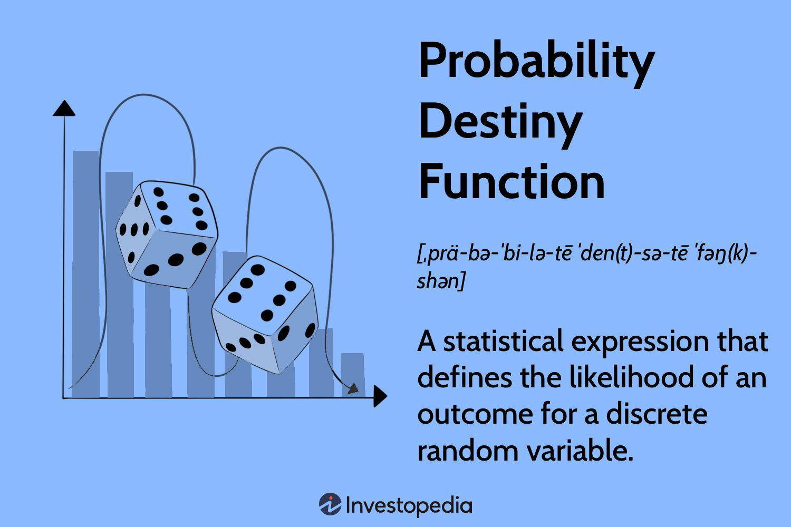

The world of algorithmic trading has transformed the financial industry by harnessing sophisticated algorithms and unparalleled computational power to execute orders at velocities beyond the reach of human traders. At the heart of many quantitative trading strategies lies the Probability Density Function (PDF), a fundamental concept in probability theory that is indispensable for modeling and forecasting outcomes based on historical data.

In algorithmic trading, the ability to anticipate future market behavior is crucial. PDFs offer a way to mathematically describe the likelihood of a continuous random variable taking on a particular value. This allows traders to quantify uncertainties and structure their strategies accordingly. By employing PDFs, traders can construct statistical models that not only enhance understanding of market dynamics but also enable more precise risk assessments, pricing of financial derivatives, and implementation of trading strategies built on statistical principles.



This article will explore the significance of PDFs, discussing their mathematical underpinnings and practical uses in the world of trading. A robust grasp of PDFs equips traders with the tools to refine risk management techniques, improve derivative pricing algorithms, and craft strategies that adapt to ever-changing market conditions. As such, mastering PDFs can significantly enhance the efficacy of algorithmic trading approaches, fostering a more nuanced comprehension of market movements and enabling the capture of trading opportunities with increased precision.

## Table of Contents

## Understanding the Probability Density Function

A Probability Density Function (PDF) is a statistical tool used to describe the likelihood of a continuous random variable assuming a particular value or range of values. Unlike discrete probability functions, which simply assign probabilities to individual outcomes, a PDF assigns a probability density over an interval, signifying the probability of the random variable falling within that specific interval.

Mathematically, for a continuous random variable $X$, a PDF is denoted as $f(x)$, where the probability that $X$ falls within the interval $[a, b]$ is given by the integral:

$$

P(a \leq X \leq b) = \int_{a}^{b} f(x) \, dx 
$$

One crucial property of the PDF is non-negativity, implying that for any possible value $x$, the PDF $f(x)$ is always greater than or equal to zero. This characteristic is essential as negative probabilities do not exist in practical settings. 

Another key property is normalization: the integral of the PDF over its entire range must equal one to satisfy the total probability axiom, confirming that the sum of all potential outcomes is a certainty. Mathematically, this is represented as:

$$

\int_{-\infty}^{\infty} f(x) \, dx = 1 
$$

To detect insights into a dataset's distribution, one often looks at visual representations of PDFs. These illustrations usually depict the distribution's shape, showcasing characteristics like symmetry, skewness, and kurtosis. These features can be leveraged to infer critical financial metrics.

For instance, the measure of [volatility](/wiki/volatility-trading-strategies) in financial markets is often associated with the spread or width of the PDF. A wider spread indicates higher volatility, while a narrower spread implies lower volatility. Average returns can also be deduced from the central tendency of the distribution, which is typically characterized by the mean or the mode of the PDF.

In practical [algorithmic trading](/wiki/algorithmic-trading), understanding the shape and properties of PDFs allows traders and quantitative analysts to model asset returns more accurately. Whether it's predicting price movements or evaluating risk, the mathematical foundation offered by PDFs aids in constructing sophisticated models that mimic real market behavior. This precision is vital for effective decision-making and strategy optimization in the complex environment of financial trading.

## Key Probability Distributions in Algorithmic Trading

Several common probability density functions (PDFs) are integral to algorithmic trading, offering frameworks for modeling financial data and shaping trading strategies. Among the most utilized distributions are the Normal (Gaussian) distribution, Log-normal distribution, Exponential distribution, and Cauchy distribution.

### Normal Distribution
The Normal distribution, represented by a bell curve, is pivotal due to the central limit theorem. This theorem posits that, given a sufficiently large sample size, the sum of independent random variables will tend to follow a normal distribution, regardless of the original distribution of the data. In mathematical terms, the normal distribution is defined by its probability density function:

$$

f(x|\mu, \sigma^2) = \frac{1}{\sqrt{2\pi\sigma^2}} e^{-\frac{(x-\mu)^2}{2\sigma^2}} 
$$

Here, $\mu$ is the mean, and $\sigma^2$ is the variance. In trading, the normal distribution is employed to model asset returns due to its simplicity and the analytical convenience it provides in risk management and derivative pricing.

### Log-normal Distribution
The Log-normal distribution is commonly used to model stock prices. It is based on the assumption that while stock prices themselves are not normally distributed, their logarithms are. This reflects the multiplicative nature of returns over time. The probability density function for a log-normal distribution is:

$$

f(x|\mu, \sigma^2) = \frac{1}{x \cdot \sqrt{2\pi\sigma^2}} e^{-\frac{\left(\ln(x)-\mu\right)^2}{2\sigma^2}}
$$

This distribution is particularly suitable for modeling stock prices, ensuring that they remain positive and allowing for proportional scalability over time.

### Exponential Distribution
The Exponential distribution is useful in modeling the time between independent events in a process that occurs at a constant average rate. This distribution is applicable in algorithmic trading for modeling the time intervals between trades. Its probability density function is given by:

$$

f(x|\lambda) = \lambda e^{-\lambda x} \quad \text{for} \, x \geq 0 
$$

where $\lambda$ is the rate parameter. It helps traders understand the expected waiting time for the next trade execution.

### Cauchy Distribution
The Cauchy distribution is notable for its heavy tails, making it suitable for capturing large market movements that defy the predictive capacity of more common distributions like the normal distribution. Its PDF is described by:

$$

f(x|x_0, \gamma) = \frac{1}{\pi \gamma \left[1 + \left(\frac{x-x_0}{\gamma}\right)^2\right]}
$$

where $x_0$ is the location parameter, and $\gamma$ is the scale parameter. The Cauchy distribution's model of large swings and market volatility makes it a valuable tool in high-frequency trading scenarios where rapid price changes are prevalent.

Understanding and properly utilizing these distributions allow quantitative analysts and algorithmic traders to better model market behaviors, assess risks, and develop robust trading strategies. Through precise application, these statistical models serve to improve predictions and enhance trading performance.

## Applications of PDFs in Algo Trading

Probability Density Functions (PDFs) are integral to various facets of algorithmic trading, crucially impacting risk management, derivative pricing, and statistical [arbitrage](/wiki/arbitrage) strategies. These applications demonstrate the depth at which understanding and harnessing PDFs can optimize and refine trading operations.

In risk management, a firm grasp of the distribution of asset returns is essential for effective portfolio hedging and preparation for market volatility. PDFs offer insights into the probability of extreme market events and asset price movements, allowing traders to devise strategies that mitigate risk while maintaining profitability. For instance, calculating the value-at-risk (VaR) — a measure that assesses the potential loss in value of a portfolio — relies on understanding the distribution of returns, which can be derived from the asset's PDF.

For option pricing, the Black-Scholes model, a cornerstone of financial mathematics, relies on the PDF of the normal distribution to estimate the value of European options. The model assumes that the log-returns of an asset follow a normal distribution, and it uses this assumption to derive the probability distribution of future prices. The value of an option is then calculated using the cumulative distribution function (CDF) of the normal distribution, represented by:

$$
C(S, t) = S \cdot N(d_1) - X \cdot e^{-r(T-t)} \cdot N(d_2)
$$

where $N()$ is the CDF of the standard normal distribution, $S$ is the current stock price, $X$ is the strike price, $T$ is the time to maturity, $r$ is the risk-free interest rate, and $d_1$ and $d_2$ are derived from the inputs.

In [statistical arbitrage](/wiki/statistical-arbitrage) strategies, which aim to profit from price discrepancies in different markets or securities, PDFs are employed to identify and exploit market inefficiencies. These strategies depend on the statistical properties of financial time series data and use PDFs to model and predict price movements. By analyzing the historical distribution of price changes, traders can identify conditions when securities deviate from their expected value and execute trades to capitalize on the correction back to the mean or expected distribution.

In sum, Probability Density Functions are not merely abstract statistical tools but are foundational to the practice of algorithmic trading, providing quantitative insights and enabling smarter, data-driven decisions across trading strategies.

## PDFs in Backtesting and Strategy Development

In algorithmic trading, [backtesting](/wiki/backtesting) is a critical process that allows traders to evaluate the viability of a trading strategy before deploying it in live markets. One of the essential components of effective backtesting is the assumption of specific probability distributions for the underlying data. By leveraging Probability Density Functions (PDFs), traders can simulate and predict potential market scenarios with greater accuracy.

Utilizing PDFs begins with selecting an appropriate distribution model that matches the historical performance of the asset or portfolio under consideration. For instance, a common approach is to assume a Gaussian distribution for asset returns, justified by the central limit theorem, which implies that the distribution of returns approaches normality given a sufficient number of trades. This assumption allows for the application of statistical measures, such as mean and standard deviation, to estimate the volatility and expected return of a strategy.

By implementing these statistical models, traders can refine their strategies. Consider a Python script that uses a normal distribution to simulate asset returns:

```python
import numpy as np
import matplotlib.pyplot as plt

# Simulate 10,000 returns from a normal distribution
mean_return = 0.01
volatility = 0.02
returns = np.random.normal(loc=mean_return, scale=volatility, size=10000)

# Plot the probability density function of the returns
plt.hist(returns, bins=100, density=True, alpha=0.6, color='g')
plt.title('Simulated Returns PDF')
plt.xlabel('Return')
plt.ylabel('Density')
plt.show()
```

In this context, the PDF provides insight into the likelihood of various return outcomes, forming the basis for predictive modeling. This modeling not only helps in understanding the risk-reward profiles but also facilitates adaptive strategy development. For example, if backtesting reveals that extreme returns occur more frequently than a normal distribution would suggest, traders might explore alternative distributions, such as the Cauchy distribution, which has heavier tails.

Accurate predictive modeling enables traders to adjust strategies to mitigate risks. For instance, incorporating Value at Risk (VaR) calculations, which depend on the correctly specified PDF, can guide traders on the maximum potential losses over a given timeframe. The precise tuning of these models can optimize returns by ensuring that strategy parameters are aligned with expected market conditions.

Overall, by employing PDFs in the backtesting phase, traders gain a profound understanding of potential market dynamics. This knowledge allows for the calibration of strategies that cater to specific risk tolerances and return objectives, ultimately leading to more robust and resilient trading practices in live market environments.

## Conclusion

The Probability Density Function (PDF) extends beyond being a statistical concept; it forms the bedrock of modern algorithmic trading strategies. PDFs empower traders with the ability to quantify and model the underlying distribution of financial data, enabling more informed decision-making processes. By mastering the nuances of PDFs, traders gain a profound understanding of market behaviors, allowing for precise risk management and the identification of lucrative trading opportunities. This comprehension translates into the development of sophisticated trading algorithms capable of executing at velocities and accuracies unattainable by human intuition alone.

As technology and data analytics advance, the increasing availability and granularity of market data provide fertile ground for the expanded use of PDFs. Such progress paves the way for more refined models, offering enhanced predictive accuracy and risk assessment. The ongoing evolution in computational capabilities and data processing techniques will continue to elevate the role of PDFs in algorithmic trading. Consequently, this evolution fuels innovations that streamline trading workflows and enhance market efficiencies, reinforcing the indispensable nature of PDFs in navigating the complexities of the financial markets today and in the future.

## References & Further Reading

[1]: Bergstra, J., Bardenet, R., Bengio, Y., & Kégl, B. (2011). ["Algorithms for Hyper-Parameter Optimization."](https://papers.nips.cc/paper/4443-algorithms-for-hyper-parameter-optimization) Advances in Neural Information Processing Systems 24.

[2]: ["Advances in Financial Machine Learning"](https://www.amazon.com/Advances-Financial-Machine-Learning-Marcos/dp/1119482089) by Marcos Lopez de Prado

[3]: ["Evidence-Based Technical Analysis: Applying the Scientific Method and Statistical Inference to Trading Signals"](https://www.amazon.com/Evidence-Based-Technical-Analysis-Scientific-Statistical/dp/0470008741) by David Aronson

[4]: ["Machine Learning for Algorithmic Trading"](https://github.com/PacktPublishing/Machine-Learning-for-Algorithmic-Trading-Second-Edition) by Stefan Jansen

[5]: ["Quantitative Trading: How to Build Your Own Algorithmic Trading Business"](https://books.google.com/books/about/Quantitative_Trading.html?id=j70yEAAAQBAJ) by Ernest P. Chan