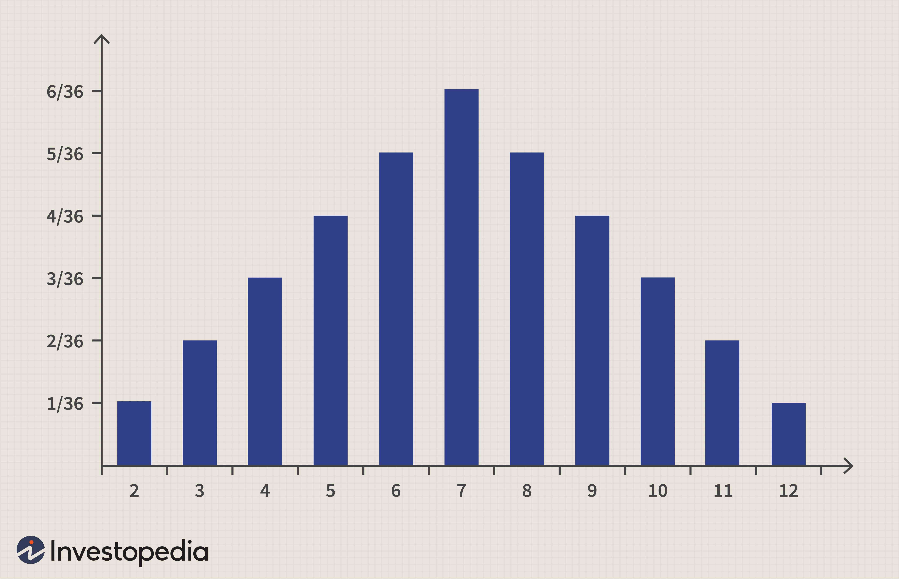

Understanding the types of distributions and probability distributions is fundamental in finance and investing. These statistical tools play a critical role in predicting market behavior, assessing risks, and formulating effective trading strategies. In particular, algorithmic trading, often referred to as algo trading, utilizes these distributions to automate and refine trading processes, enhancing both efficiency and efficacy.

Probability distributions serve as mathematical representations of the likelihood of different outcomes. In finance, they are leveraged to analyze historical data and forecast future trends. By examining the variance, skewness, and kurtosis of distributions, investors can gain insights into the volatility and potential risks associated with various financial instruments.



Algorithmic trading systems harness these distributions to make informed decisions at speeds unattainable by human traders. The automation enabled by algorithmic trading not only reduces the potential for human error but also brings about consistent application of trading strategies based on data-driven insights. This approach is especially beneficial in high-frequency trading, where rapid decision-making is essential to capitalize on fleeting market opportunities.

This article explores the application of various probability distributions in investing and their implementation in algorithmic trading strategies. By understanding these distributions, traders are better equipped to manage risks and enhance returns, ultimately improving their performance in the dynamic landscape of financial markets.

## Table of Contents

## Understanding Probability Distributions

A probability distribution is a statistical function that provides the probabilities of occurrence of different possible outcomes for a random variable. This concept is pivotal in [statistics](/wiki/bayesian-statistics) and finance as it facilitates quantifying and modeling uncertainty.

Key parameters defining these distributions are:

- **Mean (μ):** The average or expected value of a random variable. It provides a measure of the central tendency.

- **Standard Deviation (σ):** A measure of the amount of variation or dispersion in a set of values. A low standard deviation indicates that the values tend to be close to the mean, while a high standard deviation indicates a wide range of values.

- **Skewness:** Describes the asymmetry of a distribution. A positive skew means the tail on the right side is longer or fatter than the left, and a negative skew means the opposite.

- **Kurtosis:** Describes the "tailedness" of the probability distribution. High kurtosis in a data set is indicative of heavy tails or outliers.

Probability distributions can be broadly classified into two main types:

1. **Discrete Probability Distributions:** Applicable when the random variable can take on a countable number of values. Examples include:
   - **Binomial Distribution:** Models the number of successes in a fixed number of independent Bernoulli trials (e.g., a series of coin flips).
   - **Poisson Distribution:** Used for counting the number of events that occur in a fixed interval of time or space, where these events happen with a known constant rate and independently of the time since the last event.

2. **Continuous Probability Distributions:** Applicable when the random variable can take on an infinite number of values within a given range. Examples include:
   - **Normal Distribution:** Characterized by its bell curve shape, it is defined by two parameters, the mean and standard deviation. It is used extensively in finance to model asset returns.

These probability distributions are extensively used in finance to model real-world random processes and assess statistical properties. For instance, the normal distribution is often utilized to model the expected return on a stock over time due to its properties, assuming asset returns tend to aggregate to normality as per the Central Limit Theorem. Understanding and applying these distributions enable more informed decisions, especially in financial modeling, risk management, and [algorithmic trading](/wiki/algorithmic-trading) systems, where the stochastic nature of markets needs to be quantified and utilized.

For practical implementation, consider the Python code snippet for generating normal distribution values using NumPy:

```python
import numpy as np

# Parameters for the normal distribution
mean = 0  # Mean of the distribution
std_dev = 1  # Standard deviation of the distribution

# Generate a sample of 1000 random values from a normal distribution
samples = np.random.normal(mean, std_dev, 1000)

# Calculate descriptive statistics
calculated_mean = np.mean(samples)
calculated_std_dev = np.std(samples)

print(f"Calculated Mean: {calculated_mean}")
print(f"Calculated Standard Deviation: {calculated_std_dev}")
```

This code generates a normal distribution sample and calculates its mean and standard deviation, providing an example of how probability distributions can be implemented in computational models.

## Types of Probability Distributions in Investing

### Types of Probability Distributions in Investing

In finance and investing, probability distributions serve as essential tools for modeling and analyzing various market phenomena. These distributions offer insight into the expected behavior of asset prices and returns, assisting investors and traders in making informed decisions and managing risks effectively.

#### Normal Distribution

The normal distribution, or Gaussian distribution, is extensively used in finance to model the expected return of a stock over a period. It is characterized by its symmetric bell curve, with the mean (μ) denoting the center and standard deviation (σ) indicating the [dispersion](/wiki/dispersion-trading) around the mean. The probability density function (PDF) of a normal distribution is defined as: 

$$

f(x|\mu,\sigma^2) = \frac{1}{\sqrt{2\pi\sigma^2}} e^{-\frac{(x-\mu)^2}{2\sigma^2}} 
$$

In investing, the normal distribution is particularly valued for its properties, such as the empirical rule, which states that approximately 68% of values lie within one standard deviation of the mean, and about 95% fall within two standard deviations. This makes the normal distribution a staple in risk management and portfolio optimization.

#### Log-Normal Distribution

While the normal distribution is useful for modeling returns, stock prices themselves are often modeled using the log-normal distribution. This is because stock prices cannot become negative, and they exhibit a right-skewed behavior consistent with a log-normal distribution. The log-normal distribution arises when the natural logarithm of a variable follows a normal distribution. Its probability density function is expressed as:

$$

f(x|\mu,\sigma^2) = \frac{1}{x\sigma\sqrt{2\pi}} e^{-\frac{(\ln x - \mu)^2}{2\sigma^2}}, \quad x > 0 
$$

This distribution is widely applied in option pricing models, such as the Black-Scholes model, where the underlying asset prices are assumed to follow a log-normal distribution.

#### Binomial Distribution

The binomial distribution plays a critical role in evaluating the probability of success across a series of independent trials. In finance, it is frequently used in option pricing and risk assessment, particularly in constructing binomial tree models for derivative pricing. The binomial distribution is defined by two parameters: the number of trials $n$ and the probability of success $p$. The probability of obtaining exactly $k$ successes is given by the formula:

$$

P(X = k) = \binom{n}{k} p^k (1-p)^{n-k} 
$$

This distribution is particularly useful in discrete-time models where the underlying asset's price changes can be depicted as a series of up and down moves.

#### Poisson Distribution

The Poisson distribution is used to model the number of events occurring within a fixed interval of time or space in various trading scenarios. Unlike the binomial distribution, which considers only binary outcomes, the Poisson distribution is suited for scenarios where the number of occurrences is the focus. Its probability mass function (PMF) is:

$$

P(X = k) = \frac{\lambda^k e^{-\lambda}}{k!} 
$$

where $\lambda$ is the average number of events in the interval. In finance, the Poisson distribution can be applied to model the frequency of rare events, such as defaults in a credit portfolio or jumps in asset prices.

These probability distributions form the analytical backbone for many quantitative finance strategies. By understanding and applying these distributions, investors and traders can enhance their ability to predict market movements, evaluate risk, and make data-driven investment decisions.

## Probability Distributions and Risk Management

Investors employ probability distributions to predict potential returns and effectively manage risk within their portfolios. Probability distributions offer a statistical representation of potential outcomes, and understanding these distributions aids in formulating strategies that mitigate risk. One of the primary metrics derived from probability distributions is Value at Risk (VaR). VaR provides an estimate of the potential loss in the value of a portfolio over a specific time period, given normal market conditions, at a particular confidence level. For instance, a daily VaR of 5% at a 95% confidence level indicates that there is a 5% probability that the portfolio will lose more than that amount in a single day.

Mathematically, VaR can be represented as:

$$
\text{VaR}_{\alpha} = -\inf \{ x \mid F(x) > 1 - \alpha \}
$$

where $F(x)$ is the cumulative distribution function of portfolio returns and $\alpha$ is the confidence level.

Stress testing is another application where probability distributions play a crucial role. Stress testing involves using extreme but plausible market conditions to determine the impact on a portfolio, thereby assessing the resilience of investments during turbulent times. This process is vital for understanding how portfolios might react to unforeseen market shocks.

Backtesting trading strategies is a key component of risk management, where historical data is used to simulate how a strategy would have performed in the past. Probability distributions are employed to evaluate these historical returns and optimize strategy parameters. By understanding past performance, investors can adjust their strategies to account for estimated risks associated with different market conditions. This involves constructing a historical simulation of potential outcomes, often requiring a detailed analysis of return distributions over time.

In Python, [backtesting](/wiki/backtesting) can leverage historical data and simulate performance using libraries like `numpy` and `pandas`. Here is a simple example demonstrating how to use Python for backtesting a basic moving average strategy:

```python
import pandas as pd
import numpy as np

# Assume df is a pandas DataFrame with a column 'Close' for stock prices
df['SMA_20'] = df['Close'].rolling(window=20).mean()
df['Position'] = np.where(df['Close'] > df['SMA_20'], 1, -1)  # Buy when price is above SMA
df['Returns'] = df['Close'].pct_change()
df['Strategy_Returns'] = df['Position'].shift(1) * df['Returns']

# Calculate cumulative returns
cumulative_strategy_returns = (1 + df['Strategy_Returns']).cumprod()
```

This script calculates a simple moving average (SMA) for a given stock price dataset and determines potential buy/sell signals based on whether the closing price is above or below the moving average. The strategy's returns are then derived to evaluate performance.

Probability distributions inherently provide a structured approach to gauge risk and guide investment decisions. Through metrics like VaR and approaches like stress and backtesting, investors can enhance their ability to manage potential risks and strategize effectively. As financial markets evolve, the utilization of probability distributions continues to be an integral part of sophisticated risk management practices.

## Applications of Probability Distributions in Algorithmic Trading

Probability distributions are integral to algorithmic trading as they enable traders to model and predict market behavior, thereby automating strategies and reducing the chance of human error. These statistical tools offer a robust framework for understanding uncertainties and variations in trading environments, contributing to more precise strategy development and execution.

**Monte Carlo Simulations**

Monte Carlo simulations heavily rely on probability distributions to provide estimates about uncertain future outcomes. By simulating numerous possible paths of asset prices or market conditions, traders can use Monte Carlo methods to forecast and optimize potential trading results. A typical implementation involves generating a large number of random samples from a probability distribution to model the evolution of an asset's price over time. This technique helps traders in assessing the robustness of their trading strategies under various scenarios, quantifying parameters such as Value at Risk (VaR) and Expected Shortfall.

Here is a basic Python code snippet that illustrates a Monte Carlo simulation with a normal distribution to estimate possible future prices of an asset:

```python
import numpy as np
import matplotlib.pyplot as plt

# Parameters for the simulation
S0 = 100  # Initial stock price
mu = 0.05  # Expected annual return
sigma = 0.2  # Annual volatility
T = 1.0  # Time in years
dt = 1/252  # Time step in years
N = int(T / dt)  # Number of time steps
num_simulations = 1000  # Number of simulations

# Simulate the price paths
price_paths = np.zeros((N, num_simulations))
price_paths[0] = S0

for t in range(1, N):
    z = np.random.standard_normal(num_simulations)
    price_paths[t] = price_paths[t - 1] * np.exp((mu - 0.5 * sigma**2) * dt + sigma * np.sqrt(dt) * z)

# Plotting the simulation
plt.figure(figsize=[10, 6])
plt.plot(price_paths)
plt.title('Monte Carlo Simulations of Stock Prices')
plt.xlabel('Time Steps')
plt.ylabel('Price')
plt.show()
```

**Machine Learning in Trading Algorithms**

Probability distributions also underpin [machine learning](/wiki/machine-learning) models employed in trading algorithms. These models utilize distributional data to identify patterns, predict trends, and formulate trading strategies. Machine learning algorithms, such as regression models, decision trees, and neural networks, often assume specific underlying distributions of the input data or residuals, which aids in optimizing model performance and predictive accuracy.

For instance, in a regression context, normally distributed error terms are assumed to ensure reliable parameter estimation and hypothesis testing. More sophisticated models, like Bayesian neural networks, explicitly incorporate distributions to quantify uncertainty in parameter estimates and predictions, making these models particularly valuable in volatile trading environments where uncertainty is a critical [factor](/wiki/factor-investing).

In summary, the application of probability distributions in algorithmic trading serves as a foundation for enhancing predictive models, automating trading operations, and minimizing human bias. Through methodologies such as Monte Carlo simulations and machine learning, traders can harness these distributions to develop efficient, data-driven strategies that improve operational accuracy and outcomes.

## Probability Distributions: Enhancing Trading Strategies

Understanding the role of different probability distributions is crucial for traders aiming to strengthen their trading strategies. These statistical tools are integral in assessing both potential returns and associated risks, which are essential for guiding algorithmic decision-making processes.

Probability distributions like normal and log-normal are instrumental in quantifying expected returns and risks. The normal distribution is often used to model the expected return since price changes in financial markets frequently follow a bell curve distribution. This allows traders to estimate with a certain level of confidence the range within which future asset prices are likely to fall. In contrast, a log-normal distribution is particularly useful for modeling stock prices as they cannot be negative and often show a tendency to skew positively.

By simulating various market scenarios using these distributions, traders can refine their strategies to optimize performance under different conditions. Monte Carlo simulations are a powerful tool in this regard. They leverage randomness, conducting numerous simulations to generate a range of possible outcomes, and thus enabling traders to evaluate the robustness of their strategies. For example, a Monte Carlo simulation might iterate thousands of potential paths for asset prices to help estimate the probability of achieving a particular return or encountering a specific level of risk. Here's a simplified Python code snippet illustrating this approach:

```python
import numpy as np

# Parameters for simulation
num_simulations = 1000
num_days = 252
initial_price = 100
mu = 0.05  # expected annual return
sigma = 0.2  # annual volatility

# Simulate multiple paths
simulations = np.zeros((num_simulations, num_days))
for i in range(num_simulations):
    daily_returns = np.random.normal(loc=mu/num_days, scale=sigma/np.sqrt(num_days), size=num_days)
    price_path = initial_price * np.exp(np.cumsum(daily_returns))
    simulations[i, :] = price_path

# Analyzing the results
expected_price = simulations.mean(axis=0)
print(f"Expected price after {num_days} days: {expected_price[-1]:.2f}")

# Visualizing the simulation
import matplotlib.pyplot as plt

plt.figure(figsize=(12, 6))
plt.plot(simulations.T, 'grey', alpha=0.1)
plt.plot(expected_price, 'r', label='Expected Price')
plt.title('Monte Carlo Simulation of Stock Prices')
plt.xlabel('Days')
plt.ylabel('Price')
plt.legend()
plt.show()
```

Moreover, machine learning models in trading algorithms often utilize probability distributions to enhance decision-making and strategy formulation. These models analyze extensive historical data to identify patterns and correlations, enabling the prediction of future market behavior. By leveraging these insights, traders can implement strategies that are better aligned with the statistical characteristics of market data, thus optimizing trade execution and performance.

In sum, the effective use of probability distributions facilitates the creation of more refined and resilient trading strategies. It helps traders simulate diverse market conditions, manage risk effectively, and achieve a strategic advantage in the competitive landscape of financial markets.

## Conclusion

Probability distributions are essential tools in investing and algorithmic trading, offering a structured way to understand market dynamics. These mathematical models help quantify the likelihood of various outcomes, enabling traders to design strategies based on statistical evidence.

Risk management is significantly enhanced through the use of probability distributions. By modeling potential market movements, traders can estimate Value at Risk (VaR) and employ stress testing to anticipate how portfolios might perform under adverse conditions. This proactivity is critical in avoiding significant losses and maintaining a balanced risk profile. The insights gained from these models are instrumental in refining strategies to align with risk tolerance and investment goals.

Precision and reliability in trading strategies are bolstered when probability distributions guide decision-making. The ability to predict market trends and price movements enables traders to optimize entry and [exit](/wiki/exit-strategy) points, improving the efficacy of trading algorithms. These algorithms, when grounded in statistical distributions, reduce the scope for human error, allowing for consistent execution of trades based on predefined criteria.

As technology and data analytics continue to advance, the role of probability distributions in trading is poised to expand. Techniques such as machine learning and [artificial intelligence](/wiki/ai-artificial-intelligence) rely heavily on statistical models to process vast amounts of data and generate predictions with unprecedented accuracy. For instance, Python libraries such as NumPy and SciPy facilitate the computation and analysis of distributions, allowing traders to implement complex models with ease.

```python
import numpy as np
import scipy.stats as stats

# Example: Calculating VaR using a normal distribution
def calculate_var(position_value, confidence_level, mean_return, std_dev):
    z_score = stats.norm.ppf(confidence_level)
    var = position_value * (mean_return - z_score * std_dev)
    return var

# Calculate VaR for a $1,000,000 position with a mean return of 5% and std deviation of 10%
var = calculate_var(1000000, 0.95, 0.05, 0.10)
print(f"VaR at 95% confidence level: ${var:.2f}")
```

The integration of probability distributions into trading strategies not only enhances the ability to forecast and adapt to market changes but also plays a pivotal role in the evolution of quantitative finance. As traders and institutions continue to adopt these sophisticated models, the accuracy and competitiveness of algorithmic trading will likely see substantial improvements, highlighting the fundamental importance of probability distributions in modern finance.

## References & Further Reading

[1]: Bergstra, J., Bardenet, R., Bengio, Y., & Kégl, B. (2011). ["Algorithms for Hyper-Parameter Optimization."](https://dl.acm.org/doi/10.5555/2986459.2986743) Advances in Neural Information Processing Systems 24.

[2]: ["Advances in Financial Machine Learning"](https://www.amazon.com/Advances-Financial-Machine-Learning-Marcos/dp/1119482089) by Marcos Lopez de Prado

[3]: ["Evidence-Based Technical Analysis: Applying the Scientific Method and Statistical Inference to Trading Signals"](https://www.amazon.com/Evidence-Based-Technical-Analysis-Scientific-Statistical/dp/0470008741) by David Aronson

[4]: ["Machine Learning for Algorithmic Trading"](https://github.com/PacktPublishing/Machine-Learning-for-Algorithmic-Trading-Second-Edition) by Stefan Jansen

[5]: ["Quantitative Trading: How to Build Your Own Algorithmic Trading Business"](https://www.amazon.com/Quantitative-Trading-Build-Algorithmic-Business/dp/0470284889) by Ernest P. Chan