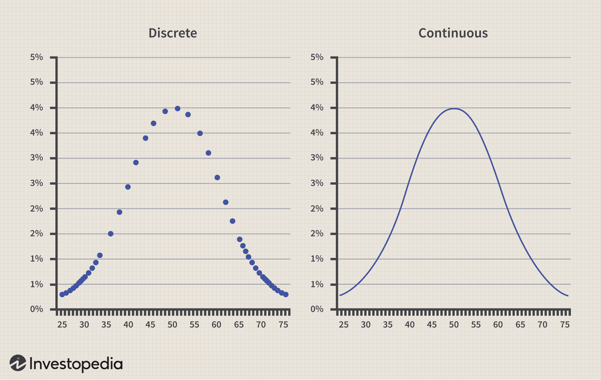

## Table of Contents

## What is a probability distribution and why is it important in investing?

A probability distribution is a way to show how likely different outcomes are. Imagine you roll a dice. A probability distribution would tell you that each number from 1 to 6 has an equal chance of coming up. In investing, it's like a map that shows the chances of different returns on your investments. It helps you understand what might happen to your money, whether it could grow a lot, a little, or even shrink.

Understanding probability distributions is important in investing because it helps you make smarter choices. If you know the chances of different outcomes, you can decide if an investment is worth the risk. For example, if an investment has a high chance of losing money, you might decide to avoid it or invest less. On the other hand, if an investment has a good chance of giving you a big return, you might want to put more money into it. This way, you can plan better and feel more confident about your investment decisions.

## How can probability distributions help in understanding investment risks?

Probability distributions help in understanding investment risks by showing you all the possible outcomes of an investment and how likely each one is. Think of it like a weather forecast for your money. Just like a weather forecast tells you the chances of rain or sunshine, a probability distribution tells you the chances of making a profit or losing money on an investment. This way, you can see if an investment is more likely to be safe or risky.

When you look at a probability distribution, you can see if the investment has a lot of ups and downs or if it's more steady. If the distribution shows that the investment could go up a lot but also could go down a lot, that means it's a high-risk investment. On the other hand, if the distribution shows that the investment is likely to stay around the same value, it's a lower-risk investment. Knowing this helps you decide if you're okay with the risk or if you should look for something safer.

## What are the common types of probability distributions used in finance?

In finance, people often use the normal distribution, also called the bell curve, to understand how investments might behave. It looks like a bell and shows that most outcomes are likely to be around the middle, with fewer outcomes far away from the middle. This is useful for things like stock prices, where most days the price might not change much, but sometimes it can go up or down a lot. The normal distribution helps investors see what's normal and what's unusual, making it easier to plan for the future.

Another common type is the lognormal distribution, which is used for things that can't be negative, like stock prices or the value of investments. It's similar to the normal distribution but shifted so that all values are positive. This is helpful because it shows that while small changes are common, big jumps or drops can happen, but they're less likely. Investors use this to understand how much their investments might grow over time and to plan for different scenarios.

Lastly, the binomial distribution is used when you want to know the chances of something happening a certain number of times, like the number of times a stock might go up in a month. It's like flipping a coin: you want to know how many times it might land on heads out of a certain number of flips. This helps investors understand the likelihood of certain events, like how often a stock might beat the market, which can guide their investment decisions.

## Can you explain the normal distribution and its role in stock market analysis?

The normal distribution, often called the bell curve, is a way to show how likely different outcomes are. It looks like a bell, with most outcomes in the middle and fewer outcomes on the sides. Imagine you're measuring the height of a bunch of people. Most people would be around average height, with fewer people being very tall or very short. In the stock market, the normal distribution helps us understand that most days, stock prices might not change much. They stay close to their average value. But sometimes, the prices can go up or down a lot, which are the less common outcomes shown on the sides of the bell curve.

In stock market analysis, the normal distribution is super helpful because it lets investors see what's normal and what's unusual. If a stock's price moves in a way that fits the normal distribution, investors can feel more confident about their predictions. They can use this to guess where the stock price might go next. For example, if a stock's price is usually stable but suddenly jumps a lot, the normal distribution can help investors decide if this is just a rare event or if something big is happening. This way, they can make better decisions about buying or selling stocks, based on how likely different price changes are.

## How does the lognormal distribution apply to asset prices?

The lognormal distribution is used to describe things that can't be negative, like the price of stocks or the value of investments. Imagine you're watching the price of a stock over time. It can go up or down, but it can never be less than zero. The lognormal distribution shows that small changes in the stock price are common, but big jumps or drops happen less often. It's like a normal distribution, but all the values are positive, which makes it perfect for understanding how asset prices might change.

In the world of investing, the lognormal distribution helps investors see how much their investments might grow over time. If you're thinking about buying a stock, you can use the lognormal distribution to understand the chances of the stock price going up or down. This helps you plan for different scenarios. For example, if you know that big price changes are less likely but still possible, you can decide if you're okay with that risk or if you should look for a safer investment. It's like having a map that shows you the possible paths your investment could take, making it easier to make smart choices.

## What is the difference between discrete and continuous probability distributions in investing?

In investing, discrete probability distributions are used when the outcomes are separate and countable, like the number of times a stock goes up in a month. Imagine you're flipping a coin to decide whether to buy or sell a stock. You can only get heads or tails, and you want to know how many times you might get heads out of 10 flips. This is like a discrete distribution because it's about counting specific outcomes. In investing, this can help you understand the chances of certain events happening a set number of times, like how often a stock might beat the market.

On the other hand, continuous probability distributions are used when the outcomes can be any value within a range, like stock prices. Think of stock prices as a smooth line that can go up or down by tiny amounts. A continuous distribution helps you see all the possible prices a stock could have, not just specific ones. This is useful in investing because it lets you understand how much a stock's price might change over time and helps you plan for different scenarios. For example, if you're looking at a stock's price, a continuous distribution can show you the chances of it being anywhere between $50 and $60, rather than just at $50 or $60.

Both types of distributions are important in investing. Discrete distributions help you count specific outcomes, like the number of times something happens, while continuous distributions help you understand the full range of possibilities, like the many different prices a stock could have. By using both, investors can get a complete picture of the risks and rewards of their investments.

## How can investors use the binomial distribution to model stock price movements?

Investors can use the binomial distribution to model stock price movements by breaking down the stock's behavior into simple up or down movements over a period of time. Imagine you're looking at a stock and you want to know how many times it might go up in a month. The binomial distribution helps you figure out the chances of the stock going up a certain number of times out of the total days in that month. It's like flipping a coin where heads means the stock goes up and tails means it goes down. By using the binomial distribution, investors can see how likely it is for the stock to have more up days than down days, or vice versa.

This model is useful because it helps investors understand the risk and reward of holding a stock. If the binomial distribution shows that the stock is more likely to go up a lot of times, it might be a good investment. But if it shows that the stock could go down a lot, investors might want to be careful. By looking at these probabilities, investors can make better decisions about whether to buy, sell, or hold onto a stock. It's like having a simple tool that helps you see the possible paths your investment could take, making it easier to plan for the future.

## What role does the Poisson distribution play in analyzing rare events in the market?

The Poisson distribution is a tool that helps investors understand how often rare events might happen in the stock market. Imagine you're waiting for a bus that comes very rarely. The Poisson distribution can tell you how likely it is that the bus will come zero times, one time, two times, or more in an hour. In the stock market, these rare events could be things like a big drop in stock prices or a sudden jump in a company's earnings. By using the Poisson distribution, investors can figure out how often these rare events might happen and plan their investments accordingly.

For example, if an investor knows that a stock has a history of big price drops once every six months, they can use the Poisson distribution to see how likely it is for these drops to happen more or less often. This helps them decide if they should buy the stock, sell it, or maybe even use strategies like buying options to protect themselves from these rare but impactful events. Understanding the frequency of rare events can make a big difference in how investors manage their portfolios and react to unexpected changes in the market.

## How can the use of Monte Carlo simulations enhance investment decision-making?

Monte Carlo simulations help investors make better decisions by showing them many possible future outcomes of their investments. Imagine you're trying to guess how much money you might have in your savings account in a year. Instead of just guessing one number, Monte Carlo simulations run thousands of different scenarios, each with different ups and downs, to give you a range of possible outcomes. This way, you can see not just the best or worst case, but all the possibilities in between. It's like playing out many different futures on a computer to see what might happen to your money.

Using Monte Carlo simulations helps investors understand the risks and rewards of their choices. If you're thinking about investing in a stock, a Monte Carlo simulation can show you how often the stock might go up or down, and by how much. This helps you decide if the investment is worth the risk. For example, if the simulation shows that the stock could lose a lot of money in many of the scenarios, you might decide to invest less or look for a safer option. By seeing a wide range of possible outcomes, investors can plan better and feel more confident about their investment decisions.

## What advanced statistical tools are used to fit probability distributions to financial data?

Advanced statistical tools like Maximum Likelihood Estimation (MLE) and the Method of Moments are used to fit probability distributions to financial data. MLE is like trying to find the best key that fits a lock. It looks at all the data, like stock prices, and tries different values for the parameters of a distribution, like the average and spread, to see which ones make the data most likely. If the key fits well, it means the distribution matches the data closely. The Method of Moments, on the other hand, is like matching fingerprints. It compares the moments of the data, which are simple summaries like the average and the spread, to the moments of a distribution to find the best fit. Both methods help investors understand how well a distribution describes their data, which is important for making smart investment decisions.

Another tool is the Kolmogorov-Smirnov test, which checks if the data follows a certain distribution. Imagine you're trying to see if a bunch of kids are lined up according to their height or not. The Kolmogorov-Smirnov test looks at the biggest difference between the actual data and what you'd expect if it followed a perfect distribution. If the difference is small, it means the distribution fits the data well. This test helps investors see if their chosen distribution, like a normal or lognormal distribution, really matches the ups and downs of stock prices. By using these tools, investors can make more accurate predictions about their investments and manage their risks better.

## How do fat-tailed distributions affect risk management strategies in investing?

Fat-tailed distributions show that big surprises, like huge jumps or drops in stock prices, can happen more often than we might think. Imagine you're looking at a bell curve, but the ends of the curve are much thicker than usual. This means that extreme events, like a stock losing half its value or doubling overnight, are not as rare as a normal distribution would suggest. In investing, this means you need to be ready for big changes that could shake up your plans.

Because of fat-tailed distributions, investors need to be extra careful about risk. They might decide to spread their money across many different investments to lower the chance of a big loss from one stock. They could also use tools like options to protect themselves from sudden drops. By understanding that big surprises are more likely, investors can plan better and feel more secure about their choices, even when the market gets wild.

## Can you discuss the application of copulas in modeling dependencies between different asset classes?

Copulas are like special tools that help investors understand how different types of investments, like stocks and bonds, move together. Imagine you have two friends, one who likes to go out when it's sunny and another who prefers to stay in when it's raining. A copula can help you see how these two friends' behaviors are connected, even if they seem to do different things. In investing, copulas let you see how the ups and downs of different assets are linked, which is important because it can affect your overall risk and return.

For example, if stocks and bonds usually move in opposite directions, a copula can show you this pattern. This helps you build a balanced investment portfolio, where losses in one area might be offset by gains in another. By using copulas, investors can make smarter choices about how to mix their investments to manage risk better and possibly get better returns. It's like having a map that shows you how all your investments are connected, helping you navigate the market more confidently.

## What are the types of probability distributions in investing?

### Types of Probability Distributions in Investing

In finance and investing, probability distributions serve as essential tools for modeling and analyzing various market phenomena. These distributions offer insight into the expected behavior of asset prices and returns, assisting investors and traders in making informed decisions and managing risks effectively.

#### Normal Distribution

The normal distribution, or Gaussian distribution, is extensively used in finance to model the expected return of a stock over a period. It is characterized by its symmetric bell curve, with the mean (μ) denoting the center and standard deviation (σ) indicating the [dispersion](/wiki/dispersion-trading) around the mean. The probability density function (PDF) of a normal distribution is defined as: 

$$

f(x|\mu,\sigma^2) = \frac{1}{\sqrt{2\pi\sigma^2}} e^{-\frac{(x-\mu)^2}{2\sigma^2}} 
$$

In investing, the normal distribution is particularly valued for its properties, such as the empirical rule, which states that approximately 68% of values lie within one standard deviation of the mean, and about 95% fall within two standard deviations. This makes the normal distribution a staple in risk management and portfolio optimization.

#### Log-Normal Distribution

While the normal distribution is useful for modeling returns, stock prices themselves are often modeled using the log-normal distribution. This is because stock prices cannot become negative, and they exhibit a right-skewed behavior consistent with a log-normal distribution. The log-normal distribution arises when the natural logarithm of a variable follows a normal distribution. Its probability density function is expressed as:

$$

f(x|\mu,\sigma^2) = \frac{1}{x\sigma\sqrt{2\pi}} e^{-\frac{(\ln x - \mu)^2}{2\sigma^2}}, \quad x > 0 
$$

This distribution is widely applied in option pricing models, such as the Black-Scholes model, where the underlying asset prices are assumed to follow a log-normal distribution.

#### Binomial Distribution

The binomial distribution plays a critical role in evaluating the probability of success across a series of independent trials. In finance, it is frequently used in option pricing and risk assessment, particularly in constructing binomial tree models for derivative pricing. The binomial distribution is defined by two parameters: the number of trials $n$ and the probability of success $p$. The probability of obtaining exactly $k$ successes is given by the formula:

$$

P(X = k) = \binom{n}{k} p^k (1-p)^{n-k} 
$$

This distribution is particularly useful in discrete-time models where the underlying asset's price changes can be depicted as a series of up and down moves.

#### Poisson Distribution

The Poisson distribution is used to model the number of events occurring within a fixed interval of time or space in various trading scenarios. Unlike the binomial distribution, which considers only binary outcomes, the Poisson distribution is suited for scenarios where the number of occurrences is the focus. Its probability mass function (PMF) is:

$$

P(X = k) = \frac{\lambda^k e^{-\lambda}}{k!} 
$$

where $\lambda$ is the average number of events in the interval. In finance, the Poisson distribution can be applied to model the frequency of rare events, such as defaults in a credit portfolio or jumps in asset prices.

These probability distributions form the analytical backbone for many quantitative finance strategies. By understanding and applying these distributions, investors and traders can enhance their ability to predict market movements, evaluate risk, and make data-driven investment decisions.

## What are Probability Distributions and how do they relate to Risk Management?

Investors employ probability distributions to predict potential returns and effectively manage risk within their portfolios. Probability distributions offer a statistical representation of potential outcomes, and understanding these distributions aids in formulating strategies that mitigate risk. One of the primary metrics derived from probability distributions is Value at Risk (VaR). VaR provides an estimate of the potential loss in the value of a portfolio over a specific time period, given normal market conditions, at a particular confidence level. For instance, a daily VaR of 5% at a 95% confidence level indicates that there is a 5% probability that the portfolio will lose more than that amount in a single day.

Mathematically, VaR can be represented as:

$$
\text{VaR}_{\alpha} = -\inf \{ x \mid F(x) > 1 - \alpha \}
$$

where $F(x)$ is the cumulative distribution function of portfolio returns and $\alpha$ is the confidence level.

Stress testing is another application where probability distributions play a crucial role. Stress testing involves using extreme but plausible market conditions to determine the impact on a portfolio, thereby assessing the resilience of investments during turbulent times. This process is vital for understanding how portfolios might react to unforeseen market shocks.

Backtesting trading strategies is a key component of risk management, where historical data is used to simulate how a strategy would have performed in the past. Probability distributions are employed to evaluate these historical returns and optimize strategy parameters. By understanding past performance, investors can adjust their strategies to account for estimated risks associated with different market conditions. This involves constructing a historical simulation of potential outcomes, often requiring a detailed analysis of return distributions over time.

In Python, [backtesting](/wiki/backtesting) can leverage historical data and simulate performance using libraries like `numpy` and `pandas`. Here is a simple example demonstrating how to use Python for backtesting a basic moving average strategy:

```python
import pandas as pd
import numpy as np

# Assume df is a pandas DataFrame with a column 'Close' for stock prices
df['SMA_20'] = df['Close'].rolling(window=20).mean()
df['Position'] = np.where(df['Close'] > df['SMA_20'], 1, -1)  # Buy when price is above SMA
df['Returns'] = df['Close'].pct_change()
df['Strategy_Returns'] = df['Position'].shift(1) * df['Returns']

# Calculate cumulative returns
cumulative_strategy_returns = (1 + df['Strategy_Returns']).cumprod()
```

This script calculates a simple moving average (SMA) for a given stock price dataset and determines potential buy/sell signals based on whether the closing price is above or below the moving average. The strategy's returns are then derived to evaluate performance.

Probability distributions inherently provide a structured approach to gauge risk and guide investment decisions. Through metrics like VaR and approaches like stress and backtesting, investors can enhance their ability to manage potential risks and strategize effectively. As financial markets evolve, the utilization of probability distributions continues to be an integral part of sophisticated risk management practices.

## References & Further Reading

[1]: Bergstra, J., Bardenet, R., Bengio, Y., & Kégl, B. (2011). ["Algorithms for Hyper-Parameter Optimization."](https://dl.acm.org/doi/10.5555/2986459.2986743) Advances in Neural Information Processing Systems 24.

[2]: ["Advances in Financial Machine Learning"](https://www.amazon.com/Advances-Financial-Machine-Learning-Marcos/dp/1119482089) by Marcos Lopez de Prado

[3]: ["Evidence-Based Technical Analysis: Applying the Scientific Method and Statistical Inference to Trading Signals"](https://www.amazon.com/Evidence-Based-Technical-Analysis-Scientific-Statistical/dp/0470008741) by David Aronson

[4]: ["Machine Learning for Algorithmic Trading"](https://github.com/PacktPublishing/Machine-Learning-for-Algorithmic-Trading-Second-Edition) by Stefan Jansen

[5]: ["Quantitative Trading: How to Build Your Own Algorithmic Trading Business"](https://www.amazon.com/Quantitative-Trading-Build-Algorithmic-Business/dp/0470284889) by Ernest P. Chan