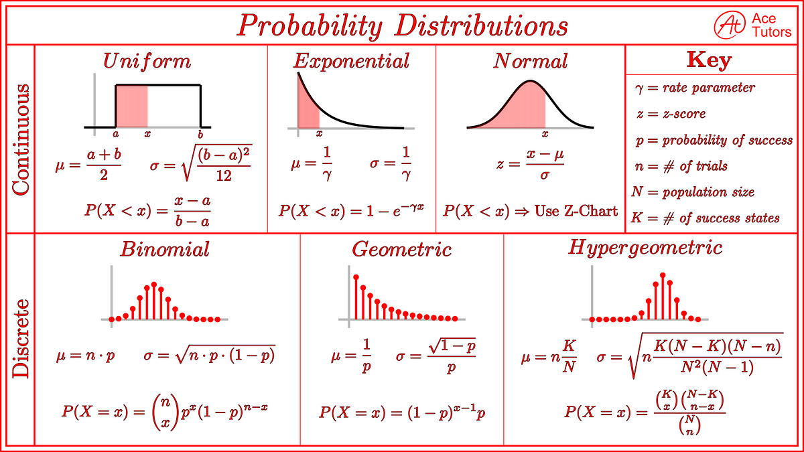

## Table of Contents

## What is a probability distribution in the context of machine learning?

In machine learning, a probability distribution is a way to describe how likely different outcomes are. Imagine you're rolling a die. A probability distribution would tell you the chances of rolling a 1, a 2, and so on up to 6. In machine learning, these distributions help models understand and predict data better. For example, if you're trying to predict house prices, a probability distribution can show how likely it is for a house to be priced at different values.

These distributions are important because they help machine learning models make decisions based on uncertainty. For instance, if a model is trying to classify whether an email is spam or not, it might use a probability distribution to figure out how likely the email fits into each category. This helps the model make more accurate predictions by considering all possible outcomes and their probabilities. In summary, probability distributions are key tools in machine learning that help models deal with uncertainty and make better predictions.

## How do probability distributions help in understanding data in machine learning?

Probability distributions help in understanding data in machine learning by showing how likely different values are to occur. Imagine you have a bunch of exam scores. A probability distribution can tell you how common it is to get a score of 70, 80, or 90. This helps you see patterns in the data, like if most scores are around 80, then 80 is the most likely score. In machine learning, knowing these patterns helps models learn from the data and make better predictions. For example, if a model is predicting exam scores, understanding the probability distribution of past scores helps it guess future scores more accurately.

These distributions also help in dealing with uncertainty. When a machine learning model makes a prediction, it's not always certain. Probability distributions let the model express how sure it is about its predictions. For instance, if a model is classifying pictures of animals, it might say there's a 90% chance the picture is a cat and a 10% chance it's a dog. This helps users understand how reliable the model's predictions are. By using probability distributions, machine learning models can handle the messiness of real-world data and make decisions that take into account all possible outcomes.

## What are the common types of probability distributions used in machine learning?

In machine learning, some common types of probability distributions are the normal distribution, the binomial distribution, and the Poisson distribution. The normal distribution, also known as the Gaussian distribution, looks like a bell curve. It's often used when data is spread out around an average value. For example, if you're looking at the heights of people, most people's heights would be around the average, with fewer people being very tall or very short. The normal distribution is great for modeling things like test scores or measurement errors. The formula for the normal distribution is $$ f(x) = \frac{1}{\sqrt{2\pi\sigma^2}} e^{-\frac{(x-\mu)^2}{2\sigma^2}} $$, where \(\mu\) is the mean and \(\sigma\) is the standard deviation.

The binomial distribution is used when you're looking at the number of successes in a fixed number of trials, like flipping a coin a certain number of times. If you flip a coin 10 times, the binomial distribution can tell you the probability of getting exactly 7 heads. This distribution is useful in machine learning for things like predicting the number of clicks on a website or the number of defective items in a batch. The Poisson distribution is used for counting the number of times something happens in a fixed interval of time or space. For example, it can be used to model the number of phone calls a call center gets in an hour. The formula for the Poisson distribution is $$ P(k) = \frac{\lambda^k e^{-\lambda}}{k!} $$, where \(\lambda\) is the average number of events per interval and \(k\) is the number of events.

These distributions help machine learning models understand and predict data by showing how likely different outcomes are. By using the right distribution for the data, models can make more accurate predictions and handle uncertainty better. For example, if a model is predicting the number of customers entering a store, using a Poisson distribution can help it understand the typical number of customers and make better forecasts.

## Can you explain the difference between discrete and continuous probability distributions?

Discrete probability distributions are used when you're counting things that can only take certain values, like the number of heads when you flip a coin. For example, if you flip a coin three times, you can only get 0, 1, 2, or 3 heads. There's no such thing as 1.5 heads. The binomial distribution is a common discrete distribution. It tells you the probability of getting a certain number of successes in a fixed number of trials. The formula for the binomial distribution is $$ P(X = k) = \binom{n}{k} p^k (1-p)^{n-k} $$, where \( n \) is the number of trials, \( k \) is the number of successes, and \( p \) is the probability of success on each trial.

Continuous probability distributions, on the other hand, are used when you're dealing with things that can take any value within a range, like the height of people or the time it takes to complete a task. For example, someone's height could be 1.75 meters, 1.76 meters, or any value in between. The normal distribution, or Gaussian distribution, is a common continuous distribution. It's shaped like a bell curve and is often used to model things that are spread out around an average value. The formula for the normal distribution is $$ f(x) = \frac{1}{\sqrt{2\pi\sigma^2}} e^{-\frac{(x-\mu)^2}{2\sigma^2}} $$, where \( \mu \) is the mean and \( \sigma \) is the standard deviation.

## How is the normal distribution used in machine learning models?

The normal distribution, often called the Gaussian distribution, is a key tool in machine learning because it helps models understand and predict data that clusters around an average value. Imagine you're looking at test scores. Most students might score around the average, with fewer students getting very high or very low scores. The normal distribution can model this pattern, showing how likely it is for a student to get a certain score. In machine learning, this helps models make better predictions about things like exam scores or house prices, where most values are close to the average but some can be far away.

In machine learning, the normal distribution is used in many ways. For example, it's used in algorithms like linear regression to understand how errors are spread out. If the errors follow a normal distribution, the model can make more accurate predictions. The formula for the normal distribution is $$ f(x) = \frac{1}{\sqrt{2\pi\sigma^2}} e^{-\frac{(x-\mu)^2}{2\sigma^2}} $$, where \( \mu \) is the mean and \( \sigma \) is the standard deviation. This formula helps models calculate the probability of different outcomes, which is crucial for making decisions under uncertainty. By using the normal distribution, machine learning models can handle the messiness of real-world data and make predictions that are more reliable.

## What role do probability distributions play in Bayesian statistics within machine learning?

In Bayesian statistics, which is a big part of machine learning, probability distributions help us update our beliefs about the world based on new data. Imagine you're trying to guess the weather. You start with a guess, like "It's probably going to be sunny." But then you see dark clouds. With Bayesian statistics, you use probability distributions to change your guess to something more accurate, like "It's more likely to rain now." In machine learning, this means models can learn from new data and get better over time. The key idea is using something called the Bayes' theorem, which looks like this: $$ P(A|B) = \frac{P(B|A)P(A)}{P(B)} $$. This formula helps models figure out how likely something is, given new information.

Probability distributions in Bayesian machine learning also help us understand uncertainty. When a model makes a prediction, it's not always 100% sure. By using distributions, the model can say things like "There's a 70% chance it will rain." This is really helpful because it lets us know how much we can trust the model's predictions. For example, if a model is classifying pictures of animals, it might use a distribution to say there's a 90% chance the picture is a cat and a 10% chance it's a dog. This way, we can make decisions based on how sure the model is. So, in Bayesian statistics, probability distributions are crucial for learning from data and handling uncertainty in machine learning models.

## How can one visualize probability distributions effectively for machine learning applications?

To visualize probability distributions effectively for machine learning applications, you can use different types of plots depending on whether the distribution is discrete or continuous. For discrete distributions, like the binomial distribution, a bar plot or histogram is often used. Imagine you're counting the number of heads in 10 coin flips. A bar plot would show how many times you got 0 heads, 1 head, 2 heads, and so on, up to 10 heads. This helps you see how likely each outcome is. For continuous distributions, like the normal distribution, a density plot or a histogram with a smooth curve can be used. The normal distribution, which looks like a bell curve, can be plotted to show how data clusters around an average value. The formula for the normal distribution is $$ f(x) = \frac{1}{\sqrt{2\pi\sigma^2}} e^{-\frac{(x-\mu)^2}{2\sigma^2}} $$, where \(\mu\) is the mean and \(\sigma\) is the standard deviation.

Tools like Python's Matplotlib or Seaborn libraries are great for creating these visualizations. Here's a simple example using Matplotlib to plot a normal distribution:

```python
import numpy as np
import matplotlib.pyplot as plt
from scipy.stats import norm

# Define the parameters of the normal distribution
mu, sigma = 0, 0.1

# Create a range of x values
x = np.linspace(mu - 3*sigma, mu + 3*sigma, 100)

# Calculate the y values for the normal distribution
y = norm.pdf(x, mu, sigma)

# Plot the distribution
plt.plot(x, y)
plt.title('Normal Distribution')
plt.xlabel('x')
plt.ylabel('Probability Density')
plt.show()
```

This code will create a smooth curve showing how the data is spread out around the mean. Visualizing distributions this way helps machine learning practitioners understand the data better, see patterns, and make more informed decisions about their models.

## What are the methods to estimate probability distributions from data?

Estimating probability distributions from data is a key part of machine learning. One common method is using histograms. Imagine you have a bunch of test scores. You can group these scores into bins, like 0-10, 10-20, and so on, and count how many scores fall into each bin. This gives you a rough idea of the distribution. For example, if most scores are in the 70-80 bin, you know that's where the data is most likely to be. Another method is using kernel density estimation (KDE). KDE smooths out the data to create a continuous curve, which can be more accurate than a histogram for showing the true shape of the distribution. The formula for KDE is $$ \hat{f}(x) = \frac{1}{nh} \sum_{i=1}^{n} K\left(\frac{x - X_i}{h}\right) $$, where \(K\) is the kernel function, \(h\) is the bandwidth, and \(X_i\) are the data points.

Another way to estimate distributions is by fitting a known distribution, like the normal distribution, to your data. This method is called maximum likelihood estimation (MLE). You try different values for the mean and standard deviation of the normal distribution until you find the ones that make the data most likely. The formula for the normal distribution is $$ f(x) = \frac{1}{\sqrt{2\pi\sigma^2}} e^{-\frac{(x-\mu)^2}{2\sigma^2}} $$, where \(\mu\) is the mean and \(\sigma\) is the standard deviation. Once you find the best \(\mu\) and \(\sigma\), you can use this distribution to understand your data better. For example, if you're looking at house prices, fitting a normal distribution can help you predict how likely it is for a house to be priced at different values.

## How do you handle high-dimensional probability distributions in machine learning?

Handling high-dimensional probability distributions in machine learning can be tricky because as the number of dimensions grows, the data becomes harder to visualize and understand. Imagine trying to plot data in more than three dimensions—it's not easy! One way to deal with this is by using techniques like dimensionality reduction. This means you take your high-dimensional data and simplify it into fewer dimensions while trying to keep the important information. For example, Principal Component Analysis (PCA) is a popular method that can help you see patterns in your data more easily by reducing the number of dimensions.

Another approach is to use probabilistic models like Gaussian Mixture Models (GMMs) or Bayesian networks. These models can handle high-dimensional data by breaking it down into simpler parts. For instance, a GMM can represent your data as a mix of several normal distributions, each in high-dimensional space. The formula for a normal distribution in one dimension is $$ f(x) = \frac{1}{\sqrt{2\pi\sigma^2}} e^{-\frac{(x-\mu)^2}{2\sigma^2}} $$, but in high dimensions, it becomes more complex. By using these models, you can still make good predictions and understand your data, even when it's spread out in many dimensions.

## Can you describe advanced techniques for modeling complex probability distributions?

When dealing with complex probability distributions in machine learning, one advanced technique is to use variational inference. This method helps approximate complicated distributions by using simpler ones. Imagine you're trying to guess the shape of a strange object by wrapping it with a sheet. Variational inference is like finding the best-fitting sheet. It uses a simpler distribution, called the variational distribution, to mimic the complex one. The goal is to make the simpler distribution as close as possible to the real one. This is done by minimizing a measure called the Kullback-Leibler divergence, which tells us how different two distributions are. By using variational inference, machine learning models can handle complex data more easily and make better predictions.

Another technique is using Monte Carlo methods. These are like playing a game of chance many times to learn about the rules. In machine learning, Monte Carlo methods help estimate complex distributions by generating lots of random samples from them. For example, if you want to know the average height of people in a city, you could measure a few people or use Monte Carlo methods to simulate many different heights and get a good estimate. One common Monte Carlo method is Markov Chain Monte Carlo (MCMC), which uses a sequence of random samples to explore the distribution. By doing this, you can understand the shape and properties of even the most complicated distributions. Both variational inference and Monte Carlo methods are powerful tools that help machine learning models deal with the messiness of real-world data.

## What are the challenges in representing and working with probability distributions in deep learning?

In deep learning, one big challenge is dealing with high-dimensional data. When you have a lot of dimensions, it's hard to see and understand the shape of the probability distribution. Imagine trying to draw a picture of something that has more than three dimensions—it's not easy! Techniques like Principal Component Analysis (PCA) can help by reducing the number of dimensions, but even then, the distributions can be complex and hard to work with. Another challenge is that deep learning models often need to handle uncertainty, and representing this uncertainty with probability distributions can be tricky. For example, if a model is trying to predict the weather, it needs to say how sure it is about its predictions, which means working with complex distributions.

Another issue is that many deep learning models, like neural networks, don't naturally output probability distributions. They usually give you a single prediction, like a number or a class label. To get around this, techniques like Bayesian neural networks can be used. These models can output a whole distribution instead of just one prediction, which helps handle uncertainty better. But using Bayesian methods in deep learning can be computationally expensive and hard to implement. The formula for a normal distribution, which is often used in these models, is $$ f(x) = \frac{1}{\sqrt{2\pi\sigma^2}} e^{-\frac{(x-\mu)^2}{2\sigma^2}} $$, where \(\mu\) is the mean and \(\sigma\) is the standard deviation. By understanding and working with these distributions, deep learning models can make better predictions and handle the messiness of real-world data more effectively.

## How do different probability distribution representations affect the performance of machine learning models?

Different ways of showing probability distributions can change how well machine learning models work. If you use a simple distribution like the normal distribution, which looks like a bell curve, it can make your model easier to understand and faster to train. The formula for the normal distribution is $$ f(x) = \frac{1}{\sqrt{2\pi\sigma^2}} e^{-\frac{(x-\mu)^2}{2\sigma^2}} $$, where \(\mu\) is the mean and \(\sigma\) is the standard deviation. When the data fits this distribution well, the model can make good predictions quickly. But if the real data is more complicated and doesn't fit the normal distribution, using it might make the model's predictions less accurate.

On the other hand, using more complex distributions can help models handle tricky data better. For example, if you use a mixture of different distributions, like a Gaussian Mixture Model, you can capture patterns in the data that a single distribution might miss. This can make your model's predictions more accurate, but it also makes the model harder to train and can take more time. So, choosing the right way to represent probability distributions is important. It's a balance between making the model simple enough to work well and complex enough to capture the real patterns in the data.