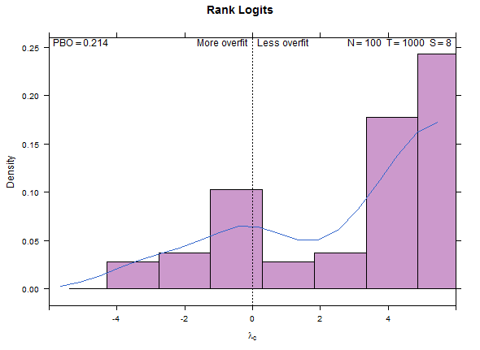

## Table of Contents

## What is backtest overfitting?

Backtest overfitting happens when someone tests a trading strategy on past data and tweaks it so much that it fits that data perfectly. But, this strategy might not work well in the future because it was made to fit the past too closely. It's like trying to predict the future by looking at the past, but changing the rules so much that they only work for what has already happened.

This problem is common in trading because people want to find a strategy that makes money. They keep adjusting their strategy until it looks good on past data. But, when they use it in real life, it often fails because the future is different from the past. To avoid this, it's important to test strategies on different sets of data and not to change the strategy too much based on one set of past results.

## Why is it important to understand the probability of backtest overfitting?

Understanding the probability of backtest overfitting is important because it helps traders and investors know if their trading strategy will really work in the future. If a strategy is overfitted, it might look great on past data but fail when used in real life. By knowing the chances of overfitting, people can be more careful and make better decisions about whether to use a strategy or not.

It's also important because it can save a lot of money and time. If someone uses an overfitted strategy, they might lose money because the strategy doesn't work as expected. By understanding the probability of overfitting, people can test their strategies in a smarter way, using different sets of data to make sure the strategy is more likely to work in the future. This way, they can avoid big losses and spend their time on strategies that have a better chance of success.

## How does backtest overfitting affect trading strategies?

Backtest overfitting can make trading strategies look much better than they really are. When someone tests a strategy on past data and keeps changing it until it fits perfectly, the strategy might seem like it will make a lot of money. But, this is a problem because the strategy was made to fit the past too closely. It's like trying to predict the future by looking at the past, but changing the rules so much that they only work for what has already happened. This means the strategy might not work well when used in real life because the future is different from the past.

Because of backtest overfitting, traders might lose money if they use an overfitted strategy. They might think they have found a great way to make money, but when they start trading with real money, the strategy fails. This can lead to big losses. To avoid this, it's important for traders to test their strategies on different sets of data and not to change the strategy too much based on one set of past results. By doing this, they can find strategies that are more likely to work in the future and avoid the problems caused by overfitting.

## What are the common causes of backtest overfitting?

One common cause of backtest overfitting is when traders keep changing their strategy to make it fit the past data perfectly. They might try different rules or settings until the strategy looks like it makes a lot of money on the past data. This is a problem because the strategy is made to fit the past too closely, and it might not work well in the future. The future is different from the past, so a strategy that fits the past perfectly might fail when used in real life.

Another cause is using too much data to test the strategy. When traders use a lot of past data and keep adjusting their strategy to fit all of it, they can end up with a strategy that is overfitted. It's like trying to make a puzzle piece fit by cutting it too much; it might fit the past data, but it won't work for new data. To avoid this, it's better to use different sets of data for testing and not to change the strategy too much based on one set of past results.

## What is the Probability of Backtest Overfitting (PBO) metric?

The Probability of Backtest Overfitting (PBO) metric is a way to check if a trading strategy is too closely fitted to past data. It helps traders see if their strategy will really work in the future or if it's just good at fitting the past. The PBO metric does this by testing the strategy on different sets of past data and seeing how well it works on each set. If the strategy only works well on one set of data and not on others, it might be overfitted.

Using the PBO metric can help traders avoid big losses. If a strategy has a high PBO, it means there's a good chance it's overfitted and might not work well in real life. By knowing this, traders can be more careful and test their strategies in a smarter way. They can use different sets of data to make sure the strategy is more likely to work in the future, helping them find strategies that are less likely to fail and more likely to make money.

## How is the PBO calculated?

The Probability of Backtest Overfitting (PBO) is calculated by testing a trading strategy on different sets of past data. Imagine you have a big pile of old trading data. You split this pile into smaller groups, like different slices of a pie. Then, you test your trading strategy on each slice to see how well it works. If the strategy works well on all the slices, it's probably a good strategy. But if it only works well on one slice and not the others, it might be overfitted.

To figure out the PBO, you look at how the strategy performs on these different slices. You count how many times the strategy makes money across all the slices. If it makes money on most of the slices, the PBO is low, meaning the strategy is less likely to be overfitted. But if it only makes money on a few slices, the PBO is high, which means there's a good chance the strategy is overfitted. This helps traders know if their strategy will really work in the future or if it's just good at fitting the past.

## What are the key components needed to compute PBO?

To compute the Probability of Backtest Overfitting (PBO), you need a set of past trading data. You split this data into different groups, like cutting a cake into slices. Each slice is used to test your trading strategy to see how well it works. You need to make sure these slices are different from each other so you can see if your strategy works well on all kinds of past data, not just one kind.

Then, you test your trading strategy on each slice of data. You count how many times your strategy makes money across all the slices. If your strategy makes money on most of the slices, the PBO is low, which means your strategy is less likely to be overfitted. But if it only makes money on a few slices, the PBO is high, which means there's a good chance your strategy is overfitted. This helps you know if your strategy will work in the future or if it's just good at fitting the past.

## Can you explain the concept of performance degradation in relation to PBO?

Performance degradation happens when a trading strategy that worked well on past data doesn't work as well in the future. This is a big problem when a strategy is overfitted, which means it was made to fit the past data too closely. The Probability of Backtest Overfitting (PBO) helps us see if a strategy might be overfitted. If a strategy has a high PBO, it means there's a good chance it's overfitted, and it might not work well in the future. This is called performance degradation because the strategy's performance gets worse over time.

When a strategy is overfitted, it might look great on the past data it was tested on, but when you use it in real life, it can fail. This is because the future is different from the past, and an overfitted strategy can't handle these differences. By using the PBO, traders can see if their strategy is likely to suffer from performance degradation. If the PBO is high, they know to be careful and maybe test the strategy on different sets of data to make sure it's more likely to work well in the future.

## How can PBO be used to improve the robustness of trading strategies?

The Probability of Backtest Overfitting (PBO) helps traders make their trading strategies stronger and more likely to work in the future. By using PBO, traders can see if their strategy is too closely fitted to past data. If the PBO is high, it means there's a good chance the strategy is overfitted and might not work well when used in real life. To fix this, traders can test their strategy on different sets of past data. If the strategy works well on all these different sets, it's more likely to be a good strategy that will work in the future.

Using PBO also helps traders avoid big losses. If a strategy has a high PBO, traders know to be careful and not to use it right away. They can keep working on the strategy, trying different rules or settings until it works well on different sets of data. This way, they can find a strategy that is less likely to fail and more likely to make money. By understanding and using PBO, traders can make their strategies more robust and ready for the future.

## What are some practical examples of PBO in financial markets?

Imagine a trader who wants to make money by buying and selling stocks. They come up with a strategy and test it on past stock prices from the last five years. The strategy looks great on this data, making a lot of money. But when they use the PBO metric, they see that the strategy only works well on this one set of data. When they test it on different sets of past data, like stock prices from different years or different markets, the strategy doesn't work as well. This high PBO tells the trader that their strategy might be overfitted and could fail in the future. So, they decide to keep working on the strategy, trying different rules until it works well on all kinds of past data.

Another example is a [hedge fund](/wiki/hedge-fund-trading-strategies) manager who uses a complex trading strategy to trade in the [forex](/wiki/forex-system) market. They test the strategy on past forex data and it looks like it will make a lot of money. But when they calculate the PBO, they find that the strategy only works well on the specific set of data they used. When they test it on other sets of forex data, like data from different time periods or different currency pairs, the strategy doesn't perform as well. This high PBO warns the manager that the strategy might be overfitted and could lead to losses in the future. To improve the strategy, the manager tests it on more diverse sets of data and adjusts it until it works well across all of them, making it more likely to succeed in real trading.

## How does PBO relate to other statistical measures like p-values and confidence intervals?

The Probability of Backtest Overfitting (PBO) helps traders see if their trading strategy is too closely fitted to past data. It's different from p-values and confidence intervals, which are used to check if results from data are just by chance or if they mean something real. PBO looks at how a strategy performs across different sets of past data. If a strategy only works well on one set of data and not on others, it might be overfitted. This means the strategy could fail in the future because it's too focused on the past.

P-values and confidence intervals are used in many areas of science and [statistics](/wiki/bayesian-statistics) to see if results are reliable. A p-value tells you how likely it is that your results happened by chance, and a confidence interval shows a range where the true value might be. PBO, on the other hand, is specific to trading and finance. It helps traders avoid using strategies that look good on past data but won't work well in the future. By using PBO along with p-values and confidence intervals, traders can get a better picture of how reliable their strategies are and make smarter decisions.

## What advanced techniques can be used to mitigate the risk of backtest overfitting beyond PBO?

One advanced technique to reduce the risk of backtest overfitting is called cross-validation. Imagine you have a big pile of past trading data. Instead of using all of it to test your strategy, you split it into smaller groups, like different slices of a pie. You test your strategy on one slice and then see how it works on the other slices. If it works well on all the slices, it's more likely to be a good strategy. This helps make sure your strategy isn't just good at fitting one set of past data but can work well on different kinds of data.

Another technique is called walk-forward optimization. This is like testing your strategy step-by-step through time. You start with some old data to set up your strategy, then you move forward in time and see how it works on new data. You keep doing this, moving forward and testing, to make sure your strategy can adapt to changes over time. This way, you can see if your strategy will still work in the future, not just in the past. By using these techniques, traders can make their strategies more reliable and less likely to fail when used in real life.

## References & Further Reading

[1]: Lopez de Prado, M. (2018). ["Advances in Financial Machine Learning"](https://books.google.com/books/about/Advances_in_Financial_Machine_Learning.html?id=oU9KDwAAQBAJ). John Wiley & Sons.

[2]: Aronson, D. R. (2006). ["Evidence-Based Technical Analysis: Applying the Scientific Method and Statistical Inference to Trading Signals"](https://www.amazon.com/Evidence-Based-Technical-Analysis-Scientific-Statistical/dp/0470008741). Wiley.

[3]: Jansen, S. (2020). ["Machine Learning for Algorithmic Trading: Predictive models to extract signals from market and alternative data for systematic trading strategies with Python"](https://www.amazon.com/Machine-Learning-Algorithmic-Trading-alternative/dp/1839217715). Packt Publishing.

[4]: Chan, E. (2009). ["Quantitative Trading: How to Build Your Own Algorithmic Trading Business"](https://github.com/ftvision/quant_trading_echan_book). Wiley.

[5]: Bailey, D., Borwein, J., López de Prado, M., & Zhu, Q. J. (2016). ["The Probability of Backtest Overfitting"](https://www.davidhbailey.com/dhbpapers/backtest-prob.pdf). Journal of Computational Finance.

[6]: Harvey, C. R., Liu, Y., & Zhu, H. (2015). ["...and the Cross-Section of Expected Returns."](https://academic.oup.com/rfs/article/29/1/5/1843824) The Journal of Finance, 70(2), 618-650.