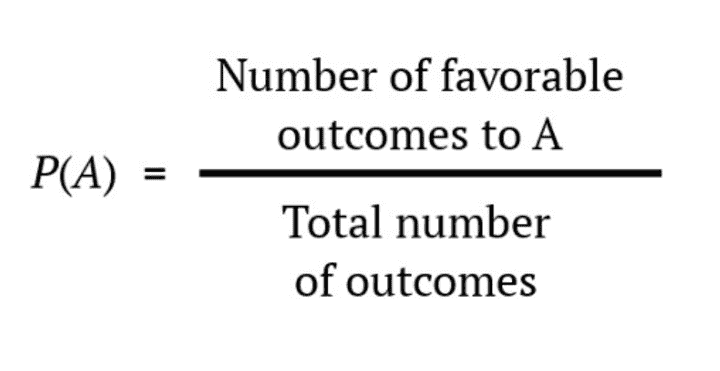

## Table of Contents

## What is the Probability of Informed Trading (PIN)?

The Probability of Informed Trading (PIN) is a measure used in finance to estimate how likely it is that someone is trading a stock based on private information, rather than public information. It helps investors and analysts understand if the market movements of a stock are driven by people who know something others don't. The PIN is calculated using a model that looks at the patterns of buy and sell orders, trying to separate those that might come from informed traders from those that come from regular, uninformed traders.

To calculate the PIN, researchers use data on the frequency and size of trades, along with the arrival rates of different types of orders. The model assumes that there are two types of traders: informed traders who trade based on private information, and uninformed traders who trade for other reasons, like liquidity needs. By analyzing this data, the model estimates the probability that any given trade is from an informed trader. A higher PIN suggests a higher chance that trading in a stock is influenced by people with inside information, which can be important for understanding market behavior and making investment decisions.

## How is PIN calculated?

The Probability of Informed Trading (PIN) is calculated using a model that looks at the buying and selling of a stock. This model tries to figure out if the trades are coming from people who know something special about the stock that others don't. To do this, it uses information about how often trades happen and how big they are. It separates the trades into two groups: those from informed traders, who have secret information, and those from uninformed traders, who are just trading for normal reasons like needing money.

The model then uses math to guess how likely it is that a trade comes from someone with inside information. It does this by looking at the patterns of the trades over time. If there are a lot of trades that seem to be based on secret information, the PIN will be high. This means the stock's price might be moving because of what these informed traders know, not just because of what everyone else knows. A high PIN can be a warning sign for investors to be careful with that stock.

## What is the significance of PIN in financial markets?

The Probability of Informed Trading (PIN) is important in financial markets because it helps people understand if a stock's price is moving because some traders know secret information. When the PIN is high, it means there's a good chance that people are trading based on things they know that others don't. This can make the stock's price go up or down quickly, which can be risky for other investors who don't have that secret information.

Knowing the PIN can help investors make better choices. If a stock has a high PIN, an investor might decide to be more careful or wait for more public information before buying or selling. This way, they can avoid making decisions based on what might be happening behind the scenes. Overall, the PIN is a useful tool for understanding and navigating the ups and downs of the stock market.

## Can you explain the basic components of the PIN model?

The PIN model looks at the buying and selling of a stock to figure out if people are trading because they know something special. It separates traders into two groups: informed traders, who have secret information, and uninformed traders, who trade for normal reasons like needing money. The model uses data on how often trades happen and how big they are to guess which group a trade comes from. If a lot of trades seem to be from informed traders, the PIN will be high.

A high PIN means there's a good chance that the stock's price is moving because of what these informed traders know, not just because of what everyone else knows. This can be important for other investors because it tells them to be careful. If they see a high PIN, they might wait for more public information before buying or selling the stock. This way, they can avoid making decisions based on what might be happening behind the scenes.

## How does PIN differ from other market microstructure measures?

The Probability of Informed Trading (PIN) is different from other market microstructure measures because it focuses on figuring out if people are trading a stock because they know something secret. Other measures might look at things like how easy it is to buy or sell a stock, how much the price changes, or how many trades happen. But PIN is special because it tries to separate trades that come from people with inside information from those that come from people trading for normal reasons.

For example, measures like bid-ask spread or trading volume tell us about the overall health and activity of the market. The bid-ask spread shows how much it costs to trade a stock, and trading volume shows how many people are buying and selling. But these measures don't tell us if the trades are based on secret information. PIN, on the other hand, uses a model to look at the patterns of trades and guess if they come from informed or uninformed traders. This makes PIN a unique tool for understanding what might be driving the price of a stock.

## What are the practical applications of PIN for traders and investors?

The Probability of Informed Trading (PIN) is a useful tool for traders and investors because it helps them understand if a stock's price is moving because some people know secret information. If the PIN is high, it means there's a good chance that the stock's price is being influenced by these informed traders. This can be a warning sign for investors to be careful. They might decide to wait for more public information before buying or selling the stock, so they don't make decisions based on what might be happening behind the scenes.

In practical terms, traders can use PIN to adjust their trading strategies. If they see a high PIN for a stock, they might choose to trade less of that stock or use different trading methods to protect themselves from sudden price changes caused by informed trading. Investors, on the other hand, can use PIN to help them pick stocks. A stock with a low PIN might be seen as safer because its price is less likely to be influenced by secret information. This way, PIN helps both traders and investors make smarter choices in the stock market.

## How can PIN be used to assess market efficiency?

The Probability of Informed Trading (PIN) can help us understand how efficient a market is. Market efficiency means that the price of a stock reflects all the information available. If the PIN is high, it means there's a good chance that some people are trading because they know something secret that others don't know. This suggests that the market might not be very efficient because the price isn't fully reflecting all the information. Instead, it's being pushed around by people with inside information.

On the other hand, if the PIN is low, it means there's less chance of secret information affecting the stock's price. This suggests that the market is more efficient because the price is more likely to reflect all the public information available. By looking at the PIN, investors and analysts can get a sense of how well the market is working and whether they should trust the current stock prices as a good guide for their decisions.

## What are the limitations of the PIN model?

The PIN model has some limitations that make it less perfect. One big problem is that it needs a lot of data to work well. It looks at how often trades happen and how big they are over time. If there isn't enough data, the PIN might not be very accurate. Also, the model makes some guesses about how traders behave, like saying there are only two types of traders: those with secret information and those without. Real trading is more complicated, so these guesses might not always be right.

Another issue is that the PIN model can be hard to use in fast-moving markets. It's based on looking at past trades, but in today's markets, things can change very quickly. What the model says might not be as useful if the market conditions change a lot. Plus, the model can sometimes mix up trades that come from people with secret information with trades that just happen because the market is moving a lot. This can make it hard to trust the PIN as a perfect measure of what's going on in the market.

## How has the PIN model evolved since its introduction?

Since it was first introduced, the PIN model has changed and improved in a few ways. People who study it have tried to make it better by using more data and new ways of looking at trades. They've also tried to fix some of the problems with the original model, like how it needs a lot of data to work well. By using more advanced math and computer tools, researchers have made the PIN model more accurate and easier to use in different kinds of markets.

One big change is that the PIN model now looks at more types of information than just the basic buying and selling data. It can now include things like news and other public information to help figure out if trades are coming from people with secret information. This makes the model more useful for understanding what's really driving the stock's price. Even with these improvements, the PIN model still has some limits, but it's become a more powerful tool for traders and investors to use in their decisions.

## Can you discuss any empirical studies that have used PIN to analyze market behavior?

Researchers have used the Probability of Informed Trading (PIN) to study how markets work in many different studies. One important study looked at how PIN can help predict stock returns. The researchers found that stocks with high PINs tend to have higher returns in the future. This suggests that when more people are trading based on secret information, it can push the stock's price up. This study shows that PIN can be a useful tool for investors trying to guess which stocks might do well.

Another study used PIN to look at how quickly new information gets into stock prices. The researchers found that in markets where PIN is low, new information gets into stock prices faster. This means the market is more efficient because everyone knows the same things at the same time. But in markets with high PIN, it takes longer for new information to show up in stock prices. This study helps us understand that PIN can tell us something about how well a market is working and how quickly prices adjust to new information.

## How do regulatory changes affect the calculation and relevance of PIN?

Regulatory changes can have a big impact on how the Probability of Informed Trading (PIN) is calculated and how useful it is. When rules about trading change, it can change how people trade and what information they use. For example, if new laws make it harder for people to trade with secret information, the number of informed trades might go down. This would mean the PIN would be lower because there are fewer trades coming from people with inside information. So, when regulators make changes, it's important to look at how these changes might affect the data used to calculate PIN.

Even though regulatory changes can affect PIN, it's still a helpful tool for understanding markets. If rules change to make trading more open and fair, the PIN can help show if these changes are working. A lower PIN after new rules might mean that fewer people are trading with secret information, which is good for the market. But if the PIN stays high or goes up, it might mean the new rules aren't doing what they're supposed to do. So, by keeping an eye on PIN, investors and regulators can see how well the market is working and if more changes are needed.

## What advanced techniques are used to estimate PIN more accurately?

To make the Probability of Informed Trading (PIN) more accurate, researchers use new math and computer tools. These tools help them look at more data and different kinds of information than before. For example, they can now use [machine learning](/wiki/machine-learning) to find patterns in the data that the old model might miss. Machine learning can help figure out if a trade comes from someone with secret information or not by looking at lots of past trades and other information like news and market reports. This makes the PIN more reliable because it's based on a bigger and more detailed picture of what's happening in the market.

Another way to improve PIN is by using something called high-frequency trading data. This kind of data shows trades that happen very quickly, sometimes in just seconds or less. By looking at this fast-moving data, researchers can see how trades are happening in real-time, which can help them tell the difference between informed and uninformed trades better. Also, some new models take into account how the market changes over time, so they can update the PIN more often and make it more useful for today's fast-changing markets. These advanced techniques help make the PIN a better tool for understanding and predicting what's going on in the stock market.

## What is the probability of informed trading and how can it be understood?

Informed trading occurs when individuals or institutions trade based on material, non-public information that is not yet reflected in market prices. This advantage enables informed traders to make significant profits before the information becomes public and affects the asset's price. Identifying such trading behavior is pivotal for understanding market dynamics and ensuring equity among market participants.

The Probability of Informed Trading (PIN), developed by Easley, Kiefer, O'Hara, and Paperman, serves as a measure to quantify the likelihood of informed trading within a market. This metric calculates the probability that a given trade reflects the activity of informed traders rather than uninformed, noise traders. PIN is crucial because it offers insights into the degree to which private information impacts market transactions and pricing.

Mathematically, the PIN is calculated using the framework developed by Easley et al., which hinges upon the assumption that buy and sell orders from informed and uninformed traders are governed by independent Poisson processes. The model can be outlined as follows:

- Let $\alpha$ be the probability of an information event occurring for any given asset.
- Define $\mu$ as the arrival rate of orders from informed traders, conditional on an information event.
- Let $\epsilon_b$ and $\epsilon_s$ denote the arrival rates of buy and sell orders, respectively, from uninformed traders or noise traders.

These parameters help form the foundational equation for PIN:

$$
\text{PIN} = \frac{\alpha \mu}{\alpha \mu + \epsilon_b + \epsilon_s}
$$

The numerator, $\alpha \mu$, represents the expected number of informed trades, while the denominator reflects the total expected number of trades. As such, a high PIN value suggests a significant portion of trading [volume](/wiki/volume-trading-strategy) is likely driven by informed traders.

Understanding PIN is essential for interpreting the informational content embedded in the bid-ask spread. The bid-ask spread, the difference between the highest price a buyer is willing to pay and the lowest price a seller is willing to accept, often widens with higher probabilities of informed trading. This spread adjusts as market makers protect themselves against potential losses incurred from trading with better-informed participants.

In sum, the Probability of Informed Trading is a pivotal metric in financial markets. By quantifying the influence of private information on trading activities and market prices, PIN provides valuable insights into market efficiency and the risks faced by uninformed traders.

## What are Theoretical Models for Calculating PIN?

The Easley et al. model, a cornerstone in the study of informed trading, provides a framework for estimating the Probability of Informed Trading (PIN). This model posits that the flow of buy and sell orders from both informed and uninformed traders can be represented using independent Poisson processes. The distinction lies in the behavior of these processes under varying market conditions: with new information and without.

### Model Assumptions

1. **Order Arrivals as Poisson Processes**: 
   - The model assumes that the arrivals of buy and sell orders can be modeled as Poisson processes. For uninformed traders, buy and sell orders arrive at rates $\mu_b$ and $\mu_s$, respectively.
   - Informed traders, possessing private information, choose to place only buy orders in anticipation of favorable news or sell orders in expectation of unfavorable news. Hence, their order arrivals occur at a rate $\alpha$.

2. **Information Events**:
   - The market differentiates between 'event days' and 'no-event days'. On event days, new information is introduced, which could be either bullish or bearish.
   - The probability of an information event occurring on a given day is denoted by $\theta$.
   - Conditional on an event day, the probability of it being a good news (bullish) event or bad news (bearish) event is equal, often assumed to be $0.5$.

3. **Order Flow Structure**:
   - On no-event days, only uninformed traders participate, leading to symmetric buy and sell orders purely based on uninformed activity.
   - On event days, in addition to the uninformed order flow, informed traders contribute a significant directional order flow, either buying or selling based on the nature of the information.

### Mathematical Framework

The crux of the model's calculations lies in estimating the PIN, which quantifies the extent of informed trading in the market. The PIN is given by the formula:

$$
\text{PIN} = \frac{\alpha \cdot \theta}{\alpha \cdot \theta + \mu_b + \mu_s}
$$

where:
- $\alpha$ is the arrival rate of informed traders.
- $\theta$ is the probability of an information event.
- $\mu_b$ and $\mu_s$ are the arrival rates of uninformed buy and sell orders, respectively.

### Days With and Without New Information

The model aptly distinguishes the variation in order flows based on the nature of the trading day:

- **Event Days**:
  - If a good news event occurs, the expected number of buy orders on that day is $\alpha + \mu_b$, while the number of sell orders remains at $\mu_s$.
  - Conversely, on a bad news event day, the number of sell orders is $\alpha + \mu_s$ with buy orders at $\mu_b$.

- **No-Event Days**:
  - The expected number of buy and sell orders remains equal to non-informational flows, $\mu_b$ and $\mu_s$, respectively.

The division of order flows into these categories allows the PIN model to allocate trading activity to informed or uninformed sources, capturing the prevalence of informed participation in the market.

In summary, the Easley et al. model provides a robust analytical approach to estimating the probability of informed trading by modelling trade flows via Poisson processes, distinguishing between event and non-event days, and deriving the PIN from observable market data. This framework assists in identifying the presence and frequency of information-based trades within financial markets.

## References & Further Reading

[1]: Easley, D., Kiefer, N. M., O'Hara, M., & Paperman, J. (1996). ["Liquidity, Information, and Infrequently Traded Stocks."](https://onlinelibrary.wiley.com/doi/abs/10.1111/j.1540-6261.1996.tb04074.x) The Review of Financial Studies, 10(2), 157-186.

[2]: Easley, D., & O'Hara, M. (1987). ["Price, Trade Size, and Information in Securities Markets."](https://www.sciencedirect.com/science/article/pii/0304405X87900298) Journal of Financial Economics, 19(1), 69-90.

[3]: Yan, Z., & Zhang, J. E. (2012). ["How Informed Are the SMART Traders? An Empirical Study of Option Market Takers."](https://www.researchgate.net/publication/342092513_Smartphone_use_and_academic_performance_A_literature_review) The Review of Financial Studies, 25(12), 3429-3466.

[4]: Lopez de Prado, M. (2018). ["Advances in Financial Machine Learning."](https://books.google.com/books/about/Advances_in_Financial_Machine_Learning.html?id=oU9KDwAAQBAJ) Wiley.

[5]: Harris, L. (2002). ["Trading and Exchanges: Market Microstructure for Practitioners."](https://academic.oup.com/book/52292) Oxford University Press.