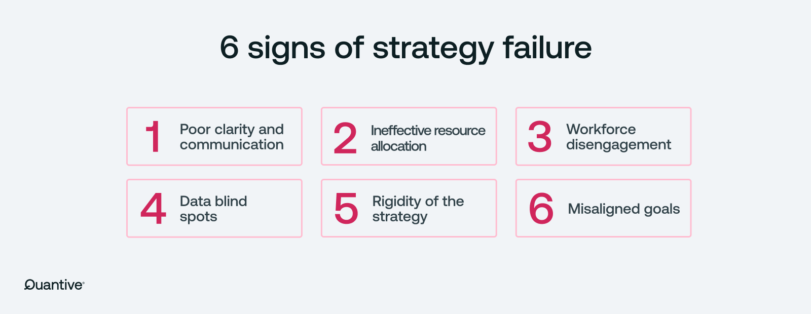

## Table of Contents

## What is the basic concept of probability in the context of strategy?

Probability in the context of strategy is about understanding the chances of different outcomes happening. When you make a strategy, you think about what might happen and how likely each thing is to happen. For example, if you are playing a game and you need to decide whether to take a risk, you might think about how likely it is that the risk will pay off. By knowing the probabilities, you can make better choices and increase your chances of winning or achieving your goals.

In everyday life, probability helps us make decisions too. For instance, if you are planning a picnic and the weather forecast says there is a 30% chance of rain, you might decide to bring an umbrella or choose a different day. Understanding probability helps us weigh the risks and rewards of our actions. It's like having a tool that lets us see into the future a little bit, so we can plan and act more wisely.

## How can one identify the factors that contribute to strategy failure?

One way to spot the reasons why a strategy might fail is by looking at what went wrong in the past. If a plan didn't work before, it's helpful to think about why that happened. Maybe the goals were too hard to reach, or the steps to get there were not clear enough. Sometimes, people might not have all the information they need, or they might not understand the situation well enough. By looking back at these past mistakes, you can see patterns and learn what to avoid in the future.

Another important factor to consider is how well the strategy fits with the current situation. If the world changes quickly, like with new technology or new rules, a strategy that was good before might not work anymore. It's also important to check if everyone involved in the strategy understands it and agrees with it. If people are not on the same page or if they don't believe in the plan, it's hard to make it work. So, keeping an eye on these things can help you see why a strategy might fail.

Lastly, resources and time are big factors too. If a strategy needs more money, people, or time than you have, it's likely to fail. It's like trying to build a house with not enough bricks or workers. You need to make sure you have what you need before you start. By thinking about these things, you can better understand why a strategy might not succeed and work on fixing those issues.

## What are common reasons for strategies to fail?

One common reason for strategies to fail is that they are based on wrong or incomplete information. When people make plans, they need to know a lot about what is going on around them. If they don't have all the facts, or if the facts they have are not right, their strategy might not work. For example, if a business thinks people will buy a new product but they don't really want it, the strategy to sell that product will fail. Another reason is that the world can change quickly. A strategy that was good last year might not be good this year because things like technology, laws, or what people want can change.

Another reason strategies fail is because of problems with how they are carried out. Even if a plan looks good on paper, it needs people to follow it and do the right things. If the people involved don't understand the plan, or if they don't agree with it, they might not do what they need to do. Also, sometimes there are not enough resources like money or time to make the strategy work. It's like trying to build a house with not enough bricks or workers. Without the right support and resources, even the best strategy can fail.

Lastly, strategies can fail because they set goals that are too hard to reach or because the steps to reach those goals are not clear. If the goals are too big or too far away, people might get tired or lose hope before they get there. And if the steps to reach the goals are confusing or too complicated, people might not know what to do next. So, making sure the goals are realistic and the steps are clear and easy to follow is very important for a strategy to succeed.

## How can probability be used to assess the risk of strategy failure?

Probability can help us figure out how likely it is that a strategy will fail. We can look at different parts of the strategy and guess how likely each part is to go wrong. For example, if we know there's a 20% chance that a key part of the plan won't work, we can think about how that might affect the whole strategy. By understanding these chances, we can see where the biggest risks are and decide if we need to change our plan to make it safer.

Using probability also helps us plan for what might happen if things go wrong. If we know there's a high chance that something could fail, we can think of ways to fix it before it happens. This is like having a backup plan. By looking at the probabilities, we can decide if the risk of failure is too big and if we should try a different strategy instead. This way, we can make smarter choices and be more ready for whatever comes our way.

## What statistical tools are used to calculate the probability of strategy failure?

To calculate the probability of strategy failure, people often use statistical tools like probability distributions and Monte Carlo simulations. Probability distributions help us understand how likely different outcomes are. For example, a normal distribution might show us that most of the time, things will go as planned, but sometimes they might go very wrong or very right. By using these distributions, we can see the chances of different levels of failure and plan accordingly.

Another useful tool is the Monte Carlo simulation. This is like running the strategy many times in a computer to see what might happen. Each time the computer runs the simulation, it uses random numbers to see how things might turn out. By doing this many times, we can get a good idea of how likely it is that the strategy will fail. This helps us see the risks and decide if we need to change our plan to make it safer.

Lastly, decision trees are also helpful. A decision tree is a diagram that shows different choices and their possible outcomes. Each branch of the tree represents a decision or an event, and we can put numbers on these branches to show how likely each outcome is. By looking at the whole tree, we can see the paths that lead to failure and figure out how likely those paths are. This helps us understand where the biggest risks are and how to avoid them.

## How does historical data influence the probability assessment of strategy failure?

Historical data is very important when we want to figure out how likely a strategy is to fail. By looking at what happened in the past, we can see patterns and learn from mistakes. For example, if a strategy failed before because of a certain reason, like not having enough money, we can check if that same problem might happen again. Historical data helps us understand the risks better and see how often things go wrong. This way, we can guess how likely it is that our new strategy will fail too.

Using historical data also helps us make our guesses more accurate. If we know that a certain kind of strategy has failed 30% of the time in the past, we can use that number to help us plan. We can think about what we can do differently this time to make the strategy work better. By looking at past data, we can see what worked and what didn't, and use that information to make smarter choices about our new strategy. This makes our plan stronger and less likely to fail.

## What role does market volatility play in the probability of strategy failure?

Market volatility can make it harder for a strategy to succeed. When the market goes up and down a lot, it's harder to predict what will happen next. This means that even if a strategy looks good on paper, it might not work out if the market changes suddenly. For example, if a business plans to sell a product but the market suddenly drops, people might not want to buy it anymore. So, market volatility adds more risk to any strategy because it makes the future less certain.

To deal with market volatility, people often use tools like risk management and scenario planning. Risk management helps by figuring out how much the market might change and planning for those changes. Scenario planning means thinking about different ways the market could go and making plans for each one. By doing this, a strategy can be more flexible and ready for whatever the market does. Even though market volatility can make strategies more likely to fail, being prepared can help lower that risk.

## How can scenario analysis improve the prediction of strategy failure?

Scenario analysis helps us see what might happen to our strategy in different situations. By thinking about different ways the future could go, we can see where our plan might fail. For example, if we are planning to start a new business, we can think about what would happen if the economy gets worse or if a new competitor comes along. By looking at these different scenarios, we can find the weak spots in our strategy and fix them before they cause problems.

Using scenario analysis also makes our predictions more accurate. When we look at many different possibilities, we get a better idea of all the risks our strategy might face. This helps us understand how likely it is that our plan will fail. By preparing for different scenarios, we can make our strategy stronger and more likely to succeed, even if things don't go as planned.

## What advanced models exist for predicting the probability of strategy failure?

One advanced model for predicting the probability of strategy failure is the Bayesian network. This model uses what we already know to guess what might happen next. It's like making a map of all the things that could affect our strategy, and then using math to figure out how likely each outcome is. By updating the model with new information, we can see how our chances of success or failure change over time. This helps us make better decisions and adjust our strategy to avoid failure.

Another model is the Markov chain, which looks at how things change from one step to the next. It's useful for predicting what might happen in the future based on what's happening now. For example, if our strategy depends on the economy getting better, a Markov chain can help us see how likely that is to happen. By understanding these steps, we can plan for different outcomes and make our strategy more likely to succeed. Both of these models help us see the risks and make our plans stronger.

## How do machine learning algorithms enhance the accuracy of predicting strategy failure?

Machine learning algorithms help us predict strategy failure more accurately by learning from past data. They look at a lot of information from the past, like what went wrong before and what worked well. By studying this data, the algorithms can find patterns and guess what might happen next. For example, if a strategy failed because of a sudden drop in the market, the machine learning model can learn from that and predict if it might happen again. This helps us see the risks better and make our plans stronger.

These algorithms also keep getting better over time. As they see more data and learn from new situations, they can update their predictions. This means that the more we use them, the better they get at guessing what will happen. By using machine learning, we can make smarter choices and adjust our strategies to avoid failure. It's like having a smart friend who helps us plan better by looking at all the details and learning from them.

## What are the limitations of current models in predicting strategy failure probability?

One big problem with the models we use to predict strategy failure is that they need a lot of good data to work well. If we don't have enough information from the past, or if the data we have is not right, the models can make bad guesses. Also, these models can be hard to understand because they use a lot of math and numbers. If people don't understand how the model works, they might not trust it or use it the right way.

Another issue is that the world changes all the time, and the models might not keep up. For example, if a new technology comes out or if the economy changes suddenly, the models might not predict these changes well. They are based on what happened before, so if the future is very different, their predictions might not be useful. This means we always need to be careful and not rely too much on what the models say, but also use our own thinking and common sense.

## How can organizations integrate the probability of strategy failure into their decision-making processes?

Organizations can integrate the probability of strategy failure into their decision-making processes by using data and models to understand the risks. They can look at past data to see what went wrong before and use tools like probability distributions and simulations to guess how likely it is that their new plan might fail. By doing this, they can see where the biggest risks are and make choices that help them avoid these problems. For example, if the data shows there's a high chance that a new product might not sell well, the organization can decide to change the product or the way they sell it to lower the risk.

It's also important for organizations to keep checking and updating their predictions as they go along. The world changes, so what was true last month might not be true this month. By regularly looking at new data and seeing if the situation has changed, organizations can adjust their strategies to make them more likely to succeed. This means they need to be ready to change their plans if the data shows that the risk of failure is too high. By being flexible and using the best information they have, organizations can make better decisions and lower the chances of their strategies failing.

## What is the Role of Monte Carlo Simulations?

Monte Carlo simulations are a vital tool for modeling complex systems influenced by random variables, and they have become an integral part of modern algorithmic trading strategies. These simulations allow traders to assess the variability and potential outcomes of trading strategies by modeling a large number of possible future scenarios. This is particularly important in trading, where uncertainty and randomness are inherent.

By using Monte Carlo simulations, traders can estimate critical metrics such as the risk of ruin, maximum drawdowns, and expected annual rates of return. Risk of ruin refers to the probability that a trading strategy will deplete a portfolio to a level where recovery is statistically improbable. Maximum drawdown measures the largest peak-to-trough decline in a portfolio, helping traders understand potential losses during adverse periods. Annual rates of return provide an average expectation of returns over a year, accounting for fluctuations in market conditions.

The implementation of Monte Carlo simulations involves generating a wide range of random paths for asset prices based on historical data and estimated volatility. These paths reflect potential market conditions that a trading strategy might encounter. By analyzing a large number of these paths, traders can observe how their strategies might perform under various scenarios. This process enhances their ability to manage risk and make informed decisions.

A practical example of implementing a Monte Carlo simulation for trading involves the generation of simulated price paths using a geometric Brownian motion model, expressed by the formula:

$$
S(t) = S_0 \times \exp((\mu - 0.5 \times \sigma^2) \times t + \sigma \times W(t))
$$

where:
- $S(t)$ is the simulated asset price at time $t$,
- $S_0$ is the initial asset price,
- $\mu$ is the expected rate of return,
- $\sigma$ is the volatility of the asset,
- and $W(t)$ represents a Wiener process or standard Brownian motion.

Traders can leverage Python libraries like NumPy to perform these simulations efficiently. For example, the following Python code snippet demonstrates how to generate simulated price paths for a given time horizon:

```python
import numpy as np

def simulate_price_paths(S0, mu, sigma, T, n_paths, n_steps):
    dt = T / n_steps
    price_paths = np.zeros((n_steps, n_paths))
    price_paths[0] = S0

    for t in range(1, n_steps):
        dW = np.random.normal(scale=np.sqrt(dt), size=n_paths)
        price_paths[t] = price_paths[t-1] * np.exp((mu - 0.5 * sigma**2) * dt + sigma * dW)

    return price_paths

# Example parameters
S0 = 100     # Initial asset price
mu = 0.05    # Expected annual return
sigma = 0.2  # Annual volatility
T = 1.0      # Time horizon in years
n_paths = 10000  # Number of simulation paths
n_steps = 252    # Number of time steps (trading days)

price_simulations = simulate_price_paths(S0, mu, sigma, T, n_paths, n_steps)
```

By analyzing the results of these simulations, traders can refine their strategies to absorb potential shocks and avoid significant losses. This capability not only supports more informed decision-making but also helps traders develop resilience against the uncertainties inherent in financial markets.

## How can we incorporate probability cones?

Probability Cones provide a robust method for monitoring real-time trading performance by projecting potential future price ranges. This technique enables traders to visually assess the expected variability of an asset's price over time, thereby allowing for more informed decision-making. Similar to Statistical Process Control (SPC) used in manufacturing, Probability Cones help traders identify when their trading strategy deviates from expected performance boundaries, signaling when adjustments might be necessary.

By focusing on statistical properties such as variance and distribution drawn from historical data, a Probability Cone can offer a visual representation of likely price paths. Accurate assumptions about these statistical properties are crucial; incorrect assumptions can lead to misleading conclusions about a strategy's potential risk and reward. The foundational idea is to use historical price volatility to project a range of likely future prices at various time horizons, thereby creating a "cone" shape on a graph.

An effective way to calculate a Probability Cone is by using the continuously compounded returns of an asset. The steps to project the cone can involve:

1. Calculate the log returns of the historical price data as:
$$
   \text{Log Return} = \ln\left(\frac{P_t}{P_{t-1}}\right)

$$
   where $P_t$ is the price at time $t$ and $P_{t-1}$ is the price at the previous time step.

2. Determine the historical volatility ($\sigma$) of these returns.

3. Define the expected future volatility over the desired time horizon using:
$$
   \sigma_{\text{future}} = \sigma \times \sqrt{T}

$$
   where $T$ is the number of time periods into the future.

4. Use the volatility to estimate potential price movements at various confidence intervals (e.g., 68%, 95%) to create the boundaries of the cone.

The implementation of a Probability Cone can be done programmatically, for example, using Python:

```python
import numpy as np
import pandas as pd
import matplotlib.pyplot as plt

def calculate_probability_cone(prices, periods_forward, confidence_level):
    log_returns = np.log(prices / prices.shift(1))
    volatility = log_returns.std()
    future_volatility = volatility * np.sqrt(periods_forward)

    # Assume a normal distribution
    future_mean = log_returns.mean() * periods_forward
    z_score = {68: 1, 95: 1.96, 99: 2.58}

    upper_bound = prices.iloc[-1] * np.exp(future_mean + z_score[confidence_level] * future_volatility)
    lower_bound = prices.iloc[-1] * np.exp(future_mean - z_score[confidence_level] * future_volatility)

    return lower_bound, upper_bound

# Example usage with dummy data
price_data = pd.Series([100, 102, 101, 105, 107])
lower, upper = calculate_probability_cone(price_data, 10, 95)

plt.plot(price_data.index, price_data, label='Price')
plt.fill_between([price_data.index[-1], price_data.index[-1] + 10], [lower, lower], [upper, upper], color='gray', alpha=0.3, label='95% Confidence Interval')
plt.legend()
plt.show()
```

By integrating Probability Cones into their strategy, traders can objectively decide whether to modify or halt a strategy in anticipation of potential deviations from expected market movements, thus minimizing unnecessary losses. When combined with Monte Carlo simulations, Probability Cones enhance the capability to predict a strategy's reliability and efficiency, creating a comprehensive toolkit for managing unforeseen market events and enhancing the robustness of algorithmic trading strategies.

## References & Further Reading

[1]: Bergstra, J., Bardenet, R., Bengio, Y., & Kégl, B. (2011). ["Algorithms for Hyper-Parameter Optimization."](https://papers.nips.cc/paper/4443-algorithms-for-hyper-parameter-optimization) Advances in Neural Information Processing Systems 24.

[2]: ["Advances in Financial Machine Learning"](https://www.amazon.com/Advances-Financial-Machine-Learning-Marcos/dp/1119482089) by Marcos Lopez de Prado

[3]: ["Evidence-Based Technical Analysis: Applying the Scientific Method and Statistical Inference to Trading Signals"](https://www.amazon.com/Evidence-Based-Technical-Analysis-Scientific-Statistical/dp/0470008741) by David Aronson

[4]: ["Machine Learning for Algorithmic Trading"](https://github.com/stefan-jansen/machine-learning-for-trading) by Stefan Jansen

[5]: ["Quantitative Trading: How to Build Your Own Algorithmic Trading Business"](https://books.google.com/books/about/Quantitative_Trading.html?id=j70yEAAAQBAJ) by Ernest P. Chan