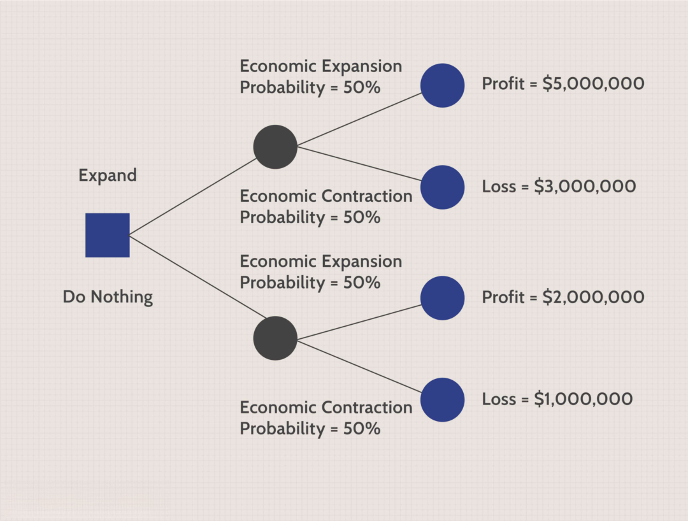

Algorithmic trading, commonly referred to as algo trading, employs sophisticated mathematical models and formulas to execute trading decisions at exceptional speeds, often faster than human traders can achieve. By automating these processes, algo trading aims to capitalize on market efficiencies and improve the precision of trades. However, despite its technological prowess and advantages, algorithmic trading presents inherent risks, particularly the possibility of strategy failure, which can result in substantial financial repercussions.

This article seeks to explore the diverse factors contributing to the likelihood of strategy failure in algorithmic trading and identify effective strategies to mitigate these risks. While the automation and speed of algo trading provide clear benefits, understanding the probability dynamics underlying these strategies is essential for both novice and experienced traders striving to optimize their approach.



One of the central aspects of this exploration involves the utilization of statistical techniques, notably Monte Carlo simulations. These simulations are vital for gaining insight into potential trading outcomes by allowing traders to model complex scenarios with multiple variables. By leveraging Monte Carlo simulations, traders can better anticipate possible failures and adapt their strategies accordingly, thus reducing the risk of adverse financial impacts.

In summary, algorithmic trading represents a robust and influential component of contemporary financial markets. However, the inherent complexities and dynamic nature of these markets necessitate an informed approach to managing the risk of strategy failure. Through a detailed examination of statistical methods and their applications, traders can enhance their understanding of strategy vulnerabilities and improve the resilience of their trading practices.

## Table of Contents

## Understanding the Risks in Algo Trading

Algorithmic trading, often referred to as algo trading, is inherently fraught with various internal and external risks that can significantly impact the success or failure of trading strategies. Understanding these risks is vital for traders looking to optimize their strategies and minimize the chances of adverse outcomes.

One of the predominant external risks associated with algo trading is market [volatility](/wiki/volatility-trading-strategies). Financial markets are inherently volatile, influenced by a plethora of factors like economic news, geopolitical events, and sudden financial crashes. These fluctuations can dramatically affect the performance of algorithmic strategies, particularly if they have not been designed to accommodate rapid market changes. For example, strategies that thrive in stable conditions may falter dramatically during volatile times, leading to significant losses.

Another risk [factor](/wiki/factor-investing) involves system errors. Algorithmic trading relies heavily on the underlying technology infrastructure, including hardware, software, and network systems. Any failure or glitch in these systems can lead to erroneous trades or missed opportunities. For example, a latency issue could result in executing trades at unexpected prices, while a software bug might trigger unintended trading activities. Ensuring robust, fault-tolerant systems is crucial for reducing the possibility of such errors.

Additionally, incorrect model assumptions pose a significant internal risk. Algorithms are built upon mathematical models that assume certain market behaviors and conditions. However, if these assumptions prove incorrect or are overly simplistic, it can lead to suboptimal trading outcomes. For instance, if a model assumes a linear relationship between certain financial variables that are, in reality, non-linear, the resulting strategy will likely underperform or fail.

To address these risks, risk management practices, such as [backtesting](/wiki/backtesting), are employed. Backtesting involves running an algorithm through historical market data to evaluate its past performance. While it is a useful tool for assessing an algorithm's historical effectiveness, it is not foolproof. One major limitation of backtesting is its reliance on historical data, which may not accurately predict future market conditions. Excessive reliance can lead to overfitting, where the algorithm is tailored too closely to past data, compromising its ability to adapt to new market environments.

Overfitting occurs when a model captures noise rather than the underlying market dynamics, resulting in strategies that perform well during backtests but poorly in live markets. To mitigate overfitting, traders should incorporate techniques such as cross-validation and include out-of-sample testing to ensure their models are not only historical but also reasonably predictive of future performance.

Identifying and understanding these risks lays the groundwork for developing more robust [algorithmic trading](/wiki/algorithmic-trading) strategies. By acknowledging the potential pitfalls associated with market volatility, system errors, and misplaced model assumptions, traders can build resilience into their trading strategies, ultimately enhancing their probability of achieving sustained success in an unpredictable market landscape.

## The Role of Monte Carlo Simulations

Monte Carlo simulations are a vital tool for modeling complex systems influenced by random variables, and they have become an integral part of modern algorithmic trading strategies. These simulations allow traders to assess the variability and potential outcomes of trading strategies by modeling a large number of possible future scenarios. This is particularly important in trading, where uncertainty and randomness are inherent.

By using Monte Carlo simulations, traders can estimate critical metrics such as the risk of ruin, maximum drawdowns, and expected annual rates of return. Risk of ruin refers to the probability that a trading strategy will deplete a portfolio to a level where recovery is statistically improbable. Maximum drawdown measures the largest peak-to-trough decline in a portfolio, helping traders understand potential losses during adverse periods. Annual rates of return provide an average expectation of returns over a year, accounting for fluctuations in market conditions.

The implementation of Monte Carlo simulations involves generating a wide range of random paths for asset prices based on historical data and estimated volatility. These paths reflect potential market conditions that a trading strategy might encounter. By analyzing a large number of these paths, traders can observe how their strategies might perform under various scenarios. This process enhances their ability to manage risk and make informed decisions.

A practical example of implementing a Monte Carlo simulation for trading involves the generation of simulated price paths using a geometric Brownian motion model, expressed by the formula:

$$
S(t) = S_0 \times \exp((\mu - 0.5 \times \sigma^2) \times t + \sigma \times W(t))
$$

where:
- $S(t)$ is the simulated asset price at time $t$,
- $S_0$ is the initial asset price,
- $\mu$ is the expected rate of return,
- $\sigma$ is the volatility of the asset,
- and $W(t)$ represents a Wiener process or standard Brownian motion.

Traders can leverage Python libraries like NumPy to perform these simulations efficiently. For example, the following Python code snippet demonstrates how to generate simulated price paths for a given time horizon:

```python
import numpy as np

def simulate_price_paths(S0, mu, sigma, T, n_paths, n_steps):
    dt = T / n_steps
    price_paths = np.zeros((n_steps, n_paths))
    price_paths[0] = S0

    for t in range(1, n_steps):
        dW = np.random.normal(scale=np.sqrt(dt), size=n_paths)
        price_paths[t] = price_paths[t-1] * np.exp((mu - 0.5 * sigma**2) * dt + sigma * dW)

    return price_paths

# Example parameters
S0 = 100     # Initial asset price
mu = 0.05    # Expected annual return
sigma = 0.2  # Annual volatility
T = 1.0      # Time horizon in years
n_paths = 10000  # Number of simulation paths
n_steps = 252    # Number of time steps (trading days)

price_simulations = simulate_price_paths(S0, mu, sigma, T, n_paths, n_steps)
```

By analyzing the results of these simulations, traders can refine their strategies to absorb potential shocks and avoid significant losses. This capability not only supports more informed decision-making but also helps traders develop resilience against the uncertainties inherent in financial markets.

## Advantages and Disadvantages of Using Monte Carlo

Monte Carlo analysis serves as a powerful tool for traders, enabling them to approach decision-making with a probabilistic mindset rather than a deterministic one. This approach is particularly beneficial in dealing with the uncertainties intrinsic to financial markets. By simulating a wide array of potential market conditions and outcomes, traders can glean insights into possible worst-case scenarios and the variability of results. This preparedness aids in crafting robust strategies that are better equipped to handle adverse market conditions.

One of the key advantages of Monte Carlo simulations is their ability to model a range of outcomes based on historical data and forecast models. For example, by accounting for asset returns, traders can evaluate the risk of ruin—a metric indicating the probability that a trading strategy will lead to a substantial loss of capital. Similarly, Monte Carlo analysis can help estimate maximum drawdowns, offering insights into the potential peak-to-trough declines in portfolio value. The formula $\text{Drawdown} = \frac{\text{Peak Value} - \text{Trough Value}}{\text{Peak Value}}$ is critical in these assessments, allowing traders to understand and manage downside risk effectively.

However, the utility of Monte Carlo simulations is contingent upon the quality and stability of the input data. Simulations rely heavily on past market data, which can be a double-edged sword. While historical data provides a foundation for estimating future scenarios, it also presents limitations. If the data is unstable or if the market undergoes significant structural changes, the validity of Monte Carlo outcomes is compromised. An overreliance on incorrect models or outdated data may lead to misguided confidence in predicted outcomes.

Traders should be mindful of the limitations that come with Monte Carlo methods. The simulations can be computationally intensive and may require assumptions about the statistical properties of asset returns, such as normal distribution and constant variance, which may not hold in reality. Additionally, overfitting is a risk when models are excessively tailored to historical data, potentially leading to poor performance in unforeseen market conditions.

In conclusion, Monte Carlo simulations offer a formidable toolset for risk assessment and strategy optimization in trading. By acknowledging both their strengths and weaknesses, traders can integrate these simulations as part of a broader, more comprehensive approach to risk management. This balance ensures that while benefiting from insights into potential risks and rewards, traders maintain a critical perspective on the data and assumptions that underpin their models.

## Incorporating Probability Cones

Probability Cones provide a robust method for monitoring real-time trading performance by projecting potential future price ranges. This technique enables traders to visually assess the expected variability of an asset's price over time, thereby allowing for more informed decision-making. Similar to Statistical Process Control (SPC) used in manufacturing, Probability Cones help traders identify when their trading strategy deviates from expected performance boundaries, signaling when adjustments might be necessary.

By focusing on statistical properties such as variance and distribution drawn from historical data, a Probability Cone can offer a visual representation of likely price paths. Accurate assumptions about these statistical properties are crucial; incorrect assumptions can lead to misleading conclusions about a strategy's potential risk and reward. The foundational idea is to use historical price volatility to project a range of likely future prices at various time horizons, thereby creating a "cone" shape on a graph.

An effective way to calculate a Probability Cone is by using the continuously compounded returns of an asset. The steps to project the cone can involve:

1. Calculate the log returns of the historical price data as:
$$
   \text{Log Return} = \ln\left(\frac{P_t}{P_{t-1}}\right)

$$
   where $P_t$ is the price at time $t$ and $P_{t-1}$ is the price at the previous time step.

2. Determine the historical volatility ($\sigma$) of these returns.

3. Define the expected future volatility over the desired time horizon using:
$$
   \sigma_{\text{future}} = \sigma \times \sqrt{T}

$$
   where $T$ is the number of time periods into the future.

4. Use the volatility to estimate potential price movements at various confidence intervals (e.g., 68%, 95%) to create the boundaries of the cone.

The implementation of a Probability Cone can be done programmatically, for example, using Python:

```python
import numpy as np
import pandas as pd
import matplotlib.pyplot as plt

def calculate_probability_cone(prices, periods_forward, confidence_level):
    log_returns = np.log(prices / prices.shift(1))
    volatility = log_returns.std()
    future_volatility = volatility * np.sqrt(periods_forward)

    # Assume a normal distribution
    future_mean = log_returns.mean() * periods_forward
    z_score = {68: 1, 95: 1.96, 99: 2.58}

    upper_bound = prices.iloc[-1] * np.exp(future_mean + z_score[confidence_level] * future_volatility)
    lower_bound = prices.iloc[-1] * np.exp(future_mean - z_score[confidence_level] * future_volatility)

    return lower_bound, upper_bound

# Example usage with dummy data
price_data = pd.Series([100, 102, 101, 105, 107])
lower, upper = calculate_probability_cone(price_data, 10, 95)

plt.plot(price_data.index, price_data, label='Price')
plt.fill_between([price_data.index[-1], price_data.index[-1] + 10], [lower, lower], [upper, upper], color='gray', alpha=0.3, label='95% Confidence Interval')
plt.legend()
plt.show()
```

By integrating Probability Cones into their strategy, traders can objectively decide whether to modify or halt a strategy in anticipation of potential deviations from expected market movements, thus minimizing unnecessary losses. When combined with Monte Carlo simulations, Probability Cones enhance the capability to predict a strategy's reliability and efficiency, creating a comprehensive toolkit for managing unforeseen market events and enhancing the robustness of algorithmic trading strategies.

## Conclusion

Algorithmic trading involves significant risks due to the volatile and ever-changing nature of financial markets. To mitigate these risks, traders can leverage statistical tools like Monte Carlo simulations and Probability Cones. These methodologies facilitate a more profound understanding of the risk profiles associated with different strategies, thereby aiding traders in making informed decisions.

Monte Carlo simulations offer robust frameworks for predicting potential market outcomes by analyzing random variables and various scenarios. This predictive power aids in assessing metrics such as risk of ruin and expected returns, even under chaotic market conditions. However, it is essential to recognize that the accuracy of these predictions depends heavily on the quality and relevance of the input data. Variability in data quality or unforeseen market changes may diminish the reliability of these forecasts.

Probability Cones add another layer of analytical depth by visualizing expected price ranges, enabling traders to monitor strategy performance in real-time. They allow traders to identify deviations from expected outcomes, prompting timely adjustments to trading strategies before losses become significant.

Despite their benefits, these statistical tools have limitations. Overconfidence in predictive models and reliance on historical data pose potential pitfalls. While Monte Carlo simulations and Probability Cones provide valuable insights, they should not be viewed as infallible predictors of market behavior. Instead, they should supplement a comprehensive risk management strategy that considers a wide array of market scenarios.

Incorporating probability-focused strategies requires a disciplined approach. By meticulously applying these statistical tools, traders can develop more resilient trading practices. This approach not only enhances decision-making but also enables traders to better navigate market uncertainties, ultimately increasing the likelihood of sustainable success in algorithmic trading.

## References & Further Reading

[1]: Bergstra, J., Bardenet, R., Bengio, Y., & Kégl, B. (2011). ["Algorithms for Hyper-Parameter Optimization."](https://papers.nips.cc/paper/4443-algorithms-for-hyper-parameter-optimization) Advances in Neural Information Processing Systems 24.

[2]: ["Advances in Financial Machine Learning"](https://www.amazon.com/Advances-Financial-Machine-Learning-Marcos/dp/1119482089) by Marcos Lopez de Prado

[3]: ["Evidence-Based Technical Analysis: Applying the Scientific Method and Statistical Inference to Trading Signals"](https://www.amazon.com/Evidence-Based-Technical-Analysis-Scientific-Statistical/dp/0470008741) by David Aronson

[4]: ["Machine Learning for Algorithmic Trading"](https://github.com/stefan-jansen/machine-learning-for-trading) by Stefan Jansen

[5]: ["Quantitative Trading: How to Build Your Own Algorithmic Trading Business"](https://books.google.com/books/about/Quantitative_Trading.html?id=j70yEAAAQBAJ) by Ernest P. Chan