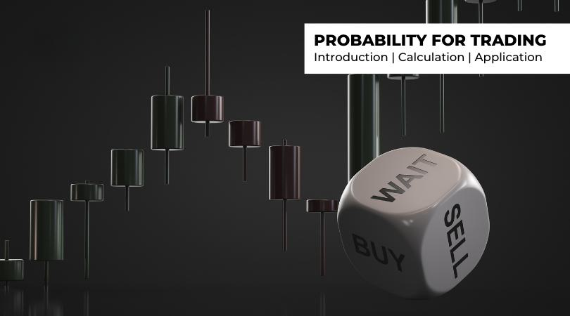

Algorithmic trading, commonly known as algo trading, has significantly transformed the methodology applied by traders within the financial markets. At the heart of this transformation lies the concept of trading probability, a pivotal element that informs the creation and deployment of trading strategies. Probability plays an essential role in guiding algorithmic decisions by enabling traders to evaluate the likelihood of various market events. This allows them to navigate the complexities of market dynamics with greater precision and objectivity.

Algo trading strategies are typically underpinned by models that incorporate probability theory as a fundamental component. These models enable algorithms to operate autonomously, making rapid, data-driven decisions without the interference of human emotion. As a result, they are capable of executing trades efficiently and systematically, deriving conclusions from statistical analyses of historical market data and other variables.



The integration of probability into algorithmic models enhances trading outcomes by providing a structured approach to decision-making. By employing probability, traders can optimize trading strategies, ensuring they are not only reactive to market changes but also capable of anticipating potential market shifts. This intelligent anticipation stems from the algorithm's ability to process and analyze large datasets to forecast probable future trends and price movements.

The significance of probability in algo trading lies in its ability to offer a balanced framework that optimizes risk and opportunity. It enables traders to quantify uncertainties and create strategies that are robust across varied market conditions. Probability theory thus serves as a foundational element in reducing the inherent risks in trading while leveraging opportunities for profitable outcomes.

In this article, we continue to explore how probability theory is incorporated into the fabric of algorithmic trading models, its implications for market performance, and ways to refine these strategies for improved results. Through the lens of probability, the article sheds light on the strategic advantages that algo trading provides, driving a systematic and emotion-free approach to engage with volatile markets effectively.

## Table of Contents

## Understanding Probability in Algo Trading

In algorithmic trading, probability serves as a foundational element for making informed trading decisions and crafting precise algorithms. Probability quantifies the likelihood of potential price movements, allowing traders to formulate strategies based on expected outcomes rather than speculation. By relying on pre-programmed instructions, algorithmic trading systems bypass human emotions, instead utilizing statistical and probability models for decision-making processes.

Central to the understanding of probability in trading is the concept of probability distributions. These mathematical functions describe all the possible values that a random variable can take, as well as the likelihood of each value. In financial markets, price movements of assets can be considered random variables, and probability distributions help traders model and predict these movements.

Several probability distributions are particularly relevant to trading. The normal distribution, also known as the Gaussian distribution, is often used due to its properties related to the central limit theorem. Markets often exhibit a bell curve pattern for returns when aggregated over a sufficiently long period. This distribution is characterized by its symmetry around the mean, with most outcomes clustering around the average.

However, financial markets can also experience skewness and heavy tails, phenomena not well captured by a normal distribution. In such cases, alternative probability distributions, such as log-normal or Pareto distributions, may be more appropriate. These distributions accommodate the asymmetric behavior and the occurrence of extreme values often observed in market data.

Algorithmic trading models integrate these probability distributions to estimate the likelihood of different price levels or market scenarios. For instance, a trader might use a normal distribution to set a confidence interval around expected price movement, thus providing a probabilistic range within which future prices are likely to fall.

Here is a simple Python example to calculate the mean and standard deviation of a set of returns, which lays the groundwork for assuming a normal distribution for future price predictions:

```python
import numpy as np

# Assume return_data is a list of historical daily returns of a stock
return_data = [0.002, 0.005, -0.003, 0.004, 0.001]  # Sample data

mean_return = np.mean(return_data)
std_dev_return = np.std(return_data)

print(f"Mean Return: {mean_return}")
print(f"Standard Deviation of Return: {std_dev_return}")
```

In this example, the mean and standard deviation are calculated, indicating the central tendency and variability of the returns, respectively. A trader can use this information to define expected price movements, set trading levels, or adjust algorithm parameters accordingly.

Through these probability-based approaches, [algorithmic trading](/wiki/algorithmic-trading) enhances its capacity to make systematic trading decisions, representing an evolution from instinct-driven to data-driven strategies. This integration of probability theory enriches algorithmic models, fostering resilient trading strategies capable of adapting to various market conditions.

## The Importance of Probability in Developing Algo Trading Strategies

Probability serves as a cornerstone in the development of algorithmic trading strategies by offering a systematic framework to predict and quantify market events. This predictive capacity is essential for crafting strategies that can yield profitable outcomes. By utilizing probability, traders can effectively gauge potential price movements and make informed decisions about their trading tactics.

One of the primary benefits of integrating probability into trading strategies is its role in risk assessment. Probability provides statistical backing to evaluate the potential upside and downside risks of a given trade. This enables traders to make calculated choices concerning potential returns and losses, enhancing the robustness of their strategies. For instance, calculating the expected value of a trade, which combines probabilities of different outcomes with their respective payoffs, can guide traders toward more lucrative trades. The expected value (EV) is given by the equation:

$$
\text{EV} = \sum (P_i \times V_i)
$$

where $P_i$ represents the probability of an outcome and $V_i$ is the value of that outcome.

Incorporating probability facilitates the design of algorithms that can withstand market fluctuations. Algorithms grounded in probabilistic models are particularly adept at adapting to changing market conditions. This adaptability is crucial in markets known for their [volatility](/wiki/volatility-trading-strategies) and unpredictability. For example, a probabilistic model may use Monte Carlo simulations to evaluate a wide array of potential future price paths, allowing traders to assess various risk scenarios and refine their strategies to mitigate potential losses.

Examples of successful probabilistic approaches in algo trading can be seen in the use of strategies like mean reversion and statistical [arbitrage](/wiki/arbitrage). Mean reversion, predicated on the probability that asset prices will revert to their historical mean, can be implemented by algorithms that identify when price deviations are statistically significant enough to signal a potential trading opportunity. By leveraging historical data and calculating z-scores to ascertain the extent of price divergence, traders can strategically enter trades anticipated to revert to the mean.

Similarly, [statistical arbitrage](/wiki/statistical-arbitrage) exploits the probability of price differences between correlated assets, relying on historical price movements to identify temporary inefficiencies in market pricing. Algorithms programmed with statistical models can quickly execute trades when such opportunities arise, capitalizing on the expected convergence of prices.

In summary, the integration of probability into algo trading strategies enhances the ability to predict market outcomes, assess risks, and adapt to market dynamics. By leveraging these probabilistic approaches, traders can construct strategies that are not only grounded in statistical rigor but also poised to capitalize on dynamic financial markets.

## Calculating Trading Probability

In algorithmic trading, calculating trading probability relies on an analysis of historical price data, current market conditions, and modeling potential outcomes. Traders use this analysis to forecast the likelihood of certain trades being profitable. Key components essential in this calculation include determining win rates, average profits, and loss ratios derived from past trading activities.

To begin, the win rate is defined as the ratio of successful trades to the total number of trades. Calculating this ratio provides traders with a fundamental understanding of their trading performance and helps in estimating future probabilities of success. Mathematically, the win rate can be expressed as:

$$
\text{Win Rate} = \frac{\text{Number of Winning Trades}}{\text{Total Number of Trades}}
$$

Average profit, another critical parameter, represents the mean profit gained per winning trade. It is calculated by dividing the total profit from winning trades by the number of those trades. Similarly, the average loss is determined by dividing the total loss by the number of losing trades. These metrics are crucial as they aid in assessing the profitability of trades in the long run.

The loss ratio, which is the ratio of average loss to average profit, is a significant indicator of risk. A lower ratio typically suggests that the trading strategy is more likely to succeed over time. This can be mathematically represented as:

$$
\text{Loss Ratio} = \frac{\text{Average Loss}}{\text{Average Profit}}
$$

Utilizing these components, traders can calculate the probability of a successful trade. One practical method to incorporate these metrics is through the Expectancy Formula, widely used in trading strategy [backtesting](/wiki/backtesting):

$$
\text{Expectancy} = (\text{Win Rate} \times \text{Average Profit}) - ((1 - \text{Win Rate}) \times \text{Average Loss})
$$

This formula offers an expected value of the trading strategy by weighing both profits and losses proportionate to their likelihood. A positive expectancy implies that, over numerous trades, the strategy tends to be profitable.

In algorithmic trading scenarios, implementing these calculations can be streamlined using programming languages like Python. Below is a Python snippet demonstrating how to compute these metrics:

```python
def calculate_metrics(trades):
    winning_trades = [trade for trade in trades if trade > 0]
    losing_trades = [trade for trade in trades if trade < 0]

    win_rate = len(winning_trades) / len(trades)
    average_profit = sum(winning_trades) / len(winning_trades) if winning_trades else 0
    average_loss = sum(losing_trades) / len(losing_trades) if losing_trades else 0

    loss_ratio = abs(average_loss / average_profit) if average_profit != 0 else 0
    expectancy = (win_rate * average_profit) - ((1 - win_rate) * abs(average_loss))

    return win_rate, average_profit, average_loss, loss_ratio, expectancy

# Example usage:
trades = [100, -50, 200, -70, 150] # Example trade outcomes
metrics = calculate_metrics(trades)
print(f"Win Rate: {metrics[0]}, Average Profit: {metrics[1]}, Average Loss: {metrics[2]}, Loss Ratio: {metrics[3]}, Expectancy: {metrics[4]}")
```

This code processes an array of trade outcomes to calculate win rate, average profit, average loss, loss ratio, and expectancy, offering a comprehensive view of the trading strategy's probability of success. In conclusion, understanding these metrics allows traders to optimize their algorithmic trading strategies and align them with their risk management goals.

## Types of Probability in Trading

In trading, probabilities can be broadly categorized into two primary types: subjective and objective probability. Each type provides a unique approach to assessing market conditions and making trading decisions.

**Subjective Probability**

Subjective probability is derived from an individual's personal judgment or intuition. It depends significantly on the trader's past experiences, knowledge, and insights about the market. Unlike objective probability, subjective probability does not require rigorous data analysis or statistical computation. Instead, it reflects a trader's confidence or belief about the occurrence of a particular market event. For example, a trader might intuitively feel that a stock is likely to rise based on recent news or market sentiment. While subjective probability can capture nuances that hard data might miss, it introduces the risk of biases and errors stemming from emotional or cognitive biases.

**Objective Probability**

Objective probability, or statistical probability, is based on empirical data and mathematical calculations. This type of probability relies on historical market data and statistical models to estimate the likelihood of different market events. By employing formal statistical methods, such as probability distributions and hypothesis testing, traders can make more informed and consistent decisions. Objective probability seeks to minimize biases by grounding predictions in quantifiable evidence. For instance, calculating the probability of a stock price increase based on its historical volatility and price patterns exemplifies the application of objective probability.

To further illustrate objective probability, consider a simple probability model using a coin toss where the probability $P$ of obtaining heads is calculated as:

$$
P(\text{heads}) = \frac{\text{Number of heads observed}}{\text{Total number of tosses}}
$$

In a trading context, this concept can be extended to assess probabilities such as the likelihood of a certain price level being reached or the probability of an asset returning within a specific range over a given period.

**Importance for Algo Traders**

Understanding both types of probability is vital for algorithmic traders. Subjective probability can aid in developing innovative trading ideas informed by an experienced trader's intuition or market feel, which can then be translated into algorithmic rules. Conversely, objective probability offers a solid framework for testing and validating these ideas using statistical evidence. By integrating subjective insights with objective analysis, algo traders can enhance their strategies, thereby potentially increasing their chances of success.

Incorporating both subjective and objective probabilities allows traders to balance qualitative and quantitative aspects of trading, thus enabling a more well-rounded and adaptable approach to navigating financial markets.

## Application of Probability in Risk Management

Risk management is essential for successful trading, and integrating probability into this process enhances the trader's ability to manage potential risks. By estimating the likelihood of various loss events, traders can implement strategies such as setting stop-loss orders to limit potential damage. The application of probability aids in the objective assessment of risk, allowing traders to make strategic decisions based on calculated risk levels.

A critical technique within risk management involves calculating the probability of adverse events, which enables traders to protect their investments effectively. For instance, the calculation of Value at Risk (VaR) is a commonly used measure in finance to assess potential losses. VaR is defined as the maximum loss over a given time period at a certain confidence level. If a trader wishes to ensure that losses on a portfolio won't exceed $10,000 at a 95% confidence level, they must calculate the VaR accordingly.

Mathematically, the VaR for a portfolio can be derived using the formula:

$$
\text{VaR} = \mu + Z \times \sigma
$$

where $\mu$ is the expected return, $Z$ is the Z-score corresponding to the desired confidence level, and $\sigma$ is the standard deviation of the portfolio's returns.

Risk assessment also involves evaluating the expected shortfall (ES), which extends the VaR concept by considering the average loss beyond the VaR threshold. This offers a more comprehensive view of potential extreme losses.

In Python, traders typically calculate VaR and ES using historical data:

```python
import numpy as np
import scipy.stats as sts

# Historical returns of a portfolio
returns = np.random.normal(loc=0.001, scale=0.02, size=1000)

# Parameters
confidence_level = 0.95
alpha = 1 - confidence_level

# VaR calculation
var = np.percentile(returns, 100 * alpha)

# ES calculation
es = returns[returns < var].mean()

print(f"VaR at {confidence_level*100}% confidence: {-var}")
print(f"Expected Shortfall: {-es}")
```

Additionally, probability aids in the establishment of acceptable risk levels by incorporating techniques such as Monte Carlo simulations. These simulations generate a multitude of possible future outcomes based on random sampling, offering an insight into the likelihood of different risk scenarios.

Stop-loss orders integrate probability by setting predefined selling prices to minimize losses when an asset's price declines. This technique ensures that trading strategies have a built-in mechanism for loss prevention. For example, if a trader estimates a 10% probability of an event leading to a significant price drop, they can set a stop-loss order just below recent support levels to mitigate potential losses.

Bayesian probability provides another dimension to risk management by updating the likelihood of risk outcomes based on new information. Traders use Bayesian models to refine their risk assessments as new evidence emerges, improving the adaptability and responsiveness of their risk management strategies.

In summary, probability forms the foundation of effective risk management in algo trading by enabling traders to quantify risks, set strategic thresholds, and prepare for uncertainties. Employing probabilistic methods and models equips traders with the tools to approach risk systematically, ensuring more informed and controlled trading decisions.

## Probability Distributions in Algo Trading

Probability distributions serve as indispensable tools in algorithmic trading, as they provide a mathematical framework to describe the potential outcomes of financial markets based on past data. By modeling the behavior of market variables, probability distributions enable traders to forecast future price movements and detect trends with precision.

The normal distribution, characterized by its bell-shaped curve, is one of the most widely used probability distributions in trading. It is defined by two parameters: the mean ($\mu$) and the standard deviation ($\sigma$). This distribution is often employed to model the returns of financial instruments, assuming that they follow a symmetrical pattern around the mean. The central limit theorem underpins the usage of the normal distribution, suggesting that, under certain conditions, the sum of random variables tends toward a normal distribution, irrespective of the shape of the original distribution. Traders utilize this distribution to identify the probability of asset returns falling within a specified range, which aids in strategic decision-making.

The binomial distribution, on the other hand, is used to model the number of successes in a fixed number of binary (yes/no) trading trials. Each trial represents an opportunity for a specific outcome, such as whether a stock price will increase or decrease. The distribution is defined by the parameters $n$ (the number of trials) and $p$ (the probability of success on each trial). In algo trading, a binomial model might assess the probability of a stock achieving a particular price point over several trading days. The distribution assists in developing strategies that capitalize on patterns of favorable outcomes over time.

Lastly, the Poisson distribution is well-suited for modeling the frequency of rare events within a fixed interval of time or space, which makes it useful for counting occurrences such as large market moves or specific trading signals. Defined by its parameter $\lambda$ (the average rate of occurrence), the Poisson distribution can help traders predict the likelihood of a specific number of events occurring in a given time frame. This application is particularly relevant in high-frequency trading, where capturing fleeting market opportunities is essential.

Practical implementations often involve utilizing these distributions in backtesting trading algorithms. For example, a trader may employ Python to simulate historical trading scenarios and calculate the probability of future price movements based on specific statistical models:

```python
import numpy as np
import scipy.stats as stats

# Generate normally distributed data
returns = np.random.normal(0, 1, 1000)

# Calculate the probability of returns within a range (e.g., -1 to 1)
probability_within_range = stats.norm.cdf(1, np.mean(returns), np.std(returns)) - stats.norm.cdf(-1, np.mean(returns), np.std(returns))

print(f"Probability of returns between -1 and 1: {probability_within_range:.2f}")
```

In summary, incorporating probability distributions such as the normal, binomial, and Poisson into trading algorithms equips traders with the ability to model market behaviors, forecast potential outcomes, and make informed decisions about entering or exiting trades. These statistical tools are vital for designing strategies that can withstand the uncertainties and volatility inherent in financial markets.

## Case Studies and Practical Implementations

Case studies in algorithmic trading provide valuable insights into how probability theory can be harnessed for profitable trading. Numerous trading algorithms have successfully employed probabilistic models to predict market movements and execute trades. One notable example is the implementation of statistical arbitrage strategies. These strategies often use mean-reversion models to speculate that the price of a financial instrument will revert to its mean or average value over time. By calculating probabilities of price changes, traders can exploit temporary imbalances for profit.

Major trading firms and hedge funds, such as Renaissance Technologies and Two Sigma, are known for their extensive use of probability in developing sophisticated trading algorithms. These firms apply complex statistical models, including [machine learning](/wiki/machine-learning) algorithms, to assess market data and determine optimal trading opportunities. Renaissance Technologies, for example, employs strategies that analyze historical price movements and probabilities of certain market behaviors occurring. This approach has allowed them to maintain a competitive edge and achieve substantial returns.

Real-world examples reveal both successes and failures in integrating probability into trading algorithms. For instance, the 2007–2008 financial crisis highlighted the limitations of some probabilistic models that underestimated tail risks—events with very low probabilities but severe consequences. Some algorithms failed to adapt to rapidly changing market conditions during this period, resulting in significant losses. Conversely, algorithms that anticipated large market shifts and adjusted their models accordingly managed to generate profits amidst the crisis.

From these case studies, several lessons can be extracted to improve personal trading strategies. Firstly, it is crucial to incorporate adaptive mechanisms into trading algorithms to account for unforeseen market conditions. Utilizing machine learning models that continuously learn and evolve based on new data can enhance adaptability. Secondly, incorporating multiple probability distributions, such as fat-tailed distributions, can better capture potential extreme events in markets, reducing the risk of unexpected losses.

Practical implementation of these lessons can be demonstrated through basic Python code for a simple mean-reversion strategy:

```python
import numpy as np
import pandas as pd

# Simulated historical returns
historical_returns = np.random.normal(0.001, 0.02, 1000)

# Parameters
window_size = 20
mean_reversion_threshold = 1.5  # standard deviations

# Calculate moving averages and standard deviations
moving_avg = pd.Series(historical_returns).rolling(window=window_size).mean()
moving_std = pd.Series(historical_returns).rolling(window=window_size).std()

# Identify trading signals
buy_signals = historical_returns < (moving_avg - mean_reversion_threshold * moving_std)
sell_signals = historical_returns > (moving_avg + mean_reversion_threshold * moving_std)

# Simulate trades
profits = []
position = 0

for i in range(len(historical_returns)):
    if buy_signals[i] and position == 0:
        position = 1  # Enter position
    elif sell_signals[i] and position == 1:
        profits.append(historical_returns[i])  # Exit position and record profit
        position = 0

total_profit = np.sum(profits)
print("Total Profit from Mean-Reversion Strategy:", total_profit)
```

This code snippet simulates a basic mean-reversion trading strategy, outlining practical steps a trader might follow to identify price anomalies using probability estimates. By iterating and refining this approach based on probabilistic insights, traders can potentially improve their trading outcomes.

## Conclusion

Trading probability is a critical component in the development and execution of successful algorithmic trading strategies. This conclusion synthesizes the integral role of probability in algorithmic trading and underscores the benefits of incorporating probabilistic models.

Understanding and applying probability allows traders to manage risks effectively while capitalizing on potential market opportunities. By using probability, traders can quantify the uncertainty inherent in the financial markets and make informed decisions on trade entries, exits, and position sizing. For instance, employing probabilistic methods like Value at Risk (VaR) provides a statistical measure of potential loss within a given confidence interval, thereby assisting traders in setting appropriate risk limits.

Algorithmic trading, underpinned by probabilistic models, offers a systematic and emotion-free approach to navigating volatile markets. These models automate decision-making processes based on pre-defined statistical criteria, such as estimating the probability distributions of asset returns. By leveraging probability distributions, such as the normal distribution or its variations, algorithms can predict future price movements and execute trades without human biases. This systematic framework enhances consistency and objectivity in trading operations, optimizing the performance of trading portfolios.

To achieve sustained success in trading, ongoing learning and refinement of trading strategies based on probability insights are essential. This includes continuously updating algorithms to incorporate newly available data and adapting to changing market conditions. As financial markets evolve, traders must consistently evaluate the performance of their trading models and improve them using insights derived from probabilistic analysis. Such an iterative approach ensures that trading algorithms remain robust, adaptive, and aligned with market dynamics.

In summary, mastering the principles of probability and integrating them into algorithmic trading strategies can significantly enhance a trader's ability to navigate and profit from the complexities of financial markets. By continuing to refine these strategies, traders can maintain a competitive edge and achieve greater consistency in their trading outcomes.

## References & Further Reading

[1]: Bergstra, J., Bardenet, R., Bengio, Y., & Kégl, B. (2011). ["Algorithms for Hyper-Parameter Optimization."](https://papers.nips.cc/paper/4443-algorithms-for-hyper-parameter-optimization) Advances in Neural Information Processing Systems 24.

[2]: ["Advances in Financial Machine Learning"](https://www.amazon.com/Advances-Financial-Machine-Learning-Marcos/dp/1119482089) by Marcos Lopez de Prado

[3]: ["Evidence-Based Technical Analysis: Applying the Scientific Method and Statistical Inference to Trading Signals"](https://www.amazon.com/Evidence-Based-Technical-Analysis-Scientific-Statistical/dp/0470008741) by David Aronson

[4]: ["Machine Learning for Algorithmic Trading"](https://github.com/stefan-jansen/machine-learning-for-trading) by Stefan Jansen

[5]: ["Quantitative Trading: How to Build Your Own Algorithmic Trading Business"](https://books.google.com/books/about/Quantitative_Trading.html?id=j70yEAAAQBAJ) by Ernest P. Chan