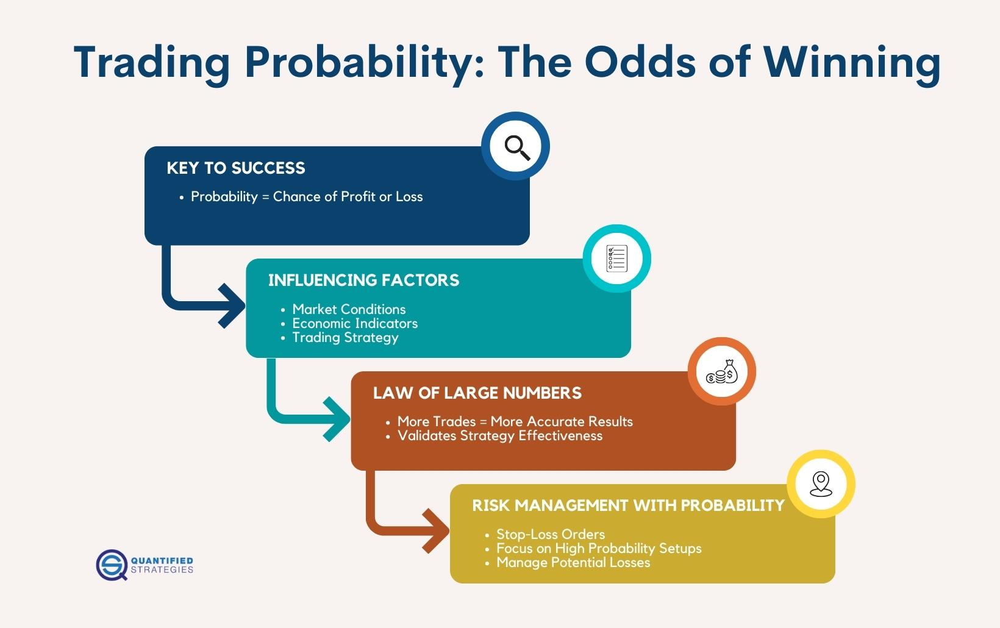

## Table of Contents

## What is probability and why is it important in trading?

Probability is a way to measure how likely something is to happen. It's like guessing the chances of rain tomorrow, but with numbers. In trading, probability helps traders understand the chances of making money or losing it on a trade. It's not about knowing for sure what will happen, but about making smarter guesses based on past information and patterns.

Understanding probability is important in trading because it helps traders manage risk. By knowing the likelihood of different outcomes, traders can decide how much money to put into a trade and when to get out. This can lead to better decisions and potentially more profits over time. It also helps traders stay calm and not make hasty decisions based on emotions, because they have a plan based on numbers and chances.

## How can basic probability concepts be applied to trading decisions?

Basic probability concepts can be used in trading to help make better decisions. Traders often look at how often a certain event has happened in the past, like a stock going up after a news release. They use this information to guess how likely it is to happen again. For example, if a stock has gone up 70% of the time after good earnings reports, a trader might think there's a 70% chance it will happen again. This helps them decide if it's worth buying the stock before the next earnings report.

Traders also use probability to manage risk. They might decide to only take trades where the probability of winning is higher than losing. For example, if a trader thinks there's a 60% chance a trade will be successful, they might decide to go for it, but if it's only 40%, they might pass. This way, over many trades, they hope to win more often than they lose. It's like playing a game where you want to pick the bets with the best odds.

## What is the difference between theoretical and empirical probability in trading?

Theoretical probability is like a guess you make before you start trading. It's based on what you think should happen if everything follows the rules. For example, if a coin is fair, you might say there's a 50% chance it will land on heads. In trading, theoretical probability might be used to guess what could happen based on a model or theory, like thinking a stock will go up because of a good earnings report. But, it doesn't always match what actually happens in the real world because markets can be unpredictable.

Empirical probability, on the other hand, is what you see happening in real life. It's based on data from the past. If you flip a coin 100 times and it lands on heads 60 times, the empirical probability of getting heads is 60%. In trading, empirical probability is used by looking at past trades or market data to see how often something has happened. For example, if a stock has gone up 70% of the time after a good earnings report in the past, a trader might use that number to guess what might happen next time. This way, empirical probability can help traders make decisions based on real data, but it's still not a guarantee because the future might not follow the past.

## How do traders use probability to manage risk?

Traders use probability to manage risk by figuring out how likely it is that a trade will make money or lose money. They look at past data to see how often a certain outcome has happened. For example, if a stock has gone up after good news 80% of the time in the past, a trader might think there's an 80% chance it will happen again. This helps them decide if a trade is worth the risk. If the chance of winning is high enough, they might decide to go ahead with the trade.

Traders also use probability to decide how much money to put into a trade. If the probability of winning is low, they might only risk a small amount of money. But if the probability of winning is high, they might be willing to risk more. This way, they try to balance the potential reward against the risk of losing money. By using probability, traders can make more informed decisions and hopefully lose less money over time.

## What are common probability distributions used in trading, such as the normal distribution?

One of the most common probability distributions used in trading is the normal distribution, also known as the bell curve. Traders use it to understand how prices might move around an average value. For example, if a stock's price is usually around $50, the normal distribution can show how likely it is for the price to be higher or lower than that. Traders use this to set up their trades, figuring out where to buy or sell based on where they think the price is most likely to go.

Another distribution used in trading is the lognormal distribution. This is helpful because stock prices can't go below zero, and the lognormal distribution takes that into account. It's often used to predict future stock prices because it fits the way prices can grow over time better than the normal distribution. Traders might use it to understand the potential growth of a stock or to figure out the risk of big price changes.

Lastly, the binomial distribution can be useful for traders who are looking at options trading. This distribution helps them understand the probability of a stock price going up or down by a certain amount over a set number of periods. It's like flipping a coin, where each flip represents a period, and heads or tails represents the stock price going up or down. This can help traders decide on the best strategies for buying or selling options based on their predictions of price movements.

## How can the concept of expected value be used in trading strategies?

Expected value is a way to figure out how much money you might make or lose on average from a trade. Traders use it to decide if a trade is worth doing. They look at all the possible outcomes of a trade, like the stock going up or down, and then they figure out how much money they would make or lose in each case. Then, they multiply each outcome by how likely it is to happen and add them all up. If the expected value is positive, it means on average, the trade could make money, so traders might decide to go for it. If it's negative, they might decide to skip the trade because it could lose money on average.

Traders can use expected value to make their trading strategies better. For example, if a trader knows that a certain stock goes up 70% of the time after good news, and they can make $100 if it goes up but lose $50 if it goes down, they can calculate the expected value. They would do this by multiplying $100 by 70% and adding it to $50 multiplied by 30%. If the result is positive, the trade might be worth taking because it's expected to make money over time. By using expected value, traders can make smarter choices about which trades to take and how much money to risk, helping them manage their money better and possibly make more profits in the long run.

## What role does the law of large numbers play in trading outcomes?

The law of large numbers is important in trading because it helps traders understand what might happen over many trades. It says that if you do the same thing a lot of times, like flipping a coin or making a trade, the results will get closer to what you expect on average. For traders, this means that if they make a lot of trades based on good information and smart guesses, their overall results should be close to what they expected. This can help them feel more confident about their trading plan, knowing that even if they lose on some trades, they should win more often over time.

In trading, the law of large numbers helps traders manage risk and make better decisions. If a trader knows that a certain strategy has a good chance of working based on past data, they can use this law to predict that over many trades, the strategy will likely be successful. This can help them decide how much money to risk on each trade and how to spread out their trades to balance wins and losses. By understanding this law, traders can focus on making many small, smart trades instead of trying to win big on just a few risky ones.

## How do traders incorporate conditional probability into their analysis?

Traders use conditional probability to figure out how likely something is to happen based on something else that has already happened. For example, a trader might want to know how likely it is that a stock will go up if a certain news event happens. They would look at past data to see how often the stock went up after that news in the past. This helps them make better guesses about what might happen next time the news comes out.

By using conditional probability, traders can make smarter decisions about when to buy or sell. If the data shows that a stock goes up 80% of the time after good earnings reports, a trader might decide to buy the stock before the next earnings report comes out. This way, they can use the information they have to increase their chances of making money. Conditional probability helps traders see the connections between different events and use that information to plan their trades more carefully.

## What advanced statistical models are used to predict market movements?

Traders use advanced statistical models to try and predict how the market will move. One common model is the autoregressive integrated moving average (ARIMA) model. This model looks at past price data to predict future prices. It's like trying to guess the next number in a pattern by looking at the numbers that came before. Traders use ARIMA to see if there are any trends or patterns in how a stock's price has moved in the past, which can help them guess where it might go next.

Another model that traders use is the GARCH (Generalized Autoregressive Conditional Heteroskedasticity) model. This model is good at predicting how much prices might change, which is called volatility. It looks at how prices have changed in the past to guess how they might change in the future. If a stock has been moving a lot lately, the GARCH model might predict that it will keep moving a lot. Traders use this information to decide how much risk to take on their trades.

Machine learning models are also becoming popular for predicting market movements. These models can look at a lot of different kinds of data, not just price data, to make their predictions. For example, they might look at news articles, social media posts, and economic reports to try and guess what will happen next in the market. Traders use [machine learning](/wiki/machine-learning) to find patterns that might be too complicated for simpler models to see. This can help them make better predictions and hopefully make more money.

## How can traders use Monte Carlo simulations to assess trading strategies?

Traders use Monte Carlo simulations to test their trading strategies by running them many times with different possible outcomes. It's like playing out a trading plan over and over again, but each time, the market moves a little differently. By doing this, traders can see how their strategy might work in different situations. For example, if a trader wants to know how a strategy would do during a big market drop, they can use a Monte Carlo simulation to see what might happen. This helps them understand the risks and potential rewards of their plan.

Using Monte Carlo simulations can also help traders figure out how much money they might make or lose over time. By running thousands of different scenarios, traders can get a good idea of the average outcome of their strategy. If the average result is good, they might decide to use the strategy in real trading. If it's not, they can go back and change their plan before they lose any real money. This way, Monte Carlo simulations help traders make smarter decisions and manage their risk better.

## What are the limitations of using probability in trading?

Using probability in trading can be helpful, but it's not perfect. One big problem is that past data doesn't always tell us what will happen in the future. Just because a stock went up after good news in the past doesn't mean it will happen again. The market can change because of new events, like unexpected news or changes in the economy, which can make our predictions wrong. Also, probability can't predict big surprises or "black swan" events that happen out of nowhere and shake up the market.

Another issue is that probability gives us guesses, not sure things. Even if we think there's a high chance of making money on a trade, we can still lose. Traders need to be careful not to rely too much on numbers and forget about other important things, like what's happening in the world or how other people are feeling about the market. It's also hard to know all the probabilities because there's so much data and so many things that can affect the market. So, while probability can help us make better guesses, it's not a magic solution for trading.

## How do expert traders combine probability with other analytical methods to enhance decision-making?

Expert traders use probability to make guesses about what might happen in the market, but they don't stop there. They also look at other things like charts and patterns, which is called technical analysis. For example, if the probability says there's a good chance a stock will go up, traders might check the stock's chart to see if it's been going up lately too. They also pay attention to what's happening in the world, like news about the economy or big events, which is called [fundamental analysis](/wiki/fundamental-analysis). By mixing probability with these other methods, traders get a fuller picture of what might happen next.

Sometimes, traders also use their own feelings and experience to make decisions. They might feel a certain way about a trade based on what they've seen in the past, even if the numbers say something different. This is called using gut instinct or intuition. Expert traders know that numbers are important, but they also know that the market can be unpredictable. So, they use probability as one tool among many, always trying to balance the numbers with other information and their own experience to make the best choices they can.

## What is the Importance of Probability in Developing Algo Trading Strategies?

Probability serves as a cornerstone in the development of [algorithmic trading](/wiki/algorithmic-trading) strategies by offering a systematic framework to predict and quantify market events. This predictive capacity is essential for crafting strategies that can yield profitable outcomes. By utilizing probability, traders can effectively gauge potential price movements and make informed decisions about their trading tactics.

One of the primary benefits of integrating probability into trading strategies is its role in risk assessment. Probability provides statistical backing to evaluate the potential upside and downside risks of a given trade. This enables traders to make calculated choices concerning potential returns and losses, enhancing the robustness of their strategies. For instance, calculating the expected value of a trade, which combines probabilities of different outcomes with their respective payoffs, can guide traders toward more lucrative trades. The expected value (EV) is given by the equation:

$$
\text{EV} = \sum (P_i \times V_i)
$$

where $P_i$ represents the probability of an outcome and $V_i$ is the value of that outcome.

Incorporating probability facilitates the design of algorithms that can withstand market fluctuations. Algorithms grounded in probabilistic models are particularly adept at adapting to changing market conditions. This adaptability is crucial in markets known for their [volatility](/wiki/volatility-trading-strategies) and unpredictability. For example, a probabilistic model may use Monte Carlo simulations to evaluate a wide array of potential future price paths, allowing traders to assess various risk scenarios and refine their strategies to mitigate potential losses.

Examples of successful probabilistic approaches in algo trading can be seen in the use of strategies like mean reversion and statistical [arbitrage](/wiki/arbitrage). Mean reversion, predicated on the probability that asset prices will revert to their historical mean, can be implemented by algorithms that identify when price deviations are statistically significant enough to signal a potential trading opportunity. By leveraging historical data and calculating z-scores to ascertain the extent of price divergence, traders can strategically enter trades anticipated to revert to the mean.

Similarly, [statistical arbitrage](/wiki/statistical-arbitrage) exploits the probability of price differences between correlated assets, relying on historical price movements to identify temporary inefficiencies in market pricing. Algorithms programmed with statistical models can quickly execute trades when such opportunities arise, capitalizing on the expected convergence of prices.

In summary, the integration of probability into algo trading strategies enhances the ability to predict market outcomes, assess risks, and adapt to market dynamics. By leveraging these probabilistic approaches, traders can construct strategies that are not only grounded in statistical rigor but also poised to capitalize on dynamic financial markets.

## How do you calculate trading probability?

In algorithmic trading, calculating trading probability relies on an analysis of historical price data, current market conditions, and modeling potential outcomes. Traders use this analysis to forecast the likelihood of certain trades being profitable. Key components essential in this calculation include determining win rates, average profits, and loss ratios derived from past trading activities.

To begin, the win rate is defined as the ratio of successful trades to the total number of trades. Calculating this ratio provides traders with a fundamental understanding of their trading performance and helps in estimating future probabilities of success. Mathematically, the win rate can be expressed as:

$$
\text{Win Rate} = \frac{\text{Number of Winning Trades}}{\text{Total Number of Trades}}
$$

Average profit, another critical parameter, represents the mean profit gained per winning trade. It is calculated by dividing the total profit from winning trades by the number of those trades. Similarly, the average loss is determined by dividing the total loss by the number of losing trades. These metrics are crucial as they aid in assessing the profitability of trades in the long run.

The loss ratio, which is the ratio of average loss to average profit, is a significant indicator of risk. A lower ratio typically suggests that the trading strategy is more likely to succeed over time. This can be mathematically represented as:

$$
\text{Loss Ratio} = \frac{\text{Average Loss}}{\text{Average Profit}}
$$

Utilizing these components, traders can calculate the probability of a successful trade. One practical method to incorporate these metrics is through the Expectancy Formula, widely used in trading strategy [backtesting](/wiki/backtesting):

$$
\text{Expectancy} = (\text{Win Rate} \times \text{Average Profit}) - ((1 - \text{Win Rate}) \times \text{Average Loss})
$$

This formula offers an expected value of the trading strategy by weighing both profits and losses proportionate to their likelihood. A positive expectancy implies that, over numerous trades, the strategy tends to be profitable.

In algorithmic trading scenarios, implementing these calculations can be streamlined using programming languages like Python. Below is a Python snippet demonstrating how to compute these metrics:

```python
def calculate_metrics(trades):
    winning_trades = [trade for trade in trades if trade > 0]
    losing_trades = [trade for trade in trades if trade < 0]

    win_rate = len(winning_trades) / len(trades)
    average_profit = sum(winning_trades) / len(winning_trades) if winning_trades else 0
    average_loss = sum(losing_trades) / len(losing_trades) if losing_trades else 0

    loss_ratio = abs(average_loss / average_profit) if average_profit != 0 else 0
    expectancy = (win_rate * average_profit) - ((1 - win_rate) * abs(average_loss))

    return win_rate, average_profit, average_loss, loss_ratio, expectancy

# Example usage:
trades = [100, -50, 200, -70, 150] # Example trade outcomes
metrics = calculate_metrics(trades)
print(f"Win Rate: {metrics[0]}, Average Profit: {metrics[1]}, Average Loss: {metrics[2]}, Loss Ratio: {metrics[3]}, Expectancy: {metrics[4]}")
```

This code processes an array of trade outcomes to calculate win rate, average profit, average loss, loss ratio, and expectancy, offering a comprehensive view of the trading strategy's probability of success. In conclusion, understanding these metrics allows traders to optimize their algorithmic trading strategies and align them with their risk management goals.

## What are the types of probability in trading?

In trading, probabilities can be broadly categorized into two primary types: subjective and objective probability. Each type provides a unique approach to assessing market conditions and making trading decisions.

**Subjective Probability**

Subjective probability is derived from an individual's personal judgment or intuition. It depends significantly on the trader's past experiences, knowledge, and insights about the market. Unlike objective probability, subjective probability does not require rigorous data analysis or statistical computation. Instead, it reflects a trader's confidence or belief about the occurrence of a particular market event. For example, a trader might intuitively feel that a stock is likely to rise based on recent news or market sentiment. While subjective probability can capture nuances that hard data might miss, it introduces the risk of biases and errors stemming from emotional or cognitive biases.

**Objective Probability**

Objective probability, or statistical probability, is based on empirical data and mathematical calculations. This type of probability relies on historical market data and statistical models to estimate the likelihood of different market events. By employing formal statistical methods, such as probability distributions and hypothesis testing, traders can make more informed and consistent decisions. Objective probability seeks to minimize biases by grounding predictions in quantifiable evidence. For instance, calculating the probability of a stock price increase based on its historical volatility and price patterns exemplifies the application of objective probability.

To further illustrate objective probability, consider a simple probability model using a coin toss where the probability $P$ of obtaining heads is calculated as:

$$
P(\text{heads}) = \frac{\text{Number of heads observed}}{\text{Total number of tosses}}
$$

In a trading context, this concept can be extended to assess probabilities such as the likelihood of a certain price level being reached or the probability of an asset returning within a specific range over a given period.

**Importance for Algo Traders**

Understanding both types of probability is vital for algorithmic traders. Subjective probability can aid in developing innovative trading ideas informed by an experienced trader's intuition or market feel, which can then be translated into algorithmic rules. Conversely, objective probability offers a solid framework for testing and validating these ideas using statistical evidence. By integrating subjective insights with objective analysis, algo traders can enhance their strategies, thereby potentially increasing their chances of success.

Incorporating both subjective and objective probabilities allows traders to balance qualitative and quantitative aspects of trading, thus enabling a more well-rounded and adaptable approach to navigating financial markets.

## How is probability applied in risk management?

Risk management is essential for successful trading, and integrating probability into this process enhances the trader's ability to manage potential risks. By estimating the likelihood of various loss events, traders can implement strategies such as setting stop-loss orders to limit potential damage. The application of probability aids in the objective assessment of risk, allowing traders to make strategic decisions based on calculated risk levels.

A critical technique within risk management involves calculating the probability of adverse events, which enables traders to protect their investments effectively. For instance, the calculation of Value at Risk (VaR) is a commonly used measure in finance to assess potential losses. VaR is defined as the maximum loss over a given time period at a certain confidence level. If a trader wishes to ensure that losses on a portfolio won't exceed $10,000 at a 95% confidence level, they must calculate the VaR accordingly.

Mathematically, the VaR for a portfolio can be derived using the formula:

$$
\text{VaR} = \mu + Z \times \sigma
$$

where $\mu$ is the expected return, $Z$ is the Z-score corresponding to the desired confidence level, and $\sigma$ is the standard deviation of the portfolio's returns.

Risk assessment also involves evaluating the expected shortfall (ES), which extends the VaR concept by considering the average loss beyond the VaR threshold. This offers a more comprehensive view of potential extreme losses.

In Python, traders typically calculate VaR and ES using historical data:

```python
import numpy as np
import scipy.stats as sts

# Historical returns of a portfolio
returns = np.random.normal(loc=0.001, scale=0.02, size=1000)

# Parameters
confidence_level = 0.95
alpha = 1 - confidence_level

# VaR calculation
var = np.percentile(returns, 100 * alpha)

# ES calculation
es = returns[returns < var].mean()

print(f"VaR at {confidence_level*100}% confidence: {-var}")
print(f"Expected Shortfall: {-es}")
```

Additionally, probability aids in the establishment of acceptable risk levels by incorporating techniques such as Monte Carlo simulations. These simulations generate a multitude of possible future outcomes based on random sampling, offering an insight into the likelihood of different risk scenarios.

Stop-loss orders integrate probability by setting predefined selling prices to minimize losses when an asset's price declines. This technique ensures that trading strategies have a built-in mechanism for loss prevention. For example, if a trader estimates a 10% probability of an event leading to a significant price drop, they can set a stop-loss order just below recent support levels to mitigate potential losses.

Bayesian probability provides another dimension to risk management by updating the likelihood of risk outcomes based on new information. Traders use Bayesian models to refine their risk assessments as new evidence emerges, improving the adaptability and responsiveness of their risk management strategies.

In summary, probability forms the foundation of effective risk management in algo trading by enabling traders to quantify risks, set strategic thresholds, and prepare for uncertainties. Employing probabilistic methods and models equips traders with the tools to approach risk systematically, ensuring more informed and controlled trading decisions.

## References & Further Reading

[1]: Bergstra, J., Bardenet, R., Bengio, Y., & Kégl, B. (2011). ["Algorithms for Hyper-Parameter Optimization."](https://papers.nips.cc/paper/4443-algorithms-for-hyper-parameter-optimization) Advances in Neural Information Processing Systems 24.

[2]: ["Advances in Financial Machine Learning"](https://www.amazon.com/Advances-Financial-Machine-Learning-Marcos/dp/1119482089) by Marcos Lopez de Prado

[3]: ["Evidence-Based Technical Analysis: Applying the Scientific Method and Statistical Inference to Trading Signals"](https://www.amazon.com/Evidence-Based-Technical-Analysis-Scientific-Statistical/dp/0470008741) by David Aronson

[4]: ["Machine Learning for Algorithmic Trading"](https://github.com/stefan-jansen/machine-learning-for-trading) by Stefan Jansen

[5]: ["Quantitative Trading: How to Build Your Own Algorithmic Trading Business"](https://books.google.com/books/about/Quantitative_Trading.html?id=j70yEAAAQBAJ) by Ernest P. Chan