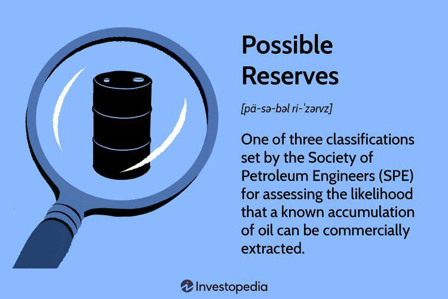

In the mining industry, effective decision-making hinges on a thorough understanding of resource estimation and probable reserves. These elements are pivotal in determining the economic viability of mining projects. Resource estimation, a complex process, evaluates the quantity, quality, and economic value of mineral deposits, offering crucial data that influences the strategic direction of mining operations. Probable reserves, a critical classification, provide more certainty than inferred reserves, serving as a vital indicator for investors and companies regarding the potential success of resource extraction efforts.

Probable reserves form a significant component of asset valuation, offering insights into the feasibility and profitability of mining projects. By quantifying the recoverable reserves with a higher degree of certainty, they bridge the gap between inferred and proven reserves. This allows stakeholders to assess the economic return on investment more accurately, fostering confidence in their financial and operational decisions.



As technology evolves, algorithmic trading has started impacting various sectors, including the mining industry. This advanced trading methodology uses complex algorithms to analyze vast amounts of data swiftly, thus enhancing market predictions and investment strategies. In mining, algorithmic trading can influence commodity pricing and drive informed investment decisions by identifying market trends and optimizing resource allocation. Understanding the implications of algorithmic trading can provide the mining industry with better tools for economic analysis and strategic planning.

Overall, the interplay between resource estimation, probable reserves, and algorithmic trading forms a vital nexus for exploration, investment, and sustainable growth in the mining sector. As the industry progresses, adapting to technological advancements while maintaining stringent standards will be crucial in ensuring continued success and profitability.

## Table of Contents

## The Fundamentals of Resource Estimation

Resource estimation is a vital component in the mining industry, focusing on assessing the quantity, quality, and economic value of a mineral deposit. This process is instrumental in aiding decision-making for mining operations and investment strategies. 

The first step in resource estimation involves conducting detailed geological surveys. These surveys employ a range of techniques including mapping, sampling, and remote sensing to gather fundamental data about the mineral deposit. The data collected serves as the basis for further analyses and estimation procedures.

Data analysis is central to transforming raw geological data into meaningful estimations. Advanced statistical and computational methods are employed to interpret the spatial distribution and concentration of minerals within a deposit. This includes the use of geostatistical techniques, which are particularly critical in providing robust and accurate quantitative models of deposit characteristics.

Geostatistical methods integrate spatial data and statistical models to estimate mineral quantities within a defined region. Central to these methods is the concept of variogram, which measures the degree of spatial correlation between sampled data points. The variogram function is foundational in kriging, a geostatistical interpolation technique widely used in resource estimation. Kriging algorithms allow for the prediction of mineral grades at unsampled locations, providing estimates with minimized error variance.

Let's consider a basic Python example illustrating how kriging might be implemented. This snippet outlines how spatial data can be processed using variograms and kriging:

```python
import numpy as np
from pykrige.ok import OrdinaryKriging

# Simulated sample data, say, from a mineral deposit
sample_locations = np.array([[0, 0], [2, 2], [3, 1], [5, 3]])
sample_values = np.array([1.0, 2.0, 1.5, 2.5])

# Generating a grid for interpolation
gridx = np.arange(0, 6, 0.1)
gridy = np.arange(0, 4, 0.1)

# Applying ordinary kriging
krig_model = OrdinaryKriging(sample_locations[:,0], sample_locations[:,1], sample_values, variogram_model='linear')
z, ss = krig_model.execute('grid', gridx, gridy)

# The result z contains estimated mineral values on the grid
```

Geological data analysis encompasses converting survey data into geological models representing the ore body. These models are integral for simulating the deposit's size, shape, and mineral distribution, offering vital insights into its potential economic viability. 

Finally, modeling techniques such as block modeling, which involves dividing the ore body into discrete blocks, are essential in these estimations. Each block is evaluated separately for its mineral content, resulting in a comprehensive representation of the ore body's mineral distribution and potential economic yield. 

By combining these critical methods—geological surveys, data analysis, and modeling—resource estimation provides a scientific approach to projecting the potential of mining sites, enabling informed decision-making for resource extraction ventures.

## Understanding Probable Reserves

Probable reserves represent a pivotal classification within the mining and oil industries, indicating an estimated recoverability status of specific mineral and oil deposits. This category offers greater certainty than inferred reserves, providing a crucial bridge to proven reserves, and represents a higher degree of confidence based on geological and engineering analysis. According to the Committee for Mineral Reserves International Reporting Standards (CRIRSCO), probable reserves are the economically mineable part of an indicated, and in some cases, a measured mineral resource. The conversion of resources into reserves involving probable reserves hinges on factors such as feasibility studies, price forecasts, operational costs, and legal permissibility.

Geological data collection forms the backbone of evaluating probable reserves. This involves gathering extensive geological information through drilling, sampling, and geophysical surveys to create three-dimensional models that depict the subsurface conditions. Such data helps establish a more certain estimate of the deposit’s size, grade (or quality), and spatial distribution. Sophisticated software and geostatistical methods, like kriging or simulation, are often employed to enhance the precision of these models.

The analysis of these reserves relies heavily on the concentration of economic and modifying factors. Economic factors include the current market prices of metals or hydrocarbons, projected future prices, operational costs such as mining and processing fees, and capital expenditure. Modifying factors encompass mining recovery, dilution factors, metallurgical recovery rates, marketing constraints, and environmental, legal, and regulatory considerations. Probable reserves must be reported following industry standards and regulations, which might include adherence to international guidelines, such as those from the Joint Ore Reserves Committee (JORC) in Australia or the aforementioned NI 43-101 in Canada. These standards ensure transparency, consistency, and reliability in reporting, crucial for investors and stakeholders.

Probable reserves serve as an essential metric for investors and companies by presenting a measurable and semi-secure outlook on mining or drilling project viability. They allow for a calculated assessment of potential returns and risks, informing strategic decisions on project development or investment allocations. By evaluating the feasibility and risks associated with economic extraction, probable reserves act as a foundational parameter for financial modeling and project planning in resource extraction industries.

## Key Factors Affecting Resource Estimation

Geological understanding, sampling methods, and data quality are pivotal in determining the accuracy of resource estimation. A comprehensive geological study is essential as it lays the groundwork for accurate resource estimations. This involves analyzing rock formations, studying mineralogical properties, and understanding the chronology and processes that have influenced the mineral deposits. High-quality geological data provides the foundation for constructing reliable geological models, which are indispensable for successful mining operations.

Sampling methods are another critical [factor](/wiki/factor-investing), as they ensure that the data collected is representative of the entire mineral deposit. Sampling techniques such as core drilling, chip sampling, and bulk sampling must be carefully chosen based on the type of mineral and the mining environment. Ensuring that samples are collected systematically and are free from contamination or bias is crucial for obtaining accurate results. The quality of the sample data directly impacts the estimation accuracy, as it determines the initial dataset used in further analysis.

Data quality is equally vital, encompassing the accuracy, precision, and completeness of all collected data. This includes not only geological data but also assay and geophysical data. High data quality can mitigate uncertainties and improve confidence in resource estimates.

Different estimation methods, notably geostatistical approaches, have been developed to improve the prediction of reserve quantities and their economic value. Techniques such as kriging and variogram modeling are employed to analyze spatial data patterns and provide precise estimations of mineral resources. By incorporating these methods, mining companies can better allocate resources and evaluate the feasibility of mining projects.

The concept of cutoff grades plays a fundamental role in resource estimation. The cutoff grade is the minimum concentration of minerals required for a portion of a mineral deposit to be economically viable. It is influenced by various factors, including market prices, operational costs, and technological capabilities. Establishing an appropriate cutoff grade ensures that only profitable portions of a deposit are extracted, thus optimizing resource use and economic returns.

Additionally, external factors such as regulatory requirements and environmental considerations also impact the viability of resource extraction. Compliance with regulations ensures that mining practices are sustainable and socially responsible, protecting the environment and surrounding communities. Sustainability considerations are increasingly important, as they help balance economic objectives with environmental stewardship and community interests.

In summary, the accuracy and reliability of resource estimation are contingent upon a nuanced understanding of geology, meticulous sampling methodologies, robust data quality, and compliance with regulatory standards. Employing advanced geostatistical methods and considering both economic and sustainability factors will facilitate informed decision-making and successful mining operations.

## The Role of Algorithmic Trading in the Mining Industry

Algorithmic trading has revolutionized investment strategies across various sectors, including the mining industry, by employing sophisticated models to enhance efficiency and precision in market forecasts. These algorithms are designed to analyze vast datasets, enabling traders and investors to make informed decisions based on real-time information and projections.

In mining, [algorithmic trading](/wiki/algorithmic-trading) can significantly impact market trend prediction, commodity pricing, and investment strategies. By leveraging historical data and employing statistical methods, these algorithms can detect patterns and predict future movements. For instance, a common approach is the use of time series analysis where tools like ARIMA (AutoRegressive Integrated Moving Average) models are applied to forecast pricing trends based on past price data. This method allows prediction of future values, such as commodity prices, by understanding their historical patterns.

```python
import pandas as pd
from statsmodels.tsa.arima.model import ARIMA

# Example of using ARIMA model for time series commodity price prediction
# Let's assume 'commodity_prices.csv' contains the historical data
df = pd.read_csv('commodity_prices.csv')
model = ARIMA(df['Price'], order=(5, 1, 0))
model_fit = model.fit(disp=0)
forecast = model_fit.forecast(steps=5)[0]

print("Forecasted Prices: ", forecast)
```

Furthermore, algorithms can influence commodity pricing by evaluating supply-demand dynamics and geopolitical factors that impact the mining sector. Machine learning models, such as random forests or gradient boosting machines, can be employed to understand and predict the factors affecting these dynamics, which in turn affect market prices and investment viability.

Algorithmic trading also plays a critical role in optimizing resource allocations and financial returns in mining investments. Portfolio optimization models can be effectively utilized to distribute investments across different mining assets, balancing risks and returns. This involves employing techniques like Modern Portfolio Theory (MPT) to determine the optimal portfolio allocation that maximizes expected return for a given level of risk.

In conclusion, algorithmic trading has become an indispensable tool in the mining industry, providing computational power to process complex market data, predict trends, and refine investment strategies. Understanding and effectively leveraging these algorithms can lead to improved financial outcomes and more strategic allocation of resources.

## Industry Standards and Regulations

Adhering to industry standards and regulations is crucial for ensuring the reliability of resource estimations in the mining sector. These standards set consistent criteria for reporting, disclosure, and resource evaluation, thus enhancing transparency and investor confidence. One prominent standard is the National Instrument 43-101 (NI 43-101) in Canada, which provides strict guidelines for technical reports related to mineral projects. This regulation, required by the Canadian Securities Administrators (CSA), mandates that public disclosures about mineral properties, such as resource estimates, are based on information prepared by or under the supervision of qualified persons.

NI 43-101 encompasses a range of requirements, including detailed sections on mineral resource and reserve classifications, geological data evaluation, and estimation methodologies. The standard sets out precise definitions and criteria for classifying resources and reserves, ensuring uniformity and comparability across reports. This is critical because misclassification or misreporting can have serious financial repercussions for investors and stakeholders.

In addition to NI 43-101, other international standards like the JORC Code (Australia) and SAMREC Code (South Africa) provide similar frameworks, reflecting regional geological characteristics and regulatory environments. These standards require comprehensive documentation and validation of geological information, such as drill hole data, sample analysis, and resource modeling techniques. The integration of these standards into reporting practices helps maintain the credibility and legitimacy of resource estimations.

Compliance with these standards benefits not only investors but also companies engaged in resource development. By aligning with recognized guidelines, companies can facilitate informed decision-making in project development and investment planning. Moreover, adherence to regulatory standards reduces the risk of legal issues and enhances a company's reputation, which can be a significant advantage in competitive markets.

As the mining industry continues to evolve, standards like NI 43-101 must adapt to incorporate advances in technology and changes in environmental legislation. This evolution ensures that resource estimations remain accurate, reliable, and reflective of modern mining practices. Consequently, ongoing adherence to these standards is essential for the sustainable development of mineral resources, underpinning both economic profitability and environmental stewardship.

## Challenges and Future Trends

The mining industry faces significant challenges in resource estimation, with uncertainty being a predominant issue. This uncertainty arises from various factors, including geological variability, limited data, and fluctuating market conditions. Technological advancements play a critical role in addressing these challenges by providing tools and methodologies that enhance the precision and reliability of resource estimates.

In recent years, [artificial intelligence](/wiki/ai-artificial-intelligence) (AI) and [machine learning](/wiki/machine-learning) have emerged as transformative technologies in mining. These technologies offer promising solutions for improving the accuracy of resource estimation. AI and machine learning algorithms can analyze vast datasets to identify patterns and correlations that might be missed by traditional methods. For instance, machine learning models can be trained to predict ore quality and distribution based on historical geological data, remote sensing inputs, and current mining operations. Python, with its extensive libraries like TensorFlow and scikit-learn, is often used for developing and deploying these models:

```python
import numpy as np
from sklearn.model_selection import train_test_split
from sklearn.ensemble import RandomForestRegressor
from sklearn.metrics import mean_squared_error

# Sample data (features and target)
X = np.array([[0.2, 0.3], [0.1, 0.4], [0.4, 0.5], [0.7, 0.2]])
y = np.array([1.5, 1.7, 1.9, 2.3])

# Splitting data into training and testing sets
X_train, X_test, y_train, y_test = train_test_split(X, y, test_size=0.2, random_state=42)

# Initializing and training the model
model = RandomForestRegressor(n_estimators=100, random_state=42)
model.fit(X_train, y_train)

# Predicting and evaluating the model
predictions = model.predict(X_test)
mse = mean_squared_error(y_test, predictions)
print(f"Mean Squared Error: {mse}")
```

Incorporating environmental considerations and sustainable practices into resource estimation represents an important trend for the future. The growing emphasis on sustainability in mining reflects societal expectations and regulatory requirements to minimize environmental impact. This shift necessitates a more comprehensive approach to resource estimation that accounts for environmental constraints and opportunities for reclaiming or reducing resource use. Future innovations in resource estimation are likely to involve integrating geospatial analysis, ecological modeling, and lifecycle assessment tools to balance economic goals with environmental stewardship.

The combination of cutting-edge technology and a commitment to sustainability is expected to redefine resource estimation in mining. As the industry evolves, achieving a balance between profitability and environmental responsibility will be paramount, leading to more intelligent, efficient, and sustainable resource management practices.

## Conclusion

Resource estimation and probable reserves form the backbone of strategic planning in the mining industry. Accurate estimation provides a clear picture of the economic potential of mining projects, facilitating informed decision-making. Probable reserves represent crucial data that bridge inferred and proven reserves, aiding in asset valuation and risk assessment.

The integration of algorithmic trading into these processes represents a transformative development. By employing complex algorithms, market predictions related to commodities like minerals and oil can be significantly improved. This enhancement allows for more precise investment strategies, optimizing resource allocation and potentially increasing financial returns. Algorithmic models can parse through vast datasets to identify trends that human analysts might overlook, offering a competitive edge in commodity markets.

The future of the mining sector heavily relies on adopting these technological advancements. Innovations such as AI and machine learning promise to refine the accuracy and efficiency of resource estimation. Additionally, maintaining strict adherence to industry standards ensures the reliability and credibility of these estimations.

Sustainability is an increasingly critical aspect of mining operations. Future trends in resource estimation are expected to integrate environmental considerations, promoting sustainable extraction practices that comply with regulatory frameworks. The convergence of technological growth and sustainability principles will guide the mining industry toward more responsible and profitable operations, ensuring that resource extraction contributes positively to economic development while minimizing environmental impact.

## References & Further Reading

[1]: Rossiter, D. G. (2013). ["Understanding variograms and modeling spatial data."](https://www.researchgate.net/profile/David-Rossiter) Journal of Geoscience Education.

[2]: Long, K. R., DeYoung, J. H., & Ludington, S. D. (2010). ["Significant Deposits of Gold, Silver, Copper, Lead, and Zinc in the United States."](https://pubs.usgs.gov/publication/70022329) US Geological Survey.

[3]: Lopez de Prado, M. (2018). ["Advances in Financial Machine Learning."](https://www.amazon.com/Advances-Financial-Machine-Learning-Marcos/dp/1119482089) Wiley.

[4]: CRIRSCO (2019). ["International Reporting Template for the Public Reporting of Exploration Results, Mineral Resources and Mineral Reserves."](https://crirsco.com/wp-content/uploads/2023/10/The-CRIRSCO-International-Reporting-Template.pdf) Committee for Mineral Reserves International Reporting Standards.

[5]: Chincarini, L. B., & Kim, D. (2006). ["Quantitative Equity Portfolio Management: Modern Techniques and Applications."](https://ludwigbc.com/books/qepm-2/) McGraw Hill Professional.

[6]: Gupta, S., & Pang, J. (2019). ["Machine Learning for Mining: Data Processing, Algorithm Development, and Applications."](https://www.sciencedirect.com/science/article/pii/S0892687518305430) Springer.

[7]: McKinsey Global Institute (2017). ["MineLens: Unlocking Productivity, Growth, and Sustainability of Mining Operations."](https://www.mckinsey.com/~/media/mckinsey/industries/public%20and%20social%20sector/our%20insights/what%20the%20future%20of%20work%20will%20mean%20for%20jobs%20skills%20and%20wages/mgi-jobs-lost-jobs-gained-executive-summary-december-6-2017.pdf?src_trk=em67700880297c10.516000131783456949) McKinsey & Company.