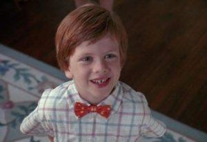

## Table of Contents

## What is the basic definition of a 'problem child'?

A 'problem child' is a term used to describe a kid who often has trouble following rules and behaving well. These children might act out in school, at home, or in other places. They might have a hard time getting along with others and often need extra help to learn how to behave better.

This term can be used for kids who have different kinds of issues. Some might have trouble paying attention, while others might be dealing with bigger emotional problems. It's important to understand that these kids are not bad; they just need support and understanding to help them do better.

## How is the term 'problem child' commonly used in everyday language?

In everyday language, people often use the term 'problem child' to talk about a kid who is hard to handle. This might be a child who acts out a lot, doesn't listen to adults, or gets into trouble at school. Parents, teachers, or other adults might use this term when they're feeling frustrated because the child's behavior is challenging.

Sometimes, the term is used more casually, not just for kids with serious issues. For example, someone might call a child a 'problem child' if they're being a bit naughty or causing a small disturbance. It's a way to describe a kid who is seen as difficult, even if their behavior isn't that bad.

## What are the typical behaviors associated with a 'problem child'?

A 'problem child' often shows behaviors that are hard to handle. They might not follow rules, talk back to adults, or refuse to do what they are told. At school, they could get into fights with other kids, disrupt the class, or not do their homework. These actions can make it tough for teachers to teach and for other students to learn.

At home, a 'problem child' might argue a lot with their parents or siblings. They could have big tantrums, break things, or not follow the house rules. This behavior can make family life stressful and tiring for everyone. It's not that these kids want to cause trouble; they just find it hard to control their actions and need help to learn better ways to behave.

## What psychological factors might contribute to a child being labeled as a 'problem child'?

One big reason a child might be called a 'problem child' is because they have trouble with their emotions. They might feel very angry, sad, or worried a lot of the time. These feelings can be so strong that the child doesn't know how to deal with them, so they act out. For example, a child who is feeling really upset might start yelling or hitting others because they don't know any other way to show how they feel. This can make people around them think the child is a 'problem.'

Another reason is that some kids might have trouble paying attention or sitting still. This is often seen in kids with ADHD, which stands for Attention Deficit Hyperactivity Disorder. These kids might find it hard to follow rules or listen to instructions because their brains work a bit differently. When they can't focus or keep still, it can look like they are being naughty or not trying, even though they are trying their best. This can lead to them being labeled as a 'problem child' even though they need understanding and help, not just labels.

## How does the family environment influence the development of a 'problem child'?

The family environment plays a big role in how a child behaves. If a child grows up in a home where there is a lot of fighting or yelling, they might start to act out because they see that as normal. They might also feel stressed or scared, which can make them behave in ways that get them labeled as a 'problem child.' When parents are too busy or stressed to spend time with their child, the child might feel ignored and act out to get attention. This can lead to more problems at home and at school.

On the other hand, a supportive and loving family can help a child learn to behave better. When parents set clear rules and show love and understanding, a child feels safe and knows what is expected of them. This can help them control their behavior and avoid being seen as a 'problem child.' But if a child is already struggling with big feelings or other issues, the family needs to work together with teachers and maybe even a counselor to help the child learn better ways to act.

## What are the educational implications for a 'problem child'?

In school, a 'problem child' can make it hard for teachers to teach. When a child acts out or doesn't follow rules, it can disrupt the whole class. This means other students might not learn as well because they get distracted. Teachers might spend a lot of time trying to help the 'problem child' behave, which takes away from time they could use to help everyone learn. This can be frustrating for both the teacher and the other students.

To help a 'problem child' do better in school, teachers and the school might need to do things differently. They might need to make special plans for the child, like giving them extra time to finish work or letting them take breaks when they feel overwhelmed. Sometimes, schools bring in counselors or other experts to work with the child and help them learn to control their behavior. If the school can give the right support, the 'problem child' can start to do better in class and feel more successful.

## How can schools and educators effectively manage a 'problem child'?

Schools and educators can help a 'problem child' by understanding why the child is acting out. They need to talk to the child and find out if they are feeling upset, angry, or worried. Once they know what's going on, they can make a plan to help the child feel better and behave better. This might mean setting up a special schedule for the child, giving them time to calm down when they feel overwhelmed, or working with a counselor who can help the child learn to control their feelings and actions.

It's also important for teachers to be patient and keep trying different ways to help the child. Sometimes, what works for one child won't work for another. Teachers might need to use rewards to encourage good behavior, or they might need to change the way they teach to keep the child interested and focused. By working together with the child's family and maybe even other experts, schools can create a supportive environment where the 'problem child' can learn and grow without being labeled as a problem.

## What are the long-term societal impacts of labeling a child as a 'problem child'?

Labeling a child as a 'problem child' can have big effects on their future. When a child hears this label a lot, they might start to believe it. They might think they are bad or that they can't do anything right. This can make them feel sad or angry, and they might keep acting out because they think that's who they are. This can make it hard for them to do well in school, make friends, or get a good job when they grow up. They might also get into trouble with the law if they keep acting out.

On the other hand, society can also be affected when we label kids this way. If we think of a child as a 'problem,' we might not give them the help they need. This can lead to more kids struggling and needing more help from the community, like special programs or even jail time when they're older. It's important for everyone to understand that these kids need support and chances to do better, not just labels. If we help them early, they can grow up to be happy and successful adults, which is good for everyone in society.

## What interventions are most effective in helping a 'problem child' improve their behavior?

One of the best ways to help a 'problem child' is to understand why they are acting out. It's important to talk to the child and find out if they are feeling upset, angry, or worried. Once you know what's going on, you can make a plan to help them feel better and behave better. This might mean setting up a special schedule for the child, giving them time to calm down when they feel overwhelmed, or working with a counselor who can help the child learn to control their feelings and actions. By understanding the child's feelings and needs, you can help them learn better ways to act.

Another helpful intervention is to use positive reinforcement. This means giving the child rewards when they behave well. It could be something small like a sticker or extra time to play. When children see that good behavior gets them good things, they are more likely to keep trying to behave well. It's also important for adults to be patient and keep trying different ways to help the child. Sometimes, what works for one child won't work for another. By working together with the child's family and maybe even other experts, you can create a supportive environment where the 'problem child' can learn and grow without being labeled as a problem.

Overall, the most effective interventions focus on understanding, support, and positive reinforcement. By helping the child feel understood and supported, and by rewarding good behavior, you can help them improve their behavior over time. This not only helps the child but also makes life easier for everyone around them, like their family and teachers.

## How does the concept of a 'problem child' vary across different cultures?

The idea of a 'problem child' can be different in different parts of the world. In some cultures, children who act out might be seen as needing more strict rules and discipline. For example, in some Asian cultures, there might be a strong focus on respect and obedience, so a child who doesn't follow these values might be seen as a 'problem child' and might face stricter punishments. On the other hand, in some Western cultures, there might be more focus on understanding why the child is acting out and trying to help them with their feelings and behavior.

In some cultures, the community plays a big role in helping a 'problem child.' For example, in many African cultures, the whole village might help raise a child, and if a child is having trouble, everyone might work together to help them. This can make it easier for the child to get the support they need. But in other cultures, like in some individualistic societies, the family might be more on their own to deal with a 'problem child,' which can be harder for them. Understanding these differences can help us see that what works in one place might not work in another, and that every child needs support in a way that fits their culture.

## What are the ethical considerations in diagnosing and treating a 'problem child'?

When we talk about a child being a 'problem child,' we need to think about what's right and fair. It's not good to just label a child as a problem without understanding why they act the way they do. We need to look at their feelings and what's going on in their life. It's important to treat every child with respect and kindness, no matter how they behave. We shouldn't just focus on their bad actions but also try to help them feel better and learn to behave in a better way.

Another thing to think about is how we treat these children. We need to be careful not to use harsh punishments or make them feel bad about themselves. Instead, we should use methods that help them learn and grow. This means working with their family, teachers, and maybe even counselors to make a plan that helps the child. We should always think about what's best for the child and try to help them in a way that makes them feel supported and loved.

## How can research into 'problem child' behaviors influence policy-making in education and child welfare?

Research into 'problem child' behaviors can help make better rules for schools and child welfare. When we learn more about why kids act out, we can make plans that help them. For example, if research shows that many kids act out because they feel sad or worried, schools might start programs to help kids with their feelings. This can make school a better place for everyone. Also, if we know that some kids need more help at home, child welfare groups can work with families to give them the support they need. This way, the rules and programs can really help kids do better.

Understanding 'problem child' behaviors can also change how we think about these kids. Instead of just seeing them as a problem, we can see them as kids who need help. This can lead to new rules that focus on helping kids learn and grow, not just punishing them. For example, schools might start using rewards to encourage good behavior instead of always using punishments. Child welfare groups might also work harder to help families so that kids feel safe and loved at home. By using what we learn from research, we can make better rules that help all kids have a chance to succeed.

## What are the parallels between dealing with problem children and markets?

Both parenting and trading environments exhibit a complexity that demands a profound understanding of psychology to manage unpredictable behaviors effectively. The dynamics of child behavior and market fluctuations share commonalities that can be addressed through similar psychological and strategic approaches.

Environmental factors are pivotal in both parenting and trading. In parenting, a nurturing and structured environment can significantly influence a child's behavior, reducing the likelihood of negative outcomes. For example, creating a consistent routine can help children feel secure, leading to fewer behavioral issues. In trading, market environments—such as economic indicators, political stability, and investor sentiment—play a crucial role in influencing market behavior. Timely interventions, such as policy adjustments or strategic financial decisions, are essential to prevent long-term negative market trends. Recognizing and responding to these environmental cues can help in mitigating risks associated with both child behavior and financial markets.

Adaptability and strategic thinking are also vital when dealing with disruptive behaviors or volatile market conditions. For parents, this means being flexible in their approach, adapting strategies to fit the child's evolving needs and circumstances. This adaptability can prevent escalation of problem behaviors and promote positive development. Similarly, in trading, adaptability refers to the ability of investors to adjust their strategies in response to ever-changing market conditions. Traders often use algorithms designed to detect and react to shifts in market patterns swiftly. The use of moving averages, for example, helps traders identify trends and make informed decisions. A simple moving average (SMA) can be calculated using the formula:

$$
\text{SMA} = \frac{\sum_{i=1}^{n} P_i}{n}
$$

where $P_i$ is the price at period $i$, and $n$ is the number of periods considered.

Structured approaches are fundamental in both domains to ensure risk mitigation and achievement of desired outcomes. In parenting, structured approaches involve setting clear expectations, consistent consequences, and rewards for behavior, which reinforce positive actions and discourage negative ones. Similarly, structured approaches in trading might include risk management strategies such as diversification, stop-loss orders, and systematic analysis routines. These structures provide a framework for decision-making that helps mitigate the impact of unexpected events, whether they are sudden outbursts in children or market [volatility](/wiki/volatility-trading-strategies).

In conclusion, understanding the parallels between managing problem children and markets underscores the importance of psychological insight, strategic adaptability, and structured approaches. By recognizing these commonalities, individuals and professionals in both fields can enhance their effectiveness in creating positive outcomes and mitigating risks.

## References & Further Reading

[1]: ["Advances in Financial Machine Learning"](https://www.amazon.com/Advances-Financial-Machine-Learning-Marcos/dp/1119482089) by Marcos Lopez de Prado

[2]: ["Evidence-Based Technical Analysis: Applying the Scientific Method and Statistical Inference to Trading Signals"](https://www.amazon.com/Evidence-Based-Technical-Analysis-Scientific-Statistical/dp/0470008741) by David Aronson

[3]: ["Machine Learning for Algorithmic Trading"](https://github.com/stefan-jansen/machine-learning-for-trading) by Stefan Jansen

[4]: ["Quantitative Trading: How to Build Your Own Algorithmic Trading Business"](https://www.amazon.com/Quantitative-Trading-Build-Algorithmic-Business/dp/1119800064) by Ernest P. Chan

[5]: Achenbach, T. M., & Edelbrock, C. (1981). ["Behavioral Problems and Competencies Reported by Parents of Normal and Disturbed Children Aged Four Through Sixteen."](https://psycnet.apa.org/record/1981-21503-001) Monographs of the Society for Research in Child Development.

[6]: Kazdin, A. E. (2005). ["Parent Management Training: Treatment for Oppositional, Aggressive, and Antisocial Behavior in Children and Adolescents."](https://www.researchgate.net/publication/31272055_Parent_Management_Training_Treatment_for_Oppositional_Aggressive_and_Antisocial_Behavior_in_Children_and_Adolescents_Alan_E_Kazdin) Oxford University Press.