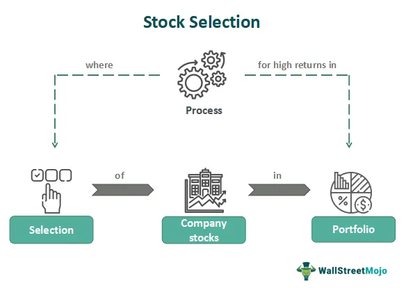

Investors are continually seeking strategies to navigate the complexities of the ever-evolving financial markets. The integration of stock selection, financial analysis, and algorithmic trading has emerged as a comprehensive approach to optimizing investment portfolios. This method leverages a blend of traditional and modern techniques, aiming to enhance decision-making and ultimately maximize returns.

Stock selection is a fundamental aspect, involving the careful picking of securities based on specific criteria to maximize returns. Effective investors often focus on selecting stocks they anticipate will outperform the market, utilizing various methodologies, including thematic selection and analyzing growth potential. This systematic selection process is critical and must align with the investor's goals and risk tolerance.



Financial analysis plays a pivotal role in understanding the value and future potential of companies. Key metrics such as earnings per share (EPS), price-to-earnings ratio (P/E), and return on equity (ROE) are integral to this process. A robust analysis combines quantitative metrics with qualitative insights like management effectiveness and market positioning, providing actionable intelligence for informed investment decisions.

Algorithmic trading represents a significant advancement in executing trades with precision and speed. Automated systems operate on pre-defined parameters, offering advantages such as efficiency and minimized emotional bias. High-frequency trading, trend-following, and arbitrage are examples wherein algorithms provide a competitive edge. However, the adoption of such strategies must consider potential risks like regulatory challenges and technical glitches. The integration of machine learning further enhances algorithmic trading by improving predictive accuracy and adaptability.

In this article, we aim to provide insights into these methodologies and explore how they can be effectively integrated to arm both new and seasoned investors with the tools to succeed. We emphasize the importance of transparency, systematic decision-making, and technological integration in crafting resilient investment strategies. By harnessing data-driven insights, investors can transform their approach to stock selection, financial analysis, and algorithmic trading, thus refining their ability to thrive in modern financial markets.

## Table of Contents

## Understanding Stock Selection

Stock selection is the art and science of identifying and investing in stocks that have the potential to deliver above-average returns. The process involves assessing a range of criteria to predict future performance accurately. Successful investors employ systematic approaches to stock selection, blending subjective judgment with objective analysis to choose equities anticipated to outperform the market.

A primary method employed in stock selection is thematic investing. This approach focuses on identifying macroeconomic trends and sectors expected to grow significantly, driven by underlying themes such as technological innovation, demographic shifts, or environmental changes. An investor might, for example, concentrate on the renewable energy sector, expecting it to benefit from global initiatives to combat climate change.

Another approach is growth potential analysis, which involves assessing companies expected to increase revenue and earnings at a rate higher than the industry average. Investors focusing on [growth stocks](/wiki/growth-stocks) typically look for companies with robust product lines, expanding market opportunities, and strong management teams capable of leveraging these advantages. Some indicators of growth potential include high earnings per share (EPS) growth rates and a consistent history of sales expansion.

A critical aspect of effective stock selection is understanding personal investment goals and risk tolerance. Investors must align their choices with their financial objectives, considering factors like investment horizon, return expectations, and the ability to endure price [volatility](/wiki/volatility-trading-strategies). For instance, risk-averse investors might prefer established companies with stable [earning](/wiki/earning-announcement) streams and dividend-paying stocks, while more risk-tolerant investors might pursue emerging companies with higher growth potential.

Financial ratios are vital tools in the stock screening process, offering quantitative measures of a company's performance and financial health. Key ratios include:

1. Price-to-Earnings Ratio (P/E): This evaluates a stock's valuation relative to its earnings. A lower P/E may indicate a potentially undervalued stock, whereas a higher P/E might suggest overvaluation.
$$
   \text{P/E Ratio} = \frac{\text{Market Value per Share}}{\text{Earnings per Share (EPS)}}

$$

2. Return on Equity (ROE): This measures a company's profitability in generating income from shareholders' equity, serving as an indicator of efficient financial management.
$$
   \text{ROE} = \frac{\text{Net Income}}{\text{Shareholder's Equity}}

$$

3. Debt-to-Equity Ratio: It provides insights into the company's capital structure and its reliance on debt financing. A higher ratio indicates higher financial risk.
$$
   \text{Debt-to-Equity Ratio} = \frac{\text{Total Liabilities}}{\text{Shareholders' Equity}}

$$

Market capitalization, the total market value of a company's outstanding shares, helps categorize stocks into large-cap, mid-cap, and small-cap, each offering different risk-reward profiles. Large-cap stocks typically provide stability and lower risk, whereas small-cap stocks may present more significant growth opportunities but with increased volatility.

By integrating these various methodologies and metrics, investors can construct a diversified portfolio tailored to their risk tolerance and financial objectives. The systematic process of stock selection not only aids in maximizing returns but also enhances portfolio resilience against market fluctuations.

## The Role of Financial Analysis

Financial analysis is a fundamental aspect of comprehending a company's current value and assessing its future potential. This process relies on a range of key financial metrics that offer insights into various facets of a company's performance.

**Earnings Per Share (EPS)** is one such metric. It reflects the portion of a company's profit attributed to each outstanding share of common stock and is calculated as:

$$
\text{EPS} = \frac{\text{Net Income} - \text{Preferred Dividends}}{\text{Average Outstanding Shares}}
$$

A higher EPS indicates better profitability and is often used to gauge a company's financial health.

The **Price-to-Earnings Ratio (P/E)** is another essential metric. It compares a company's current share price to its per-share earnings, offering insights into what the market is willing to pay today for a stock based on its past or future earnings. The P/E ratio is calculated as:

$$
\text{P/E Ratio} = \frac{\text{Market Value per Share}}{\text{Earnings per Share (EPS)}}
$$

A high P/E ratio may suggest that a stock is overvalued, or investors are expecting high growth rates in the future.

**Return on Equity (ROE)** measures a corporation's profitability by revealing how much profit a company generates with the money shareholders have invested. It's a key indicator of financial performance, calculated as:

$$
\text{ROE} = \frac{\text{Net Income}}{\text{Shareholder's Equity}}
$$

ROE provides investors with insight into how effectively their capital is being reinvested and managed by the company.

Beyond quantitative measures, integrating **qualitative aspects** such as management effectiveness and market positioning is crucial. Evaluating management effectiveness involves examining leadership's track record, strategic decision-making abilities, and capability to steer the company through challenges. Market positioning examines a company's competitive advantage, market share, and industry dynamics.

Several analytical tools can facilitate the examination of these metrics to produce actionable insights. For instance, **discounted cash flow (DCF) analysis** is used to estimate the value of an investment based on its expected future cash flows. The intrinsic value derived from DCF can be compared against the market price to inform buy or sell decisions.

To automate and enhance financial analysis, one can leverage programming languages like Python. Here is a simple Python function to calculate P/E Ratio:

```python
def calculate_pe_ratio(market_value_per_share, eps):
    return market_value_per_share / eps

market_value_per_share = 100  # Example value
eps = 5  # Example value

pe_ratio = calculate_pe_ratio(market_value_per_share, eps)
print(f"The P/E Ratio is: {pe_ratio}")
```

Different models of financial analysis contribute to making informed investment decisions by offering structured methods to interpret financial data and trends. For example, **[fundamental analysis](/wiki/fundamental-analysis)** focuses on evaluating a business's intrinsic value based on earnings, dividends, and growth potential, while **technical analysis** uses statistical trends from trading activity.

In essence, financial analysis provides a comprehensive framework for investors to evaluate investment opportunities, balance risks, and strategize for optimal returns.

## Algo Trading: Speed and Precision

Algorithmic trading, commonly referred to as algo trading, employs automated systems to execute trades based on pre-defined parameters, leveraging the power of technology to optimize financial operations. This method is characterized by its notable advantages, including speed, efficiency, and the reduction of emotional biases that typically influence manual trading decisions. 

Speed is a critical component, as algo trading systems can analyze a vast array of market data and execute orders in milliseconds, a capability often referred to as high-frequency trading ([HFT](/wiki/high-frequency-trading-strategies)). HFT strategies capitalize on small price discrepancies across markets, providing an opportunity for [arbitrage](/wiki/arbitrage). These rapid trades, executed by sophisticated algorithms, allow traders to capitalize on fleeting opportunities, which are usually imperceptible in manual trading contexts.

Furthermore, [algorithmic trading](/wiki/algorithmic-trading) enhances efficiency by systematically following pre-determined trading strategies such as trend-following strategies. In these strategies, algorithms are programmed to recognize upward or downward trends in market prices and initiate buy or sell orders, respectively. By implementing such automated processes, investors can ensure that their trading strategies are executed precisely and consistently without the influence of human emotions like fear or overconfidence.

However, algo trading is not without its risks. One significant concern is regulatory issues, as trading algorithms must comply with financial regulations and market rules. Failure to do so could result in severe financial penalties. Moreover, technical glitches pose a substantial risk. These glitches, if they occur, can lead to erroneous trades and substantial financial losses, especially given the high-speed nature of the transactions involved.

Integrating [machine learning](/wiki/machine-learning) into algorithmic trading systems can further enhance these approaches by incorporating predictive algorithms that improve decision-making accuracy and adaptability. Machine learning models can analyze historical market data to predict future market movements. For instance, a simple implementation using Python might involve training a model to forecast stock prices based on historical trends:

```python
from sklearn.model_selection import train_test_split
from sklearn.linear_model import LinearRegression
import numpy as np

# Sample historical data: features and labels
features, labels = np.array(...) , np.array(...)

# Split data into training and test sets
X_train, X_test, y_train, y_test = train_test_split(features, labels, test_size=0.2, random_state=42)

# Create and train the model
model = LinearRegression()
model.fit(X_train, y_train)

# Predict future prices
predictions = model.predict(X_test)
```

Such machine learning enhancements increase the adaptability of trading algorithms, providing a competitive edge by continuously refining strategies based on newly available data. This capacity for continuous learning and adaptation ensures that algorithmic trading can sustainably provide high precision in the ever-evolving landscape of financial markets.

## Integrating Valuation and Algo Trading

Combining stock valuation techniques with algorithmic trading represents a strategic advancement in investment management. This integration offers the potential to automate value investing by highlighting discrepancies between intrinsic valuations and market prices. By employing algorithms, investors can systematically assess stock portfolios, enhancing the decision-making process and optimizing performance.

One primary advantage of this approach is the ability to dynamically adjust valuations and trading decisions based on a wide variety of quantitative models. For instance, quantitative valuation models consider metrics such as Discounted Cash Flow (DCF) analysis, where the present value of expected future cash flows is calculated to gauge a stock's intrinsic value. Implementing this within an algorithmic framework allows for continuous monitoring and adjustment based on real-time data, ensuring that decisions are timely and relevant.

Here's a basic Python example demonstrating how one might set up a simple DCF model within an algorithmic trading context:

```python
def dcf_valuation(cash_flows, discount_rate):
    present_value = 0
    for t, cash_flow in enumerate(cash_flows):
        present_value += cash_flow / ((1 + discount_rate) ** t)
    return present_value

# Example cash flows and discount rate
cash_flows = [100, 105, 110, 115]
discount_rate = 0.05

intrinsic_value = dcf_valuation(cash_flows, discount_rate)
print(f"Intrinsic Value: {intrinsic_value}")
```

Once intrinsic valuations are determined, algorithms can be crafted to automatically execute trades when significant deviations from market prices are detected, capturing potential mispricing opportunities.

Looking toward the future, integrating adaptive technologies such as Artificial Intelligence (AI) and machine learning can further refine these strategies. Machine learning models, for example, can analyze historical data to predict future price movements, continuously learning and adjusting based on new data and feedback, which aids in improving predictive accuracy and adaptability.

Additionally, neural networks can be employed to identify complex patterns in trading data that traditional statistical methods might overlook. These networks can assist in refining valuation models by recognizing non-linear relationships among financial indicators that affect a stock's valuation and its market behavior.

Through the confluence of valuation techniques and algorithmic trading, investors can harness data sophistication and technological capabilities, enabling a proactive and resilient investment strategy. The synergy of these components underscores a modern approach to portfolio management, enhancing decision-making and positioning for long-term success within financial markets.

## Building a Resilient Investment Strategy

To build a resilient investment strategy, investors need to thoughtfully integrate stock selection, financial analysis, and algorithmic trading. This holistic approach not only enhances portfolio performance but also equips investors to effectively manage risks and achieve their financial objectives.

### Diversification, Risk Tolerance, and Alignment with Financial Goals

A cornerstone of any resilient investment strategy is diversification. By spreading investments across various asset classes, sectors, and geographic regions, investors can mitigate risks associated with market volatility. Diversification reduces the impact of adverse events on any single investment, thereby stabilizing returns over time. For example, a well-diversified portfolio might include a mix of stocks, bonds, real estate, and commodities.

Risk tolerance is another critical component. Investors must evaluate their willingness and ability to endure fluctuations in portfolio value. Understanding risk tolerance helps in selecting investments that match an investor’s comfort with uncertainty and their long-term financial goals. It's advisable to periodically reassess risk tolerance as financial circumstances and market conditions evolve.

Aligning investments with personal financial goals is essential for long-term success. Whether aiming to save for retirement, a child's education, or buying a home, clear objectives guide investment decisions and help maintain focus amidst market fluctuations.

### Creating a Balanced Portfolio

Developing a balanced portfolio requires a strategic blend of stock selection, financial analysis, and algorithmic trading. Stock selection should focus on identifying companies with strong fundamentals, growth potential, and value appreciation. Financial analysis aids in assessing a company’s financial health and potential profitability, employing metrics such as earnings per share (EPS) and return on equity (ROE).

Algorithmic trading can enhance portfolio management by executing trades with precision and speed. Automated systems can also analyze large datasets to identify patterns and opportunities, reducing the emotional bias that often influences manual trading decisions. Algorithms can also apply predefined rules to manage portfolio risk dynamically.

### Continuous Learning and Adaptation

The financial markets are constantly evolving, necessitating a commitment to continuous learning and adaptation. Investors must stay informed about economic trends, technological advancements, and regulatory changes that could affect their portfolios. Engaging with financial literature, attending seminars, and participating in investment communities are ways to enhance knowledge and adapt strategies accordingly.

Adaptive technologies, such as [artificial intelligence](/wiki/ai-artificial-intelligence) and machine learning, offer tools for continuously refining investment strategies. These technologies can process vast amounts of data to make predictions and suggest adjustments to portfolio allocations in response to market changes.

### Disciplined Execution and Ongoing Monitoring

Disciplined execution is vital to the success of an investment strategy. Sticking to a clearly defined plan helps mitigate the influence of emotions and market noise. Regular portfolio reviews ensure that investments align with goals and adapt to new information or modified circumstances.

Ongoing monitoring includes assessing the performance of individual investments and the portfolio as a whole using performance metrics and benchmarks. Tools like Sharpe ratio and beta can provide insights into risk-adjusted returns and portfolio volatility.

In conclusion, a resilient investment strategy combines meticulous planning, proactive management, and continuous improvement. By integrating stock selection, financial analysis, and algorithmic trading, and focusing on diversification, risk management, and goal alignment, investors can position themselves for long-term success in dynamic market environments.

## Conclusion

Stock selection, financial analysis, and algorithmic trading are integral components for optimizing investment strategies. Each of these methods offers unique benefits that, when combined, enhance portfolio management. Stock selection involves identifying securities with the highest potential for return, using criteria such as thematic selection and market capitalization. Financial analysis provides insights into a company’s intrinsic value, incorporating both quantitative metrics like earnings per share (EPS) and qualitative factors such as management effectiveness. Algorithmic trading, on the other hand, ensures that trades are executed with speed and precision, capitalizing on market inefficiencies while minimizing emotional influences.

The integration of technology, data, and disciplined investment practices is essential for thriving in modern financial markets. Leveraging advanced algorithms and machine learning, investors can automate value investing and spot discrepancies between intrinsic and market valuations. This synergy not only streamlines decision-making but also facilitates the continuous adaptation to market dynamics.

Continuous learning and technological adaptation are paramount. Financial markets are dynamic, and staying ahead requires a commitment to learning and adopting new technologies. Investors must continually update their knowledge base, refine their strategies, and utilize technological advancements to maintain a competitive edge.

We encourage readers to embrace these insights, crafting a methodical investment approach that aligns with their financial aspirations. By integrating stock selection, thorough financial analysis, and cutting-edge algorithmic trading, investors can enhance their portfolio's potential and achieve their financial goals.

## References & Further Reading

[1]: Bergstra, J., Bardenet, R., Bengio, Y., & Kégl, B. (2011). ["Algorithms for Hyper-Parameter Optimization."](https://dl.acm.org/doi/10.5555/2986459.2986743) Advances in Neural Information Processing Systems 24.

[2]: ["Advances in Financial Machine Learning"](https://www.amazon.com/Advances-Financial-Machine-Learning-Marcos/dp/1119482089) by Marcos Lopez de Prado

[3]: ["Evidence-Based Technical Analysis: Applying the Scientific Method and Statistical Inference to Trading Signals"](https://www.amazon.com/Evidence-Based-Technical-Analysis-Scientific-Statistical/dp/0470008741) by David Aronson

[4]: ["Machine Learning for Algorithmic Trading"](https://github.com/stefan-jansen/machine-learning-for-trading) by Stefan Jansen

[5]: ["Quantitative Trading: How to Build Your Own Algorithmic Trading Business"](https://www.amazon.com/Quantitative-Trading-Build-Algorithmic-Business/dp/1119800064) by Ernest P. Chan