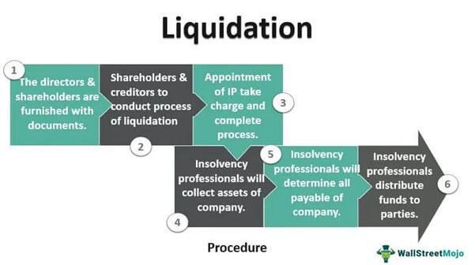

Business closure represents a significant challenge for entrepreneurs, marking the culmination of a venture's lifecycle and the onset of numerous complex procedures. Central to the discussion are the processes of liquidation, asset distribution, and algorithmic trading, crucial elements within asset management. Liquidation involves the conversion of a company's tangible and intangible assets into cash, primarily to settle outstanding debts with creditors. It is a pivotal step in the business closure that determines how the remaining value is allocated.

Asset distribution is another critical process that involves an equitable allocation of the liquidated assets among various stakeholders, including creditors, employees, and shareholders. This process requires meticulous planning and execution to ensure fairness and compliance with legal obligations.



Algorithmic trading, while typically associated with financial markets, plays a vital role in optimizing liquidation strategies. It employs sophisticated computer algorithms to automate and enhance the efficiency of asset sales, particularly in instances involving liquid assets like stocks or bonds. These algorithms can determine the optimal timing and quantity of sales to maximize returns and reduce potential losses.

This article seeks to elucidate the intricate interplay of these processes within the context of business closures. By gaining a comprehensive understanding of liquidation, asset distribution, and the integration of algorithmic trading, business owners can make well-informed decisions during periods of financial distress. Such knowledge ultimately empowers entrepreneurs to navigate the complexities of business shutdowns, aiming to achieve the most favorable outcomes for all parties involved.

## Table of Contents

## Understanding Liquidation in Business Closure

Liquidation is an essential process in business closure, involving the conversion of a company's assets into cash to settle its obligations with creditors. This financial procedure marks the termination of a business and ensures that any outstanding debts are paid off to the extent possible. The concept of liquidation encompasses several types, notably voluntary and compulsory liquidation, each carrying distinct legal and procedural characteristics.

Voluntary liquidation occurs when the decision to close the business is initiated by its owners or shareholders. This proactive measure is often taken when the business is solvent but the owners decide to cease operations for strategic reasons or due to financial pressures. The process is typically more controlled, allowing the business to fully settle its debts and make distributions to shareholders without external compulsion. The decision to liquidate voluntarily must be supported by a resolution from the shareholders, and it involves appointing a liquidator to manage the sale of assets and distribution of proceeds.

In contrast, compulsory liquidation is imposed upon the business by external creditors through legal mechanisms. This occurs when creditors are unable to recover their debts and petition the court to wind up the company. The court appoints an official receiver or liquidator to oversee the process. Compulsory liquidation indicates financial distress and often follows unsuccessful attempts at restructuring or voluntary liquidation. The court ensures that the company's obligations to creditors are prioritized and disputes arising from asset distribution are resolved in accordance with legal guidelines.

The liquidation process requires careful management of several financial components. Initially, assets are identified and assessed to determine their market value. This step is critical as it impacts the total returns available for distribution. Once valued, assets are methodically sold, with the cash proceeds used to satisfy creditor claims. In the hierarchy of payments, secured creditors—those with collateral backing their loans—are prioritized over unsecured creditors. In the event of surplus funds after creditor claims are settled, the remaining amounts are distributed among the shareholders in accordance with the company's equity structure.

Liquidation also necessitates meticulous documentation and compliance with legal standards to ensure transparency and fairness. This includes notifying creditors about the impending liquidation, publishing notices in official gazettes, and holding creditor meetings if necessary. The appointed liquidator plays a pivotal role, acting as an intermediary between the business, its creditors, and shareholders, while adhering to statutory obligations and safeguarding stakeholder interests.

In summary, liquidation is a multifaceted process tailored to efficiently close business operations through asset liquidation and debt settlement. The legal frameworks governing voluntary and compulsory liquidations ensure structured proceedings, facilitating an orderly dissolution of a company and equitable distribution of residual value among stakeholders.

## The Role of Asset Distribution in Liquidation

Asset distribution is a pivotal component within the liquidation process, ensuring all entitled stakeholders receive their appropriate share. The accurate valuation of assets is the first step, as the value assigned directly affects the distribution outcomes among creditors and shareholders. The importance of precise asset valuation lies in its ability to reflect the true financial position of the company, allowing for an equitable distribution of proceeds. Various methods, such as market comparison or discounted cash flow analysis, can be employed to estimate the value of assets, depending on their nature and current market dynamics.

In liquidation, priority in distribution is generally given to secured creditors. These creditors have collateral backing their claims, providing them a higher claim priority over unsecured creditors and shareholders. Following the satisfaction of secured creditors, unsecured creditors receive a share of the remaining assets. Shareholders are typically last in line, receiving any residual funds only after all creditor obligations have been satisfied. This prioritization is not arbitrary but follows legal frameworks designed to protect the rights of creditors and investors.

Liquidators, who oversee the distribution process, must strictly adhere to these legal guidelines to ensure fair treatment for all involved parties. Adherence to legal standards not only ensures equitable asset distribution but also minimizes the potential for legal challenges from disgruntled creditors or shareholders. Liquidators often must navigate complex legal terrains to ensure compliance and fairness.

Asset distribution also presents challenges, particularly concerning the valuation of assets and prioritization of debts. Disputes over asset valuations may arise if stakeholders believe an asset's value has been underestimated, potentially reducing their share of the final distribution. Such disputes require resolution through negotiation or legal adjudication to reach a consensus that reflects fair market value.

Similarly, prioritizing debts can be contentious. Stakeholders may debate the classification of a creditor as secured or unsecured, affecting their position in the payout hierarchy. Resolving these disputes requires a thorough understanding of the contractual obligations and legal claims involved.

In summary, the role of asset distribution in liquidation is crucial for ensuring a fair and just process. By focusing on accurate valuation, adhering to legal principles, and addressing potential disputes, liquidators can effectively manage the distribution process, balancing the interests of creditors and shareholders alike.

## Algorithmic Trading in the Liquidation Process

Algorithmic trading employs sophisticated computer programs to execute trades automatically based on predefined criteria. This approach is particularly advantageous in the liquidation process, enabling the efficient management of liquid asset sales, such as stocks. By leveraging [algorithmic trading](/wiki/algorithmic-trading), businesses can optimize returns by quickly responding to market fluctuations, thus reducing the likelihood of human error.

In the context of liquidation, the ability of algorithms to determine the ideal timing and [volume](/wiki/volume-trading-strategy) of asset liquidations is crucial. These automated systems analyze various market indicators and adjust their strategies to fit current conditions. For instance, when liquidating stocks, an algorithm might execute trades in smaller batches to prevent a sudden drop in share price that could occur with a large sale.

Maximizing returns through algorithmic trading involves careful design and strategy formulation to account for market [volatility](/wiki/volatility-trading-strategies) and [liquidity](/wiki/liquidity-risk-premium) constraints. The algorithms used must be robust, incorporating parameters that address these elements while also factoring in transaction costs and potential market impact.

Here is a simple Python example demonstrating how an algorithm might decide the optimal volume to liquidate based on market conditions:

```python
def optimal_liquidation(volume, market_volatility, liquidity_constraint, transaction_cost):
    adjustment_factor = (1 - market_volatility) * liquidity_constraint
    optimal_volume = volume * adjustment_factor - transaction_cost
    return max(0, optimal_volume)

# Example usage:
total_volume = 10000  # total shares to liquidate
market_volatility = 0.2  # assumed volatility (20%)
liquidity_constraint = 0.8  # assumed liquidity constraint (80%)
transaction_cost = 5  # cost per transaction

optimal_volume_to_sell = optimal_liquidation(total_volume, market_volatility, liquidity_constraint, transaction_cost)
print(f"Optimal volume to liquidate: {optimal_volume_to_sell} shares")
```

This example demonstrates how potential volatility and liquidity might adjust the number of shares to sell, simulating a scenario where too large a sale in a volatile market could be disadvantageous. By using such dynamic calculation methods, businesses can ensure that liquidation efforts do not inadvertently affect their financial standing or market perceptions negatively.

Algorithmic trading thus provides a powerful tool in the liquidation process, enhancing the ability to react to rapid market changes, ensuring that asset sales are conducted efficiently, and typically resulting in better financial outcomes for stakeholders. However, it is critical to ensure that these algorithms are continually updated and tailored to the firm's specific liquidation needs and prevailing market conditions.

## Strategic Considerations for Business Closure

Strategically planning the closure of a business is crucial for minimizing losses and protecting stakeholders' interests. One of the initial steps involves conducting a comprehensive analysis of financial statements and market conditions. This analysis is essential to understand the business's current financial health and to identify potential areas where losses can be minimized. It typically includes reviewing balance sheets, income statements, and cash flow statements to gain insights into the company's financial status and obligations.

Developing a clear [exit](/wiki/exit-strategy) strategy is another critical component, which can effectively be achieved through consultation with financial advisors and legal experts. These professionals can offer valuable insights into the complex legal and financial implications of business closure. They can also assist in crafting a strategy that aligns with the company’s objectives while ensuring compliance with legal requirements.

Ensuring transparent communication with employees and creditors is vital for a smooth transition during business closure. Clear and honest communication helps in managing expectations and mitigating potential conflicts. For employees, this could involve notifying them of the closure plans and providing details about severance packages or employment assistance programs. For creditors, maintaining transparent communication can help negotiate terms and avoid legal disputes.

Additionally, it is important to consider the potential benefits and drawbacks of liquidation versus other exit strategies such as mergers or acquisitions. Liquidation involves selling off assets to pay creditors, which can sometimes result in significant losses. Conversely, mergers or acquisitions may offer more favorable outcomes by allowing the business to continue operations under a different entity or management. Each option has its own set of financial and operational implications, and the decision should align with the long-term goals of the business stakeholders.

## Case Studies and Real-world Examples

Examining case studies of businesses that successfully navigated liquidation offers valuable insights into practical applications of liquidation strategies, asset distribution, and algorithmic trading. These examples underscore the crucial role of strategic planning and the effective use of technology in business closure scenarios.

One notable case involved a tech startup facing financial difficulties that opted for liquidation. The startup leveraged algorithmic trading to liquidate its stock assets efficiently. By deploying sophisticated algorithms programmed to analyze market conditions in real-time, the startup ensured the sale of its assets at optimal prices. This approach minimized losses, as the algorithm identified favorable trading windows, reducing market impact and exploiting short-term price inefficiencies. As a result, the startup was able to satisfy creditors more effectively, providing a template for integrating algorithmic trading in liquidation processes.

Another instructive example is a large retail chain that encountered diminishing profitability and chose closure over prolonged financial distress. The management prioritized asset distribution to preserve brand integrity post-closure. The chain meticulously categorized its assets, differentiating between those that could be liquidated quickly and those requiring more strategic handling to maintain value. Using a phased asset distribution plan, the company prioritized paying off secured creditors to prevent legal entanglements, followed by addressing obligations to unsecured creditors and shareholders. This methodical approach not only mitigated legal risks but also maintained the company's reputation, safeguarding its brand value for potential future ventures.

These cases highlight the significance of strategic foresight in handling business closures. For the tech startup, the use of algorithmic trading provided a data-driven, efficient way to manage asset liquidation, demonstrating the potential benefits of technological integration. For the retail chain, strategic prioritization in asset distribution exemplified the importance of detailed planning in mitigating stakeholder losses and protecting brand assets. Both cases emphasize the need for adaptability and strategic foresight, illustrating that even in the challenging framework of business closure, well-devised strategies can optimize outcomes for all parties involved.

## Conclusion

Business closure is a multifaceted process that necessitates thorough consideration of both liquidation and asset distribution. Liquidation, the conversion of assets into cash, demands precision in assessing and prioritizing creditor debts and shareholder interests. The process is made more efficient with the integration of algorithmic trading, which utilizes sophisticated computer programs to execute trades based on pre-established parameters. This technology aids in optimizing returns by swiftly adapting to market dynamics and reducing human error.

Strategic planning is paramount in orchestrating a successful business exit. Engaging with financial advisors and legal experts can facilitate a comprehensive understanding of financial statements and market conditions, paving the way for a clear and effective exit strategy. Transparent communication with employees and creditors additionally ensures a smooth transition, minimizing disruption and maintaining stakeholder trust.

By comprehending these components, business owners are better equipped to navigate the complexities of business closure. This expertise empowers them to devise informed strategies, ultimately optimizing outcomes for all parties involved and ensuring a dignified closure. Thus, the integration of coherent strategies, expert counsel, and advanced technological tools like algorithmic trading positions businesses for a more effective and controlled liquidation process.

## References & Further Reading

[1]: Bergstra, J., Bardenet, R., Bengio, Y., & Kégl, B. (2011). ["Algorithms for Hyper-Parameter Optimization."](https://dl.acm.org/doi/10.5555/2986459.2986743) Advances in Neural Information Processing Systems 24.

[2]: ["Advances in Financial Machine Learning"](https://www.amazon.com/Advances-Financial-Machine-Learning-Marcos/dp/1119482089) by Marcos Lopez de Prado

[3]: ["Evidence-Based Technical Analysis: Applying the Scientific Method and Statistical Inference to Trading Signals"](https://www.amazon.com/Evidence-Based-Technical-Analysis-Scientific-Statistical/dp/0470008741) by David Aronson

[4]: ["Machine Learning for Algorithmic Trading"](https://github.com/stefan-jansen/machine-learning-for-trading) by Stefan Jansen

[5]: ["Quantitative Trading: How to Build Your Own Algorithmic Trading Business"](https://github.com/LucindaYa/quant-resources/blob/master/Quantitative%20Trading%20How%20to%20Build%20Your%20Own%20Algorithmic%20Trading%20Business.pdf) by Ernest P. Chan