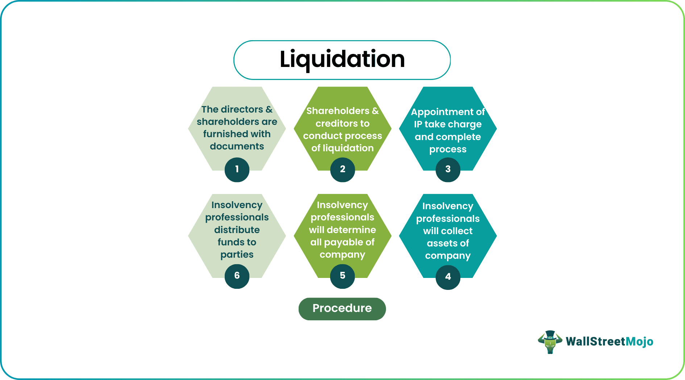

## Table of Contents

## What is liquidation?

Liquidation is when a company stops doing business and sells everything it owns to pay off its debts. This happens when a company can't pay its bills and has to close down. The goal is to turn the company's assets, like buildings, equipment, and inventory, into cash to pay back people and other businesses the company owes money to.

There are two main types of liquidation: voluntary and compulsory. Voluntary liquidation happens when the company's owners decide to close the business themselves. Compulsory liquidation is when a court orders the company to close because it can't pay its debts. In both cases, a liquidator is appointed to handle the process of selling the assets and paying off the debts in a fair way.

## What are the different types of liquidation?

There are two main types of liquidation: voluntary and compulsory. Voluntary liquidation happens when the company's owners decide to close the business themselves. They might do this because the business is not making money anymore, or they want to retire. The owners will call a meeting, vote to liquidate, and then a liquidator is appointed to handle selling the company's assets and paying off debts.

Compulsory liquidation is different. It happens when a court orders the company to close because it can't pay its debts. Usually, someone the company owes money to, like a creditor, will go to court and ask for the company to be liquidated. If the court agrees, it will appoint a liquidator to take over. The liquidator's job is to sell the company's assets and use the money to pay off the debts in a fair way.

Both types of liquidation aim to turn the company's assets into cash to pay back what the company owes. The main difference is who starts the process: the company's owners in voluntary liquidation, or a court in compulsory liquidation.

## What triggers the liquidation process?

The liquidation process can start in two main ways. The first way is when the company's owners decide to close the business themselves. This is called voluntary liquidation. They might choose to do this because the business is losing money, they want to retire, or they see no future for the business. When this happens, the owners will have a meeting, vote to liquidate, and then appoint someone called a liquidator to handle selling everything the company owns and using the money to pay off debts.

The second way is when a court orders the company to close. This is called compulsory liquidation. It happens when the company can't pay its bills and someone it owes money to, like a creditor, goes to court and asks for the company to be liquidated. If the court agrees, it will appoint a liquidator to take over. The liquidator's job is to sell the company's assets and use the money to pay off the debts in a fair way. Both types of liquidation aim to turn the company's assets into cash to pay back what the company owes.

## Who are the key stakeholders involved in liquidation?

The key stakeholders in liquidation are the company's owners or shareholders, the creditors, and the liquidator. The owners or shareholders are the people who started the business or own part of it. They might decide to start the liquidation process if they think it's the best way to deal with the company's problems. Creditors are the people or businesses that the company owes money to. They can ask a court to start the liquidation process if the company can't pay its bills.

The liquidator is a very important person in the liquidation process. They are usually a professional who is appointed to take control of the company and sell everything it owns. Their job is to turn the company's assets into cash and use that money to pay back the creditors as fairly as possible. The liquidator has to follow the law and make sure the process is done correctly.

## What are the steps involved in the liquidation process?

The liquidation process starts when a decision is made to close the company. This can happen in two ways: either the company's owners decide to do it themselves, which is called voluntary liquidation, or a court orders it because the company can't pay its bills, which is called compulsory liquidation. Once the decision is made, a liquidator is appointed. This person's job is to take control of the company and sell everything it owns, like buildings, equipment, and inventory. The goal is to turn these assets into cash.

After the liquidator is appointed, they start selling the company's assets. They have to do this in a fair way, making sure to get the best price possible. The money from these sales is then used to pay off the company's debts. The liquidator pays the creditors in a certain order, usually starting with secured creditors, like banks, and then moving on to unsecured creditors, like suppliers. Once all the assets are sold and the debts are paid, the company is officially closed, and it no longer exists.

## How does liquidation affect employees?

When a company goes into liquidation, it can be tough for the employees. They might lose their jobs because the company is closing down. This means they won't have a regular income anymore, which can be scary. Sometimes, the employees are owed money, like wages or vacation pay, and they become creditors. They might get some of this money back, but it depends on how much the company can sell its assets for and how many other debts need to be paid first.

The liquidator, who is in charge of selling the company's things, has to follow certain rules about paying employees. Usually, employees are paid before other unsecured creditors, but after secured creditors like banks. If there isn't enough money to pay everyone, employees might not get all the money they are owed. This can make it hard for them to find a new job and take care of their families during a difficult time.

## What are the legal requirements for liquidation?

When a company goes into liquidation, there are some important legal rules that need to be followed. If the owners decide to close the business themselves, they have to call a meeting and vote to liquidate. They then need to appoint a liquidator, who is a professional that knows the law and can handle the process correctly. The liquidator's job is to sell everything the company owns and use the money to pay off the company's debts. They have to do this in a fair way, following the order set by the law, which usually means paying secured creditors first, like banks, and then unsecured creditors, like suppliers.

If a court orders the company to close because it can't pay its bills, the process is a bit different. A creditor, someone the company owes money to, goes to court and asks for the company to be liquidated. If the court agrees, it will appoint a liquidator to take over. The liquidator has to follow the same rules about selling the company's assets and paying off debts. They need to make sure everything is done legally and fairly, so that everyone gets paid as much as possible from what's left of the company.

## How is the value of assets determined during liquidation?

When a company goes into liquidation, the liquidator has to figure out how much the company's things, or assets, are worth. They do this by looking at what the assets might sell for in the current market. The liquidator might hire experts, like appraisers, to help them decide the value. They look at things like buildings, equipment, and inventory, and try to guess what people would pay for them right now. This is important because the money from selling these assets is used to pay off the company's debts.

Sometimes, the value of the assets during liquidation is less than what they were worth when the company was still running. This is because the liquidator usually has to sell everything quickly, and buyers know this. They might offer less money because they know the liquidator needs to sell fast. So, the liquidator tries to get the best price they can, but it's often not as much as the company would have gotten if it was still open and selling things in the normal way.

## What are the financial implications of liquidation for creditors?

When a company goes into liquidation, it means the company is selling everything it owns to pay back the money it owes. Creditors are the people or businesses that the company owes money to. They might get some of their money back, but it depends on how much the company can sell its things for. The liquidator, who is in charge of selling the company's assets, has to follow certain rules about who gets paid first. Usually, secured creditors, like banks that have loans secured by the company's property, get paid before unsecured creditors, like suppliers. If there isn't enough money to pay everyone, some creditors might not get all the money they are owed.

For unsecured creditors, like suppliers or employees owed wages, the situation can be tough. They are usually at the back of the line to get paid, after secured creditors and certain other priority debts. If the company's assets don't sell for enough money, these creditors might only get a small part of what they are owed, or nothing at all. This can be a big problem for them, especially if they were counting on that money to keep their own businesses running or to pay their bills.

## How can a company prepare for liquidation?

If a company thinks it might have to close down and go into liquidation, it's a good idea to get ready ahead of time. The first thing the company should do is talk to a lawyer or a financial advisor who knows about liquidation. They can help the company understand what needs to be done and make a plan. The company should also make a list of everything it owns, like buildings, equipment, and inventory, and figure out how much these things might be worth. It's also important to make a list of all the people and businesses the company owes money to, so the liquidator knows who to pay back.

Another important step is to tell the employees what's going on. They need to know that the company might close and that they could lose their jobs. The company should also try to pay any money it owes to employees, like wages or vacation pay, as soon as possible. This can help make things a bit easier for the employees if the company does go into liquidation. By getting ready ahead of time, the company can make the liquidation process go more smoothly and help make sure everyone gets treated fairly.

## What are the tax implications of liquidation?

When a company goes into liquidation, there are some tax things to think about. The company might have to pay taxes on any money it makes from selling its things, like buildings or equipment. This is called capital gains tax. Also, if the company has been making money and owes taxes on that, those taxes need to be paid before the company can close. The liquidator, who is in charge of selling the company's things and paying off its debts, has to make sure all the taxes are paid correctly. If the company can't pay all its taxes, the tax people become creditors, and they might get paid before other people the company owes money to.

For the people who own the company, there can be tax implications too. If they get any money back from the company after everything is sold and the debts are paid, they might have to pay taxes on that money. This depends on the rules in their country. It's a good idea for the owners to talk to a tax expert to understand what they might have to pay. By knowing about the tax rules, everyone involved can make sure they are doing things the right way and not getting into trouble with the tax people.

## What are the long-term effects of liquidation on a company's reputation and future operations?

When a company goes into liquidation, it can really hurt its reputation. People might think the company failed because it couldn't pay its bills, and this can make customers, suppliers, and investors lose trust in the company. Even if the owners start a new business later, it can be hard to shake off the bad reputation from the old company. People might be wary of working with them again because they remember what happened before.

In terms of future operations, liquidation means the company is closed for good. All its things are sold, and it can't do business anymore. If the owners want to start a new business, they have to begin from scratch. They might use what they learned from the old company to do better next time, but they won't have any of the old company's resources or customers to help them. Starting over can be tough, but with a good plan and hard work, they might be able to build a successful business again.

## References & Further Reading

[1]: Bergstra, J., Bardenet, R., Bengio, Y., & Kégl, B. (2011). ["Algorithms for Hyper-Parameter Optimization."](https://dl.acm.org/doi/10.5555/2986459.2986743) Advances in Neural Information Processing Systems 24.

[2]: ["Advances in Financial Machine Learning"](https://www.amazon.com/Advances-Financial-Machine-Learning-Marcos/dp/1119482089) by Marcos Lopez de Prado

[3]: ["Evidence-Based Technical Analysis: Applying the Scientific Method and Statistical Inference to Trading Signals"](https://www.amazon.com/Evidence-Based-Technical-Analysis-Scientific-Statistical/dp/0470008741) by David Aronson

[4]: ["Machine Learning for Algorithmic Trading"](https://github.com/stefan-jansen/machine-learning-for-trading) by Stefan Jansen

[5]: ["Quantitative Trading: How to Build Your Own Algorithmic Trading Business"](https://github.com/LucindaYa/quant-resources/blob/master/Quantitative%20Trading%20How%20to%20Build%20Your%20Own%20Algorithmic%20Trading%20Business.pdf) by Ernest P. Chan