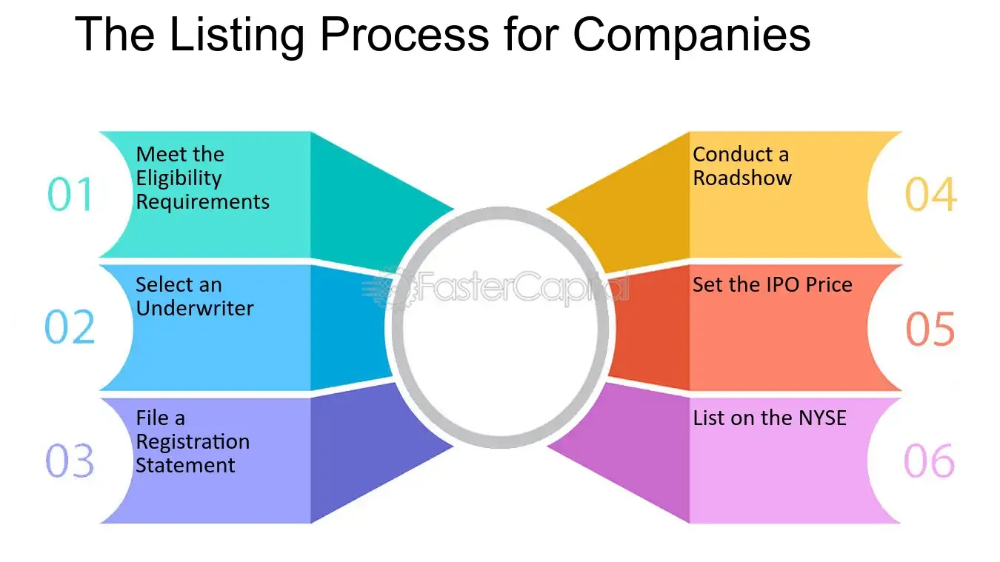

## Table of Contents

## What is the OTCBB and how does it differ from other stock markets?

The OTCBB, or Over-The-Counter Bulletin Board, is a trading platform where stocks that are not listed on major exchanges like the NYSE or NASDAQ can be bought and sold. It's run by the Financial Industry Regulatory Authority (FINRA) and is mainly used for trading smaller companies that might not meet the requirements to be listed on bigger exchanges. These companies often have lower stock prices and can be riskier investments.

The main difference between the OTCBB and other stock markets is the type of companies listed. On the OTCBB, you'll find many small or startup companies, while major exchanges like the NYSE and NASDAQ list larger, more established companies. Another difference is the level of regulation and transparency. Companies on the OTCBB have less strict reporting requirements, which can make it harder for investors to get detailed information about the company's financial health. This can make investing in OTCBB stocks riskier compared to stocks on more regulated exchanges.

## What are the basic requirements for a company to be listed on the OTCBB?

To be listed on the OTCBB, a company needs to meet a few basic requirements. First, it must have at least one market maker that agrees to quote its stock. A market maker is a firm that stands ready to buy and sell the stock. Second, the company needs to be up-to-date with its filings to the Securities and Exchange Commission (SEC). This means they have to regularly report their financial information.

These requirements are less strict than those for bigger exchanges like the NYSE or NASDAQ. For example, the OTCBB doesn't have minimum standards for things like the company's size, how much money it makes, or how many shares are available to the public. This makes it easier for smaller companies to get listed on the OTCBB, but it also means that investors need to be careful because the information about these companies might not be as detailed or reliable.

## How does a company start the process of listing on the OTCBB?

To start the process of listing on the OTCBB, a company first needs to find a market maker. A market maker is a firm that agrees to buy and sell the company's stock. The company talks to different market makers and picks one that will work with them. Once they have a market maker, the company needs to make sure they are up-to-date with their filings to the Securities and Exchange Commission (SEC). This means they have to regularly report their financial information to the SEC.

After these steps, the market maker will file a Form 211 with FINRA. This form tells FINRA that the market maker wants to start quoting the company's stock on the OTCBB. If FINRA approves the Form 211, the company's stock can start trading on the OTCBB. The whole process can take a few weeks to a few months, depending on how quickly the company can get everything ready and how long it takes FINRA to review the Form 211.

## What are the financial reporting obligations for companies listed on the OTCBB?

Companies listed on the OTCBB have to follow certain rules about sharing their financial information. They need to file regular reports with the Securities and Exchange Commission (SEC). This includes things like annual reports, which give a detailed look at the company's financial health for the past year, and quarterly reports, which update investors on how the company is doing every three months.

These reports are important because they help investors understand how the company is doing. The OTCBB has less strict rules than bigger stock markets, but companies still have to be honest and up-to-date with their filings. If a company doesn't keep up with these reports, it might get removed from the OTCBB, which can make it harder for them to raise money or attract investors.

## What is the role of a market maker in the OTCBB listing process?

A market maker plays a key role in getting a company listed on the OTCBB. They are the ones who agree to buy and sell the company's stock. When a company wants to be on the OTCBB, it first needs to find a market maker willing to work with them. The company talks to different market makers and picks one. Once they have a market maker, the company needs to make sure they are up-to-date with their financial reports to the SEC.

After these steps, the market maker files a Form 211 with FINRA. This form tells FINRA that the market maker wants to start quoting the company's stock on the OTCBB. If FINRA approves the Form 211, the company's stock can start trading on the OTCBB. The market maker's job is important because without them, the company's stock wouldn't be able to be bought and sold on the OTCBB.

## How can a company find and appoint a market maker for OTCBB listing?

To find a market maker for OTCBB listing, a company usually starts by reaching out to different brokerage firms that act as market makers. These firms specialize in trading stocks that are not listed on major exchanges. The company might use their existing contacts in the financial world or search online for firms that work with OTCBB listings. They will talk to several market makers to see which one is the best fit for their needs. The company looks for a market maker that understands their business and is willing to support them through the listing process.

Once the company finds a market maker they like, they will work together to get everything ready for the OTCBB listing. The market maker will help the company make sure all their financial reports are up-to-date with the SEC. Then, the market maker will file a Form 211 with FINRA. This form is important because it tells FINRA that the market maker wants to start quoting the company's stock on the OTCBB. If FINRA approves the Form 211, the company's stock can start trading on the OTCBB, and the market maker will keep buying and selling the stock to make sure there is always a market for it.

## What are the ongoing compliance requirements for companies listed on the OTCBB?

Companies listed on the OTCBB have to keep up with certain rules to stay on the board. They need to file regular reports with the Securities and Exchange Commission (SEC). This means they have to send in annual reports, which tell investors how the company did over the past year, and quarterly reports, which update investors every three months. These reports are important because they help investors understand the company's financial health. If a company doesn't keep up with these reports, it might get removed from the OTCBB, which can make it harder for them to raise money or attract investors.

Another ongoing requirement is that the company must have at least one market maker that continues to quote its stock. The market maker helps keep the stock trading by buying and selling it. If the market maker stops quoting the stock, the company could lose its listing on the OTCBB. So, it's important for the company to keep a good relationship with their market maker and make sure they are happy to keep working with them.

## How does the SEC's regulation impact the listing and operation on the OTCBB?

The SEC's rules play a big part in how companies get listed and stay on the OTCBB. To be listed, a company has to keep up with its financial reports to the SEC. This means sending in yearly and every-three-months reports that show how the company is doing. If a company doesn't do this, it can't get listed or might get kicked off the OTCBB. The SEC's rules help make sure that investors can see important information about the company, so they can make smart choices about buying or selling the stock.

Once a company is listed on the OTCBB, the SEC's rules keep on being important. The company has to keep sending in those regular reports to stay on the board. If they miss a report, they could get removed, which would make it harder for them to raise money or attract investors. Also, the SEC's rules make sure that the company has at least one market maker who keeps the stock trading. If the market maker stops, the company could lose its spot on the OTCBB. So, the SEC's rules help keep things fair and open for everyone involved.

## What are the common challenges and pitfalls companies face when listing on the OTCBB?

One common challenge companies face when listing on the OTCBB is finding and keeping a market maker. A market maker is important because they buy and sell the company's stock. If a company can't find a good market maker or if the market maker stops working with them, the company might not be able to stay listed on the OTCBB. This can be tough because market makers might not want to work with smaller or riskier companies.

Another challenge is keeping up with the SEC's reporting rules. Companies have to send in regular reports to the SEC to show how they are doing. If they miss a report, they could get kicked off the OTCBB. This can be hard for smaller companies that might not have a lot of money or people to help with the paperwork. Missing these reports can hurt the company's chances of raising money or attracting investors.

Lastly, being on the OTCBB can be risky because it's less regulated than bigger stock markets. This means there might be less information available about the company, which can make it harder for investors to trust them. Some investors might think the company is too risky and not want to invest. This can make it harder for the company to grow and succeed.

## How does the process of listing on the OTCBB compare to listing on other exchanges like NASDAQ or NYSE?

Listing on the OTCBB is easier for small companies than listing on bigger exchanges like NASDAQ or NYSE. To get on the OTCBB, a company needs to find a market maker who will buy and sell their stock, and they have to keep up with their financial reports to the SEC. That's it. But to get on NASDAQ or NYSE, a company has to meet tougher rules. They need to show they are big enough, make enough money, and have enough shares out there for people to buy. These exchanges also check that the company follows strict rules about how they run their business and report their finances.

The OTCBB is less strict and more welcoming to smaller companies, but it also means less protection for investors. On the OTCBB, there's less information about the company, and it can be riskier to invest. On the other hand, NASDAQ and NYSE have more rules to make sure investors have all the information they need. This can make it safer to invest, but it's harder for small companies to get listed. So, the OTCBB is a good first step for small companies, but NASDAQ and NYSE are better for bigger, more stable companies.

## What strategies can a company use to enhance its visibility and liquidity after listing on the OTCBB?

After listing on the OTCBB, a company can boost its visibility by actively sharing news and updates about its business. This can be done through press releases, social media, and a well-maintained company website. By keeping investors and the public informed about new products, partnerships, or financial achievements, the company can attract more attention and interest. It's also helpful to participate in investor conferences and roadshows where the company can meet potential investors face-to-face and explain why their stock is a good investment.

To improve liquidity, the company should work closely with its market maker to make sure there are always buyers and sellers for its stock. Encouraging more market makers to quote the stock can also help because it means more people are ready to trade. Another strategy is to engage with shareholders and encourage them to hold onto their shares and even buy more. This can be done by offering dividends or other incentives. By keeping the stock active and in demand, the company can make it easier for people to buy and sell its shares, which helps with liquidity.

## What advanced financial considerations should a company be aware of when planning to list on the OTCBB?

When a company plans to list on the OTCBB, it needs to think about how it will handle its finances in the long run. One big thing to consider is how much it will cost to stay listed. The company has to pay for things like keeping up with SEC reports, working with a market maker, and maybe hiring people to help with all the paperwork. These costs can add up, especially for a small company. The company also needs to think about how it will raise money after listing. Being on the OTCBB might make it easier to get investors, but it can also be harder because some investors might see the company as riskier than one on a bigger exchange.

Another important thing to think about is how the company's stock price might change after listing. The OTCBB can be a bit unpredictable because it's less regulated than bigger exchanges. This means the stock price might go up and down a lot, which can be good or bad. If the price goes up, it can help the company raise more money. But if it goes down, it might be harder to get investors. The company should also think about how it will manage its finances to keep growing and stay healthy. This might mean making smart choices about spending money, investing in new projects, and keeping enough cash on hand to handle any surprises.

## References & Further Reading

[1]: U.S. Securities and Exchange Commission (SEC). ["Over-the-Counter Bulletin Board (OTCBB)."](https://www.sec.gov/search-filings)

[2]: Financial Industry Regulatory Authority (FINRA). ["Form 211: Initiating or Resuming Quotations in a Quoted Security."](https://www.finra.org/filing-reporting/over-the-counter-reporting-facility-orf/form-211)

[3]: Hasbrouck, J. (2003). ["Intraday price formation in U.S. equity markets."](https://onlinelibrary.wiley.com/doi/10.1046/j.1540-6261.2003.00609.x) The Journal of Finance, 58(6), 2375-2400.

[4]: Easley, D., & O'Hara, M. (1992). ["Time and the process of security price adjustment."](https://onlinelibrary.wiley.com/doi/abs/10.1111/j.1540-6261.1992.tb04402.x)90028-8) Journal of Finance, 47(2), 577-605.

[5]: Narang, R. K. (2013). ["Inside the Black Box: A Simple Guide to Quantitative and High-Frequency Trading."](https://onlinelibrary.wiley.com/doi/book/10.1002/9781118662717) Wiley.

[6]: Durbin, M. (2010). ["All About High-Frequency Trading."](https://www.mhebooklibrary.com/doi/book/10.1036/9780071743457) McGraw Hill Professional.