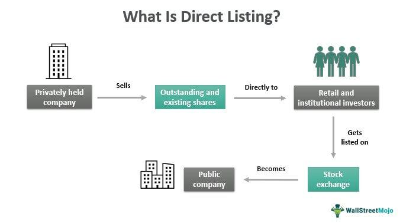

The Over-the-Counter Bulletin Board (OTCBB) is a regulated quotation service managed by the National Association of Securities Dealers (NASD), designed to facilitate the trading of over-the-counter (OTC) securities. Unlike major exchanges such as Nasdaq, the OTCBB does not operate as a formal exchange but as a platform providing real-time quotations, last-sale prices, and volume information. This feature ensures that investors have access to current and comprehensive trading data.

The OTCBB serves as a crucial platform for companies that do not meet the stringent listing requirements of larger exchanges, thereby enabling smaller or emerging businesses to access public capital markets. In this context, the OTCBB acts as a bridge, providing these companies with an opportunity to maintain visibility and share liquidity in the broader financial market.



In examining the OTCBB, this article will delve into the listing process for companies, clarifying the essential trading mechanics involved. Additionally, the article will address the emergence and implications of algorithmic trading in the context of OTCBB listings. With the advent of sophisticated trading algorithms, market participants can execute trades at speeds previously unimagined, leveraging the real-time data provided by the OTCBB to optimize trading strategies. Through this exploration, we aim to provide a comprehensive overview of the OTCBB's functionality and its interaction with modern trading technologies.

## Table of Contents

## Understanding the OTCBB

The Over-the-Counter Bulletin Board (OTCBB) is a marketplace designed for the trading of over-the-counter (OTC) securities that are not listed on national securities exchanges such as the New York Stock Exchange (NYSE) or Nasdaq. Unlike these major exchanges, the OTCBB does not impose stringent listing requirements on the companies whose securities are traded. This flexibility allows a variety of smaller or financially distressed companies to access public capital markets, which might otherwise be inaccessible due to their inability to meet the more rigid criteria of traditional exchanges.

One of the distinguishing features of the OTCBB is its requirement for companies to remain up-to-date with their filings with the Securities and Exchange Commission (SEC). This includes timely submission of periodic reports such as 10-K, 10-Q, and other material event reports. Compliance with SEC reporting is crucial as it serves as a transparency mechanism, providing investors with essential information about the company's financial health, management, and market performance.

OTCBB listings often serve as a refuge for companies that have been delisted from major exchanges due to non-compliance with their requirements. Reasons for delisting from primary exchanges can range from failure to maintain a minimum share price to inadequacies in market capitalization or shareholder equity. By continuing to trade on the OTCBB, these companies can maintain some level of marketability and liquidity for their securities while they work to improve their financial standing.

While the OTCBB does not set financial or qualitative benchmarks for listing, it does enforce regulatory compliance through the SEC's oversight. This hybrid structure offers a middle ground between the strictly regulated environments of major stock exchanges and the more loosely regulated OTC markets, such as the Pink Sheets. As such, the OTCBB plays a vital role in providing an interim platform for companies trying to improve their financial status or those that choose not to be constrained by the larger exchanges' rigorous requirements.

## Listing Process on the OTCBB

The Over-the-Counter Bulletin Board (OTCBB) provides an accessible platform for companies seeking to list their securities without the stringent requirements of major exchanges. To initiate a listing on the OTCBB, a company must engage a market maker who acts as an intermediary to facilitate the listing process. The market maker is responsible for applying for quotes on behalf of the company, essentially becoming a sponsor for the company's securities.

The involvement of a market maker is critical because they ensure [liquidity](/wiki/liquidity-risk-premium) and provide a continuous market for the security. Their role involves submitting a Form 211 to the Financial Industry Regulatory Authority (FINRA), detailing the company’s financial information, business plan, and any other pertinent information required for transparency to investors.

One of the attractive features of the OTCBB is the absence of listing fees for companies. This can be particularly beneficial for smaller companies or those experiencing financial constraints, as it reduces the initial cost barrier to entering the public markets. However, it is important to note that market makers do incur a nominal fee for each security they quote on the OTCBB. This fee compensates for the administrative and regulatory costs associated with maintaining and updating the quotes. Additionally, market makers earn revenue through the bid-ask spread, which is the difference between the prices at which they are willing to buy and sell securities.

Overall, the OTCBB listing process offers a low-cost alternative for companies unable to meet the capital or regulatory requirements of major exchanges, while also granting visibility and access to a broader investor base. The partnership with market makers is a cornerstone of this process, ensuring the company's securities have the necessary support to facilitate trading.

## Role of Market Makers

Market makers play an essential role in the functioning of the Over-the-Counter Bulletin Board (OTCBB) by providing liquidity and ensuring the smooth execution of trades for OTC securities. They achieve this by being willing to buy and sell securities from their own inventories, thus facilitating continuous trading even when there are not enough buyers or sellers at a given time. 

The primary way market makers earn profits is through the bid-ask spread. The bid price is the maximum price a buyer is willing to pay for a security, while the ask price is the minimum price a seller is willing to accept. The spread, or the difference between these two prices, represents the market maker's [earning](/wiki/earning-announcement) opportunity. For example, if a market maker quotes a bid price of $10.00 and an ask price of $10.10, they stand to make a $0.10 profit per share traded, assuming they can buy at their bid and sell at their ask.

In addition to profiting from the spread, market makers are also responsible for maintaining the integrity of quotes and ensuring that transactions can proceed efficiently. This responsibility often involves managing their inventory of securities and continuously updating their bid and ask prices based on market conditions and information flows. Given their pivotal role, market makers influence the price stability and trading [volume](/wiki/volume-trading-strategy) of OTCBB-listed securities significantly. 

Moreover, since the OTCBB does not function like traditional stock exchanges with centralized order [books](/wiki/algo-trading-books), the decentralized nature of the OTCBB emphasizes the role of market makers in bridging gaps between buyers and sellers. They provide vital market data, including real-time quotes and transaction summations, that are indispensable for investors making informed decisions. This continuous provision of liquidity helps to mitigate the risk of large price swings, which can be typical in less liquid OTC markets.

In summary, market makers are indispensable participants in the OTCBB framework, ensuring both the execution of trades and the stability of trading prices. They not only profit from the bid-ask spread but also uphold the integrity and efficiency of the market to the benefit of all stakeholders involved.

## Algorithmic Trading and the OTCBB

Algorithmic trading, which employs automated systems to execute trading strategies at high speeds, can be effectively extended to securities traded on the Over-the-Counter Bulletin Board (OTCBB). This platform provides essential real-time data, including quotes and transaction volumes, that algorithmic traders rely on to optimize their operations. The efficient execution of algorithmic trades on the OTCBB demands access to this uninterrupted and precise data, which enables traders to make informed decisions quickly.

Automation in trading on platforms like the OTCBB generally aims to improve market efficiency. However, successful [algorithmic trading](/wiki/algorithmic-trading) requires not just any data, but high-quality data that is both accurate and timely. This means processing information about bid-ask spreads, trade volumes, and price movements in real-time to determine and execute optimal trading strategies. Algorithmic systems must be equipped to handle the nuances of OTCBB trading environments, tailoring strategies to match the liquidity and [volatility](/wiki/volatility-trading-strategies) patterns characteristic of OTC markets.

The inherent characteristics of OTCBB—its lack of stringent listing requirements and the prevalence of smaller companies—may present unique opportunities for [arbitrage](/wiki/arbitrage) and other algorithm-driven strategies. Traders can potentially exploit inefficiencies arising from less frequent trading and larger bid-ask spreads compared to more regulated exchanges. Nonetheless, the automation of such strategies necessitates sophisticated algorithms capable of adapting to rapidly changing market conditions and extracting insights from vast datasets, which can be implemented using languages like Python:

```python
import pandas as pd
import numpy as np

# Simulate a simple price-movement-based trading strategy
def simple_moving_average_strategy(prices, window=10):
    """
    Simple moving average strategy for detecting trade signals.

    Parameters:
    - prices: time-series data for security prices
    - window: number of days over which to calculate the moving average

    Returns:
    - signals: trading signals (1 for buy, -1 for sell)
    """
    signals = np.zeros_like(prices)
    moving_avg = pd.Series(prices).rolling(window=window).mean()

    # Buy signal: today's price crosses moving average from below
    buy_signal = (prices > moving_avg) & (np.roll(prices, 1) <= np.roll(moving_avg, 1))
    # Sell signal: today's price crosses moving average from above
    sell_signal = (prices < moving_avg) & (np.roll(prices, 1) >= np.roll(moving_avg, 1))

    signals[buy_signal] = 1
    signals[sell_signal] = -1

    return signals

# Example usage with synthetic price data
prices = np.random.normal(loc=100, scale=5, size=100)
trade_signals = simple_moving_average_strategy(prices)
```

This kind of algorithm can be fine-tuned to account for specific characteristics of OTCBB securities and can be used to identify entry and [exit](/wiki/exit-strategy) points in trading. The flexibility of algorithmic trading on the OTCBB helps maintain competitive edges in an ever-evolving financial landscape. Nonetheless, it is critical for traders to ensure that the algorithms are resilient to the volatility and liquidity challenges that can arise in such markets.

## Challenges and Considerations

The Over-the-Counter Bulletin Board (OTCBB) presents a range of challenges and considerations for investors and traders, particularly due to its distinct operational and regulatory environment compared to major exchanges. One primary concern is the potential for market manipulation. OTC markets, including the OTCBB, typically face lower regulatory scrutiny, which can increase the risk of manipulative activities, such as pump-and-dump schemes. These schemes involve artificially inflating the price of a security through misleading statements, followed by selling the security at a profit, leaving unsuspecting investors with devalued shares.

Furthermore, the OTCBB's relatively less stringent disclosure requirements compared to national exchanges can lead to a lack of transparency. Investors may encounter difficulties obtaining comprehensive and reliable information about OTCBB-listed companies. This opacity necessitates thorough due diligence when considering investments, as insufficient data may hinder proper risk assessment and financial analysis.

Algorithmic trading on the OTCBB introduces additional challenges tied to the unique characteristics of over-the-counter markets, such as volatility and liquidity concerns. Unlike trading on major exchanges, the OTCBB may experience significant price fluctuations and lower trading volumes, presenting difficulties for algorithms designed to execute trades with precision and speed. As a result, robust computational systems and carefully calibrated trading strategies are essential for navigating these conditions.

To address these issues, traders may apply enhanced risk management techniques and sophisticated algorithms capable of adapting to rapid market changes. For instance, implementing [machine learning](/wiki/machine-learning) models that learn from historical price movements could improve predictive accuracy and trade execution. Additionally, setting up real-time monitoring systems could provide traders with critical insights into market dynamics, helping to mitigate risks associated with price manipulation or significant volatility.

In summary, engaging with OTCBB-listed securities requires an awareness of the inherent risks posed by lower regulatory oversight and market transparency. Investors and traders must apply rigorous evaluation and select advanced trading technologies to effectively participate in these markets.

## Conclusion

The Over-the-Counter Bulletin Board (OTCBB) plays a crucial role in the financial landscape by offering a trading platform specifically designed for smaller companies that do not meet the stringent listing requirements of major exchanges such as Nasdaq or the New York Stock Exchange (NYSE). This flexibility allows these companies to access capital markets while providing investors with opportunities to invest in emerging and potentially high-growth ventures.

However, trading in OTCBB-listed securities is not without risks. The lower regulatory oversight compared to major exchanges means that investors face a higher level of uncertainty and potential exposure to market manipulation or fraudulent activities. Consequently, investors must be vigilant and perform comprehensive due diligence when considering investments in OTCBB securities. This includes scrutinizing financial statements, understanding the company’s business model, and evaluating market conditions that could impact the stock’s performance.

The advent of algorithmic trading introduces additional complexities and opportunities in the context of the OTCBB. These automated systems can efficiently process large volumes of data and execute trades at speeds far beyond human capabilities, potentially capturing nuanced market movements and arbitrage opportunities. However, the success of algorithmic trading on the OTCBB is contingent upon the availability of precise and timely market data, robust execution strategies, and effective risk management protocols. Traders must account for the inherent volatility and liquidity challenges characteristic of OTC markets.

In conclusion, while the OTCBB offers a necessary platform for smaller companies, and algorithmic strategies can enhance trade execution, caution is warranted. Both investors and traders need to thoroughly assess the risks and craft well-informed strategies to navigate the unique complexities of the OTCBB environment effectively.

## References & Further Reading

[1]: U.S. Securities and Exchange Commission (SEC). ["Over-the-Counter Bulletin Board (OTCBB)."](https://www.sec.gov/search-filings)

[2]: Financial Industry Regulatory Authority (FINRA). ["Form 211: Initiating or Resuming Quotations in a Quoted Security."](https://www.finra.org/filing-reporting/over-the-counter-reporting-facility-orf/form-211)

[3]: Hasbrouck, J. (2003). ["Intraday price formation in U.S. equity markets."](https://onlinelibrary.wiley.com/doi/10.1046/j.1540-6261.2003.00609.x) The Journal of Finance, 58(6), 2375-2400.

[4]: Easley, D., & O'Hara, M. (1992). ["Time and the process of security price adjustment."](https://onlinelibrary.wiley.com/doi/abs/10.1111/j.1540-6261.1992.tb04402.x)90028-8) Journal of Finance, 47(2), 577-605.

[5]: Narang, R. K. (2013). ["Inside the Black Box: A Simple Guide to Quantitative and High-Frequency Trading."](https://onlinelibrary.wiley.com/doi/book/10.1002/9781118662717) Wiley.

[6]: Durbin, M. (2010). ["All About High-Frequency Trading."](https://www.mhebooklibrary.com/doi/book/10.1036/9780071743457) McGraw Hill Professional.