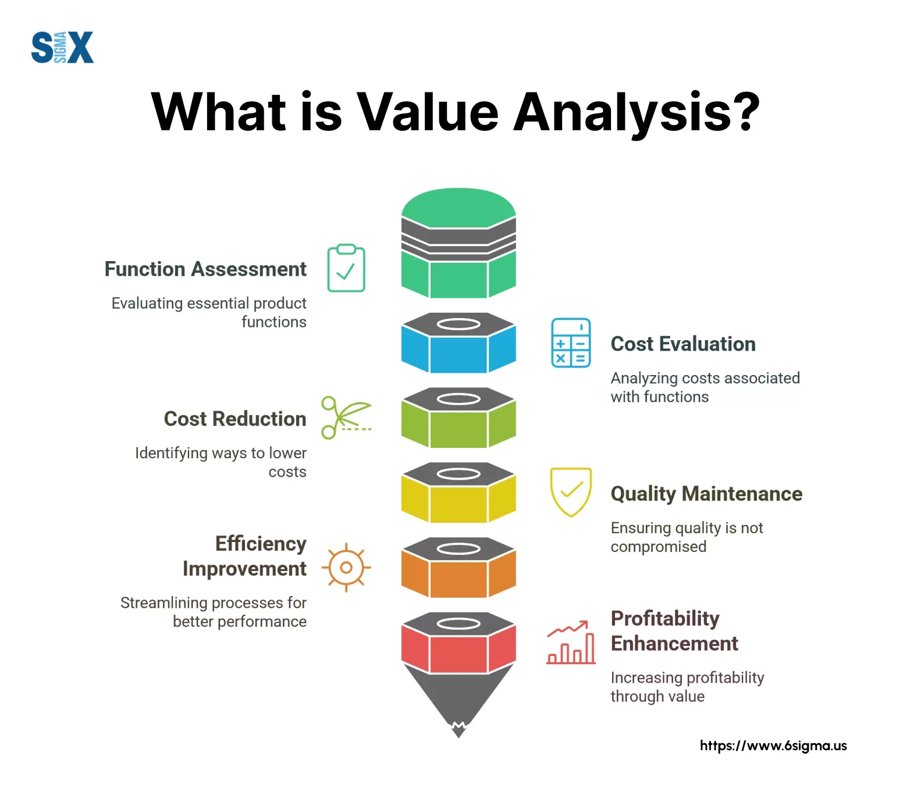

## Table of Contents

## What is Process Value Analysis?

Process Value Analysis is a method used to understand and improve business processes. It involves looking at each step in a process to see if it adds value or if it can be done better. The goal is to make the process more efficient and effective, which can save time and money.

To do a Process Value Analysis, you start by mapping out the entire process from start to finish. Then, you look at each step to see if it is necessary and if it adds value to the end product or service. If a step does not add value, you think about ways to change or remove it. This helps make the process smoother and can lead to better results for the business.

## What are the main objectives of Process Value Analysis?

The main objectives of Process Value Analysis are to make business processes better and more efficient. This means looking at each step in a process to see if it really needs to be there and if it helps make the final product or service better. By doing this, businesses can find ways to cut out steps that don't add value, which can save time and money.

Another goal is to improve the overall quality of what the business offers. When you take out unnecessary steps and focus on the ones that matter, the end result is often better. This can make customers happier and can help the business stand out from others. In the end, Process Value Analysis helps businesses work smarter, not harder, and deliver better value to their customers.

## How does Process Value Analysis differ from other process improvement methodologies?

Process Value Analysis focuses on looking at each step in a process to see if it adds value to the final product or service. It's all about figuring out which steps are really needed and which ones can be changed or removed to make the process better. This method is different from others because it puts a big focus on value. Instead of just trying to make things faster or cheaper, Process Value Analysis wants to make sure every step helps make the end result better.

Other process improvement methods, like Lean or Six Sigma, have different main goals. Lean is all about getting rid of waste and making things flow smoothly. It looks at the whole process to find any steps that don't add value and tries to cut them out. Six Sigma, on the other hand, is more about making things consistent and reducing mistakes. It uses data and statistics to find and fix problems in the process. While these methods can also improve value, they don't focus on it as directly as Process Value Analysis does.

In short, Process Value Analysis is unique because it zeroes in on the value each step adds to the final product or service. It's not just about speed or quality, but about making sure every part of the process contributes to a better outcome. This makes it different from Lean, which focuses on eliminating waste, and Six Sigma, which aims to reduce variability and defects.

## What are the key steps involved in conducting a Process Value Analysis?

To start a Process Value Analysis, you first need to map out the entire process from beginning to end. This means writing down all the steps that happen, in the order they happen. Once you have this map, you can see the whole process clearly. The next step is to look at each part of the process and ask if it adds value to the final product or service. If a step does not add value, you think about ways to change it or get rid of it. This helps you find parts of the process that can be made better.

After you've looked at each step, you start making changes. You might combine some steps, remove others, or find new ways to do things that add more value. It's important to keep checking how these changes affect the process. You might need to try different things to see what works best. Once you've made all your changes, you should have a process that is more efficient and adds more value to the end result. This can save time and money, and make your customers happier with what you offer.

## Can you provide an example of Process Value Analysis applied in a real-world scenario?

Imagine a small bakery that wants to make their bread-making process better. They start by writing down all the steps they take to make bread, from mixing the dough to baking and selling it. After looking at each step, they find that they spend a lot of time waiting for the dough to rise. They decide to try a new type of yeast that makes the dough rise faster. This change cuts down the waiting time and lets them make more bread in a day.

After making this change, the bakery keeps an eye on how things are going. They see that they can now make more bread without working longer hours. This means they can sell more bread and make more money. The customers are also happy because they can buy fresh bread more often. By using Process Value Analysis, the bakery made their process more efficient and added more value to their business.

## What tools and techniques are commonly used in Process Value Analysis?

In Process Value Analysis, people often use a few key tools and techniques to make their processes better. One common tool is process mapping, which means drawing out all the steps in a process so you can see them clearly. This helps you understand how everything fits together and where you might be able to make changes. Another tool is value stream mapping, which is similar but focuses more on the flow of materials and information through the process. It helps you see where there might be delays or waste that you can get rid of.

Another technique used in Process Value Analysis is the 5 Whys method. This involves asking "why" five times to get to the root cause of a problem. By understanding why something is happening, you can find better ways to fix it. People also use data analysis to look at numbers and see how changes affect the process. This can help you make decisions based on facts, not just guesses. Together, these tools and techniques help businesses make their processes more efficient and add more value to what they offer.

## What are the potential benefits of implementing Process Value Analysis in an organization?

Implementing Process Value Analysis in an organization can bring many benefits. It helps businesses find and remove steps in their processes that don't add value. This makes the process faster and more efficient, which can save time and money. By focusing on what really matters, companies can make their products or services better, which can make customers happier and more loyal.

Another big benefit is that Process Value Analysis can help businesses stay ahead of their competition. By constantly looking for ways to improve, companies can keep up with changes in the market and find new ways to meet customer needs. This can lead to more sales and growth for the business. Overall, using Process Value Analysis can make a company more successful by making their processes better and adding more value to what they offer.

## What are some common challenges and limitations faced when using Process Value Analysis?

One common challenge when using Process Value Analysis is that it can be hard to get everyone in the organization to agree on what adds value. Different people might have different ideas about which steps in a process are important. This can lead to disagreements and make it difficult to make changes. Another challenge is that Process Value Analysis can take a lot of time and effort. You need to map out the whole process, look at each step carefully, and try different changes to see what works best. This can be hard for busy organizations that don't have a lot of time to spend on process improvements.

Another limitation is that Process Value Analysis might not work well for very complex processes. If a process has a lot of steps and involves many different people or departments, it can be hard to see how everything fits together. This can make it difficult to figure out which steps add value and which ones don't. Also, sometimes the changes you make based on Process Value Analysis can have unexpected effects on other parts of the business. You might improve one process but cause problems somewhere else. This means you need to be careful and keep checking how your changes are working.

## How can the effectiveness of Process Value Analysis be measured?

The effectiveness of Process Value Analysis can be measured by looking at how much the process has improved after making changes. You can check things like how long it takes to complete the process, how much it costs, and how happy customers are with the final product or service. If the process is faster, cheaper, and customers are happier, then the Process Value Analysis has worked well.

Another way to measure effectiveness is by comparing the results before and after the analysis. You can use data to see if there are fewer mistakes, less waste, and if the process is more efficient. If you see big improvements in these areas, it means that the Process Value Analysis has helped make the process better and added more value to what the business offers.

## What criticisms have been leveled against Process Value Analysis by experts in the field?

Some experts say that Process Value Analysis can be too focused on cutting out steps that don't add value, which might make people overlook other important parts of the process. They worry that by only looking at value, businesses might miss chances to improve things like customer service or employee satisfaction. Another criticism is that Process Value Analysis can be hard to use in big, complicated businesses. In these places, it's tough to see how all the different parts of a process fit together, so figuring out what adds value can be tricky.

Experts also point out that Process Value Analysis might not work well if a business doesn't have good data to start with. Without clear information about how the process is working now, it's hard to know if the changes you make are really helping. Some also argue that Process Value Analysis can be too slow and take too much time, especially for companies that need to make quick changes to stay competitive. Overall, while Process Value Analysis can help make processes better, it's not perfect and has some limits that businesses need to think about.

## How have recent developments in technology influenced the application of Process Value Analysis?

Recent developments in technology have made Process Value Analysis easier and more effective. For example, software tools can now help businesses map out their processes quickly and accurately. These tools can show the whole process in a clear way, making it easier to see which steps add value and which ones don't. Also, data analytics technology can look at lots of information about how a process is working. This helps businesses make smart decisions about changes they should make to improve the process.

Another way technology has changed Process Value Analysis is through automation. With automation, businesses can try out different changes to their process without spending a lot of time and effort. This means they can see how a change will work before they do it for real. Plus, technology like artificial intelligence can help find patterns and problems in a process that people might miss. This makes Process Value Analysis more thorough and can lead to bigger improvements in how a business works.

## What future trends might impact the evolution of Process Value Analysis?

In the future, Process Value Analysis might change a lot because of new technology. One big trend is the use of artificial intelligence (AI) and machine learning. These technologies can look at a lot of data really fast and find patterns that people might not see. This can make Process Value Analysis more accurate and help businesses find even better ways to improve their processes. Also, as more businesses use cloud computing, they can share information more easily. This means that Process Value Analysis can be done across different parts of a company, no matter where they are located.

Another trend that could change Process Value Analysis is the growing focus on sustainability. More and more, businesses want to make sure their processes are good for the environment. This means that when they do Process Value Analysis, they will also look at how their processes affect the planet. They might try to find ways to use less energy or create less waste. As these trends keep growing, Process Value Analysis will need to change to help businesses meet these new goals.

## References & Further Reading

[1]: Bergstra, J., Bardenet, R., Bengio, Y., & Kégl, B. (2011). ["Algorithms for Hyper-Parameter Optimization."](https://dl.acm.org/doi/10.5555/2986459.2986743) Advances in Neural Information Processing Systems 24.

[2]: ["Advances in Financial Machine Learning"](https://www.amazon.com/Advances-Financial-Machine-Learning-Marcos/dp/1119482089) by Marcos Lopez de Prado

[3]: ["Evidence-Based Technical Analysis: Applying the Scientific Method and Statistical Inference to Trading Signals"](https://www.amazon.com/Evidence-Based-Technical-Analysis-Scientific-Statistical/dp/0470008741) by David Aronson

[4]: ["Machine Learning for Algorithmic Trading"](https://github.com/stefan-jansen/machine-learning-for-trading) by Stefan Jansen

[5]: ["Quantitative Trading: How to Build Your Own Algorithmic Trading Business"](https://github.com/LucindaYa/quant-resources/blob/master/Quantitative%20Trading%20How%20to%20Build%20Your%20Own%20Algorithmic%20Trading%20Business.pdf) by Ernest P. Chan