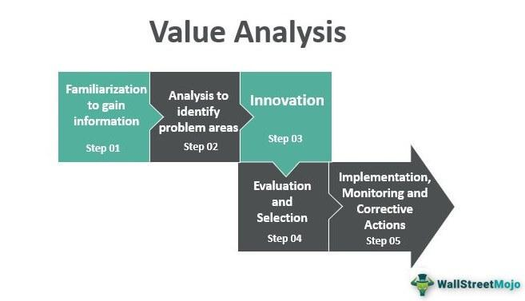

In today's fast-paced business environment, efficiency and the rapid delivery of goods or services are essential to maintaining a competitive edge. Companies continuously seek ways to optimize their operations to respond swiftly to market demands and technological advancements. Process Value Analysis (PVA) emerges as a powerful tool that businesses employ to streamline their internal processes by thoroughly evaluating each component for its contribution to the end value delivered to the customer.

PVA focuses on identifying and eliminating steps in a process that do not add economic value, thereby reducing costs and delivery time. It is a comprehensive approach applicable across various sectors, including logistics, operations, and customer service. By consistently adapting to technological advancements, businesses can enhance their operational efficiencies and stay competitive in ever-evolving markets.



This article investigates how PVA can transform business process evaluations, specifically emphasizing its application in algorithmic trading. As a form of trading that leverages automated, pre-programmed trading instructions, algorithmic trading benefits significantly from the refinement that PVA offers. By optimizing trading algorithms, businesses can achieve faster trade execution, lower transaction costs, and improved overall profitability.

While PVA offers substantial benefits, its implementation is not without challenges and criticisms. It requires careful consideration to ensure that essential process elements are not removed, thereby compromising operational integrity and internal controls. The successful application of PVA involves strategic analysis and collaboration with all stakeholders, ensuring that its value-adding potential is fully realized.

Ultimately, integrating PVA into business processes can improve efficiency and align operations more closely with strategic goals. For businesses striving to meet evolving market demands and customer expectations, adopting PVA provides the agility and competitive advantage needed to succeed.

## Table of Contents

## Understanding Process Value Analysis (PVA)

Process Value Analysis (PVA) is an analytical tool used to assess each step of a business process to determine its contribution to the overall value delivered to the customer. The primary goal of PVA is to identify and eliminate processes or steps that do not add economic value, thereby effectively reducing costs and delivery times. By focusing on value-adding activities, businesses can channel their resources more efficiently, fostering improvements in productivity and customer satisfaction.

Managers conducting PVA take into account several factors to maximize process efficiency. The implementation of new technologies often plays a pivotal role, as technological advancements can streamline processes, improve accuracy, and reduce manual interventions. Error reduction is another critical [factor](/wiki/factor-investing), as minimizing errors can enhance quality, reduce waste, and improve customer satisfaction. Efficient processes, in turn, lead to lower operational costs and quicker delivery times.

PVA is versatile and applicable across various business domains, including logistics, operations, and customer service. In logistics, PVA might involve restructuring supply chain processes to eliminate redundancies, reducing lead times, and cutting down transportation costs. In operations, it could mean refining manufacturing processes to ensure resources are used optimally. Meanwhile, in customer service, PVA can help streamline communication processes to enhance the customer experience.

To keep up with the rapidly changing business environment, organizations must continuously adapt these processes to incorporate the latest technological advancements. Embracing innovation allows businesses to maintain efficient operations and improve their competitive positioning. Technologies such as [artificial intelligence](/wiki/ai-artificial-intelligence), automation, and data analytics can significantly contribute to process efficiency, offering precise insights into where value is added and where improvements can be made.

For example, [machine learning](/wiki/machine-learning) algorithms can be used to identify patterns in process inefficiencies, providing predictive insights that aid in decision-making. Simple linear regression, a statistical method, can help quantify the relationships between different process variables to ascertain which steps contribute most to the variance in costs or delivery times.

```python
import numpy as np
from sklearn.linear_model import LinearRegression

# Example dataset
X = np.array([[1, 2], [2, 3], [4, 5], [3, 4]])
y = np.array([7, 9, 14, 12])

# Fit linear regression model
model = LinearRegression().fit(X, y)

# Coefficients show which process steps contribute most to changes in value
coefficients = model.coef_
intercept = model.intercept_

print("Coefficients:", coefficients)
print("Intercept:", intercept)
```

By fostering a culture of continuous improvement, businesses can better align their processes with strategic objectives, ensuring that every step delivers maximum value to the customer while remaining responsive to emerging market trends and technological innovations.

## PVA in Algorithmic Trading

Algorithmic trading is a method of executing trades using automated and pre-programmed instructions, ensuring trades are executed at optimal times. This method benefits significantly from the application of Process Value Analysis (PVA). By systematically analyzing trading algorithms, PVA helps identify redundant or inefficient steps that can be eliminated to enhance the algorithm's performance.

The primary aim of incorporating PVA into [algorithmic trading](/wiki/algorithmic-trading) is to optimize algorithms to execute trades more swiftly and at reduced costs. By eliminating unnecessary steps, the response time for trade execution is decreased, potentially increasing overall profitability. For instance, if a particular algorithmic strategy involves multiple intermediate calculations that do not significantly affect the output, PVA can help identify these calculations and suggest their removal, streamlining the process.

Beyond enhancing trade execution speed and cost efficiency, regular PVA assessments ensure algorithms remain current with the latest market conditions and technological advancements. As financial markets are dynamic, algorithms must adapt to changes such as new trading regulations, shifts in market sentiment, or developments in trading technology. Continuous PVA allows traders and algorithm developers to adjust their strategies to maintain competitiveness.

The application of PVA in algorithmic trading also aids in improving risk management and decision-making. By scrutinizing each step of a trading algorithm, PVA can help uncover potential points of failure or inadequacies in risk management practices. For example, if an algorithm does not adequately account for sudden market [volatility](/wiki/volatility-trading-strategies), PVA can inform adjustments that mitigate these risks, thereby enhancing the robustness of the trading strategy.

Implementing PVA requires a structured approach. Python, with its rich ecosystem of libraries such as NumPy and pandas, can streamline the process of evaluating and refining trading algorithms. The following Python pseudocode illustrates how one might begin such an analysis:

```python
import numpy as np
import pandas as pd

def evaluate_steps(trading_algo):
    # Load historical trade data
    data = pd.read_csv('trade_data.csv')

    # Define steps in the algorithm
    steps = ['step1', 'step2', 'step3']
    efficiency_scores = []

    for step in steps:
        # Evaluate the contribution of each step
        efficiency = analyze_step(data, trading_algo, step)
        efficiency_scores.append(efficiency)

    # Identify redundant steps
    redundant_steps = [steps[i] for i in range(len(steps)) if efficiency_scores[i] < threshold]

    return redundant_steps

def analyze_step(data, trading_algo, step):
    # Simulate trading with this step
    trade_results = trading_algo.simulate(data, step)

    # Assess efficiency
    efficiency_score = calculate_efficiency(trade_results)

    return efficiency_score

# Example threshold value
threshold = 0.05
```

This example outlines a basic framework for evaluating the efficiency of different steps within a trading algorithm. By consistently applying PVA, traders can refine their algorithms, ensuring they align with current market needs and preserve their competitive advantage.

## Criticism and Challenges of PVA

Process Value Analysis (PVA) is an essential tool for businesses aiming to optimize processes, reduce costs, and improve efficiency. However, its implementation is accompanied by a series of challenges and criticisms that organizations must navigate carefully. One significant risk associated with PVA is the potential elimination of steps that, while not immediately apparent in contributing value, are pivotal for maintaining operational integrity. This could include processes that ensure quality control, regulatory compliance, or internal checks that safeguard against fraud.

Moreover, the excessive focus on cost-cutting, a typical outcome of PVA exercises, could translate into negative repercussions such as diminished customer relationships and weakened internal control systems. For instance, reducing customer support personnel to cut costs might increase response times, leading to customer dissatisfaction. Similarly, trimming steps that appear redundant without a thorough understanding might strip essential controls, risking compliance failures or operational mishaps.

Businesses employing PVA must also be cautious not to undermine critical compliance and control measures. Overlooking these elements could result in penalties or damage to the company's reputation. Therefore, it is essential for organizations to balance efficiency with adherence to necessary regulatory and internal protocols when conducting PVA.

To counteract these risks, it is advisable for businesses to engage with stakeholders and control analysts throughout the PVA process. By consulting with these parties, organizations can gain insights into potentially overlooked functional aspects of processes and ensure that any changes maintain both value and compliance. Clear communication and collaboration with stakeholders help to preemptively identify possible pitfalls and allow organizations to refine their PVA implementation strategies accordingly.

By understanding and addressing these criticisms and challenges, businesses can harness the benefits of PVA while minimizing risks, thereby achieving a more balanced and effective approach to process optimization.

## Implementation and Examples of PVA

Successful implementation of Process Value Analysis (PVA) requires a meticulous analysis and strategic positioning to identify activities that truly add value in business processes. This involves employing cross-functional teams and leveraging tools such as process flowcharts to effectively pinpoint inefficiencies and amplify value-rich components.

Cross-functional teams, composed of members from various departments, are crucial in the PVA framework. These teams bring diverse perspectives and expertise that aid in the comprehensive evaluation of processes. By mapping out processes with flowcharts, organizations can visually identify bottlenecks, redundancies, and non-value-added tasks. Flowcharts serve as a critical tool, offering a clear representation of each process step, which supports decision-makers in identifying areas for improvement.

The application of PVA spans various domains, including the optimization of purchasing processes and the assessment of mergers and acquisitions. In procurement, for instance, PVA can streamline the purchasing process by eliminating redundant steps and reducing costs. By identifying non-essential activities in the procurement process, companies can focus on value-added functions that contribute to efficient resource allocation and cost savings.

Real-world examples illustrate how companies utilize PVA to align operations with strategic objectives and enhance performance. One such example is how a major retail company applied PVA to its supply chain operations. By analyzing each link in the supply chain, the organization identified unnecessary intermediaries and redundancies, resulting in a more direct and cost-effective distribution network. This not only reduced delivery times but also significantly lowered logistical costs.

In the context of evaluating mergers and acquisitions, PVA aids companies in assessing the value potential of each aspect of the acquired business. By focusing on performance metrics that align with strategic goals, businesses can make informed decisions on which processes to integrate, modify, or eliminate, ensuring seamless integration and optimization post-merger.

Ultimately, successful PVA implementation revolves around detailed process analysis and strategic decision-making. By harnessing the collective insights of cross-functional teams and employing visualization tools such as process flowcharts, businesses can identify and amplify value-added activities. These efforts lead to streamlined operations, cost efficiencies, and alignment with overarching business goals, driving improved organizational performance.

## Conclusion

Process Value Analysis (PVA) is an essential framework for businesses seeking to improve efficiency, especially in algorithmic trading. By focusing on the identification and removal of non-value-added activities, PVA empowers organizations to lower costs and enhance the efficiency of their processes. The strategy involves a thorough scrutiny of each step within a process to ascertain its contribution to the overall value offered to customers. 

Despite its numerous advantages, PVA is not without its challenges. One of the key risks involves the potential removal of process steps that, although not immediately apparent as value-adding, might be crucial for maintaining the overall integrity and stability of operations. An overemphasis on cost reduction can also inadvertently result in negative outcomes, such as weakened customer relationships or compromised internal controls. Hence, it is critical for companies to engage stakeholders in the implementation process, ensuring that essential compliance and control measures remain intact.

As market demands evolve, businesses are pressured to adapt swiftly to remain competitive. Integrating PVA can furnish the agility needed to achieve this objective. By continuously refining business processes, PVA enables companies to better align their operations with customer expectations and market dynamics. This alignment not only enhances customer satisfaction but also bolsters long-term sustainability in a competitive business landscape.

Ultimately, PVA plays a crucial role in fostering continuous improvement within business processes. By maintaining a focus on value creation and eliminating inefficiencies, organizations can achieve enhanced performance and operational excellence, ensuring they remain at the forefront of their respective industries.

## References & Further Reading

[1]: Bergstra, J., Bardenet, R., Bengio, Y., & Kégl, B. (2011). ["Algorithms for Hyper-Parameter Optimization."](https://dl.acm.org/doi/10.5555/2986459.2986743) Advances in Neural Information Processing Systems 24.

[2]: ["Advances in Financial Machine Learning"](https://www.amazon.com/Advances-Financial-Machine-Learning-Marcos/dp/1119482089) by Marcos Lopez de Prado

[3]: ["Evidence-Based Technical Analysis: Applying the Scientific Method and Statistical Inference to Trading Signals"](https://www.amazon.com/Evidence-Based-Technical-Analysis-Scientific-Statistical/dp/0470008741) by David Aronson

[4]: ["Machine Learning for Algorithmic Trading"](https://github.com/stefan-jansen/machine-learning-for-trading) by Stefan Jansen

[5]: ["Quantitative Trading: How to Build Your Own Algorithmic Trading Business"](https://github.com/LucindaYa/quant-resources/blob/master/Quantitative%20Trading%20How%20to%20Build%20Your%20Own%20Algorithmic%20Trading%20Business.pdf) by Ernest P. Chan