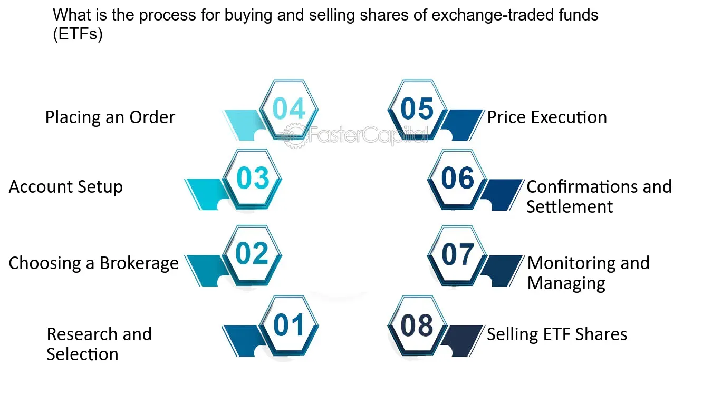

## Table of Contents

## What are shares and why do people buy and sell them?

Shares are pieces of a company that people can buy. When you buy a share, you own a small part of that company. Companies sell shares to get money to grow their business. The price of a share can go up or down based on how well the company is doing and what people think about it.

People buy and sell shares for different reasons. Some people buy shares to make money. If the price of the share goes up, they can sell it for more than they paid. This is called making a profit. Other people buy shares to get money from the company without selling the shares. This is called a dividend. People also sell shares if they think the price will go down or if they need money for something else.

## How can someone begin the process of buying shares?

To start buying shares, you first need to open a brokerage account. A brokerage account is like a special bank account where you can buy and sell shares. You can open one online with a company called a broker. Some popular brokers are Robinhood, E*TRADE, and Charles Schwab. When you sign up, you'll need to give some personal information and maybe some money to start.

Once your account is set up, you can start looking for shares to buy. You can search for companies you like or ones that you think will do well. When you find a share you want, you can place an order to buy it. You'll need to decide how many shares you want and how much you're willing to pay. After you place your order, the broker will try to buy the shares for you. If everything goes well, you'll own a part of the company!

## What are the different types of orders used when buying or selling shares?

When you want to buy or sell shares, you can use different types of orders. The most common type is a market order. A market order means you want to buy or sell the shares right away at the current price. It's fast and simple, but the price you get might be a little different from what you see because the price can change quickly.

Another type of order is a limit order. With a limit order, you set a specific price at which you want to buy or sell the shares. If the share price reaches your limit, the order will go through. This gives you more control over the price, but there's no guarantee your order will be filled if the price never reaches your limit.

There are also stop orders. A stop order is used to limit losses or protect profits. For example, a stop-loss order will sell your shares if the price drops to a certain level. A stop-limit order combines a stop order and a limit order. It will trigger a limit order when the share price reaches your stop price. These orders can be a bit more complicated but can help you manage risk.

## What are the key factors to consider before buying shares?

Before you buy shares, it's important to think about the company you're interested in. You should look at how the company is doing. Is it making money? Is it growing? You can find this information in the company's financial reports. It's also good to know what the company does and if it's in a strong industry. Sometimes, big news or changes in the world can affect a company's share price, so keep an eye on that too.

Another thing to consider is your own money situation. How much money can you afford to spend on shares? Remember, the price of shares can go up or down, so you might lose money. It's a good idea to only use money you can afford to lose. Also, think about how long you want to keep the shares. Are you looking to make a quick profit, or are you planning to hold onto them for a long time? Your plan can change how you pick shares and when you decide to sell them.

## How does the stock market function and what role do stock exchanges play?

The stock market is like a big store where people can buy and sell pieces of companies, called shares. It works by matching people who want to sell their shares with people who want to buy them. The price of shares goes up and down based on how many people want to buy or sell them. If more people want to buy than sell, the price goes up. If more people want to sell than buy, the price goes down. This all happens very quickly, and the prices can change a lot in a short time.

Stock exchanges are special places where all this buying and selling happens. They make sure everything is fair and follows the rules. Some famous stock exchanges are the New York Stock Exchange (NYSE) and the NASDAQ. When you buy or sell shares, you usually do it through a broker, who uses these exchanges to find someone to trade with. The exchanges keep track of all the trades and make sure everyone gets what they paid for. This helps keep the stock market running smoothly.

## What are the common fees and costs associated with buying and selling shares?

When you buy and sell shares, you might have to pay some fees and costs. One common fee is called a commission. This is what you pay the broker for helping you buy or sell shares. Some brokers charge a flat fee for each trade, while others might charge a percentage of the total amount you're spending. There are also brokers that offer commission-free trades, but they might make money in other ways, like by charging for other services or getting paid by the companies whose shares you're buying.

Another cost to think about is the bid-ask spread. This is the difference between the highest price someone is willing to pay for a share (the bid) and the lowest price someone is willing to sell it for (the ask). When you buy a share, you usually pay the ask price, and when you sell, you get the bid price. The difference between these two prices is a cost to you. Also, if you hold onto your shares for a long time, you might have to pay taxes on any money you make when you sell them. It's a good idea to know about all these costs so you can make smart choices about buying and selling shares.

## How can one analyze a company's financial health before deciding to buy its shares?

To figure out if a company is doing well before you buy its shares, you can look at its financial reports. These reports tell you how much money the company is making and spending. One important thing to check is the company's earnings. If the company is making more money than it's spending, that's a good sign. You can also look at the company's debt. If it has a lot of debt, it might be risky. Another thing to consider is the company's revenue, which is how much money it's bringing in from selling its products or services. If the revenue is growing, the company might be doing well.

Another way to analyze a company's financial health is by looking at some special numbers called financial ratios. These ratios can help you understand the company's situation better. For example, the price-to-earnings (P/E) ratio compares the company's share price to its earnings per share. A lower P/E ratio might mean the share is a good deal. The debt-to-equity ratio tells you how much the company is borrowing compared to what it owns. A high ratio could mean the company is taking big risks. By looking at these numbers and understanding what they mean, you can make a smarter choice about whether to buy the company's shares.

## What are the tax implications of buying and selling shares?

When you buy and sell shares, you might have to pay taxes on any money you make. If you sell your shares for more than you paid for them, that's called a capital gain. You'll need to pay taxes on that gain. The tax rate depends on how long you held the shares. If you held them for a year or less, it's called a short-term capital gain, and you'll pay your regular income tax rate on it. If you held the shares for more than a year, it's a long-term capital gain, and the tax rate is usually lower.

Sometimes, you might sell your shares for less than you paid for them. That's called a capital loss. You can use this loss to lower the taxes you owe on your gains. If your losses are more than your gains, you can use some of the loss to reduce your other income, up to a certain amount each year. It's a good idea to keep track of when you buy and sell shares and how much you paid and received, so you can figure out your taxes correctly.

## How can one use technical analysis to make informed decisions about buying and selling shares?

Technical analysis is a way to look at share prices and see if they might go up or down in the future. People who use technical analysis look at charts and patterns of how the share price has moved in the past. They think that these patterns can help them guess what will happen next. For example, if a share price keeps going up and up, making higher highs and higher lows, some people might think it will keep going up. They use tools like moving averages, which smooth out the price over time, and indicators like the Relative Strength Index (RSI), which can tell if a share is overbought or oversold.

When deciding whether to buy or sell shares, technical analysts pay close attention to things like support and resistance levels. Support is a price where the share has stopped falling before and might stop falling again. Resistance is a price where the share has stopped going up before and might stop going up again. If a share price breaks through a resistance level, it might be a good time to buy because it could keep going up. If it falls below a support level, it might be a good time to sell because it could keep going down. By using these tools and patterns, people try to make smarter choices about when to buy and sell shares.

## What are the risks involved in buying and selling shares and how can they be mitigated?

Buying and selling shares can be risky because the price of shares can go up and down a lot. If the price goes down after you buy, you could lose money. Sometimes, big news or changes in the world can make the price of shares drop suddenly. Also, if a company is not doing well, its share price might go down. Another risk is that you might not know enough about the company or the stock market, which can lead to bad choices. 

You can lower these risks by doing a few things. First, learn as much as you can about the companies you're thinking about buying shares in. Look at their financial reports and see if they're making money and growing. You can also spread your money out by buying shares in different companies and industries. This way, if one company does badly, you won't lose all your money. It's also a good idea to only use money you can afford to lose on shares, so you don't get into financial trouble if the price goes down. Finally, think about your plan for buying and selling shares and stick to it, even if the market gets exciting or scary.

## How do advanced trading strategies like short selling and options trading work?

Short selling is a way to make money if you think a share's price will go down. When you short sell, you borrow shares from someone else and sell them right away at the current price. Later, if the price goes down like you thought it would, you buy the shares back at the lower price and give them back to the person you borrowed them from. The difference between the price you sold at and the price you bought back at is your profit. But if the price goes up instead, you lose money because you have to buy the shares back at a higher price. Short selling can be risky because your losses can be bigger than your gains.

Options trading is another way to bet on share prices, but it's a bit more complicated. An option is like a contract that gives you the right to buy or sell a share at a certain price before a certain date. There are two main types of options: calls and puts. A call option lets you buy a share at a set price, called the strike price, before the option expires. If the share price goes up above the strike price, you can buy the share at the lower strike price and then sell it at the higher market price to make a profit. A put option lets you sell a share at the strike price. If the share price goes down below the strike price, you can buy the share at the lower market price and then sell it at the higher strike price to make a profit. Options can be risky too, because you can lose the money you paid for the option if the share price doesn't move the way you expected.

## What are the regulatory considerations and compliance requirements for buying and selling shares?

When you buy and sell shares, you need to follow rules set by government agencies like the Securities and Exchange Commission (SEC) in the United States. These rules are there to make sure the stock market is fair and safe for everyone. For example, you have to give true information when you open a brokerage account. Also, if you know something important about a company that other people don't know, you can't use that information to buy or sell shares. This is called insider trading, and it's against the law. Brokers and stock exchanges also have to follow these rules and make sure their customers do too.

Another important thing to know is that you might need to report your trades to the government. If you make a lot of money from buying and selling shares, you have to pay taxes on it. You also need to keep good records of when you bought and sold shares and how much you paid and received. This helps you figure out your taxes correctly. If you don't follow these rules, you could get in trouble and have to pay fines or even go to jail. So, it's a good idea to learn about the rules and make sure you follow them when you're trading shares.

## References & Further Reading

[1]: ["Advances in Financial Machine Learning"](https://www.amazon.com/Advances-Financial-Machine-Learning-Marcos/dp/1119482089) by Marcos Lopez de Prado

[2]: ["Algorithmic Trading: Winning Strategies and Their Rationale"](https://www.wiley.com/en-us/Algorithmic+Trading%3A+Winning+Strategies+and+Their+Rationale-p-9781118746912) by Ernie Chan

[3]: ["Flash Boys: A Wall Street Revolt"](https://en.wikipedia.org/wiki/Flash_Boys) by Michael Lewis

[4]: Hasbrouck, J. (2017). ["High-frequency trading and price discovery."](https://faculty.haas.berkeley.edu/hender/HFT-PD.pdf)

[5]: Kirchler, M., & Huber, J. (2007). ["Fat tails and volatility clustering in financial markets: A simple model."](https://www.uibk.ac.at/ibf/team/huberj/kirchlerhuber_jedc_final.pdf) Journal of Futures Markets.