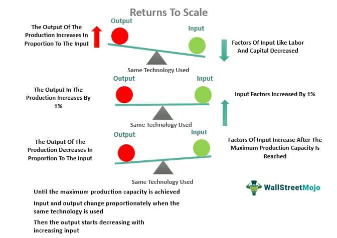

Economic cycles are fundamental to understanding market behavior and financial stability, as they represent the natural fluctuations in economic activity over time. These cycles are generally characterized by phases of expansion, where economic indicators such as gross domestic product (GDP) and employment rates increase, and phases of contraction, marked by declines in these same indicators. A critical aspect of these cycles is procyclicality, which refers to variables that move in tandem with overall economic conditions. Procyclical variables, such as GDP, asset prices, and credit availability, tend to rise during economic expansions and decrease during contractions, thereby amplifying economic cycles.

Algorithmic trading, which employs pre-programmed trading instructions to execute orders based on market data, has the potential to exploit these cycles for profit and risk management. Due to its capacity to process complex and voluminous data quickly, algorithmic trading can identify cyclical patterns and adjust trading strategies accordingly. This capability allows traders to potentially capitalize on the predictable movements associated with procyclicality, either by taking advantage of rising trends during expansions or by mitigating risks during downturns.



This article will explore the influence of procyclicality within economic cycles and analyze its impact on algorithmic trading strategies. Through a comprehensive examination, we aim to understand how procyclical factors could be harnessed by algorithmic trading to enhance decision-making and improve financial outcomes.

## Table of Contents

## Understanding Economic Cycles

Economic cycles represent the natural ebb and flow of economic activity that occurs over time. These cycles are typically characterized by alternating periods of expansion, where economic activities and indicators rise, and contraction, where they fall. Understanding economic cycles is essential for effectively navigating financial markets, as it provides insights into the broader economic context in which businesses and policymakers operate.

The different phases of economic cycles include expansion, peak, contraction, and trough. During the expansion phase, economic indicators such as Gross Domestic Product (GDP), employment rates, and consumer spending generally increase. This phase reflects an upturn in economic production and confidence, often accompanied by rising corporate profits and job creation. At the peak, economic activity reaches its zenith, noting the end of the expansion period and the beginning of contraction.

Contraction phases, including recessions, see a decline in economic activity. GDP may decrease, unemployment rates can rise, and consumer spending often slows. Eventually, the economy hits a trough, marking the end of the contraction phase and laying the groundwork for the next expansion.

Key economic indicators often reflect these cycles, with GDP, employment, and consumer spending being predominantly procyclical, meaning they move in the same direction as the overall economy. For example, GDP tends to rise during expansions and fall during contractions. However, other indicators may exhibit acyclical or countercyclical behaviors. Acyclical indicators show no systematic correlation with the economic cycle, while countercyclical indicators, such as unemployment rates, typically move inversely with the overall economic trend.

Recognizing and interpreting these indicators is vital for policymakers in devising fiscal policies and for central banks in setting monetary policies. For businesses, understanding economic cycles aids strategic planning and risk management, allowing companies to anticipate changes in demand and adjust production or investment accordingly. Investors also rely on insights from economic cycles to optimize portfolio allocations, seeking to maximize returns while managing risk during different phases of the cycle.

In summary, a comprehensive understanding of economic cycles and their indicators enables policymakers, businesses, and investors to make informed decisions. This understanding fosters economic resilience and stability by allowing stakeholders to anticipate and respond to cyclical changes effectively.

## The Concept of Procyclicality

Procyclicality is characterized by the tendency of economic indicators to align positively with the overall economic state. This phenomenon is observable across various metrics, such as Gross Domestic Product (GDP), labor market dynamics, and asset prices. In a procyclical environment, GDP increases when the economy is expanding and decreases during contractions. Similarly, employment rates and workforce participation tend to improve as economic conditions strengthen and decline when the economy contracts.

The concept extends beyond traditional economic indicators to financial variables such as credit availability and leverage. During periods of economic growth, credit is more accessible due to increased lender confidence and borrower optimism, contributing to an expansion in financial activities. Conversely, in downturns, credit becomes restrictive, reflecting heightened risk aversion, thereby exacerbating economic contraction.

Procyclicality results from interconnected market behaviors and structural dynamics. For instance, asset prices often exhibit procyclical patterns due to investor sentiment. In bullish market phases, rising confidence leads to higher valuations, while bearish phases see valuations dip. Similarly, leveraging practices in financial markets display procyclical tendencies—investors and institutions increase their leverage in boom periods, seeking to maximize returns, and reduce it during downturns to minimize potential losses.

This intrinsic link between economic activity and financial variables underscores the importance of understanding procyclicality. Recognizing these patterns assists policymakers, investors, and financial analysts in predicting market movements and implementing measures to cushion the economy from extreme cyclical fluctuations. Addressing procyclical tendencies requires strategies that balance growth and stability, ensuring economic resilience across business cycles.

## Mechanisms of Procyclicality

Procyclicality in economic systems emerges from the interplay of behavioral factors, financial market structures, and regulatory policies, each influencing how economic cycles unfold. These mechanisms lead to the amplification of economic fluctuations, creating challenges for financial stability.

Behavioral factors play a significant role in driving procyclical tendencies. During periods of economic expansion, investor optimism and confidence often lead to increased risk-taking. This is characterized by greater investments in high-risk assets and elevated levels of borrowing, driven by expectations of continued growth and high returns. Conversely, during economic contractions, fear and uncertainty prompt risk aversion, resulting in reduced investment and a pullback from the markets. Such herd behavior can exacerbate market cycles, pushing asset prices higher during booms and lower during busts.

Financial market structures also contribute to procyclicality. The design of financial instruments and the dynamics of lending practices inherently foster cyclical behavior. For instance, when asset prices rise during an economic boom, the collateral value used for securing loans increases. This facilitates further lending and borrowing, which can inflate asset bubbles. Conversely, during downturns, falling asset prices reduce collateral values, leading to tighter credit conditions and a contraction in lending activities. These credit market dynamics inherently magnify the ebbs and flows of the economic cycle.

Regulatory frameworks and macroeconomic policies significantly impact procyclicality as well. Regulatory policies, if not designed with a counter-cyclical perspective, can inadvertently amplify economic fluctuations. For example, capital adequacy requirements for banks that are rigidly set without consideration of economic cycles may lead to tighter credit conditions in downturns, further constraining economic activity. Conversely, policies that encourage lending during booms can fuel asset price inflation and expose the financial system to higher risks.

To mitigate these procyclical tendencies, regulatory policies can be designed to be counter-cyclical. This involves implementing dynamic capital buffers that increase during economic booms and decrease during downturns, ensuring banks have sufficient capital to continue lending during economic contractions. Additionally, macroprudential policies that adjust interest rates in response to economic indicators can help stabilize cycles. These policy interventions, by smoothing out the extremes of economic fluctuations, play a vital role in promoting financial system stability and sustainable economic growth.

## Impact on Financial Markets and Stability

Procyclicality significantly influences financial markets and stability by intensifying economic cycles. In periods of economic expansion, procyclical variables like GDP and asset prices rise, potentially inflating asset bubbles. These bubbles occur when the prices of assets surpass their intrinsic values due to excessive optimism. For instance, during a boom, investors might irrationally inflate stock prices, driven by expectations of continued growth, only for these prices to plummet when the economy contracts, illustrating the burst of the bubble. The decline often exacerbates economic downturns as wealth diminishes, leading to reduced consumer spending and investment.

The [volatility](/wiki/volatility-trading-strategies) introduced by procyclicality presents considerable challenges to financial stability. During boom periods, the consistent rise in asset values might lead to complacency among investors and financial institutions. As risk perception diminishes, entities may engage in excessive risk-taking, often using high leverage to amplify returns. This behavior creates systemic vulnerabilities that become apparent during economic contractions, potentially triggering widespread financial distress or, in severe cases, financial crises. The rapid unwinding of leveraged positions and mass sell-offs during downturns can lead to sharp market declines, increasing volatility and systemic risk.

Policymakers play a crucial role in mitigating the risks associated with procyclicality by designing and implementing counter-cyclical regulations. These regulations aim to temper the natural ebb and flow of economic cycles. For instance, counter-cyclical capital buffers require banks to accumulate additional capital during periods of economic growth to cushion potential losses during downturns. Similarly, dynamic provisioning mandates financial institutions to set aside loan-loss provisions in good times, smoothing out losses over the cycle and preventing abrupt tightening of credit during downturns. Effective implementation of such policies can moderate the amplitude of economic cycles, ensuring a more stable economic environment. 

By proactively managing these procyclical tendencies through tailored regulatory practices, policymakers can reduce volatility, safeguard financial systems, and enhance overall economic resilience.

## Procyclicality in Algorithmic Trading

Algorithmic trading leverages mathematical models and algorithms to make trading decisions at speeds and frequencies that are impossible for a human trader. Within this context, the procyclicality of financial indicators can be a valuable asset for developing trading strategies that capitalize on economic cycles. By identifying cyclical patterns in market data, [algorithmic trading](/wiki/algorithmic-trading) systems can optimize their operations to enhance returns and manage risks.

One of the key approaches employed by algorithmic traders is the identification and exploitation of procyclical trends in asset prices. This involves the use of quantitative models to detect and predict cyclical patterns, which can inform buying and selling decisions. For instance, if a particular asset exhibits a procyclical pattern such that its prices rise in tandem with an economic upturn, algo-traders may increase their holdings of this asset during periods of economic expansion.

Risk management is a crucial component of algorithmic trading strategies, particularly in the context of procyclicality. Algorithms can be designed to adjust leverage and trading exposure based on the detection of procyclical trends in market data. For example, during periods of economic expansion, where increased risk-taking is viable, algorithms may authorize higher leveraged positions. Conversely, during economic contractions, these algorithms can reduce exposure to minimize potential losses. 

### Python Example:

Here's a simplified Python example demonstrating how a basic algorithm might adjust its position size based on a procyclical indicator, like the moving average of asset prices:

```python
def adjust_portfolio_position(current_price, moving_average, current_position):
    if current_price > moving_average:
        # Economic expansion — increase position size
        new_position = current_position * 1.1  # enhance position by 10%
    elif current_price < moving_average:
        # Economic contraction — decrease position
        new_position = current_position * 0.9  # reduce position by 10%
    else:
        new_position = current_position  # maintain current position
    return new_position

# Example usage
current_price = 105
moving_average = 100
current_position = 1000
new_position = adjust_portfolio_position(current_price, moving_average, current_position)
print(f"Adjust portfolio to: {new_position}")
```

Another lucrative opportunity for algorithmic traders lies in exploiting [arbitrage](/wiki/arbitrage) opportunities that emerge from cyclical mispricing of assets. Procyclical dynamics can sometimes lead to discrepancies in asset prices, both temporal and spatial. Algorithms can identify these anomalies quickly and execute trades to benefit from the eventual correction of such mispricing.

Taken together, these strategies underline the dual potential of algorithmic trading in navigating the ebbs and flows of economic cycles. By harnessing procyclicality, algorithmic trading systems are not only positioned to optimize profit-making opportunities but also to enhance risk management practices, thereby contributing to greater market efficiency and stability.

## Technological Innovations and Fintech Solutions

Fintech companies are at the forefront of leveraging technological innovations to mitigate the challenges posed by procyclicality in economic cycles. Technologies such as blockchain and big data analytics offer novel ways to address cyclical patterns and improve financial market operations.

Blockchain technology enhances transparency and reduces transaction times, leading to more stable financial systems. It enables secure, immutable records of transactions, which can help in identifying and verifying economic activities more efficiently. By providing a decentralized ledger, blockchain reduces the dependency on central intermediaries. This can help stabilize credit cycles, as the verification of transactions and creditworthiness becomes more reliable and less procyclical.

Big data analytics plays a pivotal role in identifying procyclical patterns by processing vast amounts of economic and financial data to uncover trends that might not be immediately apparent. These analytics help financial institutions assess risks more accurately and adapt their strategies in response to emerging cyclical trends. This capability is significant in monitoring economic indicators and adjusting exposures to better align with economic conditions.

Innovative credit scoring models powered by [machine learning](/wiki/machine-learning) algorithms and [alternative data](/wiki/best-alternative-data) sources help in broadening financial inclusion. Traditional credit scoring often relies heavily on historical data, which can be procyclical. New models, however, incorporate a broader range of data, such as utility payments and social media activity, allowing for a more comprehensive assessment of creditworthiness. This reduces reliance on traditional credit cycles and helps cushion the impacts of economic downturns by providing credit access to a broader demographic, even in less favorable economic conditions.

Real-time monitoring systems also provide critical early warning signals of procyclical trends, allowing financial institutions and regulators to make timely interventions. By analyzing market data and economic indicators continuously, these systems offer insights into emerging risks and potential systemic vulnerabilities. This proactive approach enables stakeholders to implement counter-cyclical measures promptly, thus mitigating the potential for significant economic disruptions.

In conclusion, technological innovations and fintech solutions offer significant opportunities to address the challenges of procyclicality. By enhancing transparency, inclusion, and risk management, these advancements contribute to more stable and sustainable economic growth.

## Mitigating Procyclicality: Policy and Institutional Reforms

Counter-cyclical capital buffers and dynamic provisioning are critical tools financial institutions utilize to mitigate procyclical behavior. These mechanisms are designed to enforce stricter capital requirements during periods of economic upturns, ensuring that banks accumulate capital reserves in prosperous times that can be utilized to absorb losses during downturns. By doing so, these buffers help stabilize the financial system, mitigating abrupt contractions in lending that often accompany economic declines. Dynamic provisioning involves setting aside provisions based on the expected losses over the economic cycle rather than current-period losses, enabling banks to manage credit risk more consistently.

Macroeconomic policies play a vital role in stabilizing economic cycles. By adjusting interest rates, central banks can influence borrowing costs and consumer spending, effectively smoothing economic fluctuations. During times of economic expansion, central banks may increase interest rates to curb excessive investment and spending, thereby preventing overheating in the economy. Conversely, during economic slowdowns, lowering interest rates can stimulate investment and consumption, promoting recovery. Fiscal policies, including government spending and taxation measures, also contribute by adapting to changing economic conditions, potentially offsetting the procyclical impact of private sector behavior.

Strengthening financial infrastructure and enhancing transparency are further measures for reducing the impact of procyclicality. A robust financial infrastructure ensures that payment systems, settlement processes, and market operations are efficient and resilient, reducing the likelihood of systemic disruptions during periods of economic stress. Enhanced transparency, through improved reporting and disclosure standards, enables better risk assessment and management by investors and regulators. It promotes informed decision-making and can curtail excessive risk-taking by making the financial conditions of corporations and banks more visible and accessible to the public. Together, these measures can help maintain stability in financial markets and mitigate the adverse effects of economic cycles.

## Conclusion

Procyclicality plays a pivotal role in influencing economic stability and the dynamics of financial markets. These cycles, characterized by their alignment with the broader economic environment, can enhance the prevailing economic trends, thereby contributing to both growth during expansions and contractions during economic downturns. The understanding of procyclicality is vital for crafting effective trading strategies and establishing sound regulatory frameworks. Algorithmic trading, which inherently relies on identifying and responding to cyclical patterns, must consider procyclicality to optimize performance and manage risk effectively.

Technological advancements present significant opportunities to address and mitigate the adverse effects of procyclicality. Technologies such as big data analytics, blockchain, and machine learning enable more accurate predictions and real-time analysis of market conditions, allowing traders and regulators to respond more swiftly and effectively to cyclical changes. For example, fintech innovations that offer advanced credit scoring models can reduce the traditional reliance on credit cycles, fostering more stable financial systems.

Regulatory reforms are also crucial to managing procyclicality. Implementing counter-cyclical capital requirements and dynamic provisioning can help financial institutions buffer against economic fluctuations. Additionally, macroeconomic policies that adjust to the cyclical nature of the economy can stabilize growth and limit volatility. By strengthening financial infrastructure and enhancing transparency, policymakers can further cushion against the destabilizing impacts of procyclicality and bolster economic resilience.

In conclusion, the recognition and understanding of procyclicality's role are essential for enhancing economic stability and improving the efficacy of financial markets. Through a blend of technological innovation and strategic regulatory reforms, it is possible to mitigate the risks associated with procyclicality while promoting resilient and sustainable economic growth.

## References & Further Reading

[1]: Lopez de Prado, M. (2018). ["Advances in Financial Machine Learning."](https://www.amazon.com/Advances-Financial-Machine-Learning-Marcos/dp/1119482089) John Wiley & Sons.

[2]: Aronson, D. R. (2007). ["Evidence-Based Technical Analysis: Applying the Scientific Method and Statistical Inference to Trading Signals."](https://onlinelibrary.wiley.com/doi/book/10.1002/9781118268315) John Wiley & Sons.

[3]: Chan, E. P. (2009). ["Quantitative Trading: How to Build Your Own Algorithmic Trading Business."](https://github.com/ftvision/quant_trading_echan_book) John Wiley & Sons.

[4]: Jansen, S. (2018). ["Machine Learning for Algorithmic Trading: Predictive models to extract signals from market and alternative data for systematic trading strategies with Python."](https://github.com/stefan-jansen/machine-learning-for-trading) Packt Publishing.

[5]: Adrian, T. & Shin, H. S. (2010). ["Liquidity and leverage."](https://www.sciencedirect.com/science/article/pii/S1042957308000764) Journal of Financial Intermediation, 19(3), 418-437.

[6]: Borio, C. (2014). ["The financial cycle and macroeconomics: What have we learnt?"](https://www.sciencedirect.com/science/article/pii/S0378426613003063) Bank for International Settlements Working Papers, No 395.

[7]: Drehmann, M., Borio, C., & Tsatsaronis, K. (2012). ["Characterising the financial cycle: don't lose sight of the medium term!"](https://www.bis.org/publ/work380.htm) BIS Quarterly Review, June.

[8]: Bergstra, J., Bardenet, R., Bengio, Y., & Kégl, B. (2011). ["Algorithms for Hyper-Parameter Optimization."](https://dl.acm.org/doi/10.5555/2986459.2986743) Advances in Neural Information Processing Systems 24.