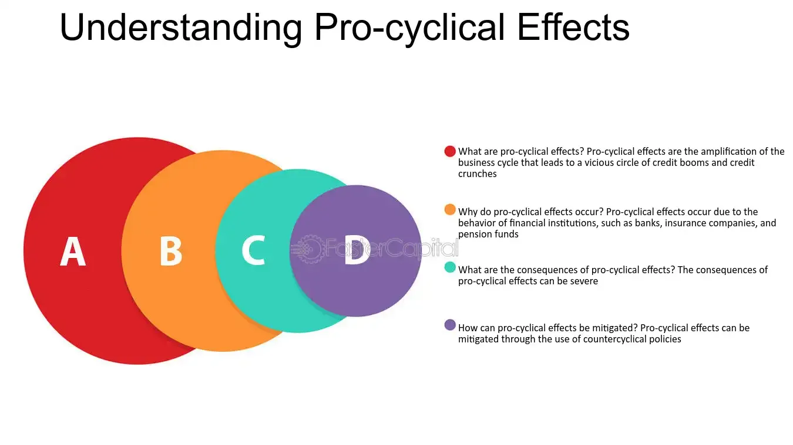

## Table of Contents

## What is procyclicality in economics?

Procyclicality in economics refers to the tendency of financial systems or economic policies to amplify the ups and downs of the economy. When the economy is doing well, procyclical behaviors can make it grow even faster, but when the economy is struggling, these same behaviors can make the downturn worse. For example, during good economic times, banks might lend more money because they feel confident, which can fuel more growth. But in bad times, they might cut back on lending, which can make the economy shrink even more.

This concept is important because it can lead to bigger economic swings than would happen naturally. Policymakers and economists try to understand and manage procyclicality to make the economy more stable. They might use tools like adjusting interest rates or changing regulations to counteract these effects. By doing so, they aim to smooth out the highs and lows, making the economy more predictable and less prone to extreme booms and busts.

## How does procyclicality affect economic cycles?

Procyclicality makes economic cycles bigger. When the economy is growing, things like more lending and spending can make it grow even more. This is because people and businesses feel confident and want to do more. But when the economy starts to slow down, procyclicality can make it worse. Banks might lend less, and people might spend less, which can make the economy shrink faster than it would have on its own.

To manage this, governments and central banks try to smooth out these cycles. They might lower interest rates during a downturn to encourage borrowing and spending. Or they might raise interest rates during a boom to cool things down. By doing this, they hope to keep the economy from swinging too wildly between good times and bad times. This can help make life more predictable for everyone.

## Can you provide examples of procyclical economic policies?

Procyclical economic policies are actions that make the economy's ups and downs bigger. For example, during good economic times, a government might cut taxes or increase spending. This can make people and businesses feel even more confident, so they spend and invest more, which can make the economy grow even faster. But if the economy is already doing well, this can lead to too much growth, which might cause inflation or a bubble that could burst later.

On the other hand, during bad economic times, a government might raise taxes or cut spending to balance the budget. This can make people and businesses feel even less confident, so they spend and invest less, which can make the economy shrink even more. This can turn a small downturn into a bigger one, making it harder for the economy to recover. Policymakers need to be careful with these kinds of policies to avoid making economic cycles worse.

## What are the differences between procyclical and countercyclical policies?

Procyclical policies make the economy's ups and downs bigger. When the economy is doing well, these policies might cut taxes or increase spending, which can make people and businesses feel even more confident. They spend and invest more, making the economy grow even faster. But if the economy is already doing well, this can lead to too much growth, which might cause inflation or a bubble that could burst later. During bad times, procyclical policies might raise taxes or cut spending to balance the budget. This can make people and businesses feel even less confident, so they spend and invest less, making the economy shrink even more.

Countercyclical policies try to smooth out the economy's ups and downs. When the economy is doing well, these policies might raise taxes or cut spending to cool things down and prevent too much growth. This can help avoid inflation or bubbles. During bad times, countercyclical policies might cut taxes or increase spending to help the economy. This can make people and businesses feel more confident, so they spend and invest more, helping the economy recover faster. By doing the opposite of what the economy is doing, countercyclical policies aim to make the economy more stable.

## How do procyclical behaviors influence financial markets?

Procyclical behaviors in financial markets make the ups and downs of the economy bigger. When the economy is doing well, people feel confident. Banks lend more money, and people invest more in stocks and other financial products. This can make stock prices go up a lot and can create bubbles, where prices are higher than they should be. If the bubble bursts, it can lead to a big drop in prices and cause problems for the economy.

On the other hand, when the economy is not doing well, procyclical behaviors can make things worse. Banks might lend less money because they are worried about the future. People might sell their investments, which can make stock prices go down even more. This can turn a small downturn into a bigger one, making it harder for the economy to recover. That's why it's important for people in financial markets to be aware of these behaviors and try to manage them to keep the economy more stable.

## What role does procyclicality play in economic crises?

Procyclicality can make economic crises worse. When the economy is doing well, people and businesses feel good, so they borrow and spend more. Banks lend more money because they think everything is safe. This can create bubbles, like when house prices or stock prices go up too high. If something goes wrong and the bubble bursts, it can cause a big problem. Prices fall a lot, and people lose money, which can start an economic crisis.

During a crisis, procyclicality can make things even worse. Banks get scared and start lending less money. People and businesses feel less confident, so they spend less and might even start saving more. This can make the economy shrink even faster than it would have on its own. Governments and central banks try to stop this by using policies that help the economy, but if they are not careful, procyclical behaviors can still make the crisis bigger and harder to fix.

## How can procyclicality be measured in economic data?

Procyclicality can be measured by looking at how certain economic indicators move with the overall economy. For example, if we see that bank lending goes up a lot when the economy is growing and drops a lot when the economy is shrinking, that's a sign of procyclicality. Economists might look at data like loan growth, stock market performance, or even consumer spending to see if these things are moving in the same direction as the economy's ups and downs.

To measure this, economists often use statistical methods to see how closely these indicators follow the business cycle. They might use something called a correlation coefficient to see how much one thing moves with another. If the correlation is high and positive, it means the indicator is procyclical. By studying these patterns over time, economists can better understand how procyclical behaviors might be making economic cycles bigger and help design policies to make the economy more stable.

## What are the theoretical models explaining procyclicality?

One theoretical model that explains procyclicality is the financial accelerator model. This model says that when the economy is doing well, companies and people feel more confident. They borrow more money to invest and spend. Banks are happy to lend because they think the loans are safe. But if something goes wrong, like a big drop in prices, people and companies can't pay back their loans. Banks get scared and stop lending, which makes the economy shrink even more. This cycle of more lending in good times and less lending in bad times makes the ups and downs of the economy bigger.

Another model is the herding behavior model. This model says that people and investors often do what everyone else is doing. In good economic times, they see others investing and spending, so they do the same. This can create bubbles where prices go up too high. But when the economy starts to slow down, everyone gets scared at the same time. They start selling their investments and saving money, which can make the economy shrink faster. Herding behavior makes the economy's ups and downs bigger because everyone is moving in the same direction at the same time.

## How do international economic policies contribute to global procyclicality?

International economic policies can make global procyclicality worse. When many countries are doing well at the same time, they might all start spending more and borrowing more. This can make the global economy grow even faster. But if something goes wrong, like a big drop in prices or a financial crisis, all these countries might start cutting back at the same time. They might raise taxes or cut spending to balance their budgets. This can make the global economy shrink faster than it would have on its own.

For example, during good times, countries might lower interest rates to encourage more borrowing and spending. This can make the global economy grow even more. But when the economy starts to slow down, many countries might raise interest rates at the same time to fight inflation. This can make borrowing more expensive everywhere, which can make the global economy shrink even more. By doing the same thing at the same time, international economic policies can make the ups and downs of the global economy bigger.

## What are the long-term effects of procyclical fiscal policies on economic growth?

Procyclical fiscal policies can make the economy's ups and downs bigger over the long term. When the economy is doing well, these policies might cut taxes or increase spending, which can make people and businesses feel even more confident. They spend and invest more, making the economy grow even faster. But if the economy is already doing well, this can lead to too much growth, which might cause inflation or a bubble that could burst later. This can make the economy unstable and lead to bigger problems down the road.

During bad times, procyclical policies might raise taxes or cut spending to balance the budget. This can make people and businesses feel even less confident, so they spend and invest less, making the economy shrink even more. Over time, this can slow down overall economic growth because the economy keeps swinging between big booms and big busts. To keep the economy growing steadily, it's better to use policies that smooth out these ups and downs, rather than making them bigger.

## How can policymakers mitigate the negative impacts of procyclicality?

Policymakers can help reduce the bad effects of procyclicality by using countercyclical policies. This means doing the opposite of what the economy is doing. When the economy is doing well, they might raise taxes or cut spending a bit to cool things down and stop the economy from growing too fast. This can help prevent bubbles and too much inflation. When the economy is doing badly, they might cut taxes or increase spending to help the economy. This can make people and businesses feel more confident, so they spend and invest more, helping the economy recover faster.

Another way policymakers can help is by making rules that stop banks from lending too much in good times and too little in bad times. They might set limits on how much banks can lend based on how the economy is doing. This can make the economy more stable because banks won't make the ups and downs bigger. By doing these things, policymakers can help make the economy grow more steadily and avoid big problems like economic crises.

## What are the latest research findings on procyclicality in emerging markets?

Recent research shows that procyclicality is a big problem in emerging markets. These are countries that are still growing and developing. When the global economy is doing well, these countries often get a lot of money from other countries. This makes their economies grow even faster. But when the global economy slows down, the money stops coming in. This can make their economies shrink a lot. Researchers have found that this can lead to bigger ups and downs in these countries than in more developed ones.

One study looked at how banks in emerging markets behave. It found that during good times, banks in these countries lend a lot more money than banks in developed countries. This makes the economy grow even faster. But when things get bad, these banks cut back on lending a lot more than banks in developed countries. This makes the downturn worse. To help with this, researchers suggest that these countries should use rules to control how much banks can lend. This can make their economies more stable and help them grow more steadily over time.

## References & Further Reading

[1]: Lopez de Prado, M. (2018). ["Advances in Financial Machine Learning."](https://www.amazon.com/Advances-Financial-Machine-Learning-Marcos/dp/1119482089) John Wiley & Sons.

[2]: Aronson, D. R. (2007). ["Evidence-Based Technical Analysis: Applying the Scientific Method and Statistical Inference to Trading Signals."](https://onlinelibrary.wiley.com/doi/book/10.1002/9781118268315) John Wiley & Sons.

[3]: Chan, E. P. (2009). ["Quantitative Trading: How to Build Your Own Algorithmic Trading Business."](https://github.com/ftvision/quant_trading_echan_book) John Wiley & Sons.

[4]: Jansen, S. (2018). ["Machine Learning for Algorithmic Trading: Predictive models to extract signals from market and alternative data for systematic trading strategies with Python."](https://github.com/stefan-jansen/machine-learning-for-trading) Packt Publishing.

[5]: Adrian, T. & Shin, H. S. (2010). ["Liquidity and leverage."](https://www.sciencedirect.com/science/article/pii/S1042957308000764) Journal of Financial Intermediation, 19(3), 418-437.

[6]: Borio, C. (2014). ["The financial cycle and macroeconomics: What have we learnt?"](https://www.sciencedirect.com/science/article/pii/S0378426613003063) Bank for International Settlements Working Papers, No 395.

[7]: Drehmann, M., Borio, C., & Tsatsaronis, K. (2012). ["Characterising the financial cycle: don't lose sight of the medium term!"](https://www.bis.org/publ/work380.htm) BIS Quarterly Review, June.

[8]: Bergstra, J., Bardenet, R., Bengio, Y., & Kégl, B. (2011). ["Algorithms for Hyper-Parameter Optimization."](https://dl.acm.org/doi/10.5555/2986459.2986743) Advances in Neural Information Processing Systems 24.